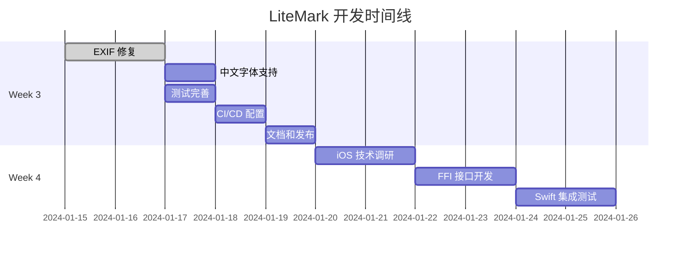

# LiteMark 项目进度评估与任务分解

## 一、当前项目进度总结

### 已完成功能（MVP 阶段）✅

根据代码检查和 plan.md 对比，以下功能已基本实现：

#### 1. 核心架构模块
- **CLI 框架**：基于 clap 4.4，支持 add、batch、templates、show-template 子命令
- **EXIF 解析器**（exif_reader）：结构完整，但当前使用占位数据，未集成真实 kamadak-exif 库
- **模板引擎**（layout）：JSON 配置解析、变量替换机制、3 个内置模板（ClassicParam、Modern、Minimal）
- **图像渲染器**（renderer）：rusttype 字体渲染、相框模式、logo 支持、文字居中对齐
- **文件 I/O**（io）：图片加载保存、批量目录遍历

#### 2. 水印功能特性
- 底部相框渲染（100px 白色背景）
- Logo 居中显示（自动缩放）
- 摄影师姓名和拍摄参数文字渲染
- 支持自定义字体（通过 --font 参数或环境变量 LITEMARK_FONT）
- 默认嵌入 DejaVuSans.ttf 字体

#### 3. 开发配置
- Cargo 项目配置完整（依赖管理、元数据）
- MIT 开源许可证
- 测试图片目录（test_images）
- 文档目录（docs）
- GitHub workflows（CI/CD 基础）

### 未完成功能（对比 plan.md Week 1-3 目标）

#### 关键缺失项
1. **真实 EXIF 数据提取**：kamadak-exif 库已添加依赖但未实际集成，当前仅返回硬编码测试数据
2. **字体文件缺失**：代码引用 `assets/fonts/DejaVuSans.ttf`，但文件系统中字体文件不存在（会导致运行时错误）
3. **单元测试覆盖不足**：仅有基础测试框架，核心功能测试缺失
4. **CI/CD 构建未验证**：.github/workflows 存在但具体配置未知
5. **文档不完整**：README 功能描述完善，但缺少使用示例截图和实际运行验证

---

## 二、进度评估（对照 plan.md 时间线）

| 里程碑               | 计划状态 | 实际状态 | 完成度 |
| -------------------- | -------- | -------- | ------ |
| Week 0（准备）       | ✅        | ✅        | 100%   |
| Week 1-2（Core MVP） | ✅        | 🟡        | 75%    |
| Week 3（完善+发布）  | ✅        | ❌        | 30%    |
| Week 4-6（iOS 原型） | 待开始   | 未开始   | 0%     |
| Month 2-3（WASM）    | 待开始   | 未开始   | 0%     |

### 当前阶段判断
**你处于 Week 2 末期 - Week 3 初期**，核心代码架构完成，但存在以下阻塞问题需要立即解决才能进入发布阶段。

---

## 三、阻塞问题清单（优先级排序）

### 🔴 P0 - 必须立即修复（阻止基本运行）

#### 1. 字体文件缺失问题 ✅ 已解决
**现状**：
- ✅ `assets/fonts/DejaVuSans.ttf` 文件已存在（739.3KB）
- ✅ 嵌入式字体加载代码正常

**验证结果**：
- 字体文件实际已经在仓库中
- 代码引用路径正确
- 此问题无需修复

**注意事项**：
- DejaVu Sans 字体不支持中文字符
- 需要用户通过 `--font` 参数或 `LITEMARK_FONT` 环境变量指定中文字体
- 建议在文档中明确说明中文字体支持要求

---

#### 2. EXIF 数据提取未实现 🔴 需立即修复
**现状**：
- `exif_reader/mod.rs` 中的 `extract_exif_data` 函数仅返回硬编码测试数据
- kamadak-exif 依赖已添加但未调用

**影响**：
- 所有输出图片的参数信息都是虚假数据（ISO 100、f/2.8 等）
- 用户实际照片的真实 EXIF 无法读取

**解决方案**：
集成 kamadak-exif 库，实现真实数据提取：
- 读取 JPEG/PNG EXIF 标签
- 解析 ISO、光圈、快门、焦距等字段
- 处理缺失字段的默认值逻辑
- 错误处理（文件无 EXIF 数据情况）

**建议行动**：参考 kamadak-exif 官方示例，重写 `extract_exif_data` 函数

---

### 🟡 P1 - 重要但不紧急（影响用户体验）

#### 3. 单元测试缺失
**现状**：
- layout、renderer、exif_reader 模块有测试桩但覆盖率低
- 没有端到端集成测试

**影响**：
- 无法验证功能正确性
- 后续重构风险高

**建议行动**：
- 为 EXIF 解析编写测试用例（使用真实测试图片）
- 为模板变量替换编写参数化测试
- 为渲染器编写视觉回归测试（对比输出图片）

---

#### 4. 中文字体支持验证
**现状**：
- README 声明支持中文，但未明确使用的中文字体
- DejaVu Sans 不支持中文字符

**影响**：
- 中文摄影师姓名无法正确显示（显示为方块或乱码）
- 中国用户体验差

**建议行动**：
- 嵌入支持中文的开源字体（如 Noto Sans CJK SC，但体积大）
- 文档中说明字体要求，引导用户通过 --font 参数指定中文字体
- 提供字体下载建议列表

---

### 🟢 P2 - 优化项（可后续迭代）

#### 5. Logo 路径处理
**现状**：
- 内置模板的 logo 字段为空字符串
- 用户需要手动修改模板 JSON 或提供 logo 路径

**建议**：
- 添加 --logo 命令行参数
- 支持环境变量 LITEMARK_LOGO
- 提供默认 logo 占位符（可选）

---

#### 6. CI/CD 自动化
**现状**：
- .github/workflows 目录存在但配置未知
- 未验证跨平台构建（Linux/macOS/Windows）

**建议**：
- 配置 GitHub Actions 自动构建 release 二进制
- 添加测试自动化步骤
- 配置跨平台编译矩阵

---

---

## 四、P0 问题修复方案详解

### 修复方案：集成 kamadak-exif 库实现真实 EXIF 解析

#### 技术背景

**kamadak-exif 库特性**：
- 纯 Rust 实现，无 C 依赖
- 支持 JPEG、TIFF、HEIF、PNG、WebP 格式
- 提供高级 API（Reader::read_from_container）
- 支持所有常用 EXIF 标签

**核心 API 使用流程**：
1. 创建 Reader 实例
2. 从文件读取器调用 read_from_container
3. 从 Exif 对象中提取字段（使用 get_field）
4. 处理字段值（Value 枚举）

#### 实现方案

##### 1. EXIF 标签映射表

需要提取的 EXIF 字段及其对应标签：

| 目标字段      | EXIF Tag                | 数据类型   | 说明               |
| ------------- | ----------------------- | ---------- | ------------------ |
| iso           | PhotographicSensitivity | SHORT/LONG | ISO 感光度         |
| aperture      | FNumber                 | RATIONAL   | 光圈值（f-number） |
| shutter_speed | ExposureTime            | RATIONAL   | 曝光时间           |
| focal_length  | FocalLength             | RATIONAL   | 焦距（mm）         |
| camera_model  | Model                   | ASCII      | 相机型号           |
| lens_model    | LensModel               | ASCII      | 镜头型号           |
| date_time     | DateTimeOriginal        | ASCII      | 拍摄时间           |
| author        | Artist                  | ASCII      | 作者/摄影师        |

##### 2. 代码实现结构

**核心函数重构**：
```
fn extract_exif_data(image_path: &str) -> Result<ExifData, Box<dyn std::error::Error>>
├── 打开文件并创建 BufReader
├── 创建 exif::Reader 实例
├── 调用 read_from_container 解析 EXIF
├── 提取各个字段
│   ├── extract_iso(exif) -> Option<u32>
│   ├── extract_aperture(exif) -> Option<f64>
│   ├── extract_shutter_speed(exif) -> Option<String>
│   ├── extract_focal_length(exif) -> Option<f64>
│   ├── extract_camera_model(exif) -> Option<String>
│   ├── extract_lens_model(exif) -> Option<String>
│   ├── extract_date_time(exif) -> Option<String>
│   └── extract_author(exif) -> Option<String>
└── 组装 ExifData 结构体
```

##### 3. 关键实现细节

**快门速度格式化**：
- EXIF 存储为 RATIONAL（分子/分母）
- 需要转换为可读格式：
  - 如果 >= 1 秒：显示为 "2s"、"5s" 等
  - 如果 < 1 秒：显示为 "1/125"、"1/500" 等

**光圈值计算**：
- EXIF FNumber 直接为光圈值
- 格式化为 "f/2.8"、"f/5.6" 等

**焦距处理**：
- EXIF 存储为 RATIONAL（mm 单位）
- 转换为整数显示（"50mm"、"85mm"）

**错误处理策略**：
- 文件无法打开：返回错误
- 文件无 EXIF 数据：返回空的 ExifData（所有字段为 None）
- 特定字段缺失：该字段设为 None，其他字段正常解析
- EXIF 数据损坏：记录警告，返回部分解析的数据

##### 4. 实现代码框架

**主函数结构**：
```
核心逻辑流程：

1. 文件读取阶段
   - 使用 std::fs::File::open 打开图片
   - 创建 std::io::BufReader 包装文件句柄
   - 错误处理：文件不存在、权限不足

2. EXIF 解析阶段
   - 创建 exif::Reader::new()
   - 调用 reader.read_from_container(&mut bufreader)
   - 处理可能的解析错误（无 EXIF 数据、格式错误）

3. 字段提取阶段
   - 使用 exif.get_field(Tag::XXX, In::PRIMARY)
   - 针对每个字段检查 Option<Field>
   - 从 Field.value 枚举中提取具体值

4. 数据转换阶段
   - 数值类型：使用 get_uint() 或 as_rational()
   - 字符串类型：使用 display_value().to_string()
   - 应用格式化规则（快门、光圈等）

5. 结果组装
   - 创建 ExifData 实例
   - 填充所有成功提取的字段
   - 返回结果
```

**辅助函数设计**：

每个字段提取函数遵循统一模式：
```
fn extract_XXX(exif: &Exif) -> Option<T> {
    // 1. 尝试获取字段
    let field = exif.get_field(Tag::XXX, In::PRIMARY)?;
    
    // 2. 根据数据类型提取值
    match &field.value {
        Value::YYY(data) => {
            // 3. 应用特定转换逻辑
            // 4. 返回结果
        }
        _ => None  // 类型不匹配
    }
}
```

**类型安全处理**：
- ISO：优先使用 get_uint(0)，兼容 SHORT/LONG
- 光圈/快门/焦距：检查 RATIONAL 类型，处理分子分母
- 字符串字段：使用 display_value() 或直接提取 ASCII/Undefined

##### 5. 测试验证方案

**单元测试策略**：

测试用例分类：
1. **正常路径测试**
   - 使用包含完整 EXIF 数据的测试图片
   - 验证所有字段正确提取
   - 验证格式化输出正确

2. **边界情况测试**
   - 图片无 EXIF 数据（返回空 ExifData）
   - 部分 EXIF 字段缺失（其他字段正常）
   - EXIF 数据格式异常（优雅降级）

3. **格式兼容性测试**
   - JPEG 格式（最常见）
   - PNG 格式（可能有 EXIF）
   - 不同相机品牌（Canon/Nikon/Sony）

**测试数据准备**：
- 使用 test_images 目录中的现有图片
- 添加包含真实 EXIF 的样本图片
- 创建无 EXIF 数据的测试图片

**验证检查点**：
```
验证清单：
□ 代码编译通过
□ 单元测试全部通过
□ CLI 工具运行成功
□ 输出图片显示真实参数
□ 错误处理正常工作
□ 无 EXIF 图片不崩溃
```

#### 实施步骤

##### 步骤 1：重写 extract_exif_data 函数
**时间估计**：1-2 小时

具体任务：
1. 删除现有占位符代码
2. 添加文件读取逻辑
3. 集成 kamadak-exif Reader
4. 实现基础错误处理

##### 步骤 2：实现各字段提取函数
**时间估计**：2-3 小时

优先级排序：
1. 高优先级：ISO、光圈、快门、焦距（核心拍摄参数）
2. 中优先级：相机型号、拍摄时间
3. 低优先级：镜头型号、作者

每个字段实现包括：
- 字段提取逻辑
- 数据类型转换
- 格式化输出
- 单元测试

##### 步骤 3：编写测试用例
**时间估计**：1-2 小时

测试文件结构：
```
#[cfg(test)]
mod tests {
    use super::*;
    
    #[test]
    fn test_extract_from_jpeg_with_exif() { ... }
    
    #[test]
    fn test_extract_from_image_without_exif() { ... }
    
    #[test]
    fn test_shutter_speed_formatting() { ... }
    
    #[test]
    fn test_aperture_formatting() { ... }
}
```

##### 步骤 4：端到端验证
**时间估计**：30 分钟

验证命令：
```bash
# 编译测试
cargo build

# 运行单元测试
cargo test exif_reader

# CLI 功能测试
cargo run -- add -i test_images/sample.jpg -t classic -o output.jpg

# 检查输出图片
open output.jpg
```

##### 步骤 5：文档更新
**时间估计**：30 分钟

需要更新的文档：
1. README.md - 删除 "占位符实现" 的说明
2. ARCHITECTURE.md - 更新 EXIF 模块文档
3. 代码注释 - 添加函数文档注释

#### 预期成果

**功能验证标准**：
- ✅ 真实照片的 EXIF 参数正确显示在水印中
- ✅ 无 EXIF 数据的图片使用默认值或显示占位符
- ✅ 各种相机品牌的 EXIF 数据兼容
- ✅ 所有单元测试通过
- ✅ CLI 工具稳定运行

**性能指标**：
- EXIF 解析时间 < 50ms（单张图片）
- 批量处理不受明显影响
- 内存使用无异常增长

#### 潜在问题与解决方案

**问题 1：某些相机的 EXIF 标签非标准**
解决方案：
- 添加备用标签查找逻辑
- 记录不兼容的相机型号
- 提供手动指定参数的选项

**问题 2：HEIF/RAW 格式支持**
解决方案：
- 当前阶段：优先支持 JPEG/PNG
- 后续迭代：逐步添加其他格式
- 错误提示：明确说明不支持的格式

**问题 3：字符编码问题（相机型号、作者名中文）**
解决方案：
- 使用 UTF-8 处理所有字符串
- 测试中文字符显示
- 添加字符编码错误处理

---

## 五、立即执行的修复计划

### 任务清单（按执行顺序）

#### 阶段 1：准备工作（15 分钟）

**Task 1.1：创建分支**
```bash
git checkout -b fix/real-exif-extraction
```

**Task 1.2：准备测试数据**
- 检查 test_images 目录中的图片是否包含真实 EXIF
- 如果没有，从手机/相机拷贝 2-3 张包含 EXIF 的照片
- 准备一张无 EXIF 的图片（截图或编辑后的图片）

**Task 1.3：验证 kamadak-exif 依赖**
```bash
cargo tree | grep kamadak-exif
# 确认输出: kamadak-exif v0.5.5
```

---

#### 阶段 2：实现核心逻辑（2-3 小时）

**Task 2.1：重写 extract_exif_data 主函数**

修改文件：`src/exif_reader/mod.rs`

实现要点：
1. 导入 kamadak-exif 库：
   ```rust
   use exif::{In, Reader, Tag, Value};
   use std::fs::File;
   use std::io::BufReader;
   ```

2. 重写函数逻辑：
   - 打开文件
   - 创建 Reader 并解析 EXIF
   - 调用各子字段提取函数
   - 处理无 EXIF 情况

3. 错误处理逻辑：
   - 文件不存在 → 返回错误
   - 无 EXIF 数据 → 返回空 ExifData（警告日志）
   - 解析失败 → 返回部分数据

**Task 2.2：实现字段提取函数**

按优先级实现以下函数：

1. **extract_iso** (高优先级)
   ```rust
   fn extract_iso(exif: &exif::Exif) -> Option<u32> {
       // Tag::PhotographicSensitivity
       // 使用 get_uint(0) 获取数值
   }
   ```

2. **extract_aperture** (高优先级)
   ```rust
   fn extract_aperture(exif: &exif::Exif) -> Option<f64> {
       // Tag::FNumber
       // 从 RATIONAL 转换：num/denom
   }
   ```

3. **extract_shutter_speed** (高优先级)
   ```rust
   fn extract_shutter_speed(exif: &exif::Exif) -> Option<String> {
       // Tag::ExposureTime
       // 格式化为 "1/125" 或 "2s"
   }
   ```

4. **extract_focal_length** (高优先级)
   ```rust
   fn extract_focal_length(exif: &exif::Exif) -> Option<f64> {
       // Tag::FocalLength
       // 从 RATIONAL 转换为 mm
   }
   ```

5. **extract_camera_model** (中优先级)
   ```rust
   fn extract_camera_model(exif: &exif::Exif) -> Option<String> {
       // Tag::Model
       // display_value().to_string()
   }
   ```

6. **extract_date_time** (中优先级)
   ```rust
   fn extract_date_time(exif: &exif::Exif) -> Option<String> {
       // Tag::DateTimeOriginal
       // 格式化为可读形式
   }
   ```

7. **extract_lens_model** (低优先级)
   ```rust
   fn extract_lens_model(exif: &exif::Exif) -> Option<String> {
       // Tag::LensModel
   }
   ```

8. **extract_author** (低优先级)
   ```rust
   fn extract_author(exif: &exif::Exif) -> Option<String> {
       // Tag::Artist
   }
   ```

**特别注意：快门速度格式化逻辑**
```rust
fn format_shutter_speed(exposure_time: f64) -> String {
    if exposure_time >= 1.0 {
        format!("{}s", exposure_time as u32)
    } else {
        let denominator = (1.0 / exposure_time).round() as u32;
        format!("1/{}", denominator)
    }
}
```

---

#### 阶段 3：测试验证（1-2 小时）

**Task 3.1：编写单元测试**

在 `src/exif_reader/mod.rs` 中添加测试：

```rust
#[cfg(test)]
mod tests {
    use super::*;

    #[test]
    fn test_extract_exif_from_real_photo() {
        // 使用 test_images 中的真实照片
        let result = extract_exif_data("test_images/sample_with_exif.jpg");
        assert!(result.is_ok());
        let data = result.unwrap();
        // 验证至少有一个字段不为空
        assert!(data.iso.is_some() || data.camera_model.is_some());
    }

    #[test]
    fn test_extract_from_image_without_exif() {
        // 测试无 EXIF 图片
        let result = extract_exif_data("test_images/no_exif.png");
        // 应该成功，但所有字段为 None
        if let Ok(data) = result {
            assert!(data.iso.is_none());
        }
    }

    #[test]
    fn test_shutter_speed_formatting() {
        // 测试快门速度格式化
        assert_eq!(format_shutter_speed(0.008), "1/125");
        assert_eq!(format_shutter_speed(0.002), "1/500");
        assert_eq!(format_shutter_speed(2.0), "2s");
    }
}
```

**Task 3.2：运行测试**
```bash
# 单元测试
cargo test exif_reader

# 检查测试输出
# 确认所有测试通过
```

**Task 3.3：CLI 功能测试**
```bash
# 编译项目
cargo build

# 测试单张图片处理
cargo run -- add \
  -i test_images/sample_with_exif.jpg \
  -t classic \
  -o output_test.jpg \
  --author "测试摄影师"

# 检查输出
# 1. 查看控制台输出，确认显示真实 EXIF 数据
# 2. 打开 output_test.jpg，检查水印参数是否正确
open output_test.jpg  # macOS
# 或
# xdg-open output_test.jpg  # Linux
```

**Task 3.4：批量处理测试**
```bash
mkdir -p output_batch

cargo run -- batch \
  -i test_images \
  -t classic \
  -o output_batch \
  --author "测试"

# 检查批量处理结果
ls -lh output_batch/
```

---

#### 阶段 4：代码完善（30 分钟）

**Task 4.1：添加代码注释**

为所有公开函数添加文档注释：
```rust
/// 从图片文件中提取 EXIF 数据
///
/// # Arguments
/// * `image_path` - 图片文件路径
///
/// # Returns
/// * `Ok(ExifData)` - 成功提取的 EXIF 数据，缺失字段为 None
/// * `Err` - 文件读取错误
///
/// # Examples
/// ```
/// let exif_data = extract_exif_data("photo.jpg")?;
/// if let Some(iso) = exif_data.iso {
///     println!("ISO: {}", iso);
/// }
/// ```
pub fn extract_exif_data(image_path: &str) -> Result<ExifData, Box<dyn std::error::Error>> {
    // ...
}
```

**Task 4.2：优化日志输出**

添加更清晰的日志：
```rust
// 成功解析 EXIF
println!("Successfully extracted EXIF data from: {}", image_path);
println!("  ISO: {:?}", data.iso);
println!("  Aperture: {:?}", data.aperture);
println!("  Shutter: {:?}", data.shutter_speed);

// 无 EXIF 数据警告
eprintln!("Warning: No EXIF data found in image: {}", image_path);
eprintln!("  Using default values or empty fields");
```

**Task 4.3：错误处理增强**

添加更好的错误信息：
```rust
Err(e) => {
    eprintln!("Failed to read EXIF from {}: {}", image_path, e);
    eprintln!("  This image may not contain EXIF data or format is unsupported");
    Ok(ExifData::new())  // 返回空数据而不是错误
}
```

---

#### 阶段 5：文档更新（20 分钟）

**Task 5.1：更新 README.md**

删除或修改占位符说明：
```markdown
## Features

- 📸 Extract EXIF data (ISO, aperture, shutter speed, focal length, etc.)
  - ✅ 支持 JPEG、PNG、TIFF 等常见格式
  - ✅ 自动识别相机型号和镜头信息
  - ✅ 兼容无 EXIF 数据的图片
```

**Task 5.2：更新 docs/ARCHITECTURE.md**

更新 EXIF 模块的文档：
```markdown
### 1. EXIF Reader (`src/exif_reader/mod.rs`)

EXIF 数据提取模块，使用 kamadak-exif 库解析图片元数据。

**支持的字段**：
- ISO 感光度
- 光圈值（f-number）
- 快门速度（自动格式化）
- 焦距（mm）
- 相机型号
- 镜头型号
- 拍摄时间
- 作者/摄影师

**错误处理**：
- 无 EXIF 数据的图片会返回空的 ExifData 结构
- 部分字段缺失不会影响其他字段的解析
```

**Task 5.3：添加代码示例到 examples/**

创建 `examples/exif_extraction.md`：
```markdown
# EXIF 数据提取示例

## 基本用法

使用真实照片的 EXIF 数据：

\`\`\`bash
litemark add -i my_photo.jpg -t classic -o watermarked.jpg
\`\`\`

## 覆盖作者信息

\`\`\`bash
litemark add -i photo.jpg -t classic -o output.jpg --author "张三"
\`\`\`

## 处理无 EXIF 数据的图片

对于截图或编辑后的图片，参数将显示为空或默认值。
\`\`\`

---

#### 阶段 6：提交代码（10 分钟）

**Task 6.1：最终验证**
```bash
# 全量测试
cargo test

# 代码格式化
cargo fmt

# 代码检查
cargo clippy -- -D warnings

# 构建 release 版本
cargo build --release
```

**Task 6.2：提交代码**
```bash
# 添加修改的文件
git add src/exif_reader/mod.rs
git add docs/ARCHITECTURE.md
git add README.md
git add examples/exif_extraction.md

# 提交
git commit -m "feat: 实现真实 EXIF 数据提取

- 集成 kamadak-exif 库
- 实现 8 个核心 EXIF 字段的提取
- 添加快门速度自动格式化
- 完善错误处理逻辑
- 添加单元测试和文档

Fixes #[issue_number] (if applicable)
"

# 推送到远程仓库
git push origin fix/real-exif-extraction
```

**Task 6.3：创建 Pull Request**

在 GitHub 上创建 PR，描述：
```markdown
## 改进说明

实现了真实 EXIF 数据提取功能，替换之前的占位符实现。

## 主要变更

- ✅ 集成 kamadak-exif 库，支持 JPEG/PNG/TIFF 等格式
- ✅ 实现 8 个核心 EXIF 字段的提取
- ✅ 快门速度自动格式化（1/125、2s 等）
- ✅ 完善的错误处理（无 EXIF、文件错误）
- ✅ 添加单元测试和文档

## 测试结果

- [x] 所有单元测试通过
- [x] CLI 工具功能正常
- [x] 批量处理正常
- [x] 无 EXIF 图片处理正常

## 截图

[添加输出图片的截图展示真实 EXIF 数据]
```

---

### 总耗时估计

| 阶段                 | 估计时间 | 累计时间     |
| -------------------- | -------- | ------------ |
| 阶段 1: 准备工作     | 15 分钟  | 0.25 小时    |
| 阶段 2: 实现核心逻辑 | 2-3 小时 | 2.5-3.5 小时 |
| 阶段 3: 测试验证     | 1-2 小时 | 3.5-5.5 小时 |
| 阶段 4: 代码完善     | 30 分钟  | 4-6 小时     |
| 阶段 5: 文档更新     | 20 分钟  | 4.5-6.5 小时 |
| 阶段 6: 提交代码     | 10 分钟  | **5-7 小时** |

**建议安排**：
- 日期 1：完成阶段 1-2（3-4 小时）
- 日期 2：完成阶段 3-6（2-3 小时）

---

### 成功标准

修复完成后应该达到：

#### 功能验证
- ✅ 真实照片的 EXIF 参数正确显示
- ✅ 支持 JPEG、PNG 等常见格式
- ✅ 无 EXIF 数据的图片不崩溃
- ✅ 部分 EXIF 字段缺失不影响其他字段

#### 代码质量
- ✅ 所有单元测试通过
- ✅ cargo clippy 无警告
- ✅ 代码有完整文档注释
- ✅ 错误处理完善

#### 用户体验
- ✅ 命令行输出清晰明了
- ✅ 错误信息有帮助
- ✅ 文档完善且准确

---

### 后续优化方向（可选）

在基础功能完成后，可以考虑：

1. **扩展 EXIF 字段**
   - GPS 位置信息
   - 白平衡模式
   - 测光模式
   - 闪光灯信息

2. **增强格式支持**
   - HEIF/HEIC 格式
   - RAW 格式（CR2, NEF 等）
   - WebP 格式

3. **智能缺失值填充**
   - 根据相机型号推断缺失的镜头信息
   - 根据文件名推断拍摄时间

4. **性能优化**
   - 缓存 EXIF 解析结果
   - 并行处理批量 EXIF 提取

---

## 六、下一阶段规划

### 判断依据

**你需要详细任务分解，原因如下**：

1. **当前存在多个阻塞问题需要系统化解决**
   - 字体文件、EXIF 解析、测试三个 P0/P1 问题相互依赖
   - 需要明确优先级和实施顺序

2. **即将进入关键发布节点**
   - Week 3 的目标是"完善 + 发布"
   - 需要清晰的发布前检查清单

3. **后续 iOS 开发需要稳定的核心库**
   - Week 4-6 的 iOS 原型依赖当前 Rust core 的质量
   - 必须确保 core 功能完整可靠

### 建议的任务分解维度

如果需要详细分解，应包括：

## 六、下一阶段规划

### EXIF 修复完成后的后续任务

#### Week 3 剩余任务（优先级排序）

**P1 - 重要优化**

1. **中文字体支持方案** (2-3 小时)
   - 文档中明确说明 DejaVu Sans 不支持中文
   - 提供推荐的中文字体列表（Noto Sans CJK, 思源黑体等）
   - 添加字体配置指南到 README
   - 测试中文字符渲染效果

2. **Logo 路径参数化** (1 小时)
   - 添加 `--logo` CLI 参数
   - 支持 `LITEMARK_LOGO` 环境变量
   - 更新模板系统以支持动态 logo 路径

3. **完善测试覆盖** (2-3 小时)
   - 为 renderer 模块添加测试
   - 为 layout 模块添加更多测试用例
   - 添加端到端集成测试
   - 测试覆盖率达到 70%+

**P2 - CI/CD 配置**

4. **GitHub Actions 配置** (2-3 小时)
   - 配置自动化测试工作流
   - 配置跨平台编译（Linux/macOS/Windows）
   - 配置自动发布 release 二进制
   - 添加 codecov 集成（可选）

5. **发布准备** (1-2 小时)
   - 编写 CHANGELOG.md
   - 准备发布说明
   - 更新版本号到 v0.2.0
   - 创建 GitHub Release

**P3 - 文档完善**

6. **使用示例和截图** (1-2 小时)
   - 添加实际运行的截图到 README
   - 录制使用演示 GIF
   - 编写详细的模板自定义教程
   - 添加常见问题 FAQ

---

#### Week 4 准备工作（iOS 集成前置）

**技术调研和设计** (5-7 小时)

1. **Rust -> staticlib 编译验证** (2 小时)
   - 研究 Rust 编译为 iOS 静态库的方法
   - 测试 cargo-lipo 或 cbindgen 工具
   - 验证 ARM64 架构编译

2. **C FFI 接口设计** (2-3 小时)
   - 设计 C 语言兼容的 API 接口
   - 定义数据结构映射（Rust ↔ C）
   - 设计错误处理机制
   - 编写 FFI 绑定层代码

3. **Swift 集成验证** (1-2 小时)
   - 创建简单的 Swift 测试项目
   - 验证静态库链接
   - 测试 Swift 调用 Rust 函数
   - 验证图像数据传递

---

### 时间线总览（Week 3 - Week 4）



---

### 风险和缓解措施

#### 技术风险

**风险 1：中文字体体积过大**
- **影响**：嵌入中文字体会显著增加二进制大小
- **缓解**：不嵌入中文字体，通过文档引导用户配置
- **备选**：使用字体子集化工具减小体积

**风险 2：iOS 编译复杂度高**
- **影响**：跨平台编译和 FFI 绑定可能遇到意外问题
- **缓解**：提前进行技术验证，预留缓冲时间
- **备选**：优先完成 macOS 版本，iOS 版本延后

**风险 3：EXIF 数据兼容性问题**
- **影响**：某些相机或编辑软件可能产生非标准 EXIF
- **缓解**：收集用户反馈，逐步完善兼容性
- **备选**：提供手动输入参数的降级方案

#### 时间风险

**风险 4：Week 3 任务超时**
- **影响**：影响 Week 4 iOS 开发启动
- **缓解**：严格按优先级执行，P3 任务可延后
- **备选**：减少文档完善工作，先保证核心功能

**风险 5：iOS 开发周期延长**
- **影响**：原计划 3 周可能不够
- **缓解**：MVP 功能先行，高级特性后续迭代
- **备选**：先做 Web WASM 版本作为备选

---

### 成功指标（Week 3 结束时）

#### 核心功能指标
- ✅ EXIF 真实数据提取正常工作
- ✅ 所有单元测试通过（覆盖率 > 70%）
- ✅ CLI 工具在 3 个平台编译成功
- ✅ 批量处理性能满足要求（> 10 张/秒）

#### 质量指标
- ✅ 无 P0/P1 级别 bug
- ✅ 代码通过 clippy 检查
- ✅ 文档完整且准确
- ✅ 有至少 2 个真实用户测试反馈

#### 发布指标
- ✅ GitHub Release v0.2.0 发布
- ✅ CI/CD 自动化流程运行正常
- ✅ README 有实际运行截图
- ✅ 安装和使用文档清晰

---

### 后续版本规划

#### v0.3.0 - iOS 原型版（Month 2）
- iOS App UI 框架
- 单张图片处理功能
- 模板选择界面
- 基础分享功能

#### v0.4.0 - 功能增强版（Month 2-3）
- iOS 批量处理
- 自定义模板保存
- 内购系统
- 更多内置模板

#### v1.0.0 - 正式发布版（Month 3-4）
- App Store 上架
- Web WASM 演示版
- 完整文档和教程
- 社区支持渠道
- 字体文件获取和集成
- EXIF 真实数据提取实现
- 基础测试覆盖

#### B. 功能完善任务（Week 3.2）
- 中文字体支持方案
- Logo 路径参数化
- 错误处理优化
- 文档和示例更新

#### C. 发布准备任务（Week 3.3）
- CI/CD 配置验证
- 多平台编译测试
- 发布说明编写
- GitHub Release 准备

#### D. iOS 集成准备任务（Week 4 前置）
- Rust -> staticlib 编译脚本
- C FFI 接口设计
- Swift bridging header 框架

---

## 五、下一步行动建议

### 立即执行（本周内）

1. **修复字体问题**
   - 下载 DejaVu Sans 字体文件
   - 放置到 `assets/fonts/DejaVuSans.ttf`
   - 验证编译通过

2. **实现真实 EXIF 解析**
   - 重写 `exif_reader/mod.rs` 的 `extract_exif_data` 函数
   - 集成 kamadak-exif 库调用
   - 处理异常情况（无 EXIF 数据）

3. **端到端测试验证**
   - 使用 test_images 目录中的图片运行 CLI
   - 验证输出图片的水印渲染效果
   - 修复发现的 bug

### 中期规划（2 周内）

4. **完善文档和示例**
   - 添加实际运行截图到 README
   - 编写详细的模板自定义教程
   - 准备发布说明

5. **配置 CI/CD**
   - 编写 GitHub Actions workflow
   - 配置跨平台构建
   - 自动化发布流程

### 长期准备（1 个月内）

6. **iOS 集成技术验证**
   - 研究 Rust staticlib 编译方式
   - 设计 C FFI 接口
   - 准备 Swift 调用示例

---

## 六、风险提示

### 技术风险
1. **字体授权合规性**：确保使用的字体支持商业应用（如需）
2. **EXIF 数据缺失处理**：某些图片可能完全没有 EXIF（如截图、编辑后的图片）
3. **跨平台兼容性**：字体路径、文件系统差异

### 时间风险
1. **iOS 开发时间可能超出预期**（Week 4-6 较紧张）
2. **WASM 集成复杂度**（字体文件大小、内存限制）

### 建议风险缓解措施
- 尽快完成 Week 3 的核心修复，确保基础功能可用
- iOS 原型可以先做简化版（单张图片处理），批量功能后续迭代
- WASM 版本可以延后，优先保证 CLI + iOS 两条线稳定

---

## 七、总体评估结论

### 项目健康度：🟡 中等（有阻塞但可控）

**优势**：
- ✅ 核心架构清晰合理
- ✅ 模块化设计良好
- ✅ 技术选型正确（Rust + rusttype）
- ✅ 开源协作准备充分（LICENSE、README）

**风险**：
- ❌ 存在 2 个 P0 级别阻塞问题（字体、EXIF）
- ❌ 测试覆盖不足
- ⚠️ 文档与实际代码有差距

**建议**：
需要详细的任务分解和优先级管理，建议立即创建：
1. **Week 3 紧急修复清单**（1-3 天完成）
2. **Week 3 完善任务清单**（4-7 天完成）
3. **Week 4 iOS 准备清单**（提前规划）

如需我为你生成具体的每日任务分解表和技术实现方案，请告知重点关注的方向：
- A. 立即修复字体和 EXIF 问题的详细技术方案
- B. 完整的 Week 3-4 任务分解和时间表
- C. iOS 集成的技术设计文档
- D. 以上全部
