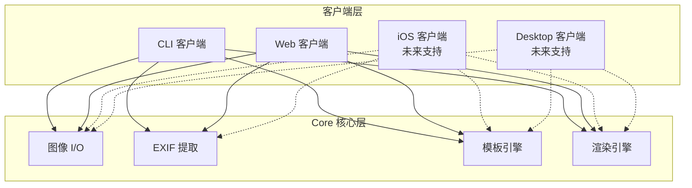
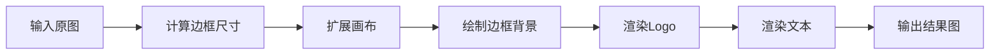
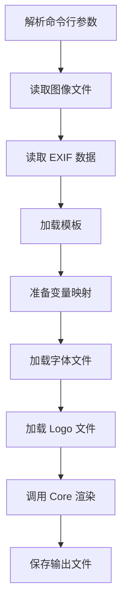
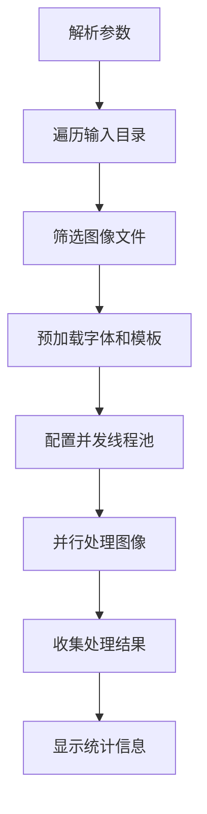
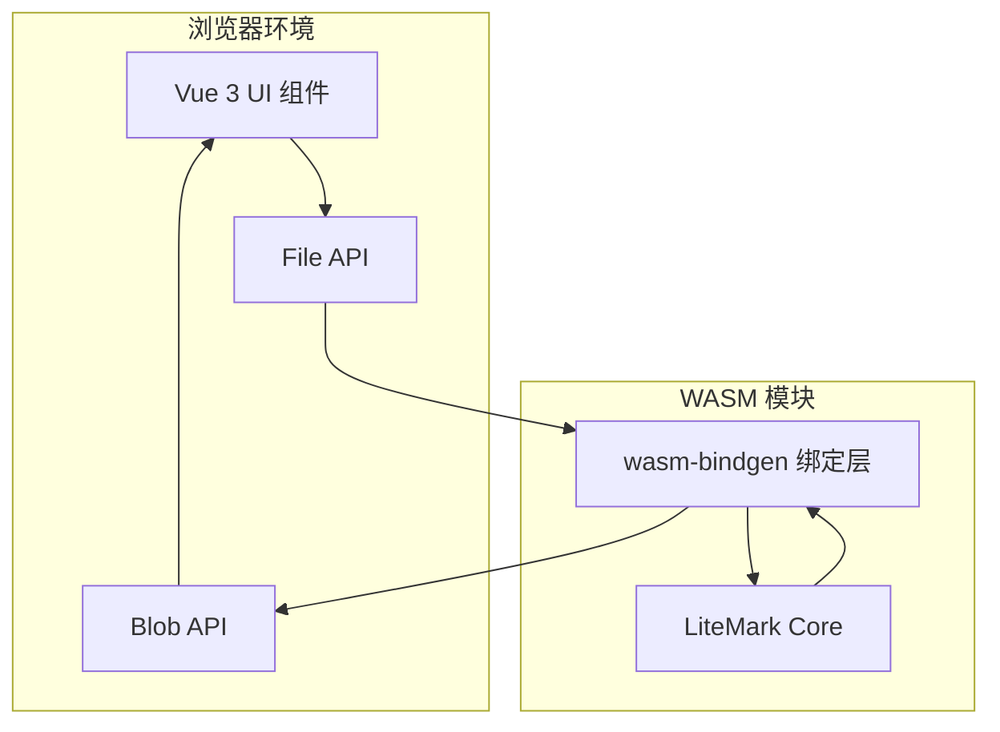
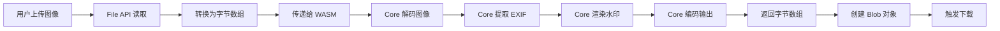

# LiteMark 核心模块划分设计

## 一、设计目标

将现有的 LiteMark 项目进行模块化拆分，形成 Core、CLI、Web 三层架构，实现核心水印处理能力的跨平台复用。

### 核心目标

- Core 层提供纯粹的单图处理能力，不依赖特定客户端环境
- CLI 层专注命令行交互和批量处理能力
- Web 层基于 WASM 提供浏览器端图像处理能力
- 支持未来扩展到 iOS、Desktop 等其他平台

## 二、整体架构设计

### 架构分层



### 模块职责边界

| 模块 | 核心职责                                     | 不包含职责                                |
| ---- | -------------------------------------------- | ----------------------------------------- |
| Core | 单图处理、EXIF解析、模板渲染、图像编解码     | 批量处理、CLI交互、文件系统操作、并发调度 |
| CLI  | 命令行参数解析、批量处理、进度显示、文件遍历 | 图像渲染逻辑、模板解析逻辑                |
| Web  | 浏览器交互、前端UI、文件上传下载、WASM绑定   | 图像渲染逻辑、模板解析逻辑                |

## 三、Core 模块详细设计

### 设计原则

- 无副作用：所有函数保持纯函数特性，不进行文件系统操作
- 平台无关：不依赖特定平台的 API（如 std::fs、环境变量等）
- 内存安全：所有图像数据通过内存传递，不涉及路径引用
- 可组合性：每个模块可独立使用，也可组合使用

### 模块结构

#### 图像 I/O 模块

职责范围：
- 图像解码：从字节流解码为内存图像对象
- 图像编码：将内存图像对象编码为字节流
- 格式识别：根据字节特征识别图像格式

核心接口：

| 接口          | 输入                   | 输出         | 说明                 |
| ------------- | ---------------------- | ------------ | -------------------- |
| decode_image  | 字节切片               | DynamicImage | 从内存解码图像       |
| encode_image  | DynamicImage、格式枚举 | 字节向量     | 将图像编码为指定格式 |
| detect_format | 字节切片               | ImageFormat  | 根据魔数识别格式     |

支持格式：
- 输入：JPEG、PNG、GIF、BMP、WebP、HEIC/HEIF
- 输出：JPEG、PNG、WebP

设计要点：
- 所有操作基于内存缓冲区，不涉及文件路径
- HEIC 格式通过 libheif-rs 解码后转换为 RGBA 格式
- 提供格式转换能力，例如 HEIC 输入自动输出为 JPEG

#### EXIF 提取模块

职责范围：
- 从内存图像数据中提取 EXIF 元数据
- 将 EXIF 字段转换为模板变量
- 处理缺失字段的降级策略

核心接口：

| 接口               | 输入     | 输出       | 说明             |
| ------------------ | -------- | ---------- | ---------------- |
| extract_from_bytes | 字节切片 | ExifData   | 从内存提取 EXIF  |
| to_variables       | ExifData | HashMap    | 转换为模板变量   |
| get_missing_fields | ExifData | 字符串列表 | 获取缺失字段清单 |

数据结构：

ExifData 包含以下可选字段：
- ISO 感光度（u32）
- 光圈值（f64，格式化为 f/2.8）
- 快门速度（String，格式化为 1/125 或 2s）
- 焦距（f64，格式化为 50mm）
- 相机型号（String）
- 镜头型号（String）
- 拍摄时间（String）
- 作者/摄影师（String）

设计要点：
- 字段缺失时返回 None，不抛出错误
- 无 EXIF 数据时返回空 ExifData 结构
- 格式化逻辑内聚在模块内部

#### 模板引擎模块

职责范围：
- 模板数据结构定义
- 模板序列化/反序列化
- 变量占位符替换
- 内置模板管理

核心接口：

| 接口                  | 输入             | 输出       | 说明           |
| --------------------- | ---------------- | ---------- | -------------- |
| parse_template        | JSON字符串       | Template   | 解析自定义模板 |
| serialize_template    | Template         | JSON字符串 | 序列化模板     |
| substitute_variables  | Template、变量表 | Template   | 替换占位符     |
| get_builtin_templates | 无               | 模板列表   | 获取内置模板   |

模板数据结构：
- 模板名称
- 锚点位置（左上、右上、左下、右下、居中）
- 布局项目列表（文本、Logo）
- 样式配置（字体大小比例、边距比例、边框高度比例）
- 背景配置（颜色、透明度、圆角）

设计要点：
- 模板通过 JSON 序列化，便于跨语言传递
- 内置模板硬编码在代码中，避免文件依赖
- 支持动态字体大小比例，适配不同图像尺寸

#### 渲染引擎模块

职责范围：
- 水印边框生成
- 文本绘制（支持中英文）
- Logo 图像合成
- 图层混合与布局

核心接口：

| 接口             | 输入                       | 输出              | 说明           |
| ---------------- | -------------------------- | ----------------- | -------------- |
| create_renderer  | 字体数据（可选）           | WatermarkRenderer | 创建渲染器     |
| render_watermark | 图像、模板、变量、Logo数据 | 图像              | 渲染水印到图像 |

渲染流程：



边框布局策略：
- 边框高度：基于图像短边的 5%-20%，限制在 80-800px
- 四列布局：
  - 第一列：作者、相机、日期（左对齐）
  - 第二列：Logo（居中显示）
  - 第三列：分隔线
  - 第四列：拍摄参数（右对齐）

文本渲染技术：
- 使用 rusttype 库渲染矢量字体
- 默认嵌入思源黑体（Region Subset 版本，约 48MB）
- 支持自定义字体数据注入
- 字体大小自适应边框高度

Logo 渲染技术：
- 支持 PNG、JPEG、GIF、WebP、BMP 格式
- 保持纵横比缩放至目标高度
- Alpha 通道混合渲染
- Logo 数据通过字节数组传入

设计要点：
- 字体数据通过字节数组传入，不依赖文件路径
- Logo 数据通过字节数组传入，不依赖文件路径
- 渲染器可复用，避免重复加载字体
- 所有尺寸计算基于比例，适配不同分辨率

### 依赖管理

Core 模块允许的依赖：
- image：图像处理核心库
- libheif-rs：HEIC 格式支持
- rusttype：字体渲染
- kamadak-exif：EXIF 解析
- serde、serde_json：数据序列化

Core 模块禁止的依赖：
- clap：CLI 参数解析（属于 CLI 层）
- rayon：并行处理（属于 CLI 层）
- indicatif：进度条（属于 CLI 层）
- walkdir：文件遍历（属于 CLI 层）
- std::fs：文件系统操作（由客户端层处理）
- std::env：环境变量（由客户端层处理）

## 四、CLI 模块详细设计

### 设计定位

CLI 模块是 Core 的客户端实现，提供命令行交互能力和批量处理能力。

### 核心功能

#### 命令结构

| 命令          | 功能         | 参数                                               |
| ------------- | ------------ | -------------------------------------------------- |
| add           | 单图处理     | 输入路径、输出路径、模板、作者、字体路径、Logo路径 |
| batch         | 批量处理     | 输入目录、输出目录、模板、并发数、进度开关         |
| templates     | 列出可用模板 | 无                                                 |
| show-template | 显示模板详情 | 模板名称                                           |

#### 单图处理流程



#### 批量处理流程



批量处理特性：
- 并发调度：基于 Rayon 线程池，默认并发数为 CPU 核心数 × 2
- 进度显示：使用 indicatif 显示处理进度和速度
- 错误处理：失败的图像不中断流程，最终汇总显示错误清单
- 资源优化：字体和模板仅加载一次，所有任务共享

#### 文件系统职责

CLI 层负责的文件操作：
- 读取图像文件到内存
- 读取 EXIF 数据（通过文件路径调用 Core 的 extract_exif_data）
- 读取字体文件到内存
- 读取 Logo 文件到内存
- 写入输出图像文件
- 遍历目录查找图像文件
- 创建输出目录

#### 配置管理

CLI 层负责的配置源：
- 命令行参数（最高优先级）
- 环境变量（LITEMARK_FONT、LITEMARK_LOGO）
- 默认值（最低优先级）

优先级规则：
- 字体：CLI 参数 > 环境变量 LITEMARK_FONT > 默认嵌入字体
- Logo：CLI 参数 > 环境变量 LITEMARK_LOGO > 模板指定路径

#### 模板加载策略

模板解析顺序：
1. 检查是否为内置模板名称（精确匹配）
2. 检查是否为内置模板名称（忽略大小写）
3. 检查常用别名（classic → ClassicParam）
4. 检查是否为文件路径（绝对路径或相对路径）
5. 检查 templates/ 目录下的 JSON 文件
6. 报告模板未找到

### 依赖清单

CLI 专属依赖：
- clap：命令行参数解析
- rayon：并行处理框架
- indicatif：进度条显示
- walkdir：目录遍历
- num_cpus：CPU 核心数检测

共享依赖：
- litemark（Core 库）

## 五、Web 模块详细设计

### 技术栈

- 前端框架：Vue 3
- 构建工具：Vite
- WASM 绑定：wasm-bindgen
- WASM 打包：wasm-pack

### 架构设计



### 核心功能

#### 图像处理流程



#### WASM 绑定接口设计

需要暴露的 JavaScript 接口：

| 接口名称          | 输入                           | 输出             | 说明             |
| ----------------- | ------------------------------ | ---------------- | ---------------- |
| process_image     | Uint8Array、模板JSON、参数对象 | Uint8Array       | 处理单张图像     |
| extract_exif      | Uint8Array                     | ExifDataJSON     | 提取 EXIF 信息   |
| list_templates    | 无                             | TemplateListJSON | 获取内置模板列表 |
| validate_template | 模板JSON                       | 布尔值或错误信息 | 验证自定义模板   |

参数对象结构：
- author：可选的作者名称（覆盖 EXIF）
- outputFormat：输出格式（jpeg、png、webp）
- logoData：可选的 Logo 图像数据（Uint8Array）
- fontData：可选的自定义字体数据（Uint8Array）

#### 前端 UI 设计

主要交互区域：
- 图像上传区：支持拖拽上传、点击上传、预览原图
- 参数配置区：
  - 模板选择器（下拉菜单或卡片选择）
  - 作者名称输入框
  - Logo 上传按钮（可选）
  - 自定义字体上传（可选）
- EXIF 信息展示区：显示提取的拍摄参数
- 处理结果区：预览水印图像、下载按钮

状态管理：
- 上传状态：未上传、上传中、已上传
- 处理状态：未处理、处理中、处理成功、处理失败
- 错误提示：文件格式错误、WASM 加载失败、处理超时等

### 技术要点

#### WASM 编译配置

Cargo.toml 需要添加的配置：
- crate-type：cdylib（编译为动态库）
- target：wasm32-unknown-unknown
- 优化级别：release 模式启用 opt-level = "z"（体积优化）

需要条件编译的功能：
- 文件系统操作：在 WASM 环境下禁用
- 环境变量：在 WASM 环境下禁用
- 并发处理：WASM 单线程环境不支持 Rayon

#### 依赖适配

WASM 环境需要替换的依赖：
- 移除 walkdir：文件遍历在浏览器中无意义
- 移除 rayon：WASM 不支持多线程
- 移除 indicatif：进度条改用前端实现
- 保留 image、rusttype、exif、serde：核心功能必需

WASM 环境需要添加的依赖：
- wasm-bindgen：Rust 与 JavaScript 互操作
- console_error_panic_hook：将 Panic 信息输出到浏览器控制台
- wee_alloc（可选）：优化 WASM 内存分配器

#### 性能优化策略

减少 WASM 体积：
- 移除未使用的图像格式支持
- 使用裁剪版字体（仅包含常用汉字）
- 启用 LTO（链接时优化）
- 使用 wasm-opt 进一步压缩

提升运行性能：
- 复用渲染器实例，避免重复加载字体
- 使用 Web Worker 执行 WASM 计算，避免阻塞主线程
- 实现增量加载，先显示预览再处理全尺寸图像

内存管理：
- 处理完成后及时释放大图像内存
- 限制单张图像最大尺寸，避免浏览器崩溃
- 提供内存占用提示

### 部署方案

构建产物：
- WASM 二进制文件（.wasm）
- JavaScript 绑定文件（.js）
- TypeScript 类型定义（.d.ts）
- Vue 应用构建产物

部署方式：
- 静态托管：Vercel、Netlify、GitHub Pages
- CDN 加速：WASM 文件通过 CDN 分发
- 离线支持：通过 Service Worker 实现 PWA

## 六、代码迁移计划

### 目录结构调整

调整前：
```
src/
├── main.rs
├── lib.rs
├── exif_reader/
├── io/
├── layout/
└── renderer/
```

调整后：
```
litemark-core/          # Core 库（新建）
├── src/
│   ├── lib.rs
│   ├── image_io.rs     # 重构后的图像 I/O
│   ├── exif.rs         # 重构后的 EXIF 提取
│   ├── layout.rs       # 模板引擎
│   └── renderer.rs     # 渲染引擎
└── Cargo.toml

litemark-cli/           # CLI 客户端（新建）
├── src/
│   ├── main.rs
│   ├── commands.rs     # 命令处理
│   ├── batch.rs        # 批量处理逻辑
│   └── utils.rs        # 文件操作、配置管理
└── Cargo.toml

litemark-web/           # Web 客户端（新建）
├── wasm/               # WASM 绑定层
│   ├── src/
│   │   └── lib.rs
│   └── Cargo.toml
├── frontend/           # Vue 前端
│   ├── src/
│   │   ├── App.vue
│   │   ├── components/
│   │   └── wasm-worker.js
│   └── package.json
└── README.md
```

### 迁移步骤

#### 第一阶段：创建 Core 库

任务清单：
1. 创建 litemark-core Cargo 项目
2. 迁移 layout 模块（无需修改）
3. 重构 exif_reader 模块：
   - 保留 extract_exif_data 函数（接受文件路径，CLI 使用）
   - 新增 extract_from_bytes 函数（接受字节流，Web 使用）
4. 重构 io 模块：
   - 保留 load_image 函数（接受文件路径，CLI 使用）
   - 新增 decode_image 函数（接受字节流，Web 使用）
   - 新增 encode_image 函数（输出字节流，Web 使用）
5. 迁移 renderer 模块：
   - 重构 WatermarkRenderer::with_font 支持字节数组输入
   - 重构 render_logo 支持字节数组输入
6. 编写单元测试验证功能

#### 第二阶段：创建 CLI 客户端

任务清单：
1. 创建 litemark-cli Cargo 项目
2. 迁移 main.rs 中的命令定义和参数解析
3. 迁移批量处理逻辑（process_batch 函数）
4. 实现文件操作工具函数：
   - 文件读取为字节数组
   - 字节数组写入文件
   - 目录遍历
5. 实现配置管理（环境变量、优先级）
6. 集成 Core 库依赖
7. 测试所有命令功能

#### 第三阶段：创建 Web 客户端

任务清单：
1. 创建 litemark-web/wasm 项目
2. 实现 wasm-bindgen 绑定层
3. 实现 JavaScript 接口（process_image 等）
4. 配置 WASM 编译优化
5. 创建 Vue 3 前端项目
6. 实现 UI 组件（上传、配置、预览、下载）
7. 集成 WASM 模块
8. 实现 Web Worker 多线程处理
9. 测试完整流程

### 兼容性保障

向后兼容策略：
- 保留原项目根目录的 Cargo.toml，作为 Workspace 管理工具
- 提供迁移脚本，自动将旧版本命令映射到新版本
- 文档中明确标注废弃的 API 和推荐的替代方案

## 七、测试策略

### Core 库测试

单元测试覆盖：
- 图像编解码：各种格式的往返转换
- EXIF 提取：有/无 EXIF 数据的图像
- 模板解析：合法/非法 JSON 模板
- 渲染引擎：边框尺寸计算、文本绘制、Logo 混合

集成测试覆盖：
- 完整的单图处理流程（从字节输入到字节输出）
- 多种模板的渲染效果
- 缺失 EXIF 字段的降级处理

### CLI 测试

功能测试：
- 单图处理命令（正常路径、边界条件）
- 批量处理命令（空目录、部分失败、全部失败）
- 模板相关命令（列出、显示）

性能测试：
- 批量处理 100 张图像的耗时
- 并发数对性能的影响
- 内存占用峰值

### Web 测试

功能测试：
- 浏览器兼容性（Chrome、Firefox、Safari、Edge）
- 文件上传和下载
- WASM 模块加载和调用

性能测试：
- 不同分辨率图像的处理时间
- WASM 模块加载时间
- 内存占用情况

用户体验测试：
- 错误提示的清晰度
- 处理进度的反馈
- 移动端适配

## 八、风险评估

| 风险项         | 影响       | 概率 | 缓解措施                     |
| -------------- | ---------- | ---- | ---------------------------- |
| WASM 体积过大  | 加载慢     | 中   | 裁剪字体、优化编译、增量加载 |
| WASM 性能不足  | 处理慢     | 低   | Web Worker、限制图像尺寸     |
| 浏览器兼容性   | 功能失效   | 低   | Polyfill、降级方案           |
| 字体版权问题   | 法律风险   | 低   | 使用 OFL 协议字体            |
| API 设计不合理 | 重构成本高 | 中   | 充分验证原型、预留扩展点     |

## 九、交付物清单

代码交付：
- litemark-core 库及文档
- litemark-cli 可执行文件及使用手册
- litemark-web WASM 模块及前端应用

文档交付：
- Core API 参考文档
- CLI 用户手册
- Web 部署指南
- 架构设计文档（本文档）

测试交付：
- 单元测试报告（覆盖率 > 80%）
- 集成测试用例
- 性能测试报告
