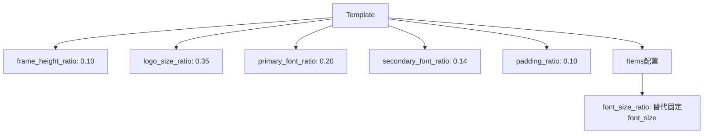
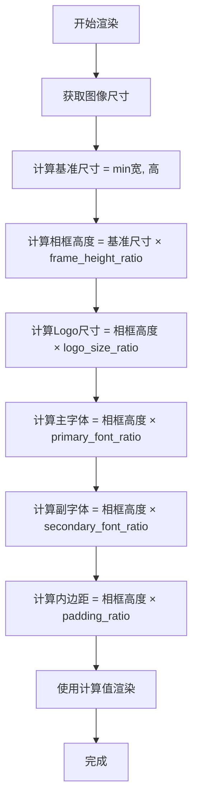

# 相框等比例缩放优化设计

## 需求背景

当前相框实现使用固定高度（100像素），导致在不同分辨率的图像上呈现效果不一致：
- 低分辨率图像：相框过大，视觉不协调
- 高分辨率图像：相框过小，内容拥挤或字体过小

需要改进为基于图像分辨率的等比例缩放方案，以保证在各种尺寸图像上的一致视觉体验。

## 问题分析

### 当前实现

在 `renderer/mod.rs` 的 `render_watermark` 方法中：

| 组件      | 当前实现        | 问题                 |
| --------- | --------------- | -------------------- |
| 相框高度  | 固定 100 像素   | 不随图像分辨率调整   |
| Logo 尺寸 | 固定 30x30 像素 | 高分辨率图像显示过小 |
| 字体大小  | 固定 20/16 像素 | 无法适配不同分辨率   |
| 内边距    | 固定像素值      | 布局比例不一致       |

### 核心缺陷

固定像素布局无法响应图像尺寸变化，导致：
- 同一模板在不同分辨率图像上的视觉比例差异大
- 无法提供专业统一的品牌输出效果

## 设计方案

### 缩放策略

采用基于图像短边的百分比缩放策略：

| 参数      | 计算公式                     | 推荐比例 | 说明                 |
| --------- | ---------------------------- | -------- | -------------------- |
| 相框高度  | `min(width, height) × ratio` | 8-12%    | 相对图像短边的比例   |
| Logo 尺寸 | `frame_height × ratio`       | 30-40%   | 相对相框高度的比例   |
| 主字体    | `frame_height × ratio`       | 18-22%   | 用于作者名等主要信息 |
| 副字体    | `frame_height × ratio`       | 12-16%   | 用于参数等次要信息   |
| 内边距    | `frame_height × ratio`       | 8-12%    | 元素间距             |

**选择短边的理由：**
- 适应横竖构图的图像
- 避免超宽或超高图像中相框过大
- 保证在各种长宽比下的一致性

### 配置参数扩展

在模板系统中增加缩放配置选项：

| 字段                   | 类型 | 默认值 | 说明                            |
| ---------------------- | ---- | ------ | ------------------------------- |
| `frame_height_ratio`   | f32  | 0.10   | 相框高度占图像短边的比例（10%） |
| `logo_size_ratio`      | f32  | 0.35   | Logo尺寸占相框高度的比例（35%） |
| `primary_font_ratio`   | f32  | 0.20   | 主字体占相框高度的比例（20%）   |
| `secondary_font_ratio` | f32  | 0.14   | 副字体占相框高度的比例（14%）   |
| `padding_ratio`        | f32  | 0.10   | 内边距占相框高度的比例（10%）   |

**模板配置示例结构：**



### 计算流程



### 模块修改范围

| 模块       | 文件路径              | 修改内容                                     |
| ---------- | --------------------- | -------------------------------------------- |
| 布局模板   | `src/layout/mod.rs`   | 扩展 Template 结构体，增加缩放比例字段       |
| 渲染引擎   | `src/renderer/mod.rs` | 修改 render_watermark 方法，实现动态尺寸计算 |
| 内置模板   | `templates/*.json`    | 更新模板配置，添加缩放参数                   |
| 代码内模板 | `src/layout/mod.rs`   | 更新 create_builtin_templates 函数           |

## 实现要点

### 向后兼容性处理

为保证现有用户模板不受影响：

| 场景               | 处理策略                               |
| ------------------ | -------------------------------------- |
| 旧模板未配置比例   | 使用默认比例值                         |
| 旧模板使用固定像素 | 优先使用比例值，若未设置则回退到固定值 |
| font_size字段      | 保留字段但添加 font_size_ratio 选项    |

**兼容逻辑：**
- 若 `font_size_ratio` 存在且 > 0，使用比例计算
- 否则使用 `font_size` 固定值
- 确保两种配置方式可共存

### 边界条件处理

| 边界情况             | 处理方案                                    |
| -------------------- | ------------------------------------------- |
| 极小图像（< 500px）  | 设置最小相框高度阈值（如 80px）             |
| 极大图像（> 8000px） | 设置最大相框高度阈值（如 800px）            |
| 比例配置异常         | 验证比例范围（0.05 - 0.20），超出使用默认值 |
| 计算结果为0          | 使用安全默认值（100px）                     |

### 质量保障

**测试覆盖：**

| 测试类型 | 验证点                 |
| -------- | ---------------------- |
| 单元测试 | 尺寸计算逻辑准确性     |
| 集成测试 | 不同分辨率图像渲染效果 |
| 边界测试 | 极端尺寸图像的处理     |
| 回归测试 | 旧模板配置兼容性       |

**测试用例矩阵：**

| 图像类型 | 分辨率    | 预期相框高度（10%比例） |
| -------- | --------- | ----------------------- |
| 小图     | 800×600   | 60px                    |
| 中图     | 1920×1080 | 108px                   |
| 大图     | 4000×3000 | 300px                   |
| 竖图     | 3000×4000 | 300px                   |
| 超宽图   | 6000×2000 | 200px                   |

## 配置示例

### 经典模板配置

```json
{
  "name": "ClassicParam",
  "frame_height_ratio": 0.10,
  "logo_size_ratio": 0.35,
  "primary_font_ratio": 0.20,
  "secondary_font_ratio": 0.14,
  "padding_ratio": 0.10
}
```

### 最小模板配置（使用默认比例）

```json
{
  "name": "Minimal",
  "frame_height_ratio": 0.08
}
```

## 效果预期

优化后的相框效果：

| 图像特征       | 优化前           | 优化后          |
| -------------- | ---------------- | --------------- |
| 1000×750 小图  | 相框过大（13%）  | 相框适中（10%） |
| 4000×3000 大图 | 相框过小（3%）   | 相框适中（10%） |
| 视觉一致性     | 不同尺寸差异明显 | 保持统一比例    |
| 专业度         | 参差不齐         | 专业统一        |

## 实施价值

| 维度     | 价值描述                         |
| -------- | -------------------------------- |
| 用户体验 | 各种分辨率图像获得一致的视觉效果 |
| 灵活性   | 模板支持精细的比例调整           |
| 专业性   | 输出更符合专业摄影作品标准       |
| 扩展性   | 为未来响应式布局奠定基础         |
