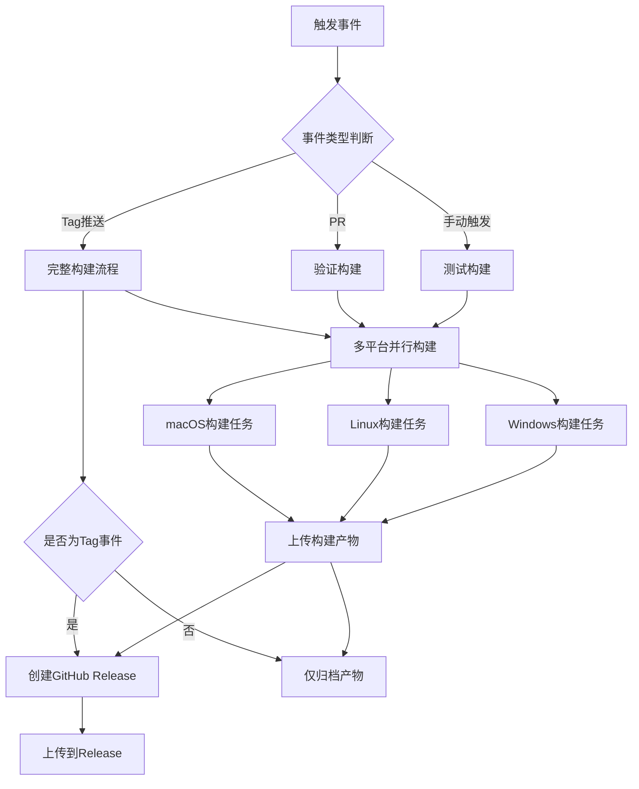

# GitHub Actions 跨平台 CLI 构建设计

## 设计目标

为 LiteMark 项目创建 GitHub Actions 自动化工作流，实现跨平台（macOS、Linux、Windows）的二进制 CLI 工具构建和发布。

## 触发机制

### 主要触发场景

| 触发事件 | 触发条件 | 用途 |
|---------|---------|------|
| Tag 推送 | 推送符合 `v*.*.*` 模式的标签 | 正式版本发布 |
| Pull Request | 针对 main/master 分支的 PR | 构建验证 |
| 手动触发 | workflow_dispatch 事件 | 按需构建测试 |

### 触发策略说明

- **Tag 推送**：当推送如 `v0.1.0`、`v1.2.3` 等版本标签时，触发完整的构建和发布流程
- **PR 验证**：在合并前验证代码在所有目标平台上能够成功编译
- **手动触发**：提供灵活性，支持开发者随时触发构建进行测试

## 目标平台矩阵

### 构建目标

| 平台 | 操作系统版本 | Rust Target | 产物名称 |
|------|------------|-------------|---------|
| macOS (Intel) | macos-latest | x86_64-apple-darwin | litemark-macos-x86_64 |
| macOS (Apple Silicon) | macos-latest | aarch64-apple-darwin | litemark-macos-aarch64 |
| Linux | ubuntu-latest | x86_64-unknown-linux-gnu | litemark-linux-x86_64 |
| Linux (musl) | ubuntu-latest | x86_64-unknown-linux-musl | litemark-linux-musl-x86_64 |
| Windows | windows-latest | x86_64-pc-windows-msvc | litemark-windows-x86_64.exe |

### 平台选择理由

- **macOS 双架构**：覆盖 Intel 和 Apple Silicon 芯片用户
- **Linux gnu**：标准 glibc 动态链接，兼容大多数发行版
- **Linux musl**：静态链接版本，无依赖，适合容器和老旧系统
- **Windows MSVC**：主流 Windows 构建工具链

## 工作流设计

### 整体流程架构



### 任务阶段划分

#### 阶段一：环境准备

**目标**：为每个平台配置统一的构建环境

**关键步骤**：
- 检出代码仓库
- 安装 Rust 工具链（使用 stable 版本）
- 配置交叉编译目标（通过 rustup target add）
- 缓存 Cargo 依赖以加速后续构建

#### 阶段二：代码编译

**目标**：生成优化的 Release 二进制

**关键步骤**：
- 执行 `cargo build --release --target <target-triple>`
- 应用 strip 优化去除调试符号（减小文件体积）
- 验证二进制可执行性

#### 阶段三：产物打包

**目标**：生成规范命名的分发包

**关键步骤**：
- 从 target/<triple>/release 目录提取二进制文件
- 按照 `litemark-<platform>-<arch>[.exe]` 格式重命名
- 上传为 GitHub Actions Artifact
- 计算校验和（SHA256）用于完整性验证

#### 阶段四：发布管理

**目标**：自动化版本发布流程

**关键步骤**：
- 检测触发事件是否为版本 Tag
- 创建 GitHub Release 并关联 Tag
- 将所有平台产物附加到 Release
- 附带校验和文件
- 生成 Release Notes（可选，基于 CHANGELOG）

### 特殊处理需求

#### Linux musl 构建

由于 musl 需要特定编译环境，需要：
- 安装 `musl-tools` 包
- 配置 musl-gcc 作为链接器
- 可能需要静态链接 OpenSSL（如果项目依赖）

#### macOS 交叉编译

- 在 macOS runner 上可以同时构建 x86_64 和 aarch64
- 通过 rustup 添加对应 target 即可，无需额外工具

#### Windows 文件扩展名

- Windows 产物必须包含 `.exe` 后缀
- 压缩包格式建议使用 `.zip` 而非 `.tar.gz`

## 配置参数规范

### 环境变量

| 变量名 | 用途 | 示例值 |
|-------|------|--------|
| CARGO_TERM_COLOR | 控制 Cargo 输出颜色 | always |
| RUST_BACKTRACE | 构建失败时输出详细堆栈 | 1 |

### Rust 工具链版本

- **版本策略**：使用 stable 通道最新版本
- **更新机制**：每次构建时自动获取最新 stable
- **备用方案**：如遇兼容性问题，可锁定特定版本（如 1.75.0）

### 缓存策略

**缓存内容**：
- `~/.cargo/registry` - 依赖包注册表
- `~/.cargo/git` - Git 依赖
- `target/` - 编译中间产物

**缓存键策略**：
- 主键：`<runner-os>-cargo-<Cargo.lock-hash>`
- 恢复键：`<runner-os>-cargo-`

**预期收益**：
- 首次构建：6-8 分钟
- 缓存命中：2-3 分钟

## Release 产物规范

### 文件命名约定

**模式**：`litemark-<platform>-<arch>[<extension>]`

**示例**：
- `litemark-macos-x86_64`
- `litemark-macos-aarch64`
- `litemark-linux-x86_64`
- `litemark-linux-musl-x86_64`
- `litemark-windows-x86_64.exe`

### 校验和文件

生成 `SHA256SUMS.txt` 文件，内容格式：
```
<sha256-hash>  litemark-macos-x86_64
<sha256-hash>  litemark-macos-aarch64
<sha256-hash>  litemark-linux-x86_64
<sha256-hash>  litemark-linux-musl-x86_64
<sha256-hash>  litemark-windows-x86_64.exe
```

用户可通过以下命令验证：
- macOS/Linux: `sha256sum -c SHA256SUMS.txt`
- Windows: `certutil -hashfile litemark-windows-x86_64.exe SHA256`

### Release 描述模板

**自动生成内容**：
- 版本号和发布日期
- 支持平台列表
- 下载说明
- 校验和验证指南
- 变更日志链接（指向 CHANGELOG.md）

## 依赖与权限要求

### GitHub Token 权限

workflow 需要 `contents: write` 权限以：
- 创建 Release
- 上传 Release 资产文件

### 外部 Action 依赖

| Action | 用途 | 版本 |
|--------|------|------|
| actions/checkout | 检出代码 | v4 |
| dtolnay/rust-toolchain | 安装 Rust | stable |
| actions/cache | 缓存依赖 | v3 |
| actions/upload-artifact | 上传构建产物 | v4 |
| softprops/action-gh-release | 创建 Release | v1 |

## 错误处理策略

### 构建失败处理

- **单平台失败**：不阻止其他平台继续构建（使用 `continue-on-error: false`）
- **发布失败**：保留已上传的 Artifacts，方便手动发布
- **通知机制**：通过 GitHub 默认通知邮件告知仓库维护者

### 重试机制

对于网络相关步骤（如依赖下载），允许：
- Cargo 自动重试 2 次
- Actions cache 内置重试机制

## 安全性考虑

### 供应链安全

- **依赖锁定**：通过 `Cargo.lock` 确保依赖版本一致性
- **校验和验证**：为用户提供 SHA256 校验文件
- **二进制签名**：（未来增强）考虑使用 GPG 或 Code Signing

### 工作流安全

- 不使用第三方不受信任的 Actions
- 避免在日志中暴露敏感信息
- 使用 GitHub 原生 GITHUB_TOKEN，避免自定义 PAT

## 性能优化目标

### 构建时间预估

| 场景 | 首次构建 | 缓存命中 |
|------|---------|---------|
| 单平台 | 5-7分钟 | 2-3分钟 |
| 全平台并行 | 7-9分钟 | 3-4分钟 |

### 并行化策略

- 所有平台构建任务并行执行
- 利用 GitHub Actions 矩阵策略自动分配 runner
- 发布阶段等待所有构建完成后统一处理

## 维护与扩展性

### 未来扩展方向

1. **增加更多平台**
   - Linux ARM64（服务器和 Raspberry Pi）
   - Windows ARM64（Surface 等设备）

2. **增强发布流程**
   - 自动生成 Changelog
   - 集成 Homebrew tap 自动更新
   - Docker 镜像构建

3. **测试集成**
   - 构建前运行单元测试
   - 跨平台集成测试
   - 性能基准测试

### 配置文件位置

工作流配置文件应位于：
```
.github/workflows/release.yml
```

### 版本发布流程

开发者操作流程：
1. 更新 `Cargo.toml` 中的版本号
2. 更新 `CHANGELOG.md`
3. 提交变更并推送
4. 创建并推送 tag：`git tag v0.2.0 && git push origin v0.2.0`
5. GitHub Actions 自动触发构建和发布
6. 检查 Release 页面确认所有产物已上传

## 成功验证标准

工作流成功的判定条件：
- ✅ 所有 5 个平台的二进制文件编译成功
- ✅ 生成的二进制文件可在对应平台执行
- ✅ 所有产物已上传到 GitHub Release
- ✅ 校验和文件正确生成
- ✅ Release Notes 自动关联到正确的 Tag
- ✅ 整个流程在 10 分钟内完成
