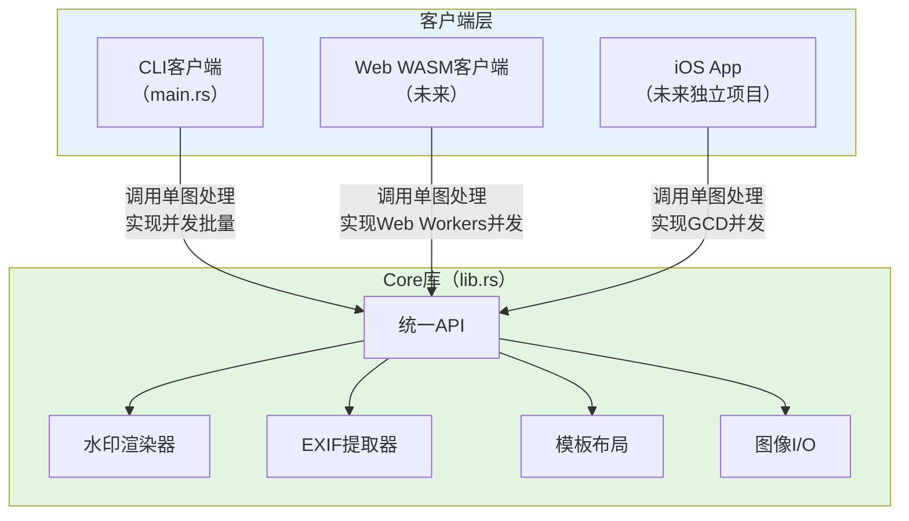
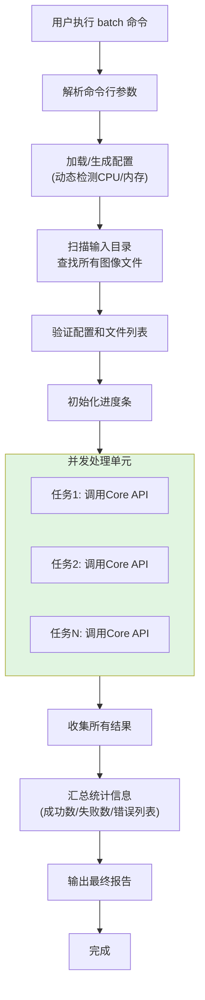
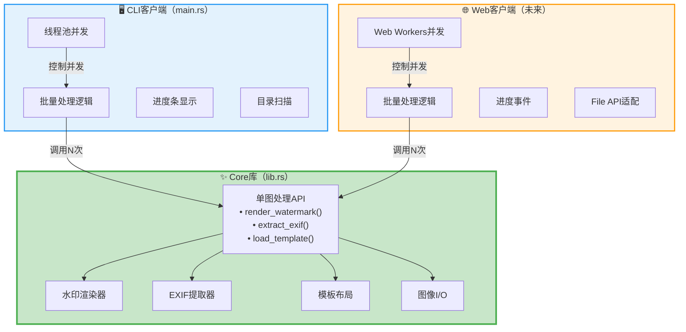
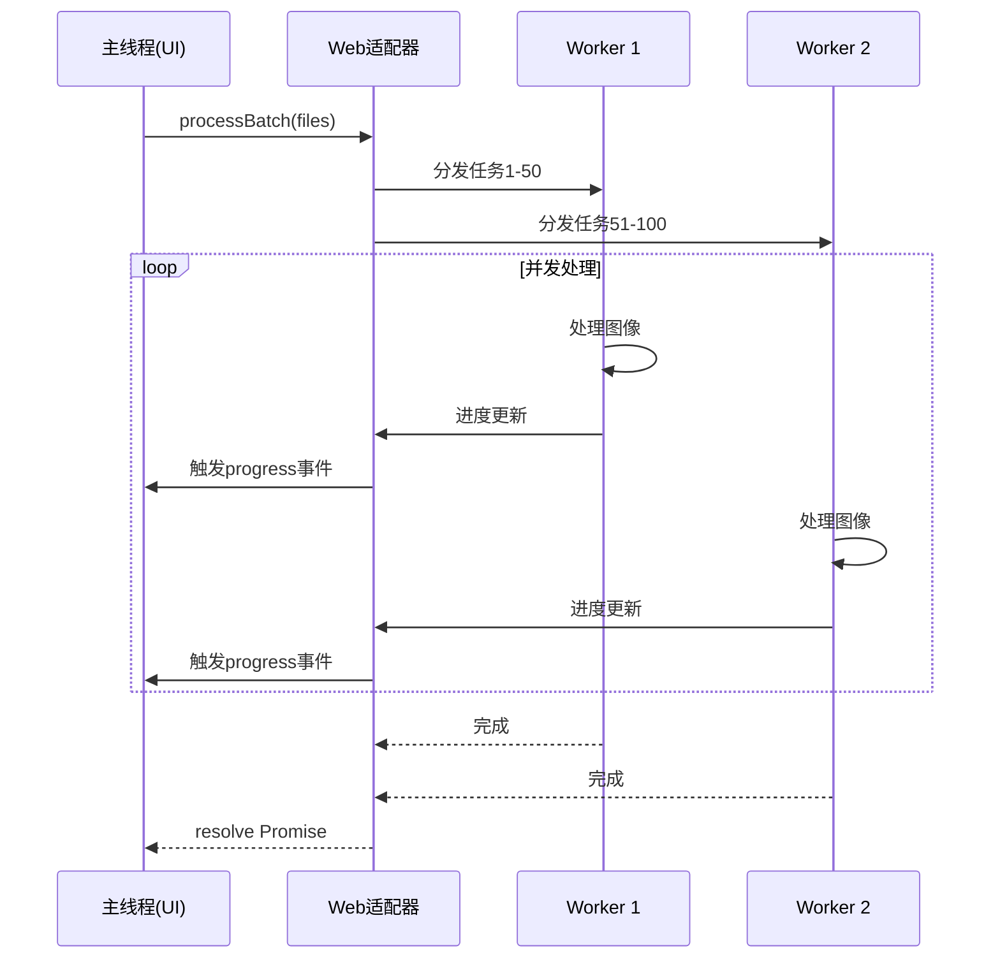
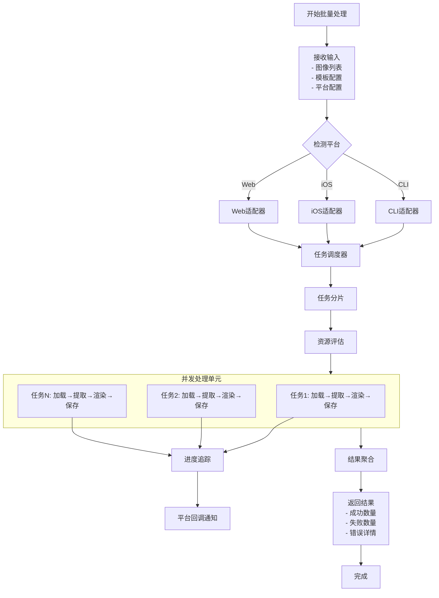
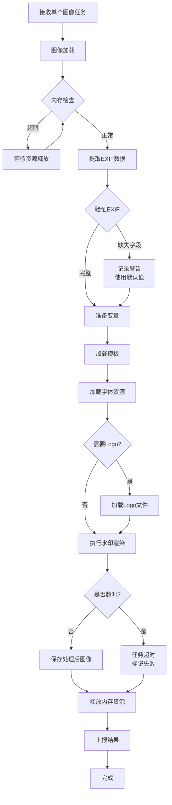
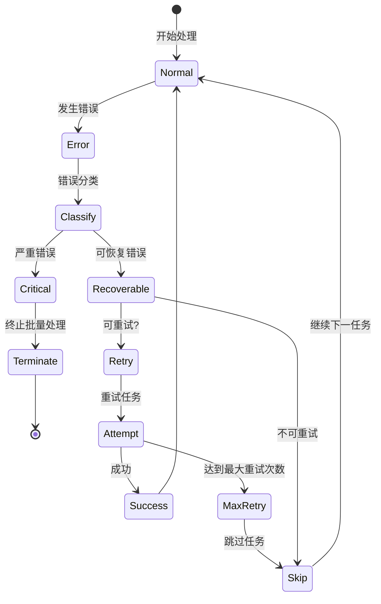
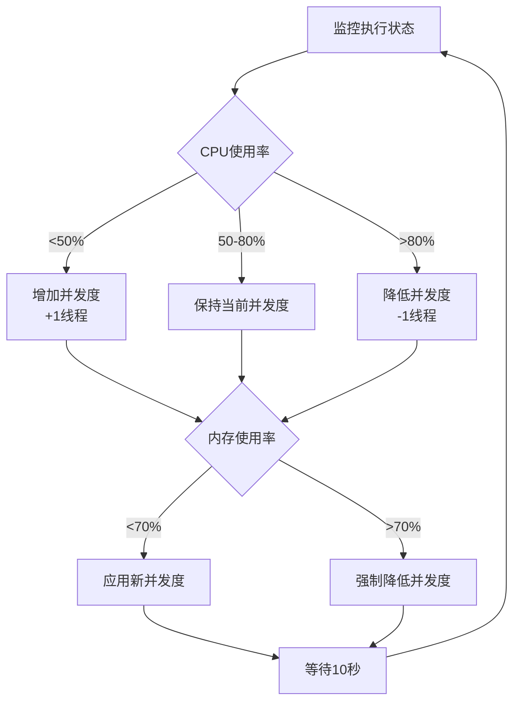
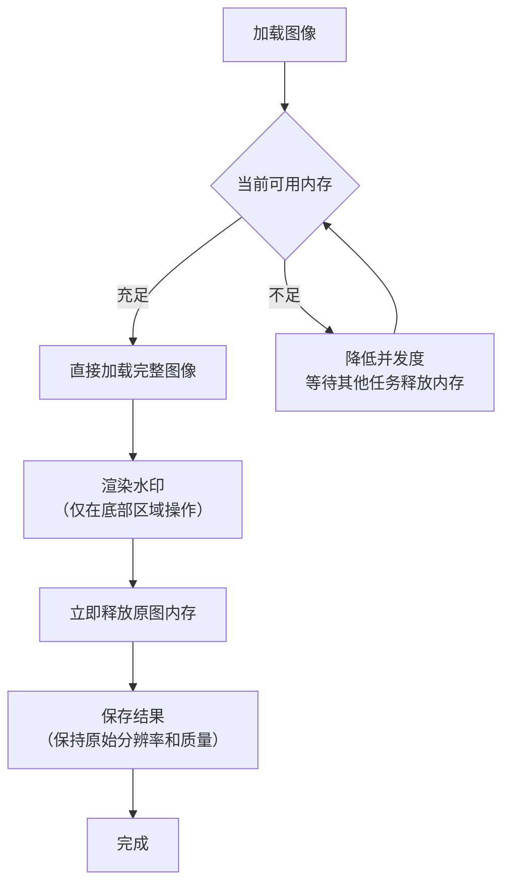
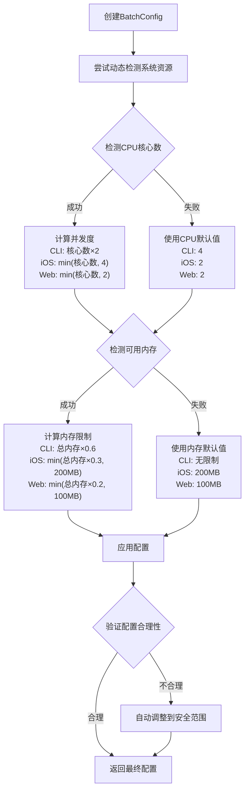

# CLI批量操作实现与代码结构规划

## 设计目标

**当前目标**：为CLI实现高性能批量水印处理能力

**未来规划**：为Core库独立化和多平台扩展做好代码结构准备

### 核心原则

1. **保持Core整洁**：`lib.rs`只提供单图处理API，不包含批量逻辑
2. **CLI实现批量**：在`main.rs`中实现并发批量处理
3. **面向未来扩展**：代码结构为未来Workspace拆分做好准备
4. **清晰的职责边界**：明确Core与CLI的职责划分

**架构理念**：


**职责划分**：

| 层级      | 职责                                      | 示例                                      |
| --------- | ----------------------------------------- | ----------------------------------------- |
| Core库    | 单图水印处理核心算法                      | 加载图像 → 提取EXIF → 渲染水印 → 保存图像 |
| CLI客户端 | 批量处理、线程池并发、终端交互            | 扫描目录 → 并发调用Core → 进度条显示      |
| Web客户端 | 批量处理、Web Workers并发、浏览器适配     | 文件选择 → Worker并发调用Core → 进度事件  |
| iOS客户端 | 批量处理、GCD并发、UI交互（未来独立项目） | 相册选择 → DispatchQueue并发 → 进度回调   |

## 核心问题分析

### 当前问题

1. **串行处理低效**：现有Batch命令采用for循环串行处理，无法利用多核CPU性能
2. **缺乏平台适配**：现有实现仅考虑CLI场景，未考虑不同平台的资源限制和执行环境
3. **无进度反馈机制**：批量处理无法向用户实时反馈进度和错误信息
4. **资源控制缺失**：没有并发数控制、内存管理策略，可能导致资源耗尽

### 平台差异性需求

| 平台特性   | CLI            | iOS                    | Web (WASM)                |
| ---------- | -------------- | ---------------------- | ------------------------- |
| 并发模型   | 操作系统线程池 | GCD/Dispatch Queue     | Web Workers / Promise并发 |
| 内存限制   | 通常无严格限制 | 应用级别限制（数百MB） | 严格限制（浏览器沙箱）    |
| 文件系统   | 本地文件系统   | 沙箱文件系统           | 虚拟文件系统/IndexedDB    |
| 进度反馈   | 终端输出       | UI回调通知             | 事件驱动/回调             |
| 错误处理   | 标准错误输出   | 错误回调/Alert         | Promise rejection/事件    |
| 优先级需求 | 批量处理优先   | 响应用户交互优先       | 避免阻塞主线程            |

## 当前代码结构规划

### 目录结构设计

**原则**：在单crate结构下，通过模块化组织，为未来拆分做好准备。

```
lite-mark-core/
├── src/
│   ├── lib.rs                    # ✨ Core库入口（单图处理API）
│   │
│   ├── main.rs                   # 🖥️ CLI客户端入口（批量处理）
│   │
│   ├── core/                     # 📦 Core核心模块（未来拆分为litemark-core）
│   │   ├── mod.rs                # Core模块导出
│   │   ├── exif_reader/          # EXIF提取
│   │   │   └── mod.rs
│   │   ├── renderer/             # 水印渲染
│   │   │   └── mod.rs
│   │   ├── layout/               # 模板布局
│   │   │   └── mod.rs
│   │   ├── io/                   # 图像I/O
│   │   │   └── mod.rs
│   │   └── types.rs              # 公共类型定义
│   │
│   └── cli/                      # 🛠️ CLI客户端模块（未来拆分为litemark-cli）
│       ├── mod.rs                # CLI模块导出
│       ├── batch.rs              # 批量处理逻辑
│       ├── config.rs             # 配置管理
│       ├── progress.rs           # 进度显示
│       └── error.rs              # CLI错误处理
│
├── templates/                    # 模板文件
├── assets/                       # 资源文件（字体等）
├── Cargo.toml
└── README.md
```

### 模块职责划分

#### Core核心模块（`src/core/`）

**职责**：提供平台无关的单图水印处理能力

| 文件 | 职责 | 对外暴露 |
|------|------|----------|
| `mod.rs` | 模块导出，定义公共API | 是 |
| `exif_reader/mod.rs` | EXIF数据提取 | 通过`lib.rs`暴露 |
| `renderer/mod.rs` | 水印渲染实现 | 通过`lib.rs`暴露 |
| `layout/mod.rs` | 模板解析与布局 | 通过`lib.rs`暴露 |
| `io/mod.rs` | 图像加载与保存 | 通过`lib.rs`暴露 |
| `types.rs` | 公共数据类型 | 是 |

**不包含**：
- ✖️ 批量处理逻辑
- ✖️ 并发控制
- ✖️ CLI参数解析
- ✖️ 平台特定功能

#### CLI客户端模块（`src/cli/`）

**职责**：实现CLI特有的批量处理和用户交互

| 文件 | 职责 | 说明 |
|------|------|------|
| `mod.rs` | 模块导出 | CLI模块公共接口 |
| `batch.rs` | 批量处理逻辑 | 目录扫描、并发调度、结果汇总 |
| `config.rs` | 配置管理 | 动态检测CPU/内存、配置验证 |
| `progress.rs` | 进度显示 | 终端进度条、日志输出 |
| `error.rs` | 错误处理 | CLI特定错误类型和格式化 |

**依赖**：
- ✅ 调用 `src/core/` 模块
- ✅ 使用 `clap` 解析命令行
- ✅ 使用 `rayon` 实现并发
- ✅ 使用 `indicatif` 显示进度

### 代码组织示例

#### `src/lib.rs` - Core库入口

```rust
// 只导出Core核心功能，不包含CLI逻辑

pub mod core;

// Re-export核心类型和API
pub use core::{
    exif_reader::{ExifData, extract_exif_data},
    renderer::{WatermarkRenderer},
    layout::{Template},
    io::{load_image, save_image},
    types::*,
};

// Core的公共API：单图处理
pub fn process_single_image(
    input_path: &str,
    output_path: &str,
    template: &Template,
    options: ProcessOptions,
) -> Result<(), CoreError> {
    // 实现...
}
```

#### `src/main.rs` - CLI入口

```rust
// CLI客户端入口，调用core和cli模块

mod core;  // Core核心模块
mod cli;   // CLI客户端模块

use clap::{Parser, Subcommand};
use cli::batch::BatchProcessor;

#[derive(Parser)]
struct Cli {
    #[command(subcommand)]
    command: Commands,
}

#[derive(Subcommand)]
enum Commands {
    Add { /* ... */ },
    Batch { /* ... */ },
    Templates,
    ShowTemplate { /* ... */ },
}

fn main() -> Result<(), Box<dyn std::error::Error>> {
    let cli = Cli::parse();
    
    match cli.command {
        Commands::Batch { input_dir, output_dir, .. } => {
            // 调用CLI模块的批量处理
            let processor = BatchProcessor::new();
            processor.process(&input_dir, &output_dir)?;
        }
        // 其他命令...
    }
    
    Ok(())
}
```

#### `src/cli/batch.rs` - 批量处理实现

```rust
use rayon::prelude::*;
use crate::core;

pub struct BatchProcessor {
    config: BatchConfig,
    progress: ProgressBar,
}

impl BatchProcessor {
    pub fn process(
        &self,
        input_dir: &str,
        output_dir: &str,
    ) -> Result<BatchResult> {
        let images = find_images(input_dir)?;
        
        // 使用Rayon并发处理
        let results: Vec<_> = images
            .par_iter()
            .map(|img| {
                // 调用Core的单图处理API
                core::process_single_image(
                    img,
                    &create_output_path(img, output_dir),
                    &self.config.template,
                    self.config.options.clone(),
                )
            })
            .collect();
        
        aggregate_results(results)
    }
}
```

### 迁移路径：从单crate到Workspace

**第一步：当前结构调整**（本次实现）

1. 创建 `src/core/` 目录，移动现有模块：
   - `src/exif_reader/` → `src/core/exif_reader/`
   - `src/renderer/` → `src/core/renderer/`
   - `src/layout/` → `src/core/layout/`
   - `src/io/` → `src/core/io/`

2. 创建 `src/cli/` 目录，将CLI逻辑从`main.rs`抽离：
   - 批量处理 → `src/cli/batch.rs`
   - 配置管理 → `src/cli/config.rs`
   - 进度显示 → `src/cli/progress.rs`

3. 调整 `src/lib.rs` 和 `src/main.rs`

**第二步：未来Workspace拆分**（v1.0时）

1. 创建 Workspace 结构
2. `src/core/` → `crates/litemark-core/src/`
3. `src/cli/` + `src/main.rs` → `crates/litemark-cli/src/`
4. 新建 `crates/litemark-wasm/` （Web平台）

## CLI批量处理实现详细设计

### 1. 批量处理流程



### 2. 关键模块设计

#### `cli/batch.rs` - 批量处理核心

**核心结构**：

```rust
pub struct BatchProcessor {
    config: BatchConfig,
}

pub struct BatchConfig {
    pub max_concurrency: usize,      // 最大并发数
    pub memory_limit_mb: Option<usize>, // 内存限制
    pub task_timeout_sec: u64,        // 单任务超时
    pub show_progress: bool,          // 是否显示进度
}

pub struct BatchResult {
    pub total: usize,
    pub succeeded: usize,
    pub failed: usize,
    pub errors: Vec<BatchError>,
}

pub struct BatchError {
    pub image_path: String,
    pub error: String,
}
```

**核心方法**：

```rust
impl BatchProcessor {
    pub fn new(config: BatchConfig) -> Self {
        // 初始化
    }
    
    pub fn process(
        &self,
        input_dir: &str,
        output_dir: &str,
        template: &Template,
        options: ProcessOptions,
    ) -> Result<BatchResult> {
        // 1. 扫描目录
        let images = self.find_images(input_dir)?;
        
        // 2. 创建输出目录
        create_dir_all(output_dir)?;
        
        // 3. 初始化进度条
        let progress = if self.config.show_progress {
            Some(ProgressBar::new(images.len()))
        } else {
            None
        };
        
        // 4. 并发处理
        let results = self.process_parallel(
            &images,
            output_dir,
            template,
            options,
            progress.as_ref(),
        );
        
        // 5. 汇总结果
        Ok(self.aggregate_results(results))
    }
    
    fn process_parallel(
        &self,
        images: &[String],
        output_dir: &str,
        template: &Template,
        options: ProcessOptions,
        progress: Option<&ProgressBar>,
    ) -> Vec<Result<(), String>> {
        use rayon::prelude::*;
        
        // 配置Rayon线程池
        rayon::ThreadPoolBuilder::new()
            .num_threads(self.config.max_concurrency)
            .build()
            .unwrap()
            .install(|| {
                images
                    .par_iter()
                    .map(|img_path| {
                        let result = self.process_single(
                            img_path,
                            output_dir,
                            template,
                            &options,
                        );
                        
                        // 更新进度
                        if let Some(pb) = progress {
                            pb.inc(1);
                        }
                        
                        result
                    })
                    .collect()
            })
    }
    
    fn process_single(
        &self,
        input_path: &str,
        output_dir: &str,
        template: &Template,
        options: &ProcessOptions,
    ) -> Result<(), String> {
        // 调用Core API
        let output_path = create_output_path(input_path, output_dir);
        
        core::process_single_image(
            input_path,
            &output_path,
            template,
            options.clone(),
        ).map_err(|e| e.to_string())
    }
}
```

#### `cli/config.rs` - 配置管理

**功能**：动态检测系统资源，生成合理配置

```rust
pub struct ConfigBuilder {
    custom_concurrency: Option<usize>,
    custom_memory_limit: Option<usize>,
}

impl ConfigBuilder {
    pub fn build() -> BatchConfig {
        let cpu_cores = detect_cpu_cores();
        let available_memory = detect_available_memory();
        
        let max_concurrency = self.custom_concurrency
            .unwrap_or_else(|| calculate_concurrency(cpu_cores));
        
        let memory_limit_mb = self.custom_memory_limit
            .or_else(|| calculate_memory_limit(available_memory));
        
        BatchConfig {
            max_concurrency,
            memory_limit_mb,
            task_timeout_sec: 300,
            show_progress: true,
        }
    }
}

fn detect_cpu_cores() -> Option<usize> {
    num_cpus::get().into()  // 使用num_cpus crate
}

fn detect_available_memory() -> Option<u64> {
    // 使用sys-info crate或平台特定API
}

fn calculate_concurrency(cpu_cores: Option<usize>) -> usize {
    match cpu_cores {
        Some(cores) => (cores * 2).min(32).max(2),
        None => 4,  // 默认值
    }
}
```

#### `cli/progress.rs` - 进度显示

**功能**：终端进度条和日志输出

```rust
use indicatif::{ProgressBar, ProgressStyle};

pub fn create_progress_bar(total: usize) -> ProgressBar {
    let pb = ProgressBar::new(total as u64);
    pb.set_style(
        ProgressStyle::default_bar()
            .template("[{bar:40.cyan/blue}] {pos}/{len} {msg}")
            .progress_chars("##-")
    );
    pb
}

pub fn log_success(path: &str) {
    println!("✓ Processed: {}", path);
}

pub fn log_error(path: &str, error: &str) {
    eprintln!("✗ Error processing {}: {}", path, error);
}
```

### 3. CLI命令参数设计

**新增参数**：

```rust
Batch {
    /// 输入目录路径
    #[arg(short, long)]
    input_dir: String,

    /// 输出目录路径
    #[arg(short, long)]
    output_dir: String,

    /// 模板名称或路径
    #[arg(short, long, default_value = "classic")]
    template: String,

    /// 最大并发数（覆盖自动检测）
    #[arg(short = 'c', long)]
    concurrency: Option<usize>,

    /// 内存限制（MB）
    #[arg(short = 'm', long)]
    memory_limit: Option<usize>,

    /// 单任务超时时间（秒）
    #[arg(long, default_value = "300")]
    timeout: u64,

    /// 禁用进度条
    #[arg(long)]
    no_progress: bool,

    /// 作者名称
    #[arg(long)]
    author: Option<String>,

    /// 自定义字体
    #[arg(long)]
    font: Option<String>,

    /// Logo文件
    #[arg(long)]
    logo: Option<String>,
}
```

**使用示例**：

```bash
# 基本用法：自动检测并发数
litemark batch -i ./photos -o ./output -t classic

# 指定并发数
litemark batch -i ./photos -o ./output -c 8

# 限制内存使用
litemark batch -i ./photos -o ./output -m 2048

# 禁用进度条（适合脚本/CI）
litemark batch -i ./photos -o ./output --no-progress

# 完整配置
litemark batch \
  -i ./photos \
  -o ./output \
  -t modern \
  -c 16 \
  --author "张三" \
  --font /path/to/font.otf \
  --logo /path/to/logo.png
```

**设计理念**：Core保持简洁，只提供单图处理API；批量、并发、平台适配由各客户端实现。



### 职责划分

#### Core库（lib.rs）职责

| 功能领域 | 具体职责                                                | 不包含          |
| -------- | ------------------------------------------------------- | --------------- |
| 单图处理 | 提供 `render_watermark(image, template, variables)` API | 批量处理逻辑    |
| EXIF解析 | 提供 `extract_exif_data(path)` API                      | 文件扫描/遮历   |
| 模板系统 | 提供 `Template::from_json()` API                        | 模板市场/云同步 |
| 图像I/O  | 提供 `load_image()`, `save_image()` API                 | 目录操作        |
| 线程安全 | 确保 API 可并发调用（无共享可变状态）                   | 并发调度策略    |

**Core API 示例**（伪代码）：

```rust
// Core库只提供单图处理能力
pub fn process_single_image(
    input_path: &str,
    output_path: &str,
    template: &Template,
    author: Option<&str>,
    font: Option<&[u8]>,
    logo: Option<&str>,
) -> Result<()> {
    // 1. 加载图像
    let mut image = io::load_image(input_path)?;
    
    // 2. 提取EXIF
    let exif_data = exif_reader::extract_exif_data(input_path)?;
    
    // 3. 准备变量
    let mut variables = exif_data.to_variables();
    if let Some(author_name) = author {
        variables.insert("Author".to_string(), author_name.to_string());
    }
    
    // 4. 渲染水印
    let renderer = WatermarkRenderer::with_font(font)?;
    renderer.render_watermark(&mut image, template, &variables, logo)?;
    
    // 5. 保存结果
    io::save_image(&image, output_path)?;
    
    Ok(())
}
```

#### CLI客户端（main.rs）职责

| 功能领域   | 具体职责                                             |
| ---------- | ---------------------------------------------------- |
| 批量处理   | `process_batch()` 函数：扫描目录、遍历图像列表       |
| 并发调度   | 使用 Rayon 或线程池，并发调用 Core API               |
| 命令行解析 | 使用 clap 解析 `--concurrency`, `--input-dir` 等参数 |
| 进度显示   | 终端进度条（如 indicatif 库）                        |
| 错误处理   | 汇总各图像处理错误，输出摘要                         |
| 资源管理   | 控制最大并发数、内存限制                             |

**CLI批量处理示例**（伪代码）：

```rust
// CLI客户端实现批量并发处理
fn process_batch_concurrent(
    images: Vec<String>,
    template: &Template,
    output_dir: &str,
    concurrency: usize,
) -> Result<BatchResult> {
    // 使用Rayon并发处理
    let results: Vec<_> = images
        .par_iter()  // Rayon的并行迭代器
        .with_max_len(concurrency)
        .map(|image_path| {
            // 调用Core的单图处理API
            let output_path = create_output_path(image_path, output_dir);
            litemark_core::process_single_image(
                image_path,
                &output_path,
                template,
                None,
                None,
                None,
            )
        })
        .collect();
    
    // 汇总结果
    aggregate_results(results)
}
```

#### Web客户端职责（未来）

| 功能领域 | 具体职责                                        |
| -------- | ----------------------------------------------- |
| 批量处理 | 接收用户上传的多个文件，组织批量处理            |
| 并发调度 | 使用 Web Workers 并发调用 WASM 编译的 Core      |
| 文件处理 | 使用 File API 读取文件，转换为 Blob/ArrayBuffer |
| 进度显示 | 触发 progress 事件，更新 UI 进度条              |
| 结果下载 | 生成 ZIP 或逐个下载处理后的图像                 |
| 内存管理 | 受浏览器限制，控制并发数为 1-2                  |

### CLI批量处理实现要点

#### 1. 并发策略

**选型**：使用 Rayon 库实现数据并行

**优势**：
- 零成本并行：API 简单，只需将 `.iter()` 改为 `.par_iter()`
- 自动负载均衡：自动分配任务到线程池
- 可配置线程数：通过 `RAYON_NUM_THREADS` 环境变量或代码设置

**实现示例**：

| 新增CLI参数    | 短选项 | 类型 | 默认值    | 说明                 |
| -------------- | ------ | ---- | --------- | -------------------- |
| --concurrency  | -c     | 整数 | CPU核心数 | 最大并发任务数       |
| --memory-limit | -m     | 整数 | 无限制    | 最大内存使用量（MB） |
| --timeout      | 无     | 整数 | 300       | 单任务超时时间（秒） |
| --progress     | 无     | 布尔 | true      | 是否显示进度条       |

**输出示例**：
```
Processing 150 images...
[████████████████████████----] 80% (120/150) - ETA: 45s
✓ IMG_001.jpg
✓ IMG_002.jpg
✗ IMG_003.jpg (Error: Invalid EXIF data)
...
```

#### iOS适配器

**特性**：
- 异步非阻塞处理，避免UI卡顿
- 支持后台任务执行
- 内存压力自适应降级
- 进度回调通知UI更新

**接口设计**：

| 方法签名                                                                  | 说明         |
| ------------------------------------------------------------------------- | ------------ |
| processBatch(images:template:config:progressCallback:completionCallback:) | 启动批量处理 |
| cancelBatch(taskId:)                                                      | 取消指定任务 |
| pauseBatch(taskId:)                                                       | 暂停任务     |
| resumeBatch(taskId:)                                                      | 恢复任务     |

**回调结构**：

| 回调类型           | 参数                                 | 触发时机         |
| ------------------ | ------------------------------------ | ---------------- |
| progressCallback   | (completed, total, currentImage)     | 每完成一张图像   |
| errorCallback      | (image, error)                       | 某张图像处理失败 |
| completionCallback | (successCount, failureCount, errors) | 全部完成         |

**内存管理策略**：
- 接收到内存警告时自动降低并发度（4→2→1）
- 完成一张图像后立即释放内存

#### Web适配器

**特性**：
- 基于Web Workers的并发处理
- 避免阻塞主线程
- 支持进度事件和Promise接口
- 虚拟文件系统适配

**接口设计**：

| 方法签名                               | 返回类型             | 说明           |
| -------------------------------------- | -------------------- | -------------- |
| processBatch(files, template, options) | Promise<BatchResult> | 异步批量处理   |
| onProgress(callback)                   | void                 | 注册进度监听器 |
| cancel()                               | Promise<void>        | 取消当前任务   |

**Web Worker通信流程**：



**文件处理策略**：
- 使用File API读取本地文件
- 处理后生成Blob对象
- 支持批量下载为ZIP或逐个下载

## 数据流设计

### 批量处理主流程



### 单任务处理流程



## 错误处理策略

### 错误分类

| 错误类型         | 严重级别 | 处理策略             | 是否终止批量处理 |
| ---------------- | -------- | -------------------- | ---------------- |
| 单张图像加载失败 | 低       | 跳过该图像，继续处理 | 否               |
| EXIF数据缺失     | 低       | 使用默认值，记录警告 | 否               |
| 模板加载失败     | 高       | 立即终止             | 是               |
| 字体加载失败     | 中       | 降级使用默认字体     | 否               |
| Logo加载失败     | 中       | 跳过Logo渲染         | 否               |
| 输出目录无写权限 | 高       | 立即终止             | 是               |
| 内存不足         | 高       | 降低并发度或终止     | 视平台而定       |
| 单任务超时       | 中       | 跳过该任务           | 否               |

### 错误恢复机制



### 错误聚合与报告

**错误信息结构**：

| 字段          | 类型   | 说明           |
| ------------- | ------ | -------------- |
| image_path    | 字符串 | 失败的图像路径 |
| error_type    | 枚举   | 错误类型       |
| error_message | 字符串 | 错误详细描述   |
| timestamp     | 时间戳 | 错误发生时间   |
| retry_count   | 整数   | 重试次数       |

**平台差异化报告**：

| 平台 | 报告方式                                         |
| ---- | ------------------------------------------------ |
| CLI  | 终端输出错误摘要，可选生成错误日志文件           |
| iOS  | 通过errorCallback回调，可选展示Alert             |
| Web  | 通过Promise rejection或error事件，可选控制台输出 |

## 性能优化策略

### 并发度动态调整

**调整算法**：



### 资源复用策略

| 资源类型   | 复用策略                   | 收益                   |
| ---------- | -------------------------- | ---------------------- |
| 字体数据   | 全局单例，所有任务共享     | 减少内存占用和加载时间 |
| Logo图像   | 加载一次，克隆使用         | 避免重复I/O            |
| 模板对象   | 解析一次，多次使用         | 减少JSON解析开销       |
| 渲染器实例 | 线程本地存储，避免频繁创建 | 减少初始化开销         |

### 内存优化

**大图像处理策略**：

**设计原则**：保证输出图像质量不受损失，通过并发控制而非降低分辨率来管理内存。



**内存压力响应**：

| 内存压力级别 | 触发条件         | 响应措施                 | 质量影响     |
| ------------ | ---------------- | ------------------------ | ------------ |
| 正常         | 使用率<60%       | 正常执行                 | 无           |
| 警告         | 使用率60-80%     | 降低并发度50%            | 无           |
| 严重         | 使用率>80%       | 降至串行处理，强制GC     | 无           |
| 危急         | 使用率>90%       | 暂停新任务，等待内存释放 | 无           |
| 单图过大     | 单个图像加载失败 | 跳过该图像，记录错误     | 该图像不处理 |

**关键说明**：所有内存优化策略都不会降低输出图像质量，仅通过调整并发度和处理顺序来控制内存使用。对于确实超出系统内存能力的超大图像，系统会明确报错，而不是生成低质量的输出。

## 平台集成接口规范

### 统一批量处理接口

**接口定义**（伪代码）：

```
BatchProcessorInterface:
    方法: process_batch
    输入:
        - images: 图像列表（路径或二进制数据）
        - template: 模板配置
        - options: 处理选项
            - author: 可选作者名
            - font: 可选字体路径
            - logo: 可选Logo路径
            - concurrency: 并发度配置
            - memory_limit: 内存限制
            - timeout: 超时配置
        - callbacks: 回调接口
            - on_progress: 进度回调
            - on_error: 错误回调
            - on_complete: 完成回调
    输出:
        - BatchResult:
            - total: 总任务数
            - success: 成功数量
            - failed: 失败数量
            - errors: 错误列表
            - outputs: 输出图像列表
```

### 平台配置结构

#### 配置获取策略

**设计原则**：动态检测优先，默认值兜底，确保系统在各种环境下都能稳定运行。



#### 配置参数表

| 配置项           | 动态检测方式       | CLI默认值（兜底） | iOS默认值（兜底） | Web默认值（兜底） | 说明             |
| ---------------- | ------------------ | ----------------- | ----------------- | ----------------- | ---------------- |
| max_concurrency  | CPU核心数动态计算  | 4                 | 2                 | 2                 | 最大并发任务数   |
| memory_limit_mb  | 可用内存比例计算   | 无限制            | 200               | 100               | 内存限制（MB）   |
| task_timeout_sec | 固定值（无需动态） | 300               | 60                | 30                | 单任务超时时间   |
| enable_progress  | 固定值（无需动态） | true              | true              | true              | 是否启用进度通知 |
| retry_on_failure | 固定值（无需动态） | true              | true              | false             | 失败是否重试     |
| max_retry_count  | 固定值（无需动态） | 3                 | 2                 | 1                 | 最大重试次数     |

#### 动态配置计算规则

**并发度计算**：

| 平台 | 计算公式          | 最小值 | 最大值 | 兜底默认值 |
| ---- | ----------------- | ------ | ------ | ---------- |
| CLI  | CPU核心数 × 2     | 2      | 32     | 4          |
| iOS  | min(CPU核心数, 4) | 1      | 4      | 2          |
| Web  | min(CPU核心数, 2) | 1      | 2      | 2          |

**内存限制计算**：

| 平台 | 计算公式                 | 最小值 | 最大值 | 兜底默认值 |
| ---- | ------------------------ | ------ | ------ | ---------- |
| CLI  | 总内存 × 0.6（或不限制） | 512MB  | 无限制 | 无限制     |
| iOS  | min(总内存 × 0.3, 200MB) | 100MB  | 200MB  | 200MB      |
| Web  | min(总内存 × 0.2, 100MB) | 50MB   | 100MB  | 100MB      |

**检测失败场景**：

| 检测项     | 可能失败原因            | 降级策略       |
| ---------- | ----------------------- | -------------- |
| CPU核心数  | 系统API不可用、权限不足 | 使用兜底默认值 |
| 可用内存   | 系统API不可用、沙箱限制 | 使用兜底默认值 |
| 运行时环境 | 无法识别平台类型        | 使用最保守配置 |

#### 配置验证与调整

**验证规则**：

| 验证项     | 验证条件                         | 不满足时的调整           |
| ---------- | -------------------------------- | ------------------------ |
| 并发度     | 1 ≤ max_concurrency ≤ 平台最大值 | 钳制到合法范围           |
| 内存限制   | 内存限制 ≥ 50MB                  | 调整为50MB（最小安全值） |
| 超时时间   | timeout ≥ 10秒                   | 调整为10秒               |
| 逻辑一致性 | 内存限制需能支撑并发度           | 降低并发度或提示配置冲突 |

## 测试策略

### 测试维度

| 测试类型   | 测试目标           | 关键指标               |
| ---------- | ------------------ | ---------------------- |
| 功能测试   | 验证批量处理正确性 | 成功率、输出图像质量   |
| 性能测试   | 评估并发处理效率   | 吞吐量、延迟           |
| 压力测试   | 验证资源控制有效性 | 内存峰值、CPU使用率    |
| 兼容性测试 | 验证多平台一致性   | 平台差异化行为         |
| 异常测试   | 验证错误处理机制   | 错误恢复率、数据完整性 |

### 性能基准

| 场景   | 图像数量 | 平均尺寸  | 预期吞吐量 (CLI) | 预期吞吐量 (iOS) | 预期吞吐量 (Web) |
| ------ | -------- | --------- | ---------------- | ---------------- | ---------------- |
| 小批量 | 10       | 2000×1500 | 10张/s           | 5张/s            | 2张/s            |
| 中批量 | 100      | 3000×2000 | 8张/s            | 3张/s            | 1.5张/s          |
| 大批量 | 1000     | 4000×3000 | 5张/s            | 2张/s            | 1张/s            |

## 实施步骤

### 阶段一：代码结构调整（Week 1）

**目标**：重组代码结构，为未来拆分做好准备

**任务清单**：

- [ ] **1.1 创建Core模块目录**
  - 创建 `src/core/` 目录
  - 移动现有模块：
    - `src/exif_reader/` → `src/core/exif_reader/`
    - `src/renderer/` → `src/core/renderer/`
    - `src/layout/` → `src/core/layout/`
    - `src/io/` → `src/core/io/`
  - 创建 `src/core/mod.rs` 和 `src/core/types.rs`

- [ ] **1.2 创建CLI模块目录**
  - 创建 `src/cli/` 目录
  - 创建空模块文件：
    - `src/cli/mod.rs`
    - `src/cli/batch.rs`
    - `src/cli/config.rs`
    - `src/cli/progress.rs`
    - `src/cli/error.rs`

- [ ] **1.3 调整`src/lib.rs`**
  - 添加 `pub mod core;`
  - Re-export Core公共API
  - 移除CLI相关代码

- [ ] **1.4 调整`src/main.rs`**
  - 添加 `mod core;` 和 `mod cli;`
  - 保留clap命令解析
  - 准备调用 `cli::batch` 模块

- [ ] **1.5 更新测试**
  - 更新import路径
  - 确保所有测试通过

**验收标准**：
- ✅ `cargo build` 成功
- ✅ `cargo test` 全部通过
- ✅ 现有功能不受影响
- ✅ 目录结构清晰，职责明确

### 阶段二：实现CLI批量处理（Week 2-3）

**目标**：实现高性能并发批量处理

**任务清单**：

- [ ] **2.1 添加依赖**
  ```toml
  [dependencies]
  rayon = "1.8"          # 并发处理
  indicatif = "0.17"     # 进度条
  num_cpus = "1.16"      # CPU检测
  ```

- [ ] **2.2 实现 `cli/config.rs`**
  - `BatchConfig` 结构体
  - `ConfigBuilder` 实现
  - 动态检测CPU核心数
  - 配置验证逻辑

- [ ] **2.3 实现 `cli/batch.rs`**
  - `BatchProcessor` 结构体
  - `process()` 方法：主流程
  - `process_parallel()` 方法：Rayon并发
  - `process_single()` 方法：调用Core API
  - 结果汇总逻辑

- [ ] **2.4 实现 `cli/progress.rs`**
  - 创建进度条
  - 日志输出函数
  - 成功/失败格式化

- [ ] **2.5 实现 `cli/error.rs`**
  - CLI错误类型定义
  - 错误格式化输出

- [ ] **2.6 集成到 `main.rs`**
  - 连接clap命令和BatchProcessor
  - 添加新的CLI参数
  - 实现batch命令处理逻辑

**验收标准**：
- ✅ 能够批量处理图像
- ✅ 并发处理正常工作
- ✅ 进度条显示正确
- ✅ 错误处理完善
- ✅ 性能达到预期（比串行快2-4倍）

### 阶段三：测试与优化（Week 4）

**目标**：完善测试、性能优化、文档完善

**任务清单**：

- [ ] **3.1 单元测试**
  - `cli/config.rs` 的配置生成测试
  - `cli/batch.rs` 的批量处理测试
  - 边界情况测试（空目录、单文件等）

- [ ] **3.2 集成测试**
  - 小批量测试（10张图）
  - 中批量测试（100张图）
  - 大批量测试（1000张图）
  - 异常情况测试（损坏EXIF、缺失模板）

- [ ] **3.3 性能优化**
  - Benchmark性能测试
  - 识别性能瓶颈
  - 优化并发策略
  - 内存使用优化

- [ ] **3.4 文档完善**
  - 更新README：批量处理使用指南
  - 添加代码注释
  - 创建示例文档

**验收标准**：
- ✅ 测试覆盖率 > 80%
- ✅ 性能达到基准（5-10张/s）
- ✅ 文档完善，示例丰富
- ✅ 通过各种场景测试

**目标**：为CLI客户端实现高性能并发批量处理

**关键任务**：
1. 在`main.rs`中集成Rayon库，实现并行批量处理
2. 添加CLI并发控制参数（`--concurrency`等）
3. 集成indicatif库，实现终端进度条显示
4. 实现动态配置检测（CPU核心数、内存）
5. 完善错误处理和结果汇总
6. 性能测试和优化

**验收标准**：
- 并发处理吞吐量达到性能基准（CLI: 5-10张/s）
- 进度输出友好清晰
- 错误处理完善，提供详细错误报告
- 通过各种场景测试（小批量、大批量、异常图像）

**Core库要求**：
- 保持`lib.rs`接口稳定，不引入批量处理逻辑
- 确保 API 线程安全，支持并发调用

### 阶段二：Web WASM批量处理（未来）

**目标**：将Core编译为WASM，实现Web平台批量处理

**关键任务**：
1. 使用wasm-pack编译Core为WASM模块
2. 实现Web Workers并发调度逻辑
3. 实现Promise和事件驱动接口
4. 适配File API和虚拟文件系统
5. 浏览器兼容性测试

**验收标准**：
- 不阻塞主线程
- 内存控制在浏览器限制内
- 支持主流现代浏览器（Chrome, Firefox, Safari, Edge）

**Core库要求**：
- 确保Core可以被wasm-pack成功编译
- 减少WASM包体积（如嵌入字体改为可选加载）

### 阶段三：优化与增强

**目标**：CLI和Web平台性能优化和功能增强

**关键任务**：
1. 动态并发度调整算法实现
2. 资源复用优化（字体、Logo、模板）
3. 完善错误恢复机制
4. CLI和Web集成测试
5. 文档完善（API文档、使用指南）

**验收标准**：
- 性能达到或超过基准指标
- 资源使用优化明显
- 通过压力测试和长时间运行测试

### 未来拓展：iOS平台（独立项目）

**计划**：
- 将litemark-core编译为iOS Framework
- 开发Swift封装层
- 利用GCD实现异步批量处理
- 作为独立的iOS App项目，不影响当前Core库的简洁性

## 未来架构演进：Workspace拆分

### 当前结构（v0.2.x）

**单crate结构**：保持简单，适合快速迭代

```
lite-mark-core/
├── src/
│   ├── lib.rs           # Core库（单图处理API）
│   ├── main.rs          # CLI客户端（批量处理）
│   ├── exif_reader/
│   ├── renderer/
│   ├── layout/
│   ├── io/
│   └── ...
├── Cargo.toml
└── README.md
```

**职责边界**：
- `lib.rs`：只提供Core API，不包含批量处理逻辑
- `main.rs`：CLI客户端，调用`lib.rs`实现批量并发

### 未来结构（v1.0+）

**Workspace结构**：更清晰的模块化，支持独立版本管理

```
litemark/                           # Workspace根目录
├── Cargo.toml                       # Workspace配置
├── README.md
├──
├── crates/
│   ├── litemark-core/               # 核心库crate
│   │   ├── Cargo.toml               # version = "1.0.0"
│   │   └── src/
│   │       ├── lib.rs               # 单图处理API
│   │       ├── exif_reader/
│   │       ├── renderer/
│   │       ├── layout/
│   │       └── io/
│   │
│   ├── litemark-cli/                # CLI客户端 crate
│   │   ├── Cargo.toml               # dependencies: litemark-core = "1.0"
│   │   └── src/
│   │       └── main.rs              # CLI批量处理逻辑
│   │
│   ├── litemark-wasm/               # Web WASM crate
│   │   ├── Cargo.toml               # dependencies: litemark-core = "1.0"
│   │   └── src/
│   │       └── lib.rs               # WASM绑定层
│   │
│   └── litemark-ios/                # iOS绑定 crate（可选）
│       ├── Cargo.toml               # dependencies: litemark-core = "1.0"
│       └── src/
│           └── lib.rs               # iOS Framework绑定
│
└── web/                             # Web前端项目目录
    ├── package.json
    ├── src/
    └── dist/
```

### 拆分优势

| 优势               | 说明                                                    |
| ------------------ | ------------------------------------------------------- |
| **独立版本管理**   | Core可以发布v1.2.0，CLI使用v2.0.0，Web使用v1.0.0        |
| **清晰的依赖关系** | 所有客户端明确声明依赖`litemark-core = "1.0"`           |
| **更好的测试隔离** | Core的测试不包含CLI/Web逻辑，更纯粹                     |
| **支持多平台发布** | Core可以发布到crates.io，CLI发布为二进制，WASM发布到npm |
| **减少编译时间**   | 修改CLI不需要重新编译Core                               |

### 拆分时机

**建议在以下情况拆分**：
1. Core接口稳定，不再频繁变动（v1.0达到此状态）
2. 需要支持Web WASM时（避免单crate同时编译为binary和library）
3. 多个客户端需要独立版本管理时

### 拆分步骤

1. **创建 Workspace 结构**
   ```toml
   # Cargo.toml (根目录)
   [workspace]
   members = [
       "crates/litemark-core",
       "crates/litemark-cli",
       "crates/litemark-wasm",
   ]
   ```

2. **迁移 Core 代码**
   - 将现有 `src/lib.rs` 和模块移至 `crates/litemark-core/src/`
   - 保持API不变

3. **创建 CLI crate**
   - 将 `src/main.rs` 移至 `crates/litemark-cli/src/`
   - 添加依赖：`litemark-core = { path = "../litemark-core" }`

4. **创建 WASM crate**
   - 新建 `crates/litemark-wasm`
   - 使用 wasm-bindgen 绑定 Core API

5. **更新 CI/CD**
   - 各 crate 独立测试和发布

## 风险与应对

### 技术风险

| 风险项                             | 影响 | 概率 | 应对措施                                                     |
| ---------------------------------- | ---- | ---- | ------------------------------------------------------------ |
| 不同平台并发模型差异大，抽象难度高 | 高   | 中   | 采用适配器模式，隔离平台差异；优先实现CLI验证架构可行性      |
| 内存管理复杂，容易导致OOM          | 高   | 高   | 严格的资源配额控制；内存压力监控；降低并发度而非降低图像质量 |
| Web平台Worker通信开销影响性能      | 中   | 中   | 优化数据传输（使用Transferable对象）；减少通信频率           |
| 并发调度算法可能不适配所有场景     | 中   | 中   | 提供可配置的并发策略；支持自定义调度参数                     |

### 兼容性风险

| 风险项                               | 影响 | 应对措施                         |
| ------------------------------------ | ---- | -------------------------------- |
| 旧版iOS系统不支持某些GCD特性         | 中   | 降级使用Operation Queue          |
| 旧浏览器不支持Web Workers            | 中   | 降级为串行Promise处理            |
| WASM编译的Rust代码在某些浏览器性能差 | 低   | 性能监控，必要时提供纯JS备选方案 |

## 配置参数参考

### CLI平台推荐配置

**命令行参数**：

```bash
litemark batch \
  --input-dir ./photos \
  --output-dir ./output \
  --template classic \
  --concurrency 8 \           # 并发数：覆盖动态检测值
  --memory-limit 2048 \        # 内存限制：2GB（可选）
  --timeout 300 \              # 超时：5分钟
  --progress                   # 显示进度条
```

**配置初始化示例**（伪代码）：

```
函数: create_cli_batch_config
输入: 命令行参数（可选）
输出: BatchConfig

步骤:
1. 动态检测:
   - CPU核心数 = 获取系统逻辑核心数()
   - 可用内存 = 获取系统可用内存()

2. 计算默认值:
   - 如果CPU检测成功:
       max_concurrency = min(CPU核心数 * 2, 32)
     否则:
       max_concurrency = 4  # 兜底默认值
   
   - 如果内存检测成功:
       memory_limit = 可用内存 * 0.6
     否则:
       memory_limit = 无限制  # 兜底默认值

3. 应用命令行覆盖:
   - 如果用户指定 --concurrency, 使用该值
   - 如果用户指定 --memory-limit, 使用该值

4. 验证与调整:
   - 限制 max_concurrency 在 [2, 32] 范围
   - 如果 memory_limit < 512MB, 警告用户

5. 返回 BatchConfig
```

**日志输出示例**：

```
Initializing batch processor...
ℹ️  Detected 8 CPU cores
ℹ️  Available memory: 16384 MB
✓ Batch config: concurrency=16, memory_limit=9830MB, timeout=300s

Processing 150 images...
[████████████████████████----] 80% (120/150) - ETA: 45s
```

### iOS平台推荐配置

**配置初始化示例**（Swift风格伪代码）：

```
函数: createBatchConfig
输入: 用户自定义配置（可选）
输出: BatchConfig

步骤:
1. 动态检测:
   - processorCount = ProcessInfo.processInfo.processorCount
   - physicalMemory = ProcessInfo.processInfo.physicalMemory

2. 计算默认值:
   - 如果检测成功:
       maxConcurrency = min(processorCount, 4)
       memoryLimitMB = min(physicalMemory * 0.3 / 1024 / 1024, 200)
     否则:
       maxConcurrency = 2  # 兜底默认值
       memoryLimitMB = 200  # 兜底默认值

3. 应用用户覆盖:
   - 如果用户提供 customConfig, 合并配置

4. 验证:
   - 限制 maxConcurrency 在 [1, 4] 范围
   - 限制 memoryLimitMB 在 [100, 200] 范围

5. 返回 BatchConfig
```

**使用示例**：

```swift
// 使用动态检测的默认配置
let config = BatchConfig.create()

// 或者自定义配置（覆盖部分参数）
let customConfig = BatchConfig.create(
    maxConcurrency: 3,  // 覆盖动态检测值
    enableBackgroundProcessing: true,
    adaptiveConcurrency: true
)

processor.processBatch(
    images: images,
    template: template,
    config: config,
    progressCallback: { completed, total in
        print("Progress: \(completed)/\(total)")
    }
)
```

### Web平台推荐配置

**配置初始化示例**（JavaScript风格伪代码）：

```javascript
函数: createBatchConfig
输入: 用户自定义配置（可选）
输出: BatchConfig

步骤:
1. 动态检测:
   - cpuCores = navigator.hardwareConcurrency || null
   - deviceMemory = navigator.deviceMemory || null  // GB

2. 计算默认值:
   - 如果cpuCores检测成功:
       maxConcurrency = min(cpuCores, 2)
     否则:
       maxConcurrency = 2  # 兜底默认值
   
   - 如果deviceMemory检测成功:
       memoryLimitMB = min(deviceMemory * 1024 * 0.2, 100)
     否则:
       memoryLimitMB = 100  # 兜底默认值

3. 应用用户覆盖:
   - 合并 userConfig 与默认配置

4. 验证:
   - 限制 maxConcurrency 在 [1, 2] 范围
   - 限制 memoryLimitMB 在 [50, 100] 范围

5. 返回 BatchConfig
```

**使用示例**：

```javascript
// 使用自动检测的配置
const config = createBatchConfig();

console.log(`Detected: ${config.maxConcurrency} workers, ${config.memoryLimitMB}MB limit`);

// 或者自定义配置
const customConfig = createBatchConfig({
    maxConcurrency: 1,  // 强制单线程
    taskTimeoutSec: 20,
    chunkSize: 5
});

await processBatch(files, template, {
    config: config,
    onProgress: (completed, total) => {
        updateProgressBar(completed / total * 100);
    }
});
```

**浏览器兼容性处理**：

```
如果 navigator.hardwareConcurrency 不可用:
    使用默认值 2
    记录警告: "Unable to detect CPU cores, using default concurrency"

如果 navigator.deviceMemory 不可用:
    使用默认值 100MB
    记录警告: "Unable to detect device memory, using conservative limit"

如果 Web Workers 不支持:
    降级为串行 Promise 处理
    maxConcurrency 强制设为 1
```
