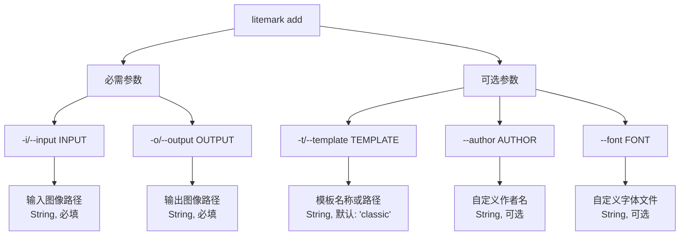
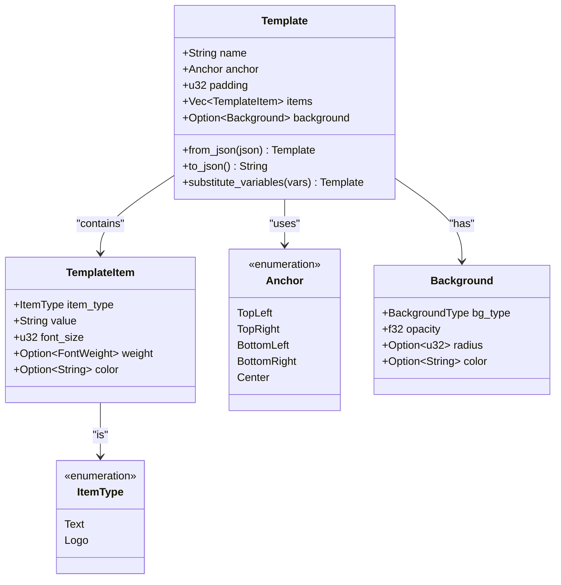
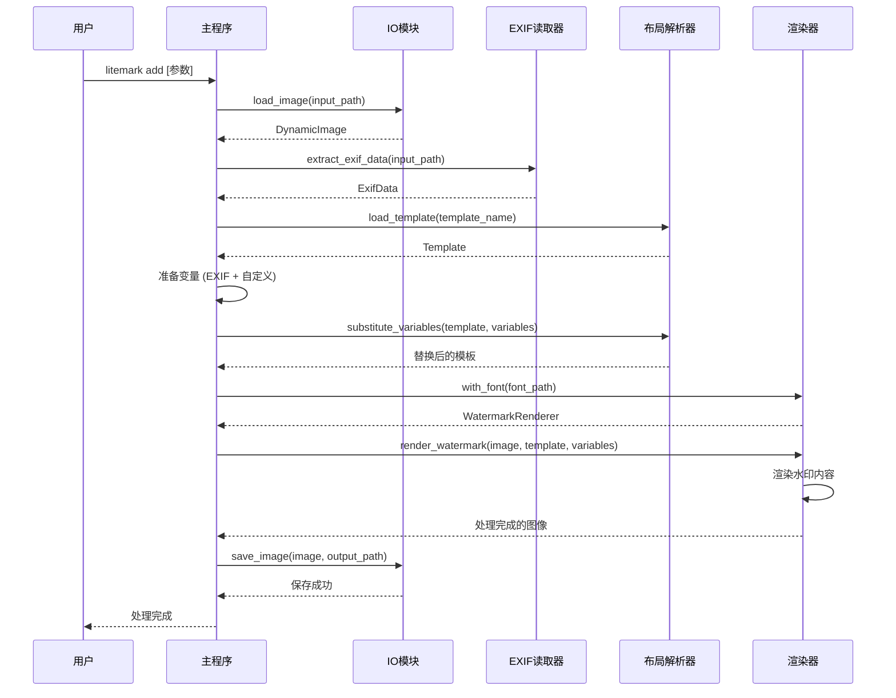
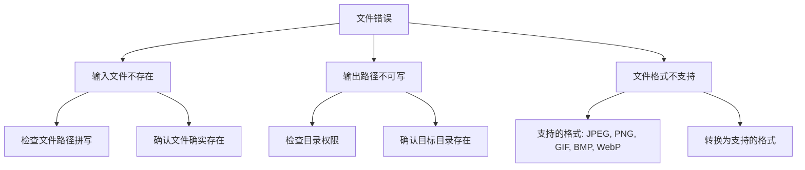
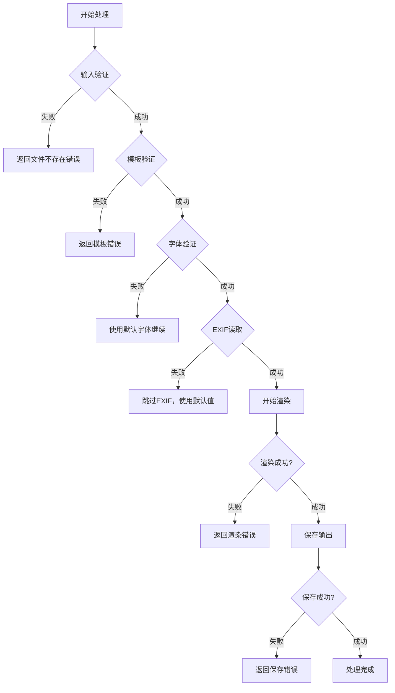
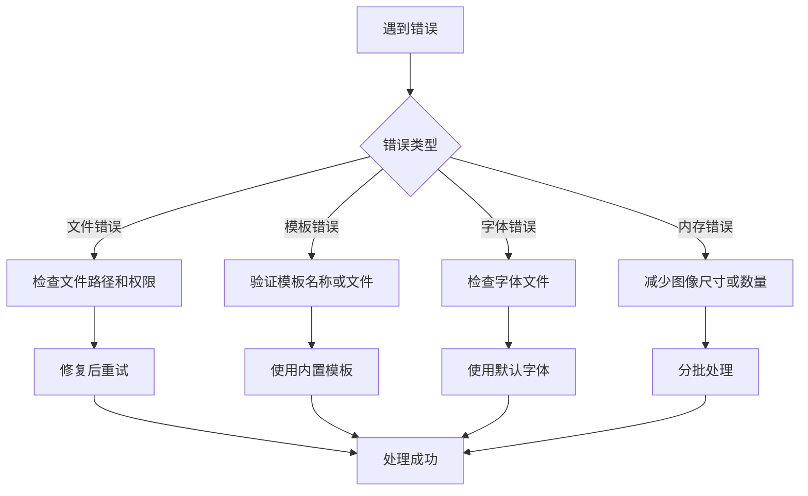

# add 命令

<cite>
**本文档中引用的文件**
- [src/main.rs](file://src/main.rs)
- [src/io/mod.rs](file://src/io/mod.rs)
- [src/exif_reader/mod.rs](file://src/exif_reader/mod.rs)
- [src/layout/mod.rs](file://src/layout/mod.rs)
- [src/renderer/mod.rs](file://src/renderer/mod.rs)
- [templates/classic.json](file://templates/classic.json)
- [templates/modern.json](file://templates/modern.json)
- [templates/minimal.json](file://templates/minimal.json)
- [Cargo.toml](file://Cargo.toml)
- [examples/basic_usage.md](file://examples/basic_usage.md)
</cite>

## 目录
1. [简介](#简介)
2. [命令语法](#命令语法)
3. [参数详解](#参数详解)
4. [模板系统](#模板系统)
5. [完整处理流程](#完整处理流程)
6. [使用示例](#使用示例)
7. [错误处理](#错误处理)
8. [性能优化](#性能优化)
9. [故障排除](#故障排除)
10. [高级用法](#高级用法)

## 简介

`add` 命令是 LiteMark 工具的核心功能，专门用于为单张图像添加水印。该命令通过提取图像的 EXIF 元数据，应用预定义或自定义的水印模板，在图像上叠加包含摄影参数和作者信息的水印层。

LiteMark 是一个轻量级的照片参数水印工具，支持多种模板风格，能够智能地从图像元数据中提取摄影参数，并将其优雅地展示在水印中。

## 命令语法

```bash
litemark add [OPTIONS] --input <INPUT> --output <OUTPUT>
```

### 基本语法结构



**图表来源**
- [src/main.rs](file://src/main.rs#L10-L25)

## 参数详解

### 输入参数

#### `-i/--input` (必需)
- **类型**: `String`
- **用途**: 指定要处理的输入图像文件路径
- **验证**: 文件必须存在且为支持的图像格式
- **支持格式**: JPEG, PNG, GIF, BMP, WebP
- **默认行为**: 无默认值，必须明确指定

#### `-o/--output` (必需)
- **类型**: `String`
- **用途**: 指定处理后的输出图像保存路径
- **验证**: 输出路径必须可写，父目录必须存在
- **默认行为**: 无默认值，必须明确指定

### 模板参数

#### `-t/--template` (可选)
- **类型**: `String`
- **用途**: 选择水印模板，可以是内置模板名称或自定义模板文件路径
- **默认值**: `"classic"`
- **支持的内置模板**:
  - `classic` 或 `ClassicParam`: 经典底部左下角模板
  - `modern` 或 `Modern`: 现代顶部右上角模板  
  - `minimal` 或 `Minimal`: 极简底部右下角模板
- **自定义模板**: 支持 JSON 格式的自定义模板文件

### 作者参数

#### `--author` (可选)
- **类型**: `Option<String>`
- **用途**: 覆盖从 EXIF 数据中提取的作者信息
- **优先级**: 如果提供此参数，则覆盖 EXIF 中的作者信息
- **默认行为**: 使用 EXIF 数据中的作者信息（如果存在）

### 字体参数

#### `--font` (可选)
- **类型**: `Option<String>`
- **用途**: 指定自定义字体文件路径
- **环境变量**: 同时支持环境变量 `LITEMARK_FONT`
- **优先级**: 命令行参数 > 环境变量 > 默认字体
- **默认行为**: 使用内置的 DejaVu Sans 字体

**章节来源**
- [src/main.rs](file://src/main.rs#L10-L25)

## 模板系统

LiteMark 的模板系统基于 JSON 格式定义，提供了灵活的水印布局和样式配置。

### 模板结构



**图表来源**
- [src/layout/mod.rs](file://src/layout/mod.rs#L5-L50)

### 内置模板详解

#### ClassicParam (经典模板)
- **位置**: 底部左下角
- **特点**: 包含作者信息和基本拍摄参数
- **适用场景**: 传统摄影风格，强调作者标识
- **变量**: `{Author}`, `{Aperture}`, `{ISO}`, `{Shutter}`

#### Modern (现代模板)  
- **位置**: 顶部右上角
- **特点**: 清洁简洁的设计，适合现代摄影作品
- **背景**: 半透明黑色矩形背景
- **变量**: `{Camera}`, `{Lens}`, `{Focal}`, `{Aperture}`, `{Shutter}`, `{ISO}`

#### Minimal (极简模板)
- **位置**: 底部右下角
- **特点**: 最小化设计，仅显示作者信息
- **适用场景**: 需要低调水印的场合
- **变量**: `{Author}`

### 模板变量系统

模板支持以下变量替换：

| 变量名 | 描述 | 示例值 |
|--------|------|--------|
| `{Author}` | 摄影师姓名 | "John Doe" |
| `{ISO}` | ISO 感光度 | "100" |
| `{Aperture}` | 光圈值 | "f/2.8" |
| `{Shutter}` | 快门速度 | "1/125" |
| `{Focal}` | 焦距 | "50mm" |
| `{Camera}` | 相机型号 | "Canon EOS R5" |
| `{Lens}` | 镜头型号 | "EF 50mm f/1.8" |
| `{DateTime}` | 拍摄时间 | "2024:01:15 14:30:25" |

**章节来源**
- [src/layout/mod.rs](file://src/layout/mod.rs#L120-L180)
- [src/exif_reader/mod.rs](file://src/exif_reader/mod.rs#L40-L70)

## 完整处理流程

`add` 命令执行一个完整的图像处理流水线，涉及多个模块的协作。



**图表来源**
- [src/main.rs](file://src/main.rs#L60-L120)
- [src/io/mod.rs](file://src/io/mod.rs#L5-L15)
- [src/exif_reader/mod.rs](file://src/exif_reader/mod.rs#L75-L95)
- [src/renderer/mod.rs](file://src/renderer/mod.rs#L15-L50)

### 流程详解

#### 1. 图像加载阶段
- **模块**: `io` 模块
- **功能**: 加载输入图像文件
- **支持格式**: JPEG, PNG, GIF, BMP, WebP
- **错误处理**: 文件不存在、格式不支持、内存不足

#### 2. EXIF 数据提取
- **模块**: `exif_reader` 模块  
- **功能**: 从图像中提取摄影参数和元数据
- **提取的信息**: ISO, 光圈, 快门速度, 焦距, 相机型号, 镜头型号, 拍摄时间, 作者信息
- **占位实现**: 当前版本使用模拟数据，未来将集成真实 EXIF 解析

#### 3. 模板加载与变量准备
- **模板查找**: 支持内置模板、别名匹配、文件路径
- **变量替换**: 将 EXIF 数据转换为模板变量
- **自定义覆盖**: `--author` 参数优先于 EXIF 数据

#### 4. 水印渲染
- **字体处理**: 支持自定义字体和默认字体
- **布局计算**: 根据模板锚点和填充计算位置
- **内容渲染**: 文字和徽标渲染
- **背景绘制**: 可选的背景矩形或圆形

**章节来源**
- [src/main.rs](file://src/main.rs#L60-L120)

## 使用示例

### 基础使用

#### 使用经典模板
```bash
# 最简单的用法
litemark add -i photo.jpg -o photo_watermarked.jpg

# 显式指定模板
litemark add -i photo.jpg -t classic -o photo_watermarked.jpg
```

#### 使用现代模板
```bash
# 现代风格水印
litemark add -i photo.jpg -t modern -o photo_watermarked.jpg
```

#### 使用极简模板
```bash
# 极简风格水印
litemark add -i photo.jpg -t minimal -o photo_watermarked.jpg
```

### 自定义作者信息

#### 覆盖 EXIF 作者
```bash
# 使用自定义作者名
litemark add -i photo.jpg -t classic -o photo_watermarked.jpg --author "Professional Photographer"

# 不同模板风格
litemark add -i photo.jpg -t modern -o photo_watermarked.jpg --author "Jane Smith"
```

### 自定义字体

#### 使用自定义字体
```bash
# 指定自定义字体文件
litemark add -i photo.jpg -t classic -o photo_watermarked.jpg --font /path/to/custom-font.ttf

# 设置环境变量
export LITEMARK_FONT=/path/to/font.ttf
litemark add -i photo.jpg -t classic -o photo_watermarked.jpg
```

### 处理不同格式

#### JPEG 图片
```bash
litemark add -i photo.jpg -t classic -o output.jpg
```

#### PNG 图片
```bash
litemark add -i photo.png -t modern -o output.png
```

#### WebP 图片
```bash
litemark add -i photo.webp -t minimal -o output.webp
```

### 高级组合用法

#### 自定义模板文件
```bash
# 导出自定义模板
litemark show-template classic > my_template.json

# 修改模板后使用
litemark add -i photo.jpg -t my_template.json -o photo_custom.jpg
```

#### 批量处理前的预处理
```bash
# 为多张照片准备相同的水印风格
litemark add -i photo1.jpg -t modern -o photo1_watermarked.jpg --author "Studio Name"
litemark add -i photo2.jpg -t modern -o photo2_watermarked.jpg --author "Studio Name"
```

**章节来源**
- [examples/basic_usage.md](file://examples/basic_usage.md#L5-L35)

## 错误处理

LiteMark 实现了完善的错误处理机制，能够识别和处理各种常见的使用错误。

### 常见错误类型

#### 1. 文件相关错误



#### 2. 模板相关错误

| 错误类型 | 描述 | 解决方案 |
|----------|------|----------|
| 模板未找到 | 指定的模板名称不存在 | 使用 `litemark templates` 查看可用模板 |
| 模板格式错误 | JSON 文件格式无效 | 检查 JSON 语法，使用模板验证工具 |
| 模板文件损坏 | 模板文件被破坏 | 重新下载或导出模板 |

#### 3. 字体相关错误

| 错误类型 | 描述 | 解决方案 |
|----------|------|----------|
| 字体文件不存在 | 指定的字体文件路径无效 | 检查文件路径，确认文件存在 |
| 字体文件损坏 | 字体文件格式不正确 | 使用有效的 TrueType 字体文件 |
| 字体加载失败 | 系统字体库问题 | 使用默认字体或修复系统字体 |

### 错误处理流程



**图表来源**
- [src/main.rs](file://src/main.rs#L60-L120)
- [src/io/mod.rs](file://src/io/mod.rs#L5-L15)

**章节来源**
- [src/main.rs](file://src/main.rs#L60-L120)

## 性能优化

为了获得最佳性能，特别是在处理大量图像时，建议采用以下优化策略。

### 硬件优化

#### 存储设备优化
- **SSD 推荐**: 使用固态硬盘显著提升 I/O 性能
- **存储位置**: 将输入输出目录放在快速存储设备上
- **空间要求**: 确保有足够的可用空间，避免磁盘满导致的性能下降

#### 内存考虑
- **大图处理**: 处理高分辨率图像时注意内存使用
- **批量处理**: 批量模式会缓存多个图像，需要更多内存

### 软件优化

#### 模板选择优化
```bash
# 简单模板更快：minimal < classic < modern
litemark add -i photo.jpg -t minimal -o output.jpg  # 最快
litemark add -i photo.jpg -t classic -o output.jpg  # 中等速度
litemark add -i photo.jpg -t modern -o output.jpg   # 较慢
```

#### 字体优化
- **默认字体**: 内置字体经过优化，性能最佳
- **自定义字体**: 避免使用过大或复杂的字体文件
- **字体缓存**: 系统会缓存字体数据，重复使用相同字体更快

### 批量处理优化

对于大量图像处理，建议使用 `batch` 命令而非多次调用 `add` 命令：

```bash
# 推荐：批量处理
litemark batch -i photos/ -t classic -o output/

# 不推荐：多次单独调用
for file in photos/*.jpg; do
    litemark add -i "$file" -t classic -o "output/${file%.jpg}_watermarked.jpg"
done
```

### 性能监控指标

| 指标 | 正常范围 | 优化建议 |
|------|----------|----------|
| 单图处理时间 | < 2秒 | 使用 SSD，选择简单模板 |
| 内存使用 | < 100MB | 处理高分辨率图像时注意 |
| CPU 使用率 | < 80% | 并行处理时注意资源分配 |

**章节来源**
- [src/main.rs](file://src/main.rs#L120-L180)

## 故障排除

### 常见问题诊断

#### 问题 1: 模板未找到
```bash
# 错误信息
Template 'custom' not found

# 解决方案
litemark templates  # 查看可用模板
litemark show-template classic  # 查看模板详情
```

#### 问题 2: 图像无法加载
```bash
# 错误信息
Failed to open image file

# 解决方案
# 1. 检查文件路径
ls -la photo.jpg

# 2. 检查文件格式
file photo.jpg

# 3. 检查文件权限
chmod 644 photo.jpg
```

#### 问题 3: 输出文件权限错误
```bash
# 错误信息
Permission denied

# 解决方案
# 1. 检查输出目录权限
ls -la output_directory/

# 2. 切换到可写目录
litemark add -i photo.jpg -t classic -o ~/Desktop/photo_watermarked.jpg
```

### 调试技巧

#### 1. 详细日志查看
```bash
# 启用详细输出
litemark add -i photo.jpg -t classic -o output.jpg --verbose
```

#### 2. 模板验证
```bash
# 检查模板语法
litemark show-template classic  # 查看模板结构
```

#### 3. 文件格式验证
```bash
# 检查图像文件完整性
identify photo.jpg
```

### 错误恢复策略



**章节来源**
- [src/main.rs](file://src/main.rs#L180-L220)

## 高级用法

### 自定义模板开发

#### 模板结构深度解析

```json
{
    "name": "MyCustomTemplate",
    "anchor": "bottom-right",
    "padding": 20,
    "items": [
        {
            "type": "text",
            "value": "© {Author} {DateTime}",
            "font_size": 16,
            "weight": "bold",
            "color": "#FFFFFF"
        }
    ],
    "background": {
        "type": "rect",
        "opacity": 0.3,
        "radius": 8,
        "color": "#000000"
    }
}
```

#### 模板开发最佳实践

| 实践 | 说明 | 示例 |
|------|------|------|
| 变量使用 | 充分利用可用变量 | `{Author}`, `{Camera}`, `{Focal}` |
| 字体大小 | 根据位置调整大小 | 底部内容使用较大字体 |
| 透明度控制 | 合理使用背景透明度 | 0.2-0.5 之间 |
| 颜色对比 | 确保文字可读性 | 白色文字搭配深色背景 |

### 集成开发

#### Shell 脚本集成
```bash
#!/bin/bash
# 批量水印处理脚本
process_photos() {
    local input_dir="$1"
    local output_dir="$2"
    local template="$3"
    local author="$4"
    
    mkdir -p "$output_dir"
    
    for photo in "$input_dir"/*.{jpg,jpeg,png}; do
        if [ -f "$photo" ]; then
            local filename=$(basename "$photo")
            local output_file="${output_dir}/${filename%.jpg}_watermarked.jpg"
            
            litemark add \
                -i "$photo" \
                -o "$output_file" \
                -t "$template" \
                --author "$author" \
                --font "/usr/share/fonts/TimesNewRoman.ttf"
                
            echo "Processed: $filename"
        fi
    done
}
```

#### 程序化调用
```rust
// Rust 程序中调用 LiteMark
use litemark::{process_single_image};

fn main() -> Result<(), Box<dyn std::error::Error>> {
    process_single_image(
        "photo.jpg",
        "classic",
        "watermarked.jpg",
        Some("Professional Photographer"),
        None,
    )?;
    Ok(())
}
```

### 性能监控和日志

#### 日志记录
```bash
# 重定向输出到日志文件
litemark add -i photo.jpg -t classic -o output.jpg 2>&1 | tee processing.log
```

#### 性能测量
```bash
# 使用 time 命令测量处理时间
time litemark add -i large_photo.jpg -t classic -o output.jpg
```

**章节来源**
- [src/layout/mod.rs](file://src/layout/mod.rs#L120-L180)
- [examples/basic_usage.md](file://examples/basic_usage.md#L80-L130)