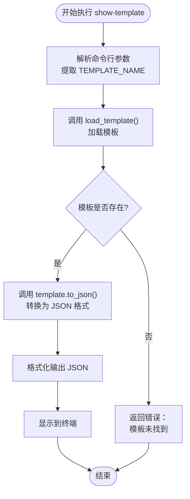
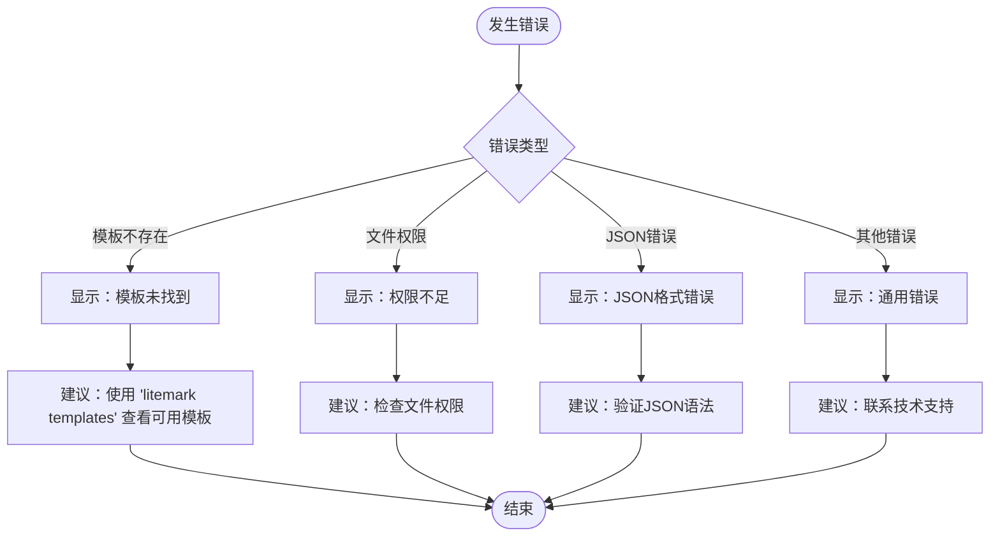

# show-template 命令

<cite>
**本文档中引用的文件**
- [src/main.rs](file://src/main.rs)
- [src/layout/mod.rs](file://src/layout/mod.rs)
- [templates/classic.json](file://templates/classic.json)
- [templates/minimal.json](file://templates/minimal.json)
- [templates/modern.json](file://templates/modern.json)
- [README.md](file://README.md)
</cite>

## 目录
1. [简介](#简介)
2. [命令语法](#命令语法)
3. [参数说明](#参数说明)
4. [工作原理](#工作原理)
5. [模板结构详解](#模板结构详解)
6. [使用示例](#使用示例)
7. [输出格式说明](#输出格式说明)
8. [错误处理](#错误处理)
9. [调试指南](#调试指南)
10. [最佳实践](#最佳实践)

## 简介

`show-template` 是 LiteMark 工具的一个子命令，专门用于查看指定模板的完整 JSON 结构详情。该命令可以帮助用户深入了解内置模板的设计逻辑，调试自定义模板配置，以及学习模板语法结构。

通过 `show-template` 命令，用户可以：
- 查看模板的完整 JSON 定义
- 理解模板布局和样式设置
- 调试模板配置问题
- 学习模板语法和可用选项
- 验证模板结构的有效性

## 命令语法

```bash
litemark show-template <TEMPLATE_NAME>
```

### 参数说明

| 参数 | 类型 | 必需 | 描述 |
|------|------|------|------|
| `<TEMPLATE_NAME>` | 字符串 | 是 | 要查看的模板名称。可以是内置模板名称（如 `classic`、`modern`、`minimal`）或自定义模板文件路径 |

## 工作原理

`show-template` 命令的工作流程如下：



**图表来源**
- [src/main.rs](file://src/main.rs#L115-L118)
- [src/main.rs](file://src/main.rs#L295-L300)

**节来源**
- [src/main.rs](file://src/main.rs#L115-L118)
- [src/main.rs](file://src/main.rs#L295-L300)

## 模板结构详解

LiteMark 模板采用 JSON 格式定义，包含以下核心字段：

### 基础属性

| 字段名 | 类型 | 描述 | 示例值 |
|--------|------|------|--------|
| `name` | 字符串 | 模板名称 | `"ClassicParam"` |
| `anchor` | 枚举 | 锚点位置 | `"bottom-left"` |
| `padding` | 数字 | 内边距大小（像素） | `24` |

### 锚点位置枚举值

| 值 | 含义 | 位置描述 |
|-----|------|----------|
| `"top-left"` | 顶部左侧 | 图像左上角 |
| `"top-right"` | 顶部右侧 | 图像右上角 |
| `"bottom-left"` | 底部左侧 | 图像左下角 |
| `"bottom-right"` | 底部右侧 | 图像右下角 |
| `"center"` | 居中 | 图像正中心 |

### 模板项（items）

每个模板包含一个或多个模板项，定义显示内容：

| 字段名 | 类型 | 描述 | 示例 |
|--------|------|------|------|
| `type` | 枚举 | 项类型 | `"text"` 或 `"logo"` |
| `value` | 字符串 | 显示内容，支持变量替换 | `"{Author}"` |
| `font_size` | 数字 | 字体大小（像素） | `20` |
| `weight` | 枚举 | 字体粗细 | `"bold"` |
| `color` | 字符串 | 文本颜色（十六进制） | `"#FFFFFF"` |

### 背景配置（background）

可选的背景设置：

| 字段名 | 类型 | 描述 | 示例 |
|--------|------|------|------|
| `type` | 枚举 | 背景类型 | `"rect"` |
| `opacity` | 浮点数 | 不透明度（0.0-1.0） | `0.3` |
| `radius` | 数字 | 圆角半径（像素） | `6` |
| `color` | 字符串 | 背景颜色 | `"#000000"` |

**节来源**
- [src/layout/mod.rs](file://src/layout/mod.rs#L5-L25)

## 使用示例

### 查看内置模板

```bash
# 查看 ClassicParam 模板
litemark show-template classic

# 查看 Modern 模板  
litemark show-template modern

# 查看 Minimal 模板
litemark show-template minimal
```

### 查看自定义模板

```bash
# 查看本地自定义模板
litemark show-template ./custom-template.json

# 查看特定目录下的模板
litemark show-template /path/to/templates/my-template.json
```

### 使用别名查看模板

```bash
# 使用别名查看 ClassicParam 模板
litemark show-template Classic

# 使用别名查看 Modern 模板
litemark show-template Modern
```

**节来源**
- [src/main.rs](file://src/main.rs#L115-L118)

## 输出格式说明

执行 `show-template` 命令后，输出的 JSON 结构具有以下特点：

### 经典模板（ClassicParam）输出示例

```json
{
  "name": "ClassicParam",
  "anchor": "bottom-left",
  "padding": 24,
  "items": [
    {
      "type": "text",
      "value": "{Author}",
      "font_size": 20,
      "weight": "bold",
      "color": "#FFFFFF"
    },
    {
      "type": "text",
      "value": "{Aperture} | ISO {ISO} | {Shutter}",
      "font_size": 14,
      "weight": "normal",
      "color": "#FFFFFF"
    }
  ],
  "background": {
    "type": "rect",
    "opacity": 0.3,
    "radius": 6,
    "color": "#000000"
  }
}
```

### 输出字段含义

| 字段 | 含义 | 用途 |
|------|------|------|
| `name` | 模板标识名 | 在其他命令中作为模板参数使用 |
| `anchor` | 锚点位置 | 决定模板在图像上的放置位置 |
| `padding` | 内边距 | 控制模板与图像边缘的距离 |
| `items[].type` | 项类型 | 定义显示内容类型（文本或标志） |
| `items[].value` | 显示内容 | 支持变量替换的文本内容 |
| `items[].font_size` | 字体大小 | 控制文字显示尺寸 |
| `items[].weight` | 字体粗细 | 设置文字粗细程度 |
| `items[].color` | 文本颜色 | 定义文字颜色 |
| `background.type` | 背景类型 | 背景形状（矩形或圆形） |
| `background.opacity` | 背景不透明度 | 控制背景透明程度 |
| `background.radius` | 背景圆角 | 设置背景边框圆角半径 |
| `background.color` | 背景颜色 | 定义背景颜色 |

**节来源**
- [templates/classic.json](file://templates/classic.json#L1-L27)
- [templates/modern.json](file://templates/modern.json#L1-L29)
- [templates/minimal.json](file://templates/minimal.json#L1-L17)

## 错误处理

### 可能的错误情况

| 错误类型 | 错误信息 | 原因 | 解决方案 |
|----------|----------|------|----------|
| 模板未找到 | `Template '<TEMPLATE_NAME>' not found` | 指定的模板不存在 | 检查模板名称拼写或确认模板文件存在 |
| 文件读取失败 | `Failed to read template file` | 模板文件权限或路径问题 | 检查文件路径和访问权限 |
| JSON 解析错误 | `Invalid JSON format` | 模板文件格式不正确 | 验证 JSON 语法正确性 |
| 权限不足 | `Permission denied` | 无权访问模板文件 | 检查文件权限设置 |

### 错误处理流程



**图表来源**
- [src/main.rs](file://src/main.rs#L275-L290)

**节来源**
- [src/main.rs](file://src/main.rs#L275-L290)

## 调试指南

### 模板调试技巧

1. **验证模板语法**
   ```bash
   # 检查模板是否有效
   litemark show-template my-template.json
   ```

2. **对比内置模板**
   ```bash
   # 对比自定义模板与内置模板
   litemark show-template my-template.json > my-template.txt
   litemark show-template classic > classic.txt
   diff my-template.txt classic.txt
   ```

3. **测试变量替换**
   ```bash
   # 查看变量替换后的效果
   litemark show-template my-template.json | jq '.items[] | .value'
   ```

### 常见调试场景

| 场景 | 调试方法 | 注意事项 |
|------|----------|----------|
| 模板不显示 | 检查 `padding` 和 `anchor` 设置 | 确保内边距足够大 |
| 文字重叠 | 检查字体大小和间距 | 调整 `font_size` 和 `padding` |
| 颜色不匹配 | 检查颜色值格式 | 使用标准十六进制格式 |
| 背景异常 | 检查 `background` 配置 | 确保所有必需字段存在 |

## 最佳实践

### 模板开发建议

1. **保持简洁**
   - 避免过多的模板项
   - 合理设置字体大小和间距
   - 使用适当的透明度

2. **兼容性考虑**
   - 支持多种语言字符
   - 考虑不同屏幕分辨率
   - 确保颜色对比度合适

3. **性能优化**
   - 减少不必要的背景效果
   - 优化图片资源大小
   - 合理使用变量替换

### 学习模板的最佳方式

1. **从简单开始**
   ```bash
   # 先查看最简单的模板
   litemark show-template minimal
   ```

2. **逐步增加复杂度**
   ```bash
   # 依次查看不同复杂度的模板
   litemark show-template minimal
   litemark show-template classic
   litemark show-template modern
   ```

3. **实践修改**
   ```bash
   # 复制模板进行修改
   cp templates/classic.json my-modified.json
   # 修改后查看效果
   litemark show-template my-modified.json
   ```

**节来源**
- [src/main.rs](file://src/main.rs#L115-L118)
- [README.md](file://README.md#L40-L60)