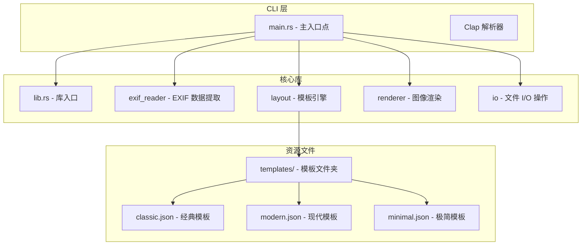
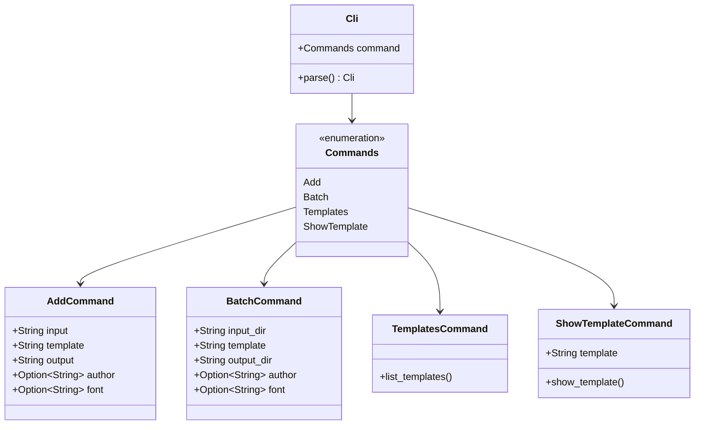
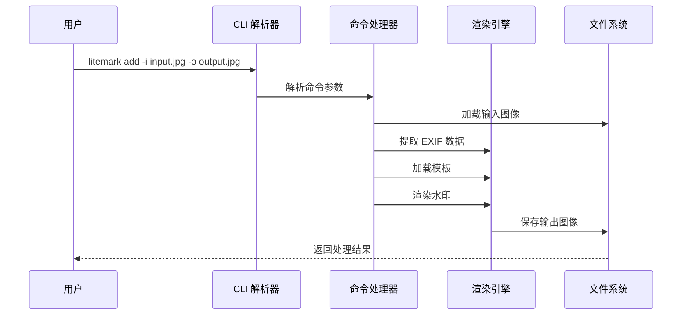
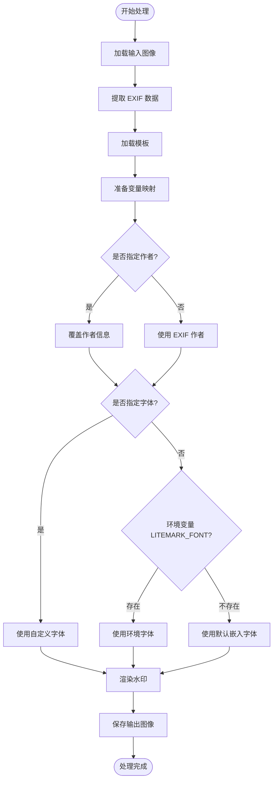
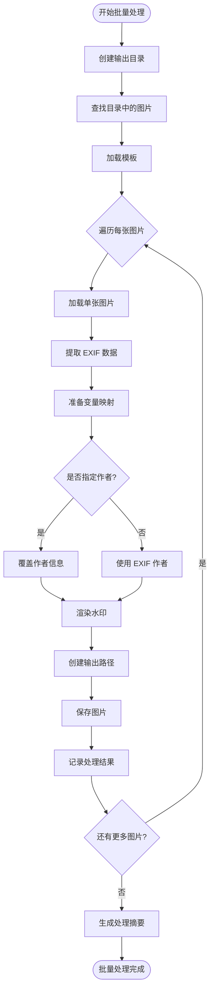

# 命令行接口参考

<cite>
**本文档中引用的文件**
- [main.rs](file://src/main.rs)
- [Cargo.toml](file://Cargo.toml)
- [lib.rs](file://src/lib.rs)
- [README.md](file://README.md)
- [classic.json](file://templates/classic.json)
- [modern.json](file://templates/modern.json)
- [minimal.json](file://templates/minimal.json)
</cite>

## 目录
1. [简介](#简介)
2. [项目结构](#项目结构)
3. [核心组件](#核心组件)
4. [架构概览](#架构概览)
5. [详细命令分析](#详细命令分析)
6. [模板系统](#模板系统)
7. [使用示例](#使用示例)
8. [故障排除指南](#故障排除指南)
9. [结论](#结论)

## 简介

LiteMark 是一个轻量级的照片参数水印工具，专为摄影爱好者设计。它通过命令行界面提供了强大的照片处理功能，包括从 EXIF 数据中提取信息、添加水印框架以及批量处理图片的能力。本文档全面覆盖了 lite-mark-core 所有子命令的使用方法和配置选项。

## 项目结构

LiteMark 采用模块化的 Rust 项目结构，主要包含以下核心模块：



**图表来源**
- [main.rs](file://src/main.rs#L1-L320)
- [lib.rs](file://src/lib.rs#L1-L9)

**章节来源**
- [main.rs](file://src/main.rs#L1-L50)
- [Cargo.toml](file://Cargo.toml#L1-L41)

## 核心组件

LiteMark 的 CLI 接口基于 clap 库构建，提供了直观且功能丰富的命令行体验。核心组件包括：

### CLI 结构体设计



**图表来源**
- [main.rs](file://src/main.rs#L8-L40)

**章节来源**
- [main.rs](file://src/main.rs#L8-L40)

## 架构概览

LiteMark 的 CLI 架构采用分层设计，确保了清晰的职责分离和可维护性：



**图表来源**
- [main.rs](file://src/main.rs#L42-L70)
- [main.rs](file://src/main.rs#L72-L120)

## 详细命令分析

### add 子命令

`add` 命令是 LiteMark 的核心功能，用于为单张图片添加水印框架。

#### 参数详解

| 参数 | 短选项 | 长选项 | 类型 | 默认值 | 描述 |
|------|--------|--------|------|--------|------|
| 输入路径 | `-i` | `--input` | String | 必需 | 要处理的输入图片路径 |
| 输出路径 | `-o` | `--output` | String | 必需 | 处理后的输出图片路径 |
| 模板名称 | `-t` | `--template` | String | `"classic"` | 使用的模板名称或 JSON 文件路径 |
| 作者名称 | - | `--author` | Option\<String\> | None | 自定义作者名称，覆盖 EXIF 数据中的信息 |
| 字体文件 | - | `--font` | Option\<String\> | None | 自定义字体文件路径 |

#### 命令语法

```bash
litemark add -i <输入路径> -o <输出路径> [-t <模板>] [--author <作者名>] [--font <字体文件>]
```

#### 处理流程



**图表来源**
- [main.rs](file://src/main.rs#L72-L120)

**章节来源**
- [main.rs](file://src/main.rs#L12-L25)

### batch 子命令

`batch` 命令提供了批量处理功能，可以同时处理目录中的多张图片。

#### 参数详解

| 参数 | 短选项 | 长选项 | 类型 | 默认值 | 描述 |
|------|--------|--------|------|--------|------|
| 输入目录 | `-i` | `--input-dir` | String | 必需 | 包含要处理图片的输入目录路径 |
| 输出目录 | `-o` | `--output-dir` | String | 必需 | 存放处理后图片的输出目录路径 |
| 模板名称 | `-t` | `--template` | String | `"classic"` | 使用的模板名称或 JSON 文件路径 |
| 作者名称 | - | `--author` | Option\<String\> | None | 自定义作者名称，覆盖 EXIF 数据中的信息 |
| 字体文件 | - | `--font` | Option\<String\> | None | 自定义字体文件路径 |

#### 命令语法

```bash
litemark batch -i <输入目录> -o <输出目录> [-t <模板>] [--author <作者名>] [--font <字体文件>]
```

#### 批量处理流程



**图表来源**
- [main.rs](file://src/main.rs#L122-L170)

**章节来源**
- [main.rs](file://src/main.rs#L27-L37)

### templates 子命令

`templates` 命令用于列出所有可用的内置模板，帮助用户了解可用的布局选项。

#### 命令语法

```bash
litemark templates
```

#### 输出格式

该命令会显示所有内置模板的列表，包括模板名称和简短描述：

```
Available templates:
  • ClassicParam - Bottom-left corner with photographer name and basic parameters
  • Modern - Top-right corner with clean typography
  • Minimal - Subtle bottom-right signature
```

**章节来源**
- [main.rs](file://src/main.rs#L172-L180)

### show-template 子命令

`show-template` 命令允许用户查看指定模板的完整 JSON 结构，便于理解和自定义模板。

#### 参数详解

| 参数 | 类型 | 描述 |
|------|------|------|
| 模板名称 | String | 要查看的模板名称 |

#### 命令语法

```bash
litemark show-template <模板名称>
```

#### 示例输出

```bash
Template 'ClassicParam':
{
  "name": "ClassicParam",
  "anchor": "bottom-left",
  "padding": 24,
  "items": [
    {
      "type": "text",
      "value": "{Author}",
      "font_size": 20,
      "weight": "bold",
      "color": "#FFFFFF"
    },
    {
      "type": "text",
      "value": "{Aperture} | ISO {ISO} | {Shutter}",
      "font_size": 14,
      "weight": "normal",
      "color": "#FFFFFF"
    }
  ],
  "background": {
    "type": "rect",
    "opacity": 0.3,
    "radius": 6,
    "color": "#000000"
  }
}
```

**章节来源**
- [main.rs](file://src/main.rs#L182-L190)

## 模板系统

LiteMark 的模板系统基于 JSON 格式，提供了灵活且可定制的水印布局方案。

### 内置模板

#### ClassicParam 模板
- **位置**: 底部左下角
- **特点**: 传统风格，包含作者名称和基本拍摄参数
- **适用场景**: 专业摄影工作流程

#### Modern 模板  
- **位置**: 顶部右上角
- **特点**: 现代简约风格，简洁的排版设计
- **适用场景**: 现代摄影作品展示

#### Minimal 模板
- **位置**: 底部右下角
- **特点**: 极简风格，仅显示作者名称
- **适用场景**: 隐藏式水印需求

### 模板变量系统

模板支持多种动态变量，这些变量会自动替换为对应的 EXIF 数据：

| 变量 | 描述 | 示例值 |
|------|------|--------|
| `{Author}` | 摄影师姓名 | "John Doe" |
| `{ISO}` | ISO 感光度 | "100" |
| `{Aperture}` | 光圈值 | "f/2.8" |
| `{Shutter}` | 快门速度 | "1/2000" |
| `{Focal}` | 焦距 | "50mm" |
| `{Camera}` | 相机型号 | "Canon EOS R5" |
| `{Lens}` | 镜头型号 | "RF 24-70mm f/2.8" |
| `{DateTime}` | 拍摄时间 | "2024-01-15 14:30:25" |

**章节来源**
- [main.rs](file://src/main.rs#L290-L310)
- [classic.json](file://templates/classic.json#L1-L27)
- [modern.json](file://templates/modern.json#L1-L29)
- [minimal.json](file://templates/minimal.json#L1-L17)

## 使用示例

### 基础使用场景

#### 单张图片处理
```bash
# 使用经典模板处理图片
litemark add -i photos/photo1.jpg -o output/photo1_watermarked.jpg

# 指定自定义作者名称
litemark add -i input.jpg -o output.jpg --author "Jane Smith Photography"

# 使用现代模板
litemark add -i image.jpg -o result.jpg -t modern

# 指定自定义字体
litemark add -i photo.jpg -o watermarked.jpg --font /path/to/font.ttf
```

#### 批量处理
```bash
# 批量处理整个目录
litemark batch -i /path/to/photos/ -o /path/to/output/ -t classic

# 批量处理并指定作者
litemark batch -i photos/ -o processed/ --author "Professional Photographer"

# 批量处理使用自定义模板
litemark batch -i raw_photos/ -o watermarked/ -t /path/to/custom_template.json
```

#### 模板管理
```bash
# 查看可用模板
litemark templates

# 查看模板详情
litemark show-template classic

# 查看现代模板结构
litemark show-template modern
```

### 高级使用场景

#### 环境变量集成
```bash
# 设置全局字体
export LITEMARK_FONT=/usr/share/fonts/custom.ttf
litemark add -i photo.jpg -o result.jpg  # 使用环境变量字体

# 批量处理时字体优先级
litemark batch -i photos/ -o output/ --font /custom/font.ttf  # CLI 优先于环境变量
```

#### 自定义模板使用
```bash
# 创建自定义模板
cat > my_template.json << EOF
{
  "name": "MyCustom",
  "anchor": "center",
  "padding": 10,
  "items": [
    {
      "type": "text",
      "value": "© {Author} {DateTime}",
      "font_size": 16,
      "color": "#FFFFFF"
    }
  ]
}
EOF

# 使用自定义模板
litemark add -i photo.jpg -o result.jpg -t my_template.json
```

## 故障排除指南

### 常见问题及解决方案

#### 模板加载错误
**问题**: `Template 'template_name' not found`
**解决方案**: 
- 检查模板名称拼写是否正确
- 确认自定义模板文件路径是否存在
- 使用 `litemark templates` 查看可用模板列表

#### 图片格式不支持
**问题**: 不支持的图片格式
**解决方案**:
- 确保输入图片为支持的格式（JPEG、PNG等）
- 检查文件权限和路径有效性

#### 字体加载失败
**问题**: 字体文件无法加载
**解决方案**:
- 验证字体文件路径正确性
- 确认字体文件格式兼容（TTF、OTF）
- 检查文件读取权限

#### 权限问题
**问题**: 无法创建输出目录或保存文件
**解决方案**:
- 确保输出目录具有写入权限
- 检查磁盘空间是否充足
- 验证目标路径的有效性

**章节来源**
- [main.rs](file://src/main.rs#L192-L220)

## 结论

LiteMark 的命令行接口设计体现了简洁性和功能性的完美平衡。通过四个核心命令（add、batch、templates、show-template），用户可以高效地完成从单张图片到批量处理的各种水印添加任务。

### 设计优势

1. **模块化架构**: 清晰的职责分离使得系统易于维护和扩展
2. **灵活的模板系统**: JSON 格式的模板支持高度定制化
3. **环境变量支持**: 通过环境变量实现全局配置
4. **错误处理**: 完善的错误处理机制提供友好的用户反馈
5. **性能优化**: 批量处理功能显著提升工作效率

### 最佳实践建议

1. **模板选择**: 根据作品风格选择合适的内置模板
2. **批量处理**: 对于大量图片处理，优先使用 batch 命令
3. **自定义字体**: 在需要特殊字体效果时使用 --font 参数
4. **环境配置**: 通过环境变量设置常用配置，减少重复输入
5. **模板测试**: 使用 show-template 命令预览模板效果

LiteMark 的 CLI 接口为摄影工作者提供了一个强大而易用的工具，无论是个人使用还是专业工作流程集成，都能满足多样化的需求。