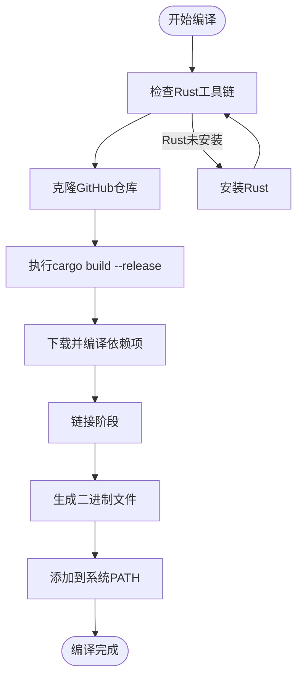
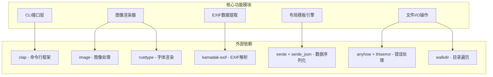

# 安装指南

<cite>
**本文档中引用的文件**
- [README.md](file://README.md)
- [Cargo.toml](file://Cargo.toml)
- [src/main.rs](file://src/main.rs)
- [src/lib.rs](file://src/lib.rs)
- [examples/basic_usage.md](file://examples/basic_usage.md)
</cite>

## 目录
1. [简介](#简介)
2. [系统要求](#系统要求)
3. [从源码编译安装](#从源码编译安装)
4. [预编译二进制文件安装](#预编译二进制文件安装)
5. [Cargo.toml项目元信息解析](#cargotoml项目元信息解析)
6. [验证安装](#验证安装)
7. [未来安装方式展望](#未来安装方式展望)
8. [常见问题排查](#常见问题排查)
9. [总结](#总结)

## 简介

LiteMark是一个轻量级的照片参数水印工具，专为摄影爱好者设计。它能够从照片中提取EXIF数据（ISO、光圈、快门速度、焦距等），并添加带有拍摄参数和标志的底部框架。本指南将详细介绍如何在不同操作系统上安装LiteMark的各种方式。

## 系统要求

### 支持的操作系统
- **macOS** (Intel 和 Apple Silicon)
- **Linux** (大多数发行版)
- **Windows** (Windows 10 及以上版本)

### 运行时依赖
- **Rust运行时环境** (可选，用于从源码编译)
- **标准C库** (用于预编译二进制文件)

### 硬件要求
- 最低2GB RAM
- 足够的磁盘空间存储图片和临时文件

## 从源码编译安装

### 步骤1：安装Rust工具链

在开始编译之前，您需要安装Rust工具链。推荐使用官方的rustup工具：

```bash
# macOS/Linux
curl --proto '=https' --tlsv1.2 -sSf https://sh.rustup.rs | sh

# Windows (PowerShell)
winget install Rust.rust
```

安装完成后，重新启动终端或执行以下命令使更改生效：

```bash
# macOS/Linux
source ~/.cargo/env

# Windows (PowerShell)
$env:PATH += ";$env:USERPROFILE\.cargo\bin"
```

### 步骤2：克隆GitHub仓库

```bash
# 克隆仓库
git clone https://github.com/26huitailang/lite-mark-core.git
cd lite-mark-core
```

### 步骤3：编译项目

```bash
# 开发构建（调试模式）
cargo build

# 发布构建（优化模式，更快的性能）
cargo build --release
```

发布构建会生成优化后的二进制文件，通常比开发构建快2-3倍。

### 步骤4：添加到系统PATH

编译完成后，二进制文件位于`target/release/`目录（macOS/Linux）或`target/release/`目录（Windows）。

#### macOS/Linux:
```bash
# 将二进制文件移动到系统路径
sudo cp target/release/litemark /usr/local/bin/

# 或者添加到个人PATH
mkdir -p ~/bin
cp target/release/litemark ~/bin/
echo 'export PATH="$HOME/bin:$PATH"' >> ~/.bashrc
source ~/.bashrc
```

#### Windows:
```powershell
# 将二进制文件复制到系统路径
Copy-Item target\release\litemark.exe C:\Windows\System32\
```

### 编译过程详解



**图表来源**
- [src/main.rs](file://src/main.rs#L1-L50)
- [Cargo.toml](file://Cargo.toml#L1-L41)

**章节来源**
- [README.md](file://README.md#L15-L25)
- [Cargo.toml](file://Cargo.toml#L1-L41)

## 预编译二进制文件安装

### 从GitHub Releases下载

LiteMark提供了预编译的二进制文件，支持多个平台：

1. 访问 [GitHub Releases页面](https://github.com/26huitailang/lite-mark-core/releases)
2. 根据您的操作系统选择合适的版本：
   - **macOS**: `litemark-x86_64-apple-darwin.tar.gz` 或 `litemark-aarch64-apple-darwin.tar.gz`
   - **Linux**: `litemark-x86_64-unknown-linux-gnu.tar.gz`
   - **Windows**: `litemark-x86_64-pc-windows-msvc.zip`

### macOS安装步骤

```bash
# 下载并解压
curl -L -O https://github.com/26huitailang/lite-mark-core/releases/latest/download/litemark-x86_64-apple-darwin.tar.gz
tar -xzf litemark-x86_64-apple-darwin.tar.gz
chmod +x litemark

# 移动到系统路径
sudo mv litemark /usr/local/bin/
```

### Linux安装步骤

```bash
# 下载并解压
wget https://github.com/26huitailang/lite-mark-core/releases/latest/download/litemark-x86_64-unknown-linux-gnu.tar.gz
tar -xzf litemark-x86_64-unknown-linux-gnu.tar.gz
chmod +x litemark

# 移动到系统路径
sudo mv litemark /usr/local/bin/
```

### Windows安装步骤

```powershell
# 下载并解压
Invoke-WebRequest -Uri "https://github.com/26huitailang/lite-mark-core/releases/latest/download/litemark-x86_64-pc-windows-msvc.zip" -OutFile "litemark.zip"
Expand-Archive litemark.zip -DestinationPath .
Move-Item litemark.exe C:\Windows\System32\
```

### 权限设置

对于某些Linux发行版，可能需要额外的权限设置：

```bash
# 设置执行权限
chmod +x litemark

# 如果遇到权限问题，可以尝试
sudo chmod +x /usr/local/bin/litemark
```

**章节来源**
- [README.md](file://README.md#L26-L28)

## Cargo.toml项目元信息解析

### 项目基本信息

LiteMark项目的核心配置信息都记录在`Cargo.toml`文件中：

```toml
[package]
name = "litemark"                    # 包名称
version = "0.1.0"                   # 版本号
edition = "2021"                    # Rust版本
description = "A lightweight photo parameter watermark tool"  # 描述
license = "MIT"                     # 许可证
repository = "https://github.com/26huitailang/lite-mark-core"  # 仓库地址
keywords = ["photo", "watermark", "exif", "photography"]       # 关键词
categories = ["multimedia::images"]               # 分类
```

### 二进制目标配置

```toml
[[bin]]
name = "litemark"                   # 可执行文件名称
path = "src/main.rs"                # 主入口文件路径
```

### 核心依赖分析

LiteMark使用了以下关键依赖库：

| 依赖库 | 版本 | 功能描述 |
|--------|------|----------|
| `clap` | 4.4 | 命令行界面框架，支持参数解析和帮助生成 |
| `image` | 0.24 | 图像处理库，支持多种图像格式 |
| `rusttype` | 0.9 | 字体渲染引擎，支持多语言文字 |
| `kamadak-exif` | 0.5 | EXIF数据解析库 |
| `serde` | 1.0 | 序列化/反序列化框架 |
| `serde_json` | 1.0 | JSON处理库 |
| `anyhow` | 1.0 | 错误处理辅助库 |
| `thiserror` | 1.0 | 错误类型定义库 |
| `walkdir` | 2.4 | 目录遍历库 |

### 依赖关系图



**图表来源**
- [Cargo.toml](file://Cargo.toml#L15-L35)
- [src/lib.rs](file://src/lib.rs#L1-L9)

**章节来源**
- [Cargo.toml](file://Cargo.toml#L1-L41)
- [src/lib.rs](file://src/lib.rs#L1-L9)

## 验证安装

### 检查版本信息

安装完成后，可以通过以下命令验证LiteMark是否正确安装：

```bash
# 显示版本信息
litemark --version

# 显示帮助信息
litemark --help

# 测试基本功能
litemark templates
```

### 预期输出示例

```bash
# 版本信息
litemark 0.1.0

# 帮助信息开头
A lightweight photo parameter watermark tool

USAGE:
    litemark <SUBCOMMAND>

OPTIONS:
    -h, --help       Print help information
    -V, --version    Print version information

SUBCOMMANDS:
    add             Add watermark to a single image
    batch           Batch process images in a directory
    templates       List available templates
    show-template   Show template details
    help            Print this message or the help of the given subcommand(s)
```

### 常见验证问题

1. **命令未找到**
   ```bash
   # 解决方案：检查PATH设置
   echo $PATH
   which litemark
   ```

2. **权限错误**
   ```bash
   # 解决方案：检查文件权限
   ls -la /usr/local/bin/litemark
   sudo chmod +x /usr/local/bin/litemark
   ```

3. **依赖缺失**
   ```bash
   # 解决方案：重新安装或更新
   cargo build --release
   ```

**章节来源**
- [src/main.rs](file://src/main.rs#L10-L20)
- [examples/basic_usage.md](file://examples/basic_usage.md#L1-L20)

## 未来安装方式展望

### 包管理器安装（计划中）

LiteMark正在计划支持更多便捷的安装方式：

#### macOS - Homebrew支持
```bash
# 未来可能的安装方式
brew install litemark
```

#### Windows - Scoop支持
```powershell
# 未来可能的安装方式
scoop bucket add extras
scoop install litemark
```

#### Linux - 包管理器支持
```bash
# Ubuntu/Debian
sudo apt install litemark

# CentOS/RHEL/Fedora
sudo yum install litemark

# Arch Linux
yay -S litemark
```

### Docker容器化部署

```dockerfile
# 未来可能的Dockerfile
FROM rust:latest
WORKDIR /app
COPY . .
RUN cargo build --release
ENTRYPOINT ["./target/release/litemark"]
```

### WebAssembly (WASM) 支持

LiteMark计划在未来支持WebAssembly，允许在浏览器中直接使用：

```javascript
// 未来可能的Web使用方式
const litemark = await import('litemark-wasm');
await litemark.addWatermark(imageData, template);
```

## 常见问题排查

### 编译相关问题

#### 问题1：Rust工具链未安装
```bash
# 错误信息
error: could not find `rustc` in PATH

# 解决方案
curl --proto '=https' --tlsv1.2 -sSf https://sh.rustup.rs | sh
```

#### 问题2：内存不足导致编译失败
```bash
# 错误信息
error: could not compile `litemark` (bin "litemark") due to previous error

# 解决方案
# 增加虚拟内存或使用预编译二进制文件
```

#### 问题3：网络连接问题
```bash
# 错误信息
error: failed to download from https://crates.io/api/v1/crates/clap/4.4.0/download

# 解决方案
cargo update
```

### 运行时问题

#### 问题1：找不到模板文件
```bash
# 错误信息
Template 'classic' not found

# 解决方案
litemark templates  # 查看可用模板
```

#### 问题2：图片格式不支持
```bash
# 错误信息
Failed to load image: Unsupported format

# 解决方案
# 支持的格式：JPEG, PNG, BMP, GIF, TIFF
```

#### 问题3：权限不足
```bash
# 错误信息
Permission denied (os error 13)

# 解决方案
chmod +x litemark
sudo chown $USER:$USER ~/.local/bin/litemark
```

### 性能优化建议

1. **批量处理大量图片**
   ```bash
   # 使用批量模式而非多次单个处理
   litemark batch -i /large/photo/directory -t classic -o output/
   ```

2. **处理大尺寸图片**
   ```bash
   # 考虑先调整图片尺寸
   convert large.jpg -resize 1920x1080 small.jpg
   ```

3. **使用SSD存储**
   - 图像处理涉及大量读写操作
   - SSD相比HDD可显著提升性能

### 调试技巧

```bash
# 启用详细日志
export RUST_LOG=debug
litemark add -i photo.jpg -t classic -o output.jpg

# 检查EXIF数据
exiftool photo.jpg
```

## 总结

LiteMark提供了灵活多样的安装方式，满足不同用户的需求：

### 推荐安装方式

| 用户类型 | 推荐方式 | 优势 |
|----------|----------|------|
| 开发者 | 从源码编译 | 最新功能，可定制 |
| 普通用户 | 预编译二进制文件 | 简单快捷，稳定可靠 |
| 技术专家 | 包管理器（未来） | 系统集成，自动更新 |

### 安装步骤总结

1. **确认系统要求**：检查操作系统兼容性和硬件需求
2. **选择安装方式**：根据技术背景选择最适合的方式
3. **执行安装**：按照对应步骤完成安装
4. **验证安装**：使用版本检查命令确认安装成功
5. **开始使用**：参考基本用法开始创作

### 后续发展

LiteMark将持续改进安装体验，提供更多便捷的安装选项，包括包管理器支持、容器化部署等。欢迎关注项目GitHub仓库获取最新动态。

通过本指南，您应该能够成功安装并开始使用LiteMark，为您的摄影作品添加专业的水印效果。如果在安装过程中遇到任何问题，请参考常见问题排查部分或访问项目GitHub页面寻求帮助。