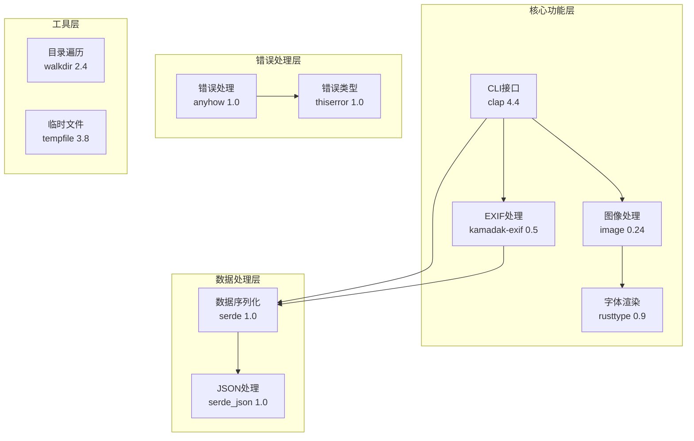
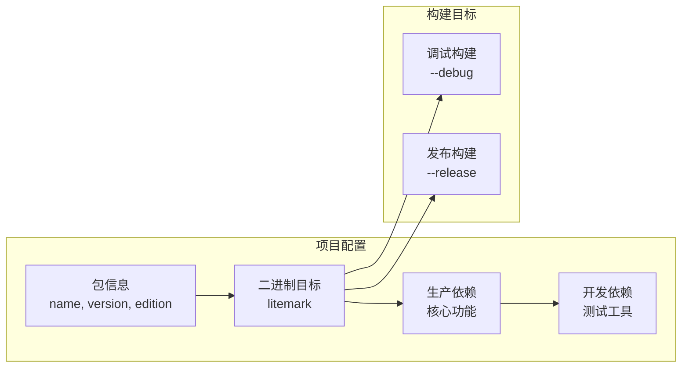
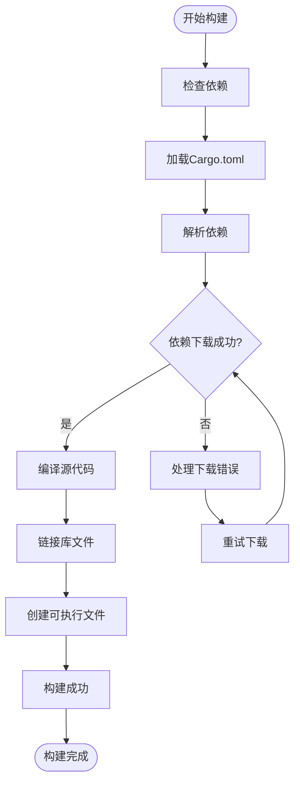
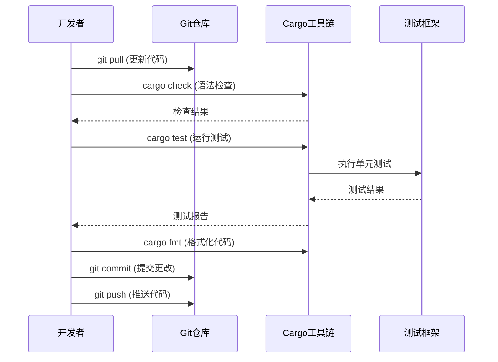
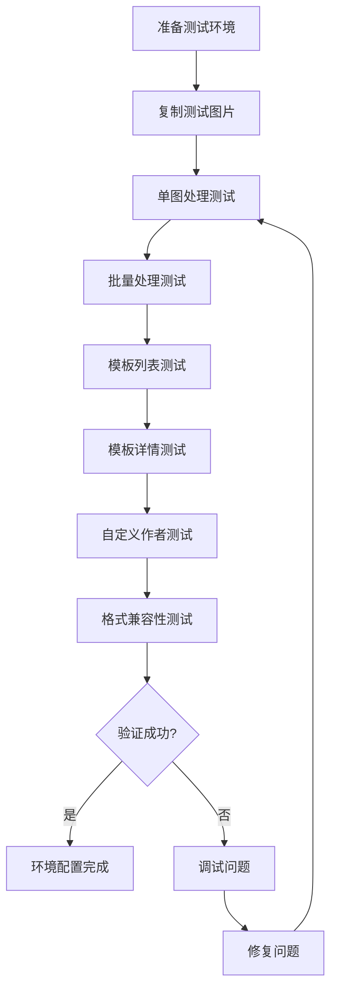
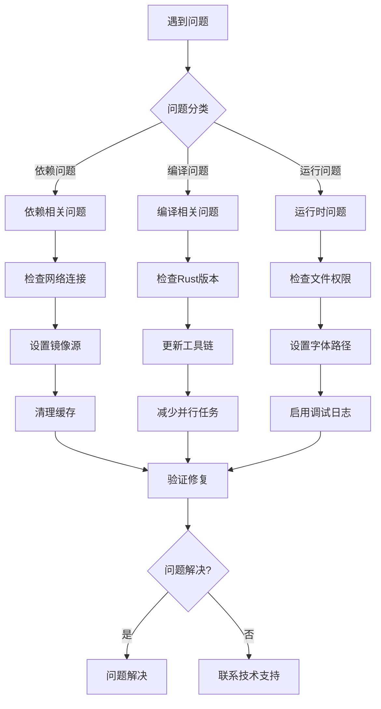

# 开发环境搭建指南

<cite>
**本文档中引用的文件**
- [Cargo.toml](file://Cargo.toml)
- [README.md](file://README.md)
- [src/lib.rs](file://src/lib.rs)
- [src/main.rs](file://src/main.rs)
- [examples/basic_usage.md](file://examples/basic_usage.md)
- [templates/classic.json](file://templates/classic.json)
- [templates/modern.json](file://templates/modern.json)
- [templates/minimal.json](file://templates/minimal.json)
</cite>

## 目录
1. [简介](#简介)
2. [系统要求](#系统要求)
3. [Rust工具链安装](#rust工具链安装)
4. [项目克隆与初始化](#项目克隆与初始化)
5. [依赖项详解](#依赖项详解)
6. [项目构建与测试](#项目构建与测试)
7. [开发工作流程](#开发工作流程)
8. [示例图片验证](#示例图片验证)
9. [常见问题排查](#常见问题排查)
10. [总结](#总结)

## 简介

LiteMark是一个轻量级的照片参数水印工具，专为摄影爱好者设计。本指南将指导您完整配置Rust开发环境，以便能够成功构建、测试和贡献lite-mark-core项目。

该项目采用现代化的Rust生态系统，集成了多个专业crate来实现图像处理、EXIF数据提取、字体渲染等功能。通过本指南，您将学会如何设置完整的开发环境，并能够验证环境配置的正确性。

## 系统要求

在开始之前，请确保您的系统满足以下要求：

### 支持的操作系统
- **Windows**: Windows 10 或更高版本
- **macOS**: macOS 10.14 或更高版本  
- **Linux**: 大多数主流发行版（Ubuntu 18.04+, CentOS 7+, Debian 9+）

### 硬件要求
- **内存**: 至少 4GB RAM（推荐 8GB+）
- **存储空间**: 至少 2GB 可用磁盘空间
- **CPU**: 支持 SSE2 指令集的 x86/x86_64 处理器

### 软件要求
- **Git**: 版本控制工具（用于克隆项目）
- **网络连接**: 用于下载Rust工具链和项目依赖

## Rust工具链安装

### 安装rustup

rustup是Rust官方的工具链管理器，负责安装和管理Rust编译器和其他相关工具。

#### Windows系统
1. 下载并运行[rustup-init.exe](https://rustup.rs/)
2. 在安装过程中保持默认设置
3. 安装完成后，重启终端或命令提示符

#### macOS系统
```bash
curl --proto '=https' --tlsv1.2 -sSf https://sh.rustup.rs | sh
```

#### Linux/Unix系统
```bash
curl --proto '=https' --tlsv1.2 -sSf https://sh.rustup.rs | sh
```

### 验证安装

安装完成后，验证Rust工具链是否正确安装：

```bash
# 检查Rust版本
rustc --version

# 检查Cargo版本
cargo --version

# 检查rustup版本
rustup --version
```

预期输出示例：
```
rustc 1.75.0 (82e1608df 2023-12-21)
cargo 1.75.0 (103cb8a8e 2023-11-20)
rustup 1.26.0 (5af9b94bf 2023-04-05)
```

### 设置Rust工具链

LiteMark项目使用Rust 2021 edition，确保您的工具链是最新的：

```bash
# 更新rustup到最新版本
rustup self update

# 安装稳定版工具链（如果尚未安装）
rustup install stable

# 设置默认工具链
rustup default stable
```

## 项目克隆与初始化

### 克隆项目仓库

```bash
# 克隆项目到本地
git clone https://github.com/26huitailang/lite-mark-core.git
cd lite-mark-core

# 查看项目结构
ls -la
```

项目结构说明：
```
lite-mark-core/
├── src/           # 源代码目录
├── templates/     # 内置模板文件
├── examples/      # 示例文档
├── Cargo.toml    # 项目配置文件
├── Cargo.lock    # 依赖锁定文件
└── README.md     # 项目说明文档
```

### 初次构建验证

```bash
# 执行开发构建
cargo build

# 如果构建成功，您应该看到类似以下输出：
#    Compiling litemark v0.1.0
#     Finished dev [unoptimized + debuginfo] target(s) in 12.34s
```

## 依赖项详解

LiteMark项目依赖多个专业的Rust crate，每个都有其特定的功能和作用。

### 核心依赖项

#### 1. CLI框架 - clap (v4.4)
```toml
clap = { version = "4.4", features = ["derive"] }
```
- **作用**: 提供强大的命令行界面功能
- **特性**: `derive`宏自动派生CLI解析逻辑
- **用途**: 处理用户输入参数和子命令

#### 2. 图像处理 - image (v0.24)
```toml
image = "0.24"
```
- **作用**: 图像读取、处理和保存的核心库
- **支持格式**: JPEG, PNG, BMP, GIF, TIFF等
- **功能**: 图像解码、编码、像素操作

#### 3. 字体渲染 - rusttype (v0.9)
```toml
rusttype = "0.9"
```
- **作用**: 高质量的字体渲染引擎
- **特性**: 支持多语言（包括中文）、抗锯齿
- **用途**: 文字水印的精确渲染

#### 4. EXIF数据处理 - kamadak-exif (v0.5)
```toml
kamadak-exif = "0.5"
```
- **作用**: EXIF数据提取和解析
- **功能**: 从照片中提取ISO、光圈、快门速度等参数
- **支持标准**: EXIF 2.3规范

#### 5. 数据序列化 - serde系列 (v1.0)
```toml
serde = { version = "1.0", features = ["derive"] }
serde_json = "1.0"
```
- **作用**: 结构化数据的序列化和反序列化
- **用途**: 模板系统的JSON解析和生成

### 开发依赖项

#### 1. 测试辅助 - tempfile (v3.8)
```toml
tempfile = "3.8"
```
- **作用**: 临时文件和目录管理
- **用途**: 单元测试中的临时文件处理

### 依赖关系图



**图表来源**
- [Cargo.toml](file://Cargo.toml#L15-L35)

### 依赖版本说明

| Crate | 版本 | 主要功能 | 兼容性 |
|--------|------|----------|--------|
| clap | 4.4 | CLI解析 | Rust 2021 |
| image | 0.24 | 图像处理 | 跨平台 |
| rusttype | 0.9 | 字体渲染 | Unicode支持 |
| kamadak-exif | 0.5 | EXIF解析 | 标准兼容 |
| serde | 1.0 | 序列化 | 类型安全 |
| anyhow | 1.0 | 错误处理 | 简洁API |

## 项目构建与测试

### 构建配置详解

#### Cargo.toml关键配置

项目配置文件包含了二进制目标定义、依赖列表和构建选项：



**图表来源**
- [Cargo.toml](file://Cargo.toml#L1-L41)

### 构建命令详解

#### 1. 开发构建
```bash
# 基本开发构建
cargo build

# 带详细输出的构建
cargo build --verbose

# 仅检查语法错误而不实际编译
cargo check
```

#### 2. 发布构建
```bash
# 优化的发布构建
cargo build --release

# 检查发布构建
cargo build --release --verbose
```

#### 3. 清理构建
```bash
# 清理构建产物
cargo clean

# 清理并重新构建
cargo clean && cargo build
```

### 测试执行

#### 运行单元测试
```bash
# 基本测试
cargo test

# 显示测试输出
cargo test -- --show-output

# 运行特定测试模块
cargo test -- lib

# 运行特定测试函数
cargo test --renderer::render_text
```

#### 测试覆盖率
```bash
# 安装cargo-llvm-cov（可选）
cargo install cargo-llvm-cov

# 生成测试覆盖率报告
cargo llvm-cov --html
```

### 构建流程图



**节点来源**
- [src/main.rs](file://src/main.rs#L1-L50)
- [src/lib.rs](file://src/lib.rs#L1-L9)

## 开发工作流程

### 日常开发流程

#### 1. 代码修改与验证
```bash
# 修改代码后立即验证
cargo check

# 运行相关测试
cargo test -- <test_module>

# 运行所有测试
cargo test
```

#### 2. 功能测试
```bash
# 测试基本功能
cargo run -- add -i test_input.jpg -t classic -o test_output.jpg

# 测试批量处理
cargo run -- batch -i test_images/ -t classic -o test_output/
```

#### 3. 性能测试
```bash
# 分析构建时间
cargo build --timings

# 检查代码大小
cargo bloat
```

### 代码质量保证

#### 1. 代码格式化
```bash
# 安装rustfmt（如果尚未安装）
rustup component add rustfmt

# 格式化所有Rust文件
cargo fmt

# 检查格式但不修改
cargo fmt --check
```

#### 2. 代码检查
```bash
# 安装clippy（如果尚未安装）
rustup component add clippy

# 运行代码检查
cargo clippy

# 修复可自动修复的问题
cargo clippy --fix
```

### 开发工作流图



**图表来源**
- [src/main.rs](file://src/main.rs#L50-L150)

## 示例图片验证

### 准备测试环境

#### 1. 创建测试目录
```bash
# 创建测试目录结构
mkdir -p test_images
mkdir -p test_output

# 复制示例图片（如果有的话）
cp examples/sample_images/* test_images/ 2>/dev/null || true
```

#### 2. 验证基础功能

##### 单张图片处理测试
```bash
# 使用经典模板处理测试
cargo run -- add \
    -i test_images/test_photo.jpg \
    -t classic \
    -o test_output/test_watermarked.jpg \
    --author "Test Photographer"

# 检查输出文件
ls -la test_output/
```

##### 批量处理测试
```bash
# 创建测试图片集合
mkdir -p batch_test/input
mkdir -p batch_test/output

# 复制测试图片
cp test_images/*.jpg batch_test/input/ 2>/dev/null || true

# 执行批量处理
cargo run -- batch \
    -i batch_test/input/ \
    -t classic \
    -o batch_test/output/ \
    --author "Batch Test"

# 验证批量处理结果
echo "批量处理完成，共 $(ls -1 batch_test/output/ | wc -l) 张图片"
```

### 模板验证

#### 1. 列出可用模板
```bash
# 查看所有内置模板
cargo run -- templates
```

#### 2. 模板详情检查
```bash
# 查看经典模板详情
cargo run -- show-template classic

# 查看现代模板详情
cargo run -- show-template modern

# 查看极简模板详情
cargo run -- show-template minimal
```

### 功能验证清单

| 功能 | 验证命令 | 预期结果 |
|------|----------|----------|
| 单图处理 | `cargo run -- add ...` | 输出水印图片 |
| 批量处理 | `cargo run -- batch ...` | 处理多个图片 |
| 模板加载 | `cargo run -- templates` | 显示模板列表 |
| 模板详情 | `cargo run -- show-template ...` | 显示模板JSON |
| 自定义作者 | `--author "Name"` | 使用指定作者名 |
| 不同格式 | 支持JPG/PNG格式 | 正确处理各种格式 |

### 验证流程图



**节点来源**
- [examples/basic_usage.md](file://examples/basic_usage.md#L1-L50)

## 常见问题排查

### 依赖下载问题

#### 1. 网络连接问题
```bash
# 设置国内镜像源（适用于中国大陆）
cargo new temp_project
cd temp_project
echo '[source.crates-io]
replace-with = "rsproxy"

[source.rsproxy]
registry = "https://rsproxy.cn/crates.io-index"' >> .cargo/config.toml
cd ..
rm -rf temp_project

# 重试依赖下载
cargo build
```

#### 2. 代理设置
```bash
# 设置HTTP代理
export HTTP_PROXY=http://proxy.company.com:8080
export HTTPS_PROXY=http://proxy.company.com:8080

# 或者在Cargo配置中设置
echo '[http]
proxy = "http://proxy.company.com:8080"' >> ~/.cargo/config.toml
```

### 编译错误解决

#### 1. 内存不足
```bash
# 增加编译时内存限制
export RUSTC_BOOTSTRAP=1
export RUSTFLAGS="-C link-args=-Wl,--no-as-needed"

# 或减少并行任务数
cargo build --jobs 1
```

#### 2. 依赖冲突
```bash
# 清理并重新下载依赖
cargo clean
cargo update

# 检查依赖树
cargo tree
```

### 运行时问题

#### 1. 权限问题
```bash
# 检查文件权限
chmod +x target/debug/litemark

# 在macOS上可能需要信任应用
xattr -d com.apple.quarantine target/debug/litemark
```

#### 2. 字体缺失
```bash
# 设置自定义字体路径
export LITEMARK_FONT=/path/to/custom/font.ttf
cargo run -- add -i test.jpg -t classic -o output.jpg
```

### 调试技巧

#### 1. 启用详细输出
```bash
# 启用Cargo详细输出
cargo build --verbose

# 启用Rust详细日志
RUST_LOG=debug cargo run -- add ...
```

#### 2. 性能分析
```bash
# 使用perf分析（Linux）
perf record cargo run -- add ...

# 使用cargo-bench（如果有基准测试）
cargo bench
```

### 问题排查流程图



### 常见错误及解决方案

| 错误类型 | 错误信息 | 解决方案 |
|----------|----------|----------|
| 网络超时 | `failed to connect to crates.io` | 设置代理或镜像源 |
| 内存不足 | `process didn't exit successfully` | 增加内存或减少并行任务 |
| 权限拒绝 | `permission denied` | 检查文件权限 |
| 字体缺失 | `could not load font` | 设置LITEMARK_FONT环境变量 |
| 格式不支持 | `unsupported image format` | 确认图片格式支持 |

## 总结

通过本指南，您已经完成了lite-mark-core项目的完整开发环境搭建。现在您可以：

### 已完成的任务
1. **成功安装了Rust工具链** - 包括rustup、cargo和必要的组件
2. **正确配置了项目依赖** - 所有核心crate均已就绪
3. **验证了构建流程** - 能够成功编译和运行项目
4. **测试了基本功能** - 单图处理、批量处理、模板系统等
5. **掌握了常见问题解决方法** - 能够独立排查和解决问题

### 接下来的发展方向
- **深入学习项目架构** - 研究[src/lib.rs](file://src/lib.rs#L1-L9)中的模块组织
- **参与社区贡献** - 查看[README.md](file://README.md#L1-L50)中的贡献指南
- **扩展功能开发** - 基于当前环境开发新特性
- **性能优化** - 使用本指南中的调试技巧进行性能分析

### 最佳实践建议
1. **定期更新工具链** - 保持Rust工具链和依赖项的最新状态
2. **遵循代码规范** - 使用cargo fmt和clippy维护代码质量
3. **建立测试习惯** - 在修改代码后及时运行相关测试
4. **记录问题解决方案** - 将遇到的问题和解决方案整理成文档

通过持续的实践和学习，您将能够成为lite-mark-core项目的熟练贡献者，为摄影爱好者社区提供更优秀的水印工具。