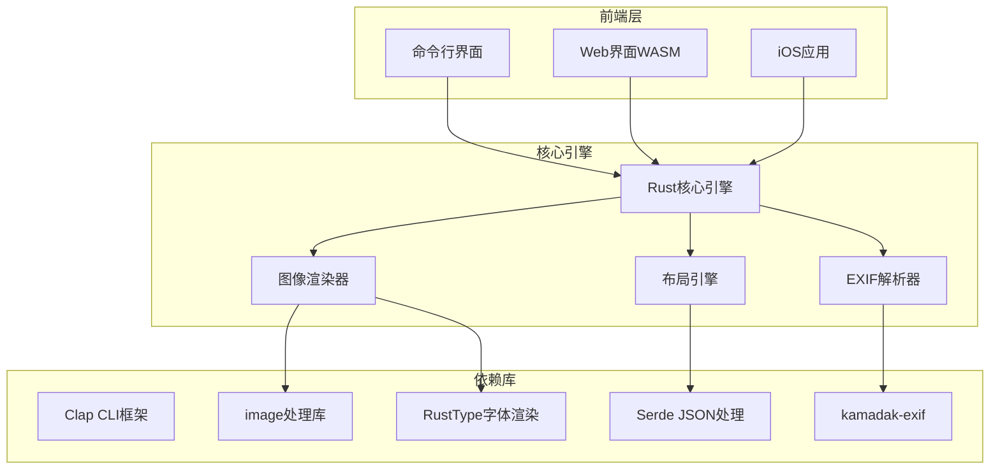
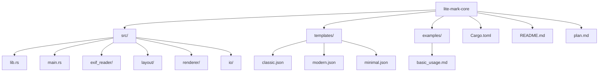
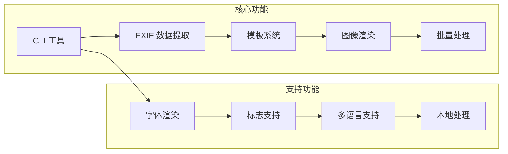
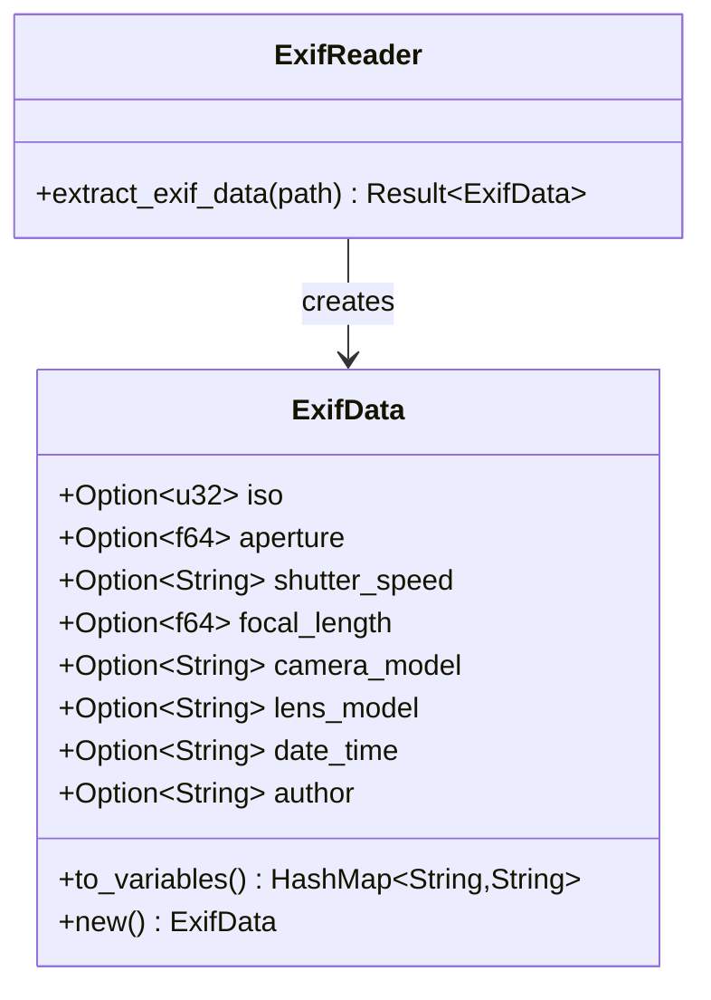
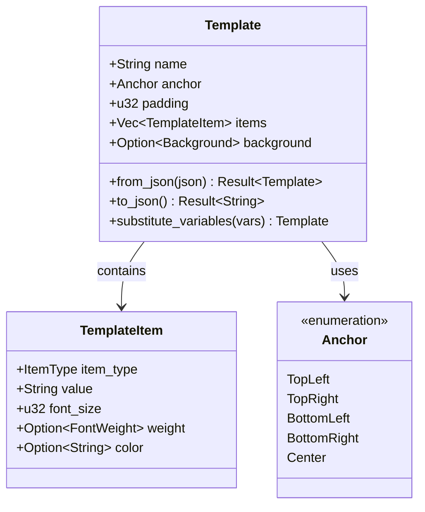
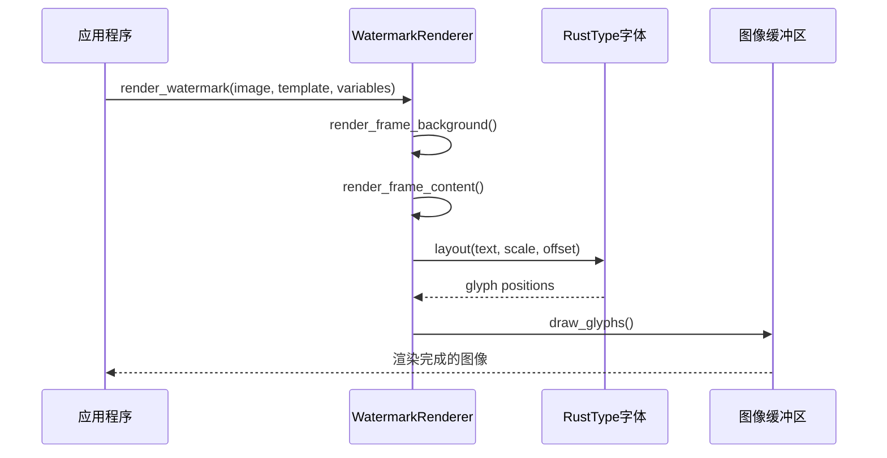
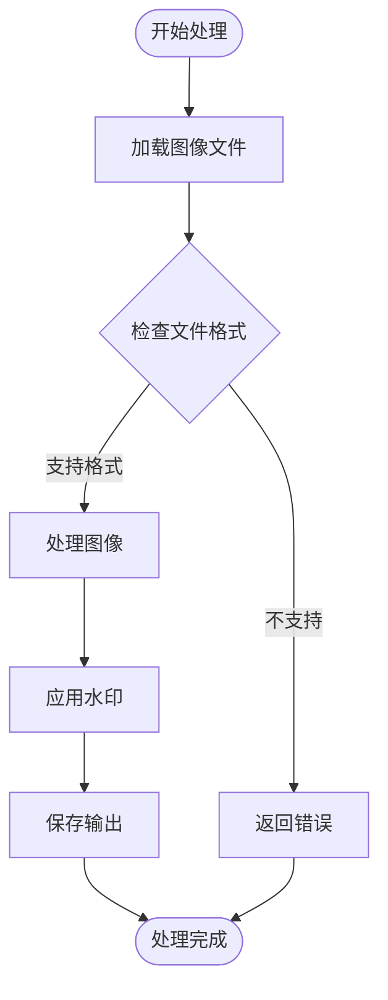

# 开发者指南

<cite>
**本文档引用的文件**
- [Cargo.toml](file://Cargo.toml)
- [README.md](file://README.md)
- [plan.md](file://plan.md)
- [src/lib.rs](file://src/lib.rs)
- [src/main.rs](file://src/main.rs)
- [src/exif_reader/mod.rs](file://src/exif_reader/mod.rs)
- [src/layout/mod.rs](file://src/layout/mod.rs)
- [src/renderer/mod.rs](file://src/renderer/mod.rs)
- [src/io/mod.rs](file://src/io/mod.rs)
- [examples/basic_usage.md](file://examples/basic_usage.md)
- [templates/classic.json](file://templates/classic.json)
- [templates/modern.json](file://templates/modern.json)
- [templates/minimal.json](file://templates/minimal.json)
</cite>

## 目录
1. [项目简介](#项目简介)
2. [技术栈概览](#技术栈概览)
3. [开发环境设置](#开发环境设置)
4. [项目结构](#项目结构)
5. [构建和运行](#构建和运行)
6. [测试指南](#测试指南)
7. [贡献流程](#贡献流程)
8. [开发路线图](#开发路线图)
9. [核心模块详解](#核心模块详解)
10. [模板系统](#模板系统)
11. [故障排除](#故障排除)

## 项目简介

LiteMark 是一个轻量级的照片参数水印工具，专为摄影爱好者和社交媒体用户设计。该工具能够从照片的 EXIF 数据中提取拍摄参数（ISO、光圈、快门速度、焦距等），并将其添加到底部相框中，为照片添加专业的参数水印。

### 核心特性
- 📸 **EXIF 数据提取**：自动读取照片的拍摄参数
- 🖼️ **帧模式**：添加底部相框显示拍摄参数和标志
- 🎨 **模板系统**：基于 JSON 的可定制布局
- 🔤 **专业字体渲染**：使用 rusttype 支持中英文
- 🖼️ **标志支持**：自动缩放和加载标志图片
- 📱 **批量处理**：支持目录级别的批量操作
- 🔒 **隐私优先**：所有处理都在本地完成

## 技术栈概览

### 核心技术选择



**图表来源**
- [Cargo.toml](file://Cargo.toml#L1-L41)
- [src/lib.rs](file://src/lib.rs#L1-L9)

### 关键技术选择理由

| 技术 | 版本 | 选择理由 |
|------|------|----------|
| **Rust** | 最新版 | 高性能、内存安全、优秀的 WASM 支持 |
| **Clap** | 4.4 | 成熟的 CLI 框架，支持 derive 宏 |
| **Image** | 0.24 | 强大的图像处理能力，支持多种格式 |
| **RustType** | 0.9 | 专业的字体渲染，支持多语言 |
| **Serde** | 1.0 | 高效的序列化/反序列化 |
| **Kamadak-exif** | 0.5 | 专门的 EXIF 解析库 |

**章节来源**
- [Cargo.toml](file://Cargo.toml#L10-L30)

## 开发环境设置

### 1. 安装 Rust 工具链

#### 方法一：使用 rustup（推荐）
```bash
# 安装 rustup
curl --proto '=https' --tlsv1.2 -sSf https://sh.rustup.rs | sh

# 重启终端或运行
source ~/.cargo/env

# 验证安装
rustc --version
cargo --version
```

#### 方法二：使用包管理器
```bash
# macOS (Homebrew)
brew install rust

# Ubuntu/Debian
sudo apt update
sudo apt install rustc cargo

# Windows (Chocolatey)
choco install rust
```

### 2. 验证环境

```bash
# 检查 Rust 版本
rustc --version

# 检查 Cargo 版本
cargo --version

# 检查目标平台
rustc --print target-list | grep -E "(x86_64|x86|arm)"
```

### 3. 克隆项目

```bash
git clone https://github.com/26huitailang/lite-mark-core.git
cd lite-mark-core
```

**章节来源**
- [README.md](file://README.md#L15-L30)

## 项目结构



**图表来源**
- [src/lib.rs](file://src/lib.rs#L1-L9)
- [src/main.rs](file://src/main.rs#L1-L20)

### 目录结构说明

| 目录/文件 | 用途 |
|-----------|------|
| `src/` | Rust 源代码主目录 |
| `src/lib.rs` | 库入口点，导出核心类型 |
| `src/main.rs` | CLI 应用程序入口点 |
| `src/exif_reader/` | EXIF 数据提取模块 |
| `src/layout/` | 模板引擎和布局系统 |
| `src/renderer/` | 图像渲染和水印生成 |
| `src/io/` | 文件输入输出操作 |
| `templates/` | 内置模板文件 |
| `examples/` | 使用示例文档 |

**章节来源**
- [src/lib.rs](file://src/lib.rs#L1-L9)
- [src/main.rs](file://src/main.rs#L1-L320)

## 构建和运行

### 开发构建

```bash
# 基本开发构建
cargo build

# 带调试信息的开发构建
cargo build --features debug

# 仅检查语法错误
cargo check
```

### 发布构建

```bash
# 生产环境构建
cargo build --release

# 优化后的二进制文件位于 target/release/
ls -la target/release/litemark
```

### 运行应用程序

```bash
# 运行开发版本
cargo run -- add -i input.jpg -t classic -o output.jpg

# 运行发布版本
./target/release/litemark add -i input.jpg -t classic -o output.jpg
```

### 使用示例图片

项目提供了基本的使用示例，可以参考以下命令：

```bash
# 使用示例图片进行功能验证
cargo run -- add -i test_images/sample.jpg -t classic -o output.jpg --author "Photographer"

# 批量处理示例
cargo run -- batch -i test_images/ -t modern -o output/ --author "Photographer"
```

**章节来源**
- [README.md](file://README.md#L40-L60)
- [examples/basic_usage.md](file://examples/basic_usage.md#L1-L50)

## 测试指南

### 运行测试套件

```bash
# 运行所有测试
cargo test

# 运行特定模块测试
cargo test --lib
cargo test --bin litemark

# 显示测试输出
cargo test -- --nocapture

# 运行特定测试函数
cargo test test_exif_data_to_variables
```

### 测试覆盖率

```bash
# 安装 cargo-llvm-cov
cargo install cargo-llvm-cov

# 生成覆盖率报告
cargo llvm-cov --html
```

### 测试数据准备

项目包含以下测试资源：
- **EXIF 数据测试**：模拟的 EXIF 数据提取
- **模板系统测试**：JSON 模板解析和变量替换
- **渲染器测试**：字体渲染和图像合成
- **IO 操作测试**：文件读写和批量处理

**章节来源**
- [src/exif_reader/mod.rs](file://src/exif_reader/mod.rs#L80-L120)
- [src/layout/mod.rs](file://src/layout/mod.rs#L180-L206)
- [src/renderer/mod.rs](file://src/renderer/mod.rs#L620-L631)

## 贡献流程

### 1. Fork 仓库

```bash
# 访问项目仓库 https://github.com/26huitailang/lite-mark-core
# 点击右上角的 Fork 按钮创建个人副本
```

### 2. 克隆你的 Fork

```bash
git clone https://github.com/YOUR_USERNAME/lite-mark-core.git
cd lite-mark-core
git remote add upstream https://github.com/26huitailang/lite-mark-core.git
```

### 3. 创建特性分支

```bash
# 创建新的功能分支
git checkout -b feature/new-watermark-effect

# 或创建修复分支
git checkout -b fix/exif-parsing-issue

# 或创建文档分支
git checkout -b docs/template-documentation
```

### 4. 开发和测试

```bash
# 进行开发工作
# ... 修改代码 ...

# 运行测试确保一切正常
cargo test

# 运行格式检查
cargo fmt --check
cargo clippy
```

### 5. 提交更改

```bash
# 添加更改
git add .

# 提交更改（遵循约定式提交规范）
git commit -m "feat(renderer): add support for custom fonts"

# 或
git commit -m "fix(exif): handle missing aperture data gracefully"
```

### 6. 推送到远程

```bash
git push origin feature/new-watermark-effect
```

### 7. 创建 Pull Request

1. 访问你的 Fork 页面
2. 点击 "Compare & pull request"
3. 填写详细的 PR 描述
4. 关联相关 Issue（如果有）

### 8. 代码审查和合并

- 维护者会审查代码
- 根据反馈修改代码
- 最终合并到主分支

**章节来源**
- [README.md](file://README.md#L140-L150)

## 开发路线图

### 已完成的功能（MVP）



**图表来源**
- [plan.md](file://plan.md#L50-L80)

### 当前状态

- ✅ **CLI 工具**：完整的命令行界面
- ✅ **EXIF 解析**：基础的 EXIF 数据提取（占位实现）
- ✅ **模板系统**：JSON 配置的灵活布局
- ✅ **图像渲染**：使用 rusttype 的专业字体渲染
- ✅ **批量处理**：目录级别的批量操作
- ✅ **开源发布**：MIT 许可证

### 未来规划

| 阶段 | 时间范围 | 主要目标 |
|------|----------|----------|
| **v1.0** | 已完成 | 核心功能 MVP |
| **v1.1** | 1-2 个月 | iOS 原型 + UX 优化 |
| **v1.2** | 3-6 个月 | Web 界面 + 跨平台支持 |
| **v2.0** | 6-12 个月 | 智能布局 + 模板市场 |

### 长期愿景

- 📱 **iOS App 集成**：原生 iOS 应用
- 🌐 **Web 界面**：基于 WASM 的在线工具
- 🎨 **更多模板**：丰富的预设模板
- 📊 **智能布局**：基于 AI 的最佳位置推荐
- 📦 **模板市场**：可购买的高级模板

**章节来源**
- [plan.md](file://plan.md#L1-L50)
- [README.md](file://README.md#L130-L150)

## 核心模块详解

### 1. EXIF 数据提取模块

负责从照片中提取拍摄参数信息：



**图表来源**
- [src/exif_reader/mod.rs](file://src/exif_reader/mod.rs#L3-L25)
- [src/exif_reader/mod.rs](file://src/exif_reader/mod.rs#L60-L80)

### 2. 模板引擎

JSON 驱动的布局系统：



**图表来源**
- [src/layout/mod.rs](file://src/layout/mod.rs#L3-L40)
- [src/layout/mod.rs](file://src/layout/mod.rs#L120-L180)

### 3. 图像渲染器

使用 rusttype 进行专业字体渲染：



**图表来源**
- [src/renderer/mod.rs](file://src/renderer/mod.rs#L60-L120)
- [src/renderer/mod.rs](file://src/renderer/mod.rs#L150-L200)

### 4. 文件 I/O 操作

支持多种图像格式和批量处理：



**图表来源**
- [src/io/mod.rs](file://src/io/mod.rs#L1-L30)
- [src/io/mod.rs](file://src/io/mod.rs#L40-L85)

**章节来源**
- [src/exif_reader/mod.rs](file://src/exif_reader/mod.rs#L1-L120)
- [src/layout/mod.rs](file://src/layout/mod.rs#L1-L206)
- [src/renderer/mod.rs](file://src/renderer/mod.rs#L1-L631)
- [src/io/mod.rs](file://src/io/mod.rs#L1-L86)

## 模板系统

### 模板结构

每个模板都是一个 JSON 对象，定义了水印的布局和样式：

```json
{
  "name": "ClassicParam",
  "anchor": "bottom-left",
  "padding": 24,
  "items": [
    {
      "type": "text",
      "value": "{Author}",
      "font_size": 20,
      "weight": "bold",
      "color": "#FFFFFF"
    },
    {
      "type": "text",
      "value": "{Aperture} | ISO {ISO} | {Shutter}",
      "font_size": 14,
      "weight": "normal",
      "color": "#FFFFFF"
    }
  ],
  "background": {
    "type": "rect",
    "opacity": 0.3,
    "radius": 6,
    "color": "#000000"
  }
}
```

### 支持的变量

| 变量 | 描述 | 示例值 |
|------|------|--------|
| `{Author}` | 摄影师姓名 | "John Doe" |
| `{ISO}` | ISO 感光度 | "100" |
| `{Aperture}` | 光圈值 | "f/2.8" |
| `{Shutter}` | 快门速度 | "1/125" |
| `{Focal}` | 焦距 | "50mm" |
| `{Camera}` | 相机型号 | "Canon EOS R5" |
| `{Lens}` | 镜头型号 | "EF 24-70mm f/2.8L II" |
| `{DateTime}` | 拍摄时间 | "2024:01:15 14:30:25" |

### 内置模板

#### ClassicParam（经典参数）
- **位置**：左下角
- **内容**：摄影师姓名 + 拍摄参数
- **特点**：半透明黑色背景，白色文字

#### Modern（现代风格）
- **位置**：右上角
- **内容**：相机型号 + 镜头 + 拍摄参数
- **特点**：简洁的半透明背景

#### Minimal（极简风格）
- **位置**：右下角
- **内容**：仅摄影师姓名
- **特点**：无背景，纯文字

**章节来源**
- [templates/classic.json](file://templates/classic.json#L1-L27)
- [templates/modern.json](file://templates/modern.json#L1-L29)
- [templates/minimal.json](file://templates/minimal.json#L1-L17)
- [src/layout/mod.rs](file://src/layout/mod.rs#L120-L180)

## 故障排除

### 常见问题及解决方案

#### 1. 编译错误

**问题**：Rust 版本过低
```bash
error: the requested Rust toolchain is nightly or later
```

**解决方案**：
```bash
# 更新 Rust 到最新版本
rustup update

# 或安装 nightly 版本（如果需要）
rustup install nightly
```

#### 2. 依赖问题

**问题**：缺少系统依赖
```bash
error: failed to run custom build command
```

**解决方案**：
```bash
# Ubuntu/Debian
sudo apt-get install pkg-config libssl-dev

# macOS
brew install pkg-config openssl

# Windows
# 安装 Visual Studio Build Tools
```

#### 3. 字体渲染问题

**问题**：中文字符显示异常
```bash
Warning: Font file not found, using placeholder
```

**解决方案**：
```bash
# 设置自定义字体路径
export LITEMARK_FONT=/path/to/chinese-font.ttf
cargo run -- add -i input.jpg -t classic -o output.jpg
```

#### 4. 性能问题

**问题**：大图片处理缓慢

**解决方案**：
```bash
# 使用 release 模式构建
cargo build --release

# 或限制并发数量（如果支持）
export RAYON_NUM_THREADS=2
```

### 调试技巧

#### 启用调试输出
```bash
# 设置环境变量启用详细输出
export RUST_LOG=debug
cargo run -- add -i input.jpg -t classic -o output.jpg
```

#### 性能分析
```bash
# 使用 perf 工具分析性能
cargo build --release
perf record ./target/release/litemark batch -i large_folder/ -t classic -o output/
perf report
```

### 获取帮助

```bash
# 查看帮助信息
litemark --help
litemark add --help
litemark batch --help

# 查看版本信息
litemark --version

# 检查配置
litemark templates
litemark show-template classic
```

**章节来源**
- [examples/basic_usage.md](file://examples/basic_usage.md#L100-L130)
- [src/main.rs](file://src/main.rs#L280-L320)

## 结语

LiteMark 是一个充满活力的开源项目，我们欢迎所有形式的贡献！无论你是 Rust 新手还是经验丰富的开发者，都可以通过以下方式参与：

- 🐛 **报告 Bug**：发现的问题可以通过 GitHub Issues 报告
- 💡 **功能建议**：提出你认为应该添加的功能
- 📝 **文档改进**：帮助改善项目文档
- 🧑‍💻 **代码贡献**：修复 bug 或添加新功能
- 🎨 **UI/UX 设计**：改进用户界面和体验

让我们一起打造一个更好的照片水印工具！如果你有任何问题，请随时在 GitHub Discussions 中提问。

**项目维护者联系方式**：
- 📧 Email: [your-email@example.com]
- 🐛 Issues: [GitHub Issues](https://github.com/26huitailang/lite-mark-core/issues)
- 💬 Discussions: [GitHub Discussions](https://github.com/26huitailang/lite-mark-core/discussions)