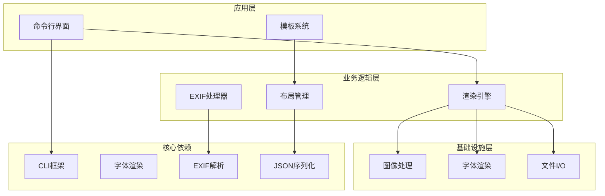
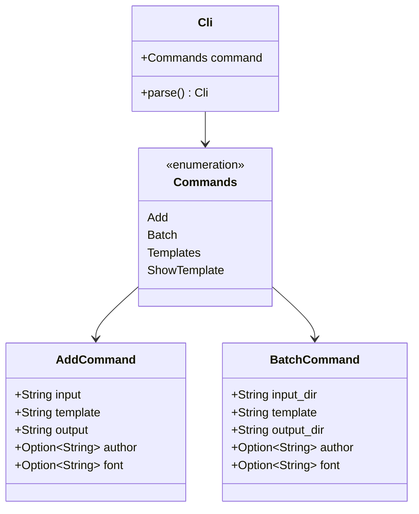
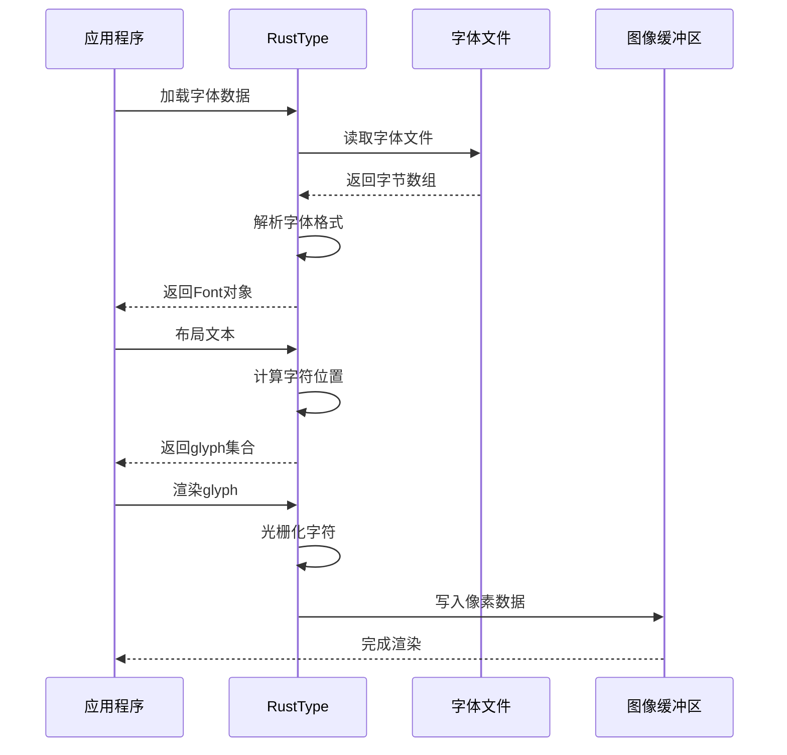
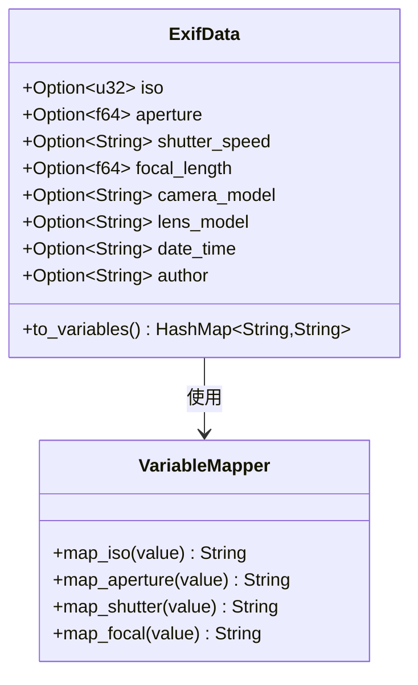
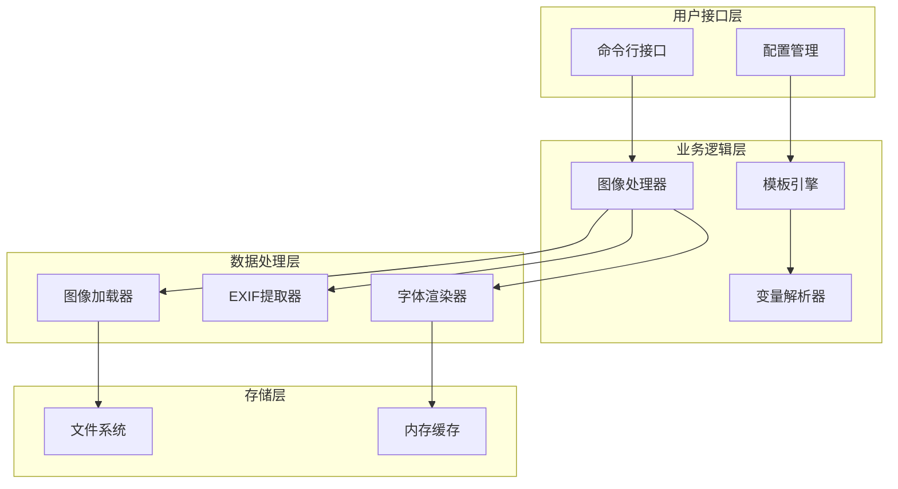
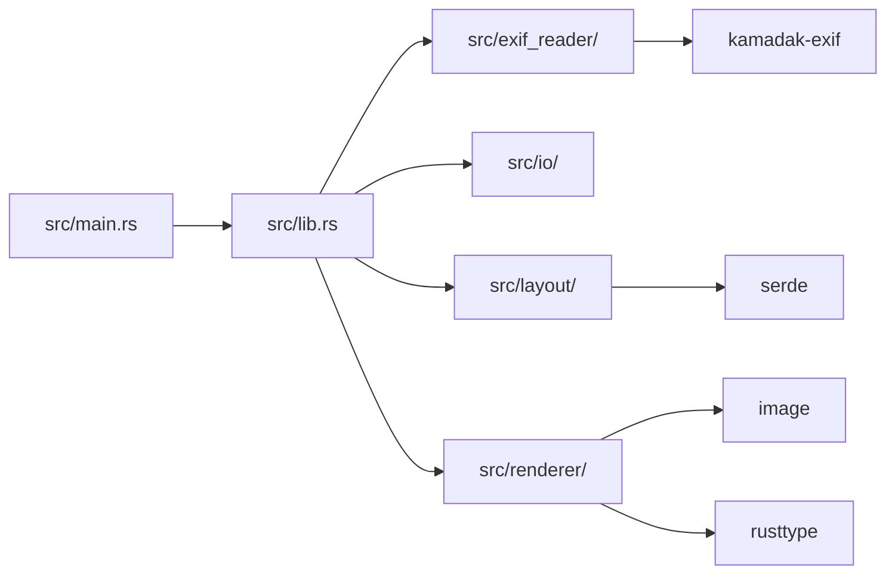

# 技术栈

<cite>
**本文档中引用的文件**
- [Cargo.toml](file://Cargo.toml)
- [src/lib.rs](file://src/lib.rs)
- [src/main.rs](file://src/main.rs)
- [src/exif_reader/mod.rs](file://src/exif_reader/mod.rs)
- [src/io/mod.rs](file://src/io/mod.rs)
- [src/layout/mod.rs](file://src/layout/mod.rs)
- [src/renderer/mod.rs](file://src/renderer/mod.rs)
- [templates/classic.json](file://templates/classic.json)
- [templates/modern.json](file://templates/modern.json)
- [templates/minimal.json](file://templates/minimal.json)
- [README.md](file://README.md)
</cite>

## 目录
1. [项目概述](#项目概述)
2. [核心技术选型](#核心技术选型)
3. [Rust语言优势](#rust语言优势)
4. [关键依赖分析](#关键依赖分析)
5. [技术栈架构](#技术栈架构)
6. [模块化设计](#模块化设计)
7. [性能与安全性](#性能与安全性)
8. [总结](#总结)

## 项目概述

LiteMark是一个轻量级的照片参数水印工具，专为摄影爱好者设计。该项目采用Rust作为核心开发语言，构建了一个功能完整、性能优异的水印处理系统。项目的核心目标是提供本地化的照片水印解决方案，确保用户隐私安全，同时支持多种模板和自定义配置。

**章节来源**
- [README.md](file://README.md#L1-L20)
- [src/lib.rs](file://src/lib.rs#L1-L9)

## 核心技术选型

LiteMark的技术栈经过精心设计，每个组件都针对特定需求进行了优化。整个系统围绕以下几个核心理念构建：

### 设计原则
- **本地处理优先**：所有操作在本地完成，保护用户隐私
- **模块化架构**：清晰的职责分离，便于维护和扩展
- **高性能计算**：利用Rust的性能优势，提供流畅的用户体验
- **跨平台兼容**：支持多种操作系统和图像格式

### 技术栈组成

**图表来源**
- [src/main.rs](file://src/main.rs#L1-L30)
- [src/lib.rs](file://src/lib.rs#L1-L9)

## Rust语言优势

### 性能卓越
Rust提供了接近C/C++的执行性能，同时保持了高级语言的开发效率。在图像处理这种计算密集型任务中，Rust的零成本抽象特性确保了最佳性能表现。

### 内存安全
通过所有权系统和借用检查器，Rust在编译时就消除了常见的内存错误，如空指针引用、缓冲区溢出等。这对于处理大量图像数据的应用程序尤为重要。

### 成熟的WASM支持
项目具备向Web平台扩展的潜力，Rust对WebAssembly的良好支持使得未来可以轻松构建Web版本。

### 强大的图像处理生态
Rust拥有丰富的生态系统，特别是在图像处理领域，这为项目的长期发展提供了坚实的基础。

**章节来源**
- [Cargo.toml](file://Cargo.toml#L1-L41)

## 关键依赖分析

### clap - 命令行界面框架

clap提供了类型安全的命令行参数解析，支持复杂的子命令结构和验证规则。

#### 核心特性
- **类型安全**：编译时验证参数类型
- **自动帮助生成**：自动生成usage信息
- **子命令支持**：支持add、batch、templates等子命令
- **参数验证**：内置输入验证机制

#### 在项目中的应用

**图表来源**
- [src/main.rs](file://src/main.rs#L8-L45)

### image - 图像编解码库

image库提供了完整的图像处理能力，支持多种格式的读取和写入。

#### 支持的格式
- **JPEG**：主要的图像格式
- **PNG**：无损压缩格式
- **GIF**：动画支持
- **BMP**：位图格式
- **WebP**：现代压缩格式

#### 核心功能
- **格式检测**：自动识别图像格式
- **像素操作**：直接访问和修改像素数据
- **颜色空间转换**：RGB、RGBA等格式转换

### rusttype - 专业字体渲染

rusttype提供了高质量的字体渲染能力，特别支持多语言文本显示。

#### 技术优势
- **矢量字体**：支持TrueType和OpenType字体
- **多语言支持**：完美支持中文、日文等复杂文字
- **高精度渲染**：抗锯齿和亚像素渲染
- **自定义字体**：支持用户指定字体文件

#### 渲染流程

**图表来源**
- [src/renderer/mod.rs](file://src/renderer/mod.rs#L15-L50)

### kamadak-exif - EXIF数据提取

专门用于从图像文件中提取EXIF元数据的库。

#### 提取的信息
- **相机参数**：ISO、光圈、快门速度、焦距
- **设备信息**：相机型号、镜头型号
- **时间戳**：拍摄时间和GPS坐标
- **作者信息**：摄影师姓名

#### 数据结构

**图表来源**
- [src/exif_reader/mod.rs](file://src/exif_reader/mod.rs#L4-L25)

### serde - JSON序列化

serde提供了高效的JSON序列化和反序列化功能。

#### 核心功能
- **结构化数据**：支持复杂的数据结构
- **类型推断**：自动推断字段类型
- **错误处理**：详细的解析错误信息
- **性能优化**：零拷贝解析

#### 在模板系统中的应用
模板系统完全基于JSON格式，serde确保了模板的正确解析和生成。

**章节来源**
- [Cargo.toml](file://Cargo.toml#L10-L25)
- [src/layout/mod.rs](file://src/layout/mod.rs#L1-L50)

## 技术栈架构

### 整体架构设计

**图表来源**
- [src/main.rs](file://src/main.rs#L50-L100)
- [src/lib.rs](file://src/lib.rs#L1-L9)

### 模块间通信
各模块通过清晰的接口进行通信，避免了紧耦合：

1. **事件驱动**：通过函数调用传递数据
2. **错误传播**：统一的错误处理机制
3. **资源管理**：自动资源清理和释放

**章节来源**
- [src/io/mod.rs](file://src/io/mod.rs#L1-L30)
- [src/renderer/mod.rs](file://src/renderer/mod.rs#L1-L50)

## 模块化设计

### 核心模块划分

#### 1. 主程序模块 (src/main.rs)
负责命令行接口和用户交互，实现了完整的CLI应用程序。

#### 2. 库模块 (src/lib.rs)
定义了核心类型和公共接口，为其他模块提供基础服务。

#### 3. EXIF读取模块 (src/exif_reader/)
专门处理图像元数据提取，提供标准化的数据格式。

#### 4. 输入输出模块 (src/io/)
封装了文件系统操作，支持批量处理和格式检测。

#### 5. 布局模块 (src/layout/)
实现了模板系统，支持JSON格式的布局定义。

#### 6. 渲染模块 (src/renderer/)
负责实际的图像渲染，包括字体渲染和图形合成。

### 模块依赖关系

**图表来源**
- [src/lib.rs](file://src/lib.rs#L1-L9)
- [src/main.rs](file://src/main.rs#L1-L10)

**章节来源**
- [src/main.rs](file://src/main.rs#L1-L320)
- [src/lib.rs](file://src/lib.rs#L1-L9)

## 性能与安全性

### 性能优化策略

#### 1. 内存管理优化
- **零拷贝操作**：尽可能减少数据复制
- **流式处理**：大文件采用流式处理方式
- **缓存机制**：字体和模板数据的智能缓存

#### 2. 并发处理
- **批量处理**：支持目录级别的批量操作
- **异步I/O**：文件读写操作的异步化

#### 3. 算法优化
- **快速查找**：模板和变量的快速匹配
- **增量渲染**：只更新变化的部分

### 安全性保障

#### 1. 输入验证
- **路径安全**：防止路径遍历攻击
- **格式验证**：严格的文件格式检查
- **大小限制**：防止大文件导致的内存问题

#### 2. 资源隔离
- **沙箱环境**：所有操作都在受限环境中进行
- **权限控制**：最小权限原则

#### 3. 错误处理
- **优雅降级**：部分功能失败不影响整体运行
- **详细日志**：完整的操作记录和错误追踪

**章节来源**
- [src/io/mod.rs](file://src/io/mod.rs#L40-L85)
- [src/renderer/mod.rs](file://src/renderer/mod.rs#L15-L100)

## 总结

LiteMark的技术栈体现了现代软件开发的最佳实践：

### 技术优势
1. **Rust语言**：提供了卓越的性能和安全性保证
2. **模块化设计**：清晰的职责分离，便于维护和扩展
3. **丰富的生态**：充分利用了Rust生态系统的优势
4. **跨平台兼容**：支持多种操作系统和硬件架构

### 架构特点
- **本地优先**：保护用户隐私，无需网络连接
- **模板化**：灵活的布局系统，支持个性化定制
- **批处理**：高效的批量处理能力
- **多语言支持**：完整的中英文支持

### 发展前景
技术栈的设计为项目的未来发展奠定了坚实基础：
- **Web集成**：通过WASM可以轻松扩展到Web平台
- **移动端适配**：Rust的跨平台特性支持移动设备
- **云原生**：容器化部署和微服务架构的可能性

这个技术栈不仅满足了当前的功能需求，更为未来的功能扩展和技术演进提供了充分的空间。通过合理的技术选型和架构设计，LiteMark能够在保持高性能的同时，提供优秀的用户体验和可靠的服务质量。