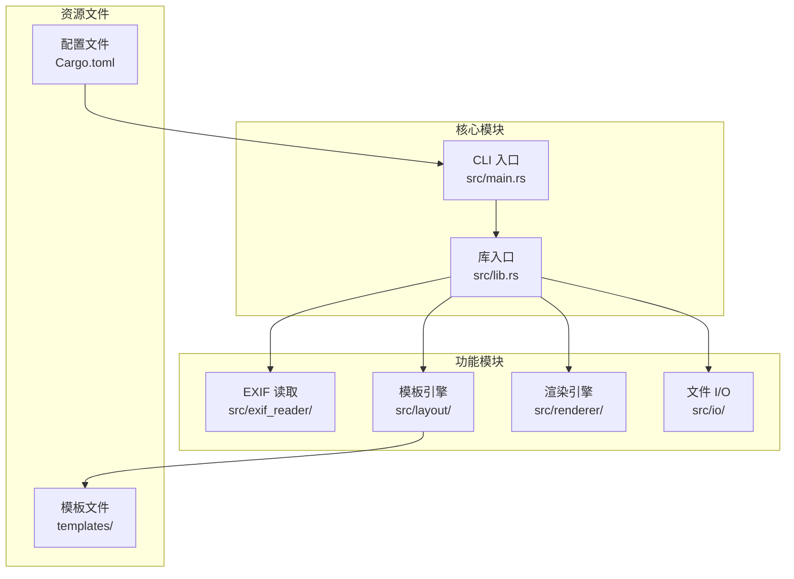

# 贡献流程

<cite>
**本文档中引用的文件**
- [README.md](file://README.md)
- [plan.md](file://plan.md)
- [Cargo.toml](file://Cargo.toml)
- [src/lib.rs](file://src/lib.rs)
- [src/main.rs](file://src/main.rs)
- [docs/DEVELOPMENT.md](file://docs/DEVELOPMENT.md)
- [examples/basic_usage.md](file://examples/basic_usage.md)
- [templates/classic.json](file://templates/classic.json)
- [templates/modern.json](file://templates/modern.json)
- [templates/minimal.json](file://templates/minimal.json)
</cite>

## 目录
1. [项目简介](#项目简介)
2. [开发环境准备](#开发环境准备)
3. [项目结构概览](#项目结构概览)
4. [贡献流程详解](#贡献流程详解)
5. [代码规范与最佳实践](#代码规范与最佳实践)
6. [新功能开发指南](#新功能开发指南)
7. [测试策略](#测试策略)
8. [Pull Request 流程](#pull-request-流程)
9. [社区协作与沟通](#社区协作与沟通)
10. [路线图与发展方向](#路线图与发展方向)

## 项目简介

LiteMark 是一个轻量级的照片参数水印工具，专为摄影爱好者设计。该项目采用 Rust 语言开发，具有以下核心特性：

- 📸 **EXIF 数据提取**：支持 ISO、光圈、快门速度、焦距等参数
- 🖼️ **相框模式**：在图片外添加底部框架，保持原图完整性
- 🎨 **模板系统**：基于 JSON 的灵活布局配置
- 🔤 **专业字体渲染**：使用 rusttype 支持多语言（中英文）
- 🖼️ **Logo 支持**：自动缩放和集成
- 📱 **批量处理**：支持目录级别的批量操作
- 🔒 **隐私优先**：所有处理都在本地完成

**章节来源**
- [README.md](file://README.md#L1-L20)
- [plan.md](file://plan.md#L1-L50)

## 开发环境准备

### 系统要求

- **Rust 1.70+**：推荐使用 `rustup` 安装
- **Cargo**：包含在 Rust 工具链中
- **Git**：版本控制系统

### 环境搭建步骤

1. **安装 Rust 工具链**
   ```bash
   curl --proto '=https' --tlsv1.2 -sSf https://sh.rustup.rs | sh
   ```

2. **验证安装**
   ```bash
   rustc --version
   cargo --version
   git --version
   ```

3. **克隆项目仓库**
   ```bash
   git clone https://github.com/26huitailang/lite-mark-core.git
   cd lite-mark-core
   ```

4. **构建项目**
   ```bash
   cargo build
   ```

5. **运行测试**
   ```bash
   cargo test
   ```

**章节来源**
- [docs/DEVELOPMENT.md](file://docs/DEVELOPMENT.md#L1-L50)
- [Cargo.toml](file://Cargo.toml#L1-L41)

## 项目结构概览

LiteMark 采用模块化的架构设计，主要包含以下核心模块：



**图表来源**
- [src/lib.rs](file://src/lib.rs#L1-L9)
- [src/main.rs](file://src/main.rs#L1-L50)

### 模块职责说明

| 模块 | 职责 | 主要功能 |
|------|------|----------|
| **exif_reader** | EXIF 数据提取 | 从图片中读取拍摄参数 |
| **layout** | 模板解析 | JSON 模板解析和变量替换 |
| **renderer** | 图像渲染 | 水印生成和相框绘制 |
| **io** | 文件操作 | 图片加载、保存和批量处理 |

**章节来源**
- [src/lib.rs](file://src/lib.rs#L1-L9)
- [docs/DEVELOPMENT.md](file://docs/DEVELOPMENT.md#L20-L60)

## 贡献流程详解

### 第一步：Fork 仓库

1. 访问项目 GitHub 页面：https://github.com/26huitailang/lite-mark-core
2. 点击右上角的 "Fork" 按钮
3. 选择您的 GitHub 账户作为目标

### 第二步：克隆到本地

```bash
# 克隆您的 fork
git clone https://github.com/YOUR_USERNAME/lite-mark-core.git
cd lite-mark-core

# 添加上游仓库
git remote add upstream https://github.com/26huitailang/lite-mark-core.git
```

### 第三步：创建特性分支

```bash
# 创建新的功能分支
git checkout -b feature/new-template

# 或创建修复分支
git checkout -b fix/exif-parsing-issue

# 或创建文档分支
git checkout -b docs/improve-contributing-guide
```

### 第四步：开发与提交

#### 1. 编写代码

按照项目代码规范进行开发：

```bash
# 格式化代码
cargo fmt

# 运行代码检查
cargo clippy

# 运行测试
cargo test
```

#### 2. 提交更改

```bash
# 添加更改
git add .

# 提交（使用约定式提交格式）
git commit -m "feat: add new template system"

# 或
git commit -m "fix: correct EXIF data extraction"
```

#### 3. 推送分支

```bash
git push origin feature/new-template
```

**章节来源**
- [README.md](file://README.md#L140-L150)
- [docs/DEVELOPMENT.md](file://docs/DEVELOPMENT.md#L300-L350)

## 代码规范与最佳实践

### Rust 风格指南

遵循 Rust 官方风格指南和项目约定：

```bash
# 自动格式化
cargo fmt

# 检查 lint
cargo clippy
```

### 命名约定

- **模块**：小写，使用下划线（`exif_reader`）
- **结构体**：大驼峰（`ExifData`, `WatermarkRenderer`）
- **函数**：蛇形命名（`extract_exif_data`, `render_watermark`）
- **常量**：大写下划线（`BOTTOM_FRAME_HEIGHT`）

### 错误处理

使用标准的 Rust 错误处理模式：

```rust
pub fn process_image(path: &str) -> Result<(), Box<dyn std::error::Error>> {
    let image = image::open(path)?;  // ? 操作符传播错误
    // ...
    Ok(())
}
```

### 文档注释

为公共 API 添加详细的文档注释：

```rust
/// Renders a watermark frame to an image.
///
/// # Arguments
/// * `image` - The image to add frame to
/// * `template` - Template configuration
/// * `variables` - Variables for text substitution
///
/// # Returns
/// `Ok(())` on success, error otherwise
pub fn render_watermark(
    &self,
    image: &mut DynamicImage,
    template: &Template,
    variables: &HashMap<String, String>,
) -> Result<(), Box<dyn std::error::Error>> {
    // ...
}
```

**章节来源**
- [docs/DEVELOPMENT.md](file://docs/DEVELOPMENT.md#L80-L150)

## 新功能开发指南

### 添加新的 CLI 命令

1. **编辑 `src/main.rs`**：

```rust
#[derive(Subcommand)]
enum Commands {
    Add { ... },
    Batch { ... },
    NewCommand {  // 添加新命令
        // 参数定义
    }
}
```

2. **实现命令逻辑**：

```rust
Commands::NewCommand { param1, param2 } => {
    handle_new_command(param1, param2)?;
}
```

### 扩展模板系统

1. **修改模板引擎**：
   - 在 `src/layout/mod.rs` 中添加新的变量类型
   - 更新 `substitute_variables` 函数

2. **添加新模板**：
   - 在 `templates/` 目录添加 JSON 文件
   - 更新 `create_builtin_templates()` 函数

### 改进渲染功能

1. **在 `src/renderer/mod.rs` 添加新方法**
2. **在 `render_watermark` 中调用新方法**
3. **添加相应的单元测试**

**章节来源**
- [src/main.rs](file://src/main.rs#L10-L80)
- [docs/DEVELOPMENT.md](file://docs/DEVELOPMENT.md#L150-L250)

## 测试策略

### 单元测试

每个模块都应该有对应的单元测试：

```rust
#[cfg(test)]
mod tests {
    use super::*;

    #[test]
    fn test_variable_substitution() {
        let template = Template::from_json(json_content).unwrap();
        let result = substitute_variables(&template, &variables);
        assert_eq!(result, expected_result);
    }
}
```

### 集成测试

在 `tests/` 目录添加完整的流程测试：

```rust
#[test]
fn test_full_workflow() {
    // 测试完整的从图片加载到水印添加的流程
    let input_path = "test_images/input.jpg";
    let output_path = "test_images/output.jpg";
    
    process_single_image(input_path, "classic", output_path, None, None)
        .expect("Should process image successfully");
        
    assert!(Path::exists(Path::new(output_path)));
}
```

### 测试图片管理

使用 `test_images/` 目录中的多样化图片进行测试：

- 多种分辨率的图片
- 包含和不包含 EXIF 数据的图片
- 不同格式（JPEG、PNG）的图片

**章节来源**
- [docs/DEVELOPMENT.md](file://docs/DEVELOPMENT.md#L250-L300)

## Pull Request 流程

### PR 创建前检查清单

- [ ] 代码已通过 `cargo fmt` 格式化
- [ ] 代码已通过 `cargo clippy` 检查
- [ ] 所有测试通过：`cargo test`
- [ ] 新功能已添加相应测试
- [ ] 文档已更新（如适用）
- [ ] Commit 消息符合约定式提交格式

### 提交信息规范

使用约定式提交格式：

- `feat:` 新功能
- `fix:` 修复 bug
- `docs:` 文档更新
- `refactor:` 代码重构
- `test:` 测试相关
- `chore:` 构建/工具相关

示例：
```
feat: add logo rendering support
fix: correct text positioning in frame mode
docs: update architecture documentation
```

### PR 描述模板

```markdown
## 变更概述
简要描述本次变更的内容和目的。

## 变更类型
- [ ] 新功能
- [ ] Bug 修复
- [ ] 文档更新
- [ ] 性能优化
- [ ] 代码重构

## 测试
- [ ] 添加了新的单元测试
- [ ] 所有现有测试通过
- [ ] 手动测试完成

## 相关 Issue
关闭 #123

## 截图/演示
如果适用，添加截图或演示视频。
```

**章节来源**
- [docs/DEVELOPMENT.md](file://docs/DEVELOPMENT.md#L300-L350)

## 社区协作与沟通

### 沟通渠道

1. **GitHub Issues**：Bug 报告和功能请求
   - URL: https://github.com/26huitailang/lite-mark-core/issues

2. **GitHub Discussions**：想法讨论和技术交流
   - URL: https://github.com/26huitailang/lite-mark-core/discussions

3. **邮件联系**：项目维护者联系方式
   - 邮箱：your-email@example.com

### 社区准则

- **尊重他人**：保持友善和专业的交流态度
- **建设性反馈**：提供建设性的意见和建议
- **开放包容**：欢迎不同背景的贡献者
- **循序渐进**：新贡献者可以从文档改进开始

### 贡献认可

项目维护团队会定期：
- 感谢贡献者的代码提交
- 在发布说明中列出重要贡献
- 为活跃贡献者提供特殊标识

**章节来源**
- [README.md](file://README.md#L150-L163)

## 路线图与发展方向

基于项目路线图（plan.md），以下是当前和未来的开发方向：

### 已完成的功能

- ✅ CLI 工具和帧模式
- ✅ 专业字体渲染（rusttype）
- ✅ Logo 支持
- ✅ 多语言支持（中英文）
- ✅ 模板系统
- ✅ 批量处理

### 当前开发重点

- 📱 **iOS 应用集成**：将 Rust 核心编译为静态库并与 Swift 桥接
- 🌐 **Web 界面**：使用 WASM 实现在线演示
- 🎨 **更多模板选项**：扩展模板库
- 📸 **HEIC/RAW 格式支持**：增强格式兼容性

### 未来发展方向

- **智能布局**：基于人脸识别的自动布局优化
- **模板市场**：支持模板的导入和分享
- **企业 API**：为企业用户提供批量处理服务
- **跨平台 GUI**：macOS 和 Windows 原生应用

### 如何参与

1. **选择感兴趣的领域**：
   - iOS 应用开发
   - Web 界面实现
   - 模板设计
   - 格式支持扩展

2. **从小处着手**：
   - 改进现有文档
   - 修复简单 bug
   - 添加单元测试

3. **深入学习**：
   - 阅读 [ARCHITECTURE.md](file://docs/ARCHITECTURE.md)
   - 参与 Discussions 讨论
   - 关注项目路线图更新

**章节来源**
- [plan.md](file://plan.md#L1-L100)
- [README.md](file://README.md#L130-L140)

## 结语

LiteMark 项目欢迎各种形式的贡献！无论您是初学者还是经验丰富的开发者，都可以在以下方面贡献力量：

- **代码贡献**：修复 bug、添加新功能、优化性能
- **文档改进**：完善使用文档、贡献教程
- **设计支持**：创建模板、设计图标
- **社区建设**：回答问题、参与讨论

我们相信，通过社区的共同努力，LiteMark 将成为摄影爱好者最喜爱的工具之一。期待您的参与！

**章节来源**
- [README.md](file://README.md#L140-L163)
- [plan.md](file://plan.md#L270-L280)