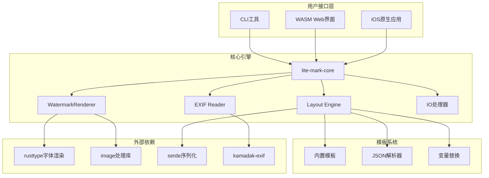
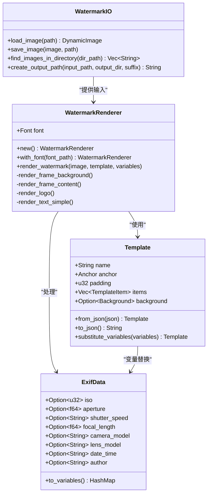
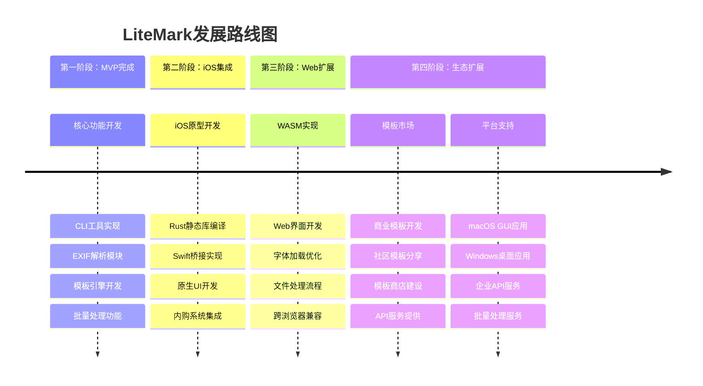
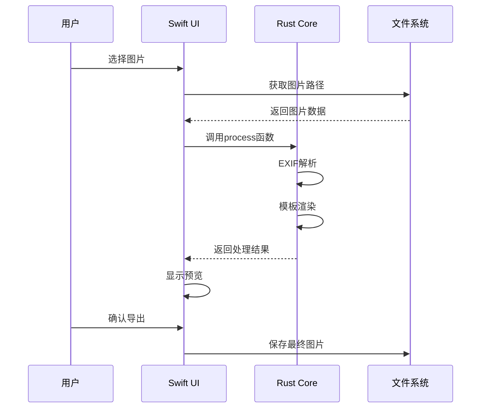
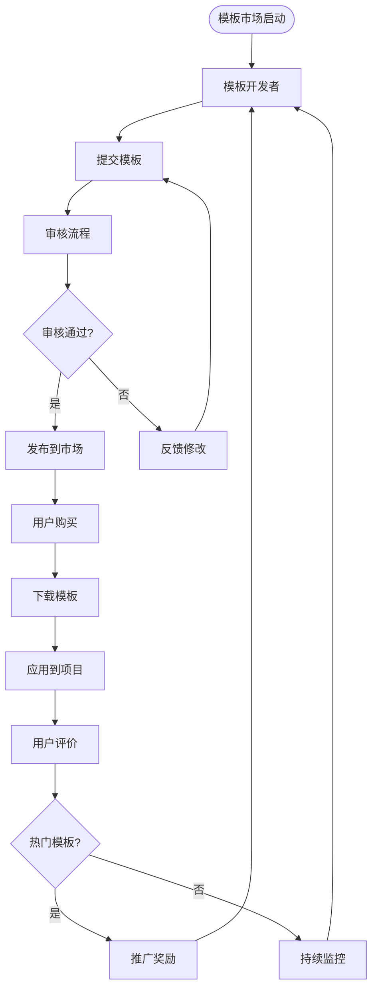
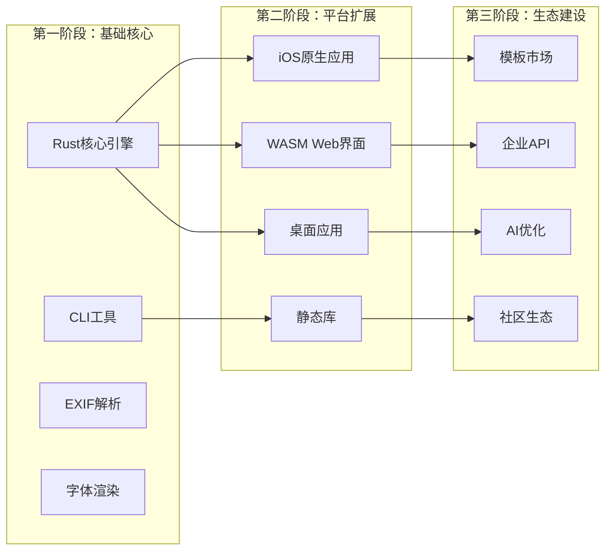
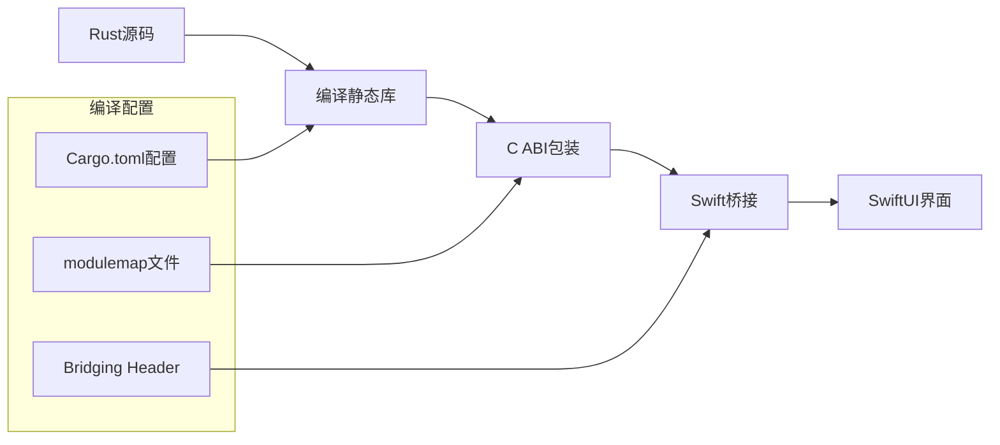
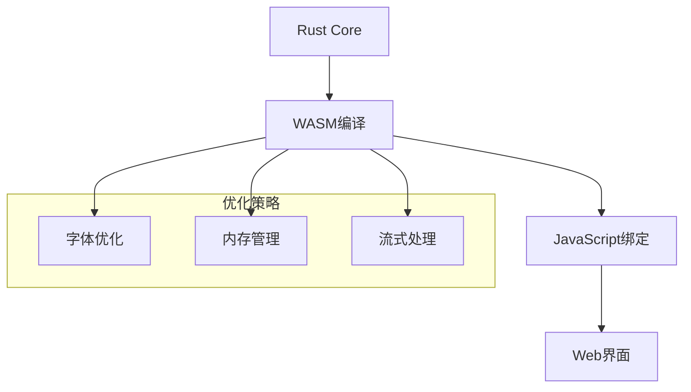

# 路线图

<cite>
**本文档中引用的文件**
- [README.md](file://README.md)
- [plan.md](file://plan.md)
- [Cargo.toml](file://Cargo.toml)
- [src/lib.rs](file://src/lib.rs)
- [src/main.rs](file://src/main.rs)
- [src/exif_reader/mod.rs](file://src/exif_reader/mod.rs)
- [src/layout/mod.rs](file://src/layout/mod.rs)
- [src/renderer/mod.rs](file://src/renderer/mod.rs)
- [src/io/mod.rs](file://src/io/mod.rs)
- [templates/classic.json](file://templates/classic.json)
- [templates/modern.json](file://templates/modern.json)
- [templates/minimal.json](file://templates/minimal.json)
</cite>

## 目录
1. [项目概述](#项目概述)
2. [已完成的MVP功能](#已完成的mvp功能)
3. [当前技术架构](#当前技术架构)
4. [未来发展规划](#未来发展规划)
5. [各阶段详细目标](#各阶段详细目标)
6. [技术路线图](#技术路线图)
7. [社区参与指南](#社区参与指南)
8. [总结](#总结)

## 项目概述

LiteMark是一个轻量级的照片参数水印工具，专为摄影爱好者和社交媒体用户设计。项目的核心愿景是为用户提供"美观、隐私友好、易用"的照片参数水印解决方案，支持ISO、光圈、快门速度、焦距、时间、作者等参数的本地化水印添加。

### 核心价值主张
- **隐私优先**：所有处理都在本地进行，不上传到云端
- **美观易用**：提供专业的模板系统和字体渲染
- **跨平台支持**：从CLI工具到移动应用的完整生态
- **开源免费**：MIT许可证，高质量模板，避免订阅陷阱

**章节来源**
- [README.md](file://README.md#L1-L163)
- [plan.md](file://plan.md#L1-L50)

## 已完成的MVP功能

基于当前代码库的状态，LiteMark已经实现了以下核心MVP功能：

### 1. CLI工具系统
- **命令行接口**：使用clap框架实现完整的CLI功能
- **子命令支持**：add、batch、templates、show-template等
- **参数配置**：支持作者名称、字体、模板等自定义参数

### 2. EXIF数据提取
- **数据结构**：完整的ExifData结构体包含ISO、光圈、快门速度、焦距等信息
- **变量替换**：支持模板中的变量占位符替换
- **占位实现**：当前使用模拟数据，为真实EXIF解析做好准备

### 3. 模板系统
- **JSON配置**：基于JSON的模板描述语言
- **布局锚点**：支持多个锚点位置（顶部、底部、角落等）
- **多类型元素**：支持文本和logo两种元素类型
- **样式控制**：字体大小、字重、颜色、背景等样式属性

### 4. 批量处理
- **目录遍历**：使用walkdir库实现批量文件处理
- **格式支持**：支持JPEG、PNG、GIF、BMP、WebP等多种格式
- **输出管理**：自动创建输出路径和文件名

### 5. 图像渲染
- **专业字体**：使用rusttype实现高质量字体渲染
- **多语言支持**：支持中文、英文等多语言字符
- **Logo支持**：自动加载和缩放logo图片
- **帧模式**：底部相框显示参数和logo

**章节来源**
- [src/main.rs](file://src/main.rs#L1-L320)
- [src/exif_reader/mod.rs](file://src/exif_reader/mod.rs#L1-L120)
- [src/layout/mod.rs](file://src/layout/mod.rs#L1-L206)
- [src/io/mod.rs](file://src/io/mod.rs#L1-L86)

## 当前技术架构



**图表来源**
- [src/lib.rs](file://src/lib.rs#L1-L9)
- [Cargo.toml](file://Cargo.toml#L1-L41)

### 核心模块架构



**图表来源**
- [src/renderer/mod.rs](file://src/renderer/mod.rs#L1-L631)
- [src/layout/mod.rs](file://src/layout/mod.rs#L1-L206)
- [src/exif_reader/mod.rs](file://src/exif_reader/mod.rs#L1-L120)
- [src/io/mod.rs](file://src/io/mod.rs#L1-L86)

**章节来源**
- [src/lib.rs](file://src/lib.rs#L1-L9)
- [Cargo.toml](file://Cargo.toml#L1-L41)

## 未来发展规划

LiteMark的路线图分为三个主要阶段，每个阶段都有明确的目标和预期交付物：

### 阶段划分

| 阶段 | 时间范围 | 主要目标 | 关键里程碑 |
|------|----------|----------|------------|
| MVP | 已完成 | 核心CLI工具上线 | v0.1.0发布 |
| v1版本 | 1-2个月 | iOS原生应用原型 | v1.0.0发布 |
| v2版本 | 3-6个月 | 跨平台扩展 | v2.0.0发布 |

### 整体发展蓝图



**章节来源**
- [plan.md](file://plan.md#L160-L280)

## 各阶段详细目标

### v1版本（iOS原型，1-2个月）

#### 核心目标
- 实现iOS原生应用原型
- 支持单张预览与批量队列处理
- 完善模板管理系统
- 实现一次性买断解锁机制

#### 具体功能

| 功能模块 | 当前状态 | v1目标 | 技术挑战 |
|----------|----------|--------|----------|
| iOS集成 | Rust静态库 | Swift桥接 + 原生UI | C ABI封装 |
| 图片选择 | CLI工具 | PhotoKit集成 | 权限处理 |
| 实时预览 | 无 | 小图缩放渲染 | 性能优化 |
| 模板管理 | 内置模板 | 自定义模板保存 | 数据持久化 |
| 内购系统 | 无 | 一次性解锁 | App Store审核 |

#### iOS集成方案



**图表来源**
- [plan.md](file://plan.md#L120-L140)

### v2版本（跨平台扩展，3-6个月）

#### 核心目标
- 实现Web界面（WASM）
- 扩展桌面平台支持
- 智能布局功能
- 模板市场建设

#### 功能扩展

| 平台扩展 | 技术方案 | 预期收益 | 实施难度 |
|----------|----------|----------|----------|
| Web界面 | WASM + JavaScript | 无需安装，快速体验 | 中等 |
| macOS应用 | SwiftUI + Rust | 完整桌面体验 | 中等 |
| Windows应用 | Electron/native | 跨平台覆盖 | 中等 |
| 智能布局 | Vision框架 + 人脸检测 | 更好的用户体验 | 高 |

#### 模板市场规划



**图表来源**
- [plan.md](file://plan.md#L180-L200)

### v3+版本（成熟生态，6个月以上）

#### 长期目标
- 企业级API服务
- AI智能优化
- 社区生态系统
- 商业化变现

**章节来源**
- [plan.md](file://plan.md#L160-L280)

## 技术路线图

### 核心技术栈演进



### 技术实现路径

#### 1. iOS集成技术路径



#### 2. WASM实现技术路径



#### 3. 跨平台部署策略

| 平台 | 技术方案 | 分发方式 | 特殊考虑 |
|------|----------|----------|----------|
| iOS | Rust + Swift | App Store | 内购审核、隐私政策 |
| Web | WASM + HTML5 | GitHub Pages | CORS、字体加载 |
| macOS | Rust + SwiftUI | Homebrew + App | 代码签名、沙盒 |
| Windows | Rust + Electron | Scoop/Chocolatey | 安装程序、注册表 |

**章节来源**
- [plan.md](file://plan.md#L80-L120)

## 社区参与指南

### 贡献方向

#### 1. 跨平台集成
- **iOS开发**：Swift桥接实现、原生UI开发
- **Web开发**：WASM绑定、前端界面
- **桌面开发**：GUI框架选择、平台适配

#### 2. 新模板开发
- **模板设计**：提供视觉设计方案
- **JSON实现**：实现模板配置
- **测试验证**：确保跨平台兼容性

#### 3. 功能增强
- **EXIF解析**：完善真实数据提取
- **格式支持**：HEIC/RAW格式处理
- **性能优化**：大图处理、内存管理

### 参与方式

#### 快速上手任务
1. **模板贡献**：创建新的视觉模板
2. **测试反馈**：在不同平台上测试功能
3. **文档改进**：完善使用文档和API说明
4. **Bug报告**：发现并报告问题

#### 高级贡献
1. **架构设计**：参与技术决策和架构讨论
2. **核心开发**：参与Rust核心代码开发
3. **平台移植**：负责特定平台的适配工作

### 开发环境设置

#### 基础要求
- Rust 1.60+
- Cargo包管理器
- Git版本控制

#### 开发工作流
```bash
# 克隆项目
git clone https://github.com/26huitailang/lite-mark-core.git
cd lite-mark-core

# 构建开发版本
cargo build

# 运行测试
cargo test

# 运行示例
cargo run -- add -i test_images/input.jpg -t classic -o output.jpg
```

**章节来源**
- [README.md](file://README.md#L140-L163)
- [plan.md](file://plan.md#L260-L280)

## 总结

LiteMark项目展现了从MVP到成熟产品的清晰发展路径。当前已完成的核心功能包括CLI工具、EXIF数据提取、模板系统和批量处理，为后续的跨平台扩展奠定了坚实基础。

### 项目优势

1. **技术先进**：采用Rust语言确保高性能和内存安全
2. **架构清晰**：模块化设计便于扩展和维护
3. **生态完整**：从CLI到移动应用的完整产品线
4. **社区友好**：开源MIT许可证，欢迎社区贡献

### 发展前景

随着iOS应用原型的推进和Web界面的实现，LiteMark将逐步建立起完整的跨平台生态系统。模板市场的建设和商业化策略的完善，将为项目的可持续发展提供保障。

### 社区价值

LiteMark不仅是一个技术项目，更是连接摄影爱好者和开发者的重要桥梁。通过开源协作和社区参与，项目将不断演进，为更多用户提供优质的水印解决方案。

**章节来源**
- [README.md](file://README.md#L1-L163)
- [plan.md](file://plan.md#L1-L280)