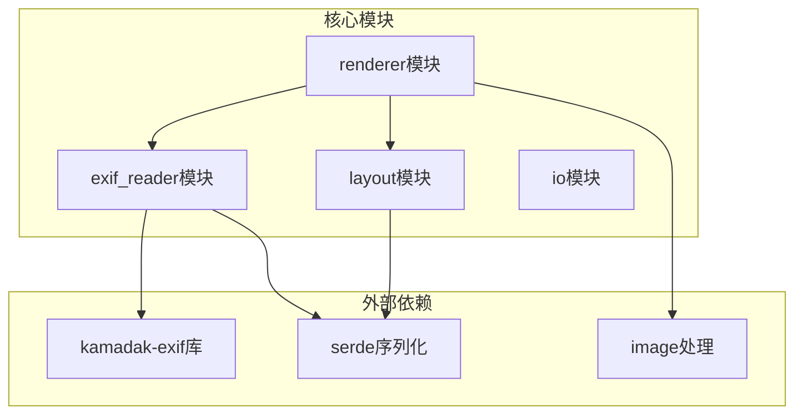
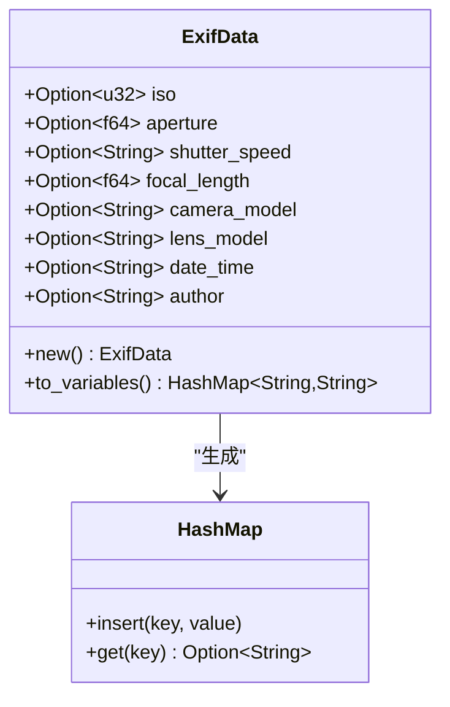
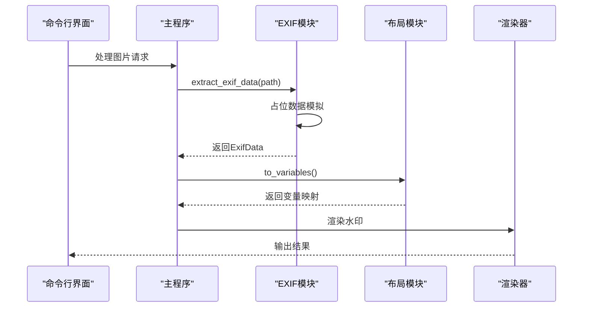
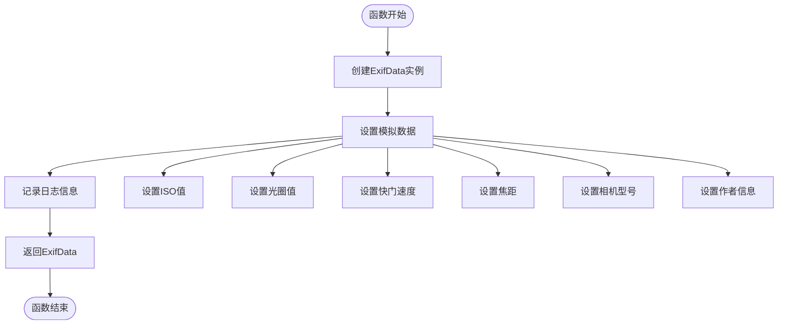
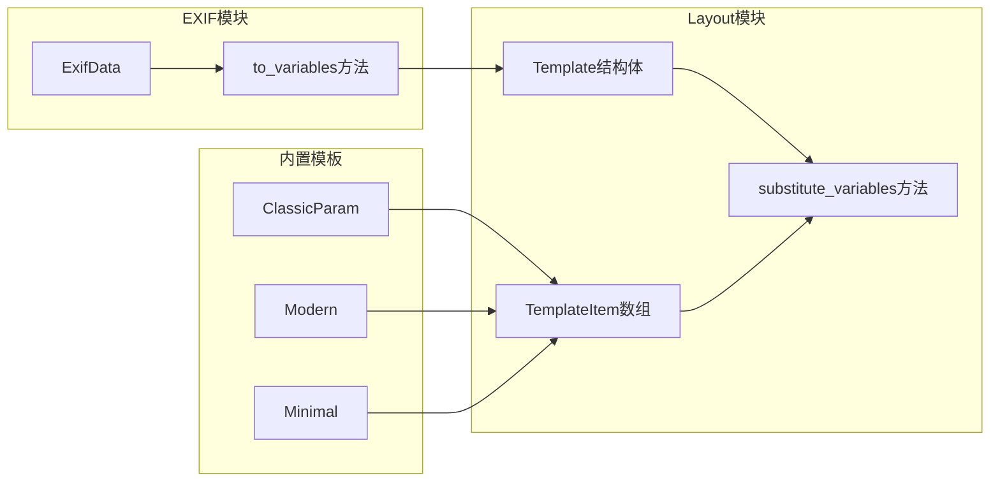
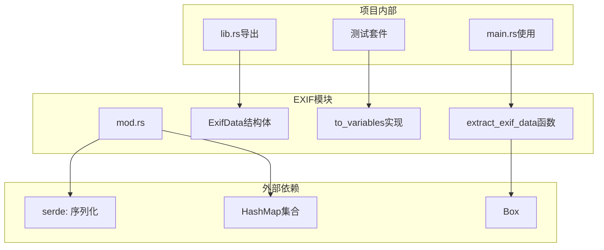

# EXIF数据提取模块

<cite>
**本文档引用的文件**
- [src/exif_reader/mod.rs](file://src/exif_reader/mod.rs)
- [src/layout/mod.rs](file://src/layout/mod.rs)
- [src/lib.rs](file://src/lib.rs)
- [src/main.rs](file://src/main.rs)
- [Cargo.toml](file://Cargo.toml)
- [examples/basic_usage.md](file://examples/basic_usage.md)
</cite>

## 目录
1. [简介](#简介)
2. [项目结构](#项目结构)
3. [核心组件](#核心组件)
4. [架构概览](#架构概览)
5. [详细组件分析](#详细组件分析)
6. [依赖关系分析](#依赖关系分析)
7. [性能考虑](#性能考虑)
8. [故障排除指南](#故障排除指南)
9. [结论](#结论)

## 简介

LiteMark EXIF数据提取模块是一个专门设计用于从照片中提取元数据信息的核心组件。该模块通过ExifData结构体封装了常见的摄影参数，如ISO感光度、光圈值、快门速度、焦距等，并提供了灵活的模板变量映射功能，使这些元数据能够无缝集成到水印渲染过程中。

当前实现采用占位模式，模拟EXIF数据提取过程，为未来的kamadak-exif库集成做好准备。这种设计既保证了系统的可扩展性，又确保了现有接口的稳定性。

## 项目结构

EXIF模块位于src/exif_reader目录下，是LiteMark项目的核心子模块之一。该项目采用清晰的模块化架构，将功能按职责分离：

**图表来源**
- [src/exif_reader/mod.rs](file://src/exif_reader/mod.rs#L1-L120)
- [src/layout/mod.rs](file://src/layout/mod.rs#L1-L206)
- [Cargo.toml](file://Cargo.toml#L1-L41)

**章节来源**
- [src/lib.rs](file://src/lib.rs#L1-L9)
- [Cargo.toml](file://Cargo.toml#L1-L41)

## 核心组件

### ExifData结构体设计

ExifData结构体是整个EXIF模块的核心数据容器，采用了可选字段设计来处理不同照片可能包含的元数据差异：

**图表来源**
- [src/exif_reader/mod.rs](file://src/exif_reader/mod.rs#L4-L18)
- [src/exif_reader/mod.rs](file://src/exif_reader/mod.rs#L30-L60)

### 数据类型选择原理

每个字段的数据类型都经过精心设计：

| 字段名 | 数据类型 | 设计原因 |
|--------|----------|----------|
| iso | Option<u32> | ISO值为整数，范围有限且常用 |
| aperture | Option<f64> | 光圈值为浮点数，精度要求高 |
| shutter_speed | Option<String> | 快门速度格式多样，字符串更灵活 |
| focal_length | Option<f64> | 焦距为浮点数，常见小数点值 |
| camera_model | Option<String> | 相机型号文本，需要完整字符串 |
| lens_model | Option<String> | 镜头型号文本，需要完整字符串 |
| date_time | Option<String> | 时间格式复杂，字符串便于处理 |
| author | Option<String> | 作者信息文本，需要完整字符串 |

**章节来源**
- [src/exif_reader/mod.rs](file://src/exif_reader/mod.rs#L4-L18)

## 架构概览

EXIF模块在整个LiteMark系统中的作用是数据提取层，负责从原始图像中提取元数据并转换为模板可用的格式：

**图表来源**
- [src/main.rs](file://src/main.rs#L120-L140)
- [src/main.rs](file://src/main.rs#L220-L240)
- [src/exif_reader/mod.rs](file://src/exif_reader/mod.rs#L62-L80)

## 详细组件分析

### extract_exif_data函数实现

当前的extract_exif_data函数采用占位实现策略，虽然不执行真实的EXIF解析，但保持了完整的错误处理和返回类型：

**图表来源**
- [src/exif_reader/mod.rs](file://src/exif_reader/mod.rs#L62-L80)

### to_variables方法详解

to_variables方法是EXIF数据转换为模板变量的关键桥梁，实现了智能的数据格式化：

```mermaid
flowchart TD
Start([开始转换]) --> InitMap["初始化HashMap"]
InitMap --> CheckISO{"检查ISO字段"}
CheckISO --> |存在| FormatISO["格式化ISO: 数字转字符串"]
CheckISO --> |不存在| CheckAperture{"检查光圈字段"}
FormatISO --> InsertISO["插入'ISO'键"]
InsertISO --> CheckAperture
CheckAperture --> |存在| FormatAperture["格式化光圈: f/{:.1}"]
CheckAperture --> |不存在| CheckShutter{"检查快门字段"}
FormatAperture --> InsertAperture["插入'Aperture'键"]
InsertAperture --> CheckShutter
CheckShutter --> |存在| CopyShutter["复制快门字符串"]
CheckShutter --> |不存在| CheckFocal{"检查焦距字段"}
CopyShutter --> InsertShutter["插入'Shutter'键"]
InsertShutter --> CheckFocal
CheckFocal --> |存在| FormatFocal["格式化焦距: {:.0}mm"]
CheckFocal --> |不存在| CheckCamera{"检查相机字段"}
FormatFocal --> InsertFocal["插入'Focal'键"]
InsertFocal --> CheckCamera
CheckCamera --> |存在| CopyCamera["复制相机型号"]
CheckCamera --> |不存在| CheckLens{"检查镜头字段"}
CopyCamera --> InsertCamera["插入'Camera'键"]
InsertCamera --> CheckLens
CheckLens --> |存在| CopyLens["复制镜头型号"]
CheckLens --> |不存在| CheckDateTime{"检查时间字段"}
CopyLens --> InsertLens["插入'Lens'键"]
InsertLens --> CheckDateTime
CheckDateTime --> |存在| CopyDateTime["复制时间字符串"]
CheckDateTime --> |不存在| CheckAuthor{"检查作者字段"}
CopyDateTime --> InsertDateTime["插入'DateTime'键"]
InsertDateTime --> CheckAuthor
CheckAuthor --> |存在| CopyAuthor["复制作者信息"]
CheckAuthor --> |不存在| ReturnMap["返回最终映射"]
CopyAuthor --> InsertAuthor["插入'Author'键"]
InsertAuthor --> ReturnMap
ReturnMap --> End([完成])
```

**图表来源**
- [src/exif_reader/mod.rs](file://src/exif_reader/mod.rs#L30-L60)

**章节来源**
- [src/exif_reader/mod.rs](file://src/exif_reader/mod.rs#L30-L60)
- [src/exif_reader/mod.rs](file://src/exif_reader/mod.rs#L62-L80)

### 与layout模块的集成

EXIF模块与layout模块通过模板变量映射紧密集成，支持多种内置模板：

**图表来源**
- [src/layout/mod.rs](file://src/layout/mod.rs#L100-L130)
- [src/layout/mod.rs](file://src/layout/mod.rs#L150-L180)

**章节来源**
- [src/layout/mod.rs](file://src/layout/mod.rs#L100-L130)
- [src/layout/mod.rs](file://src/layout/mod.rs#L150-L180)

## 依赖关系分析

EXIF模块的依赖关系体现了项目的模块化设计理念：

**图表来源**
- [src/exif_reader/mod.rs](file://src/exif_reader/mod.rs#L1-L3)
- [src/lib.rs](file://src/lib.rs#L1-L9)
- [src/main.rs](file://src/main.rs#L120-L140)

**章节来源**
- [src/exif_reader/mod.rs](file://src/exif_reader/mod.rs#L1-L3)
- [src/lib.rs](file://src/lib.rs#L1-L9)
- [Cargo.toml](file://Cargo.toml#L15-L25)

## 性能考虑

### 当前实现的性能特点

1. **内存效率**：使用Option类型避免不必要的内存分配
2. **字符串处理**：采用clone操作而非引用传递，简化生命周期管理
3. **格式化开销**：to_variables方法的格式化操作在合理范围内

### 未来优化方向

当迁移到kamadak-exif库时，可以考虑以下优化：

1. **延迟加载**：只解析需要的EXIF字段
2. **缓存机制**：缓存已解析的图像元数据
3. **并发处理**：利用多核CPU处理批量图像

## 故障排除指南

### 常见问题及解决方案

#### 1. EXIF数据为空
**症状**：生成的水印缺少摄影参数信息
**原因**：当前占位实现不提供真实数据
**解决方案**：等待kamadak-exif库集成完成

#### 2. 模板变量替换失败
**症状**：模板中的变量占位符未被替换
**原因**：to_variables方法返回空映射
**解决方案**：检查EXIF数据提取逻辑

#### 3. 类型转换错误
**症状**：编译时或运行时报错
**原因**：数据类型不匹配
**解决方案**：验证字段类型定义

**章节来源**
- [src/exif_reader/mod.rs](file://src/exif_reader/mod.rs#L82-L120)

## 结论

LiteMark的EXIF数据提取模块展现了良好的软件设计原则：

1. **模块化设计**：清晰的职责分离和接口定义
2. **可扩展性**：占位实现为未来功能扩展预留空间
3. **类型安全**：使用Rust的Option类型处理可选数据
4. **测试友好**：完整的单元测试覆盖关键功能

当前的占位实现虽然简单，但为未来的kamadak-exif库集成奠定了坚实基础。随着真实EXIF解析功能的实现，该模块将继续发挥其在照片水印系统中的核心作用，为用户提供丰富的摄影元数据展示能力。