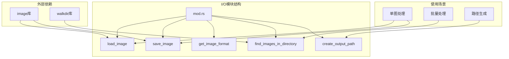
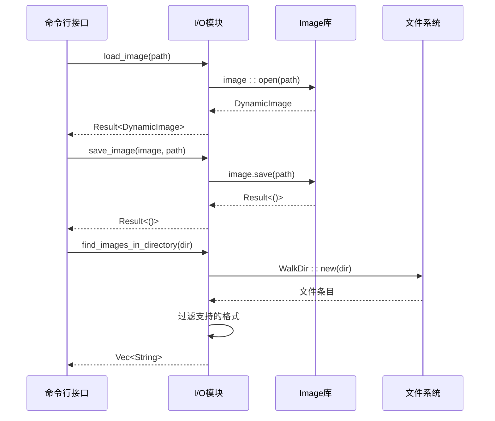
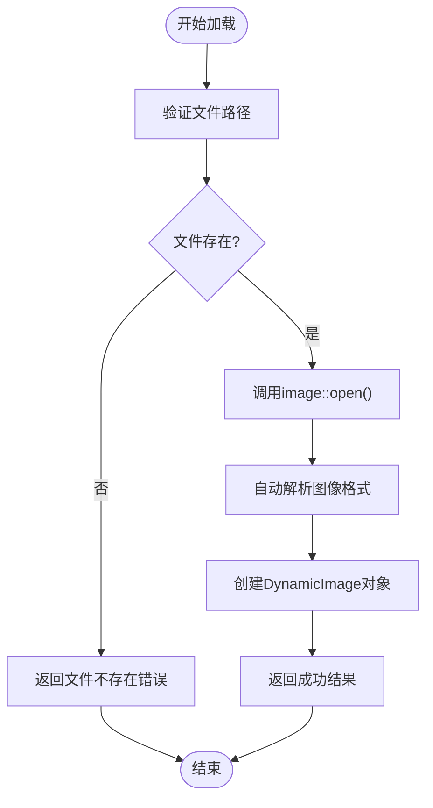
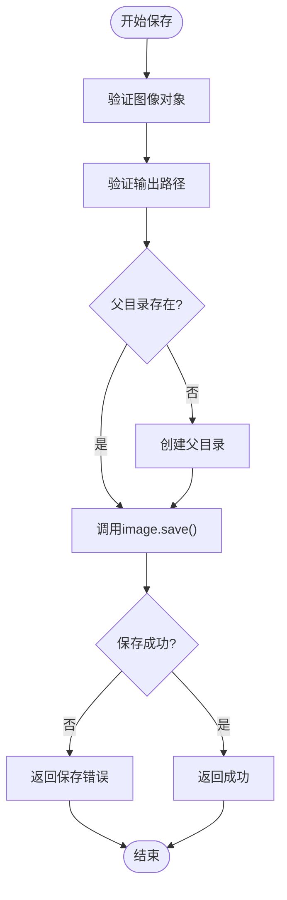
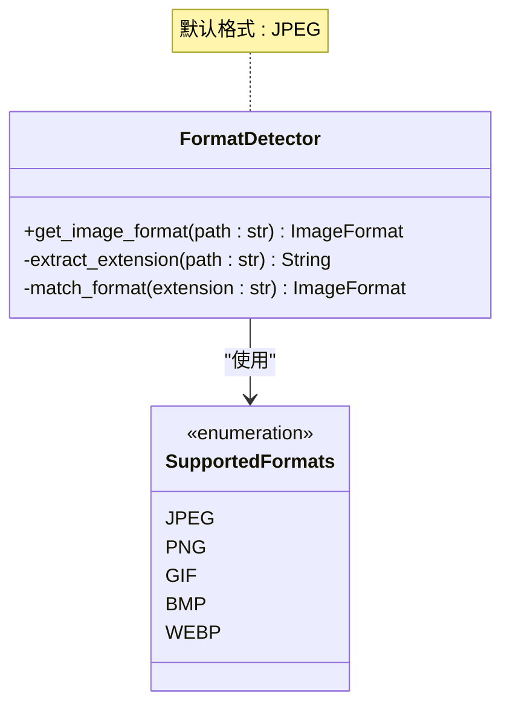
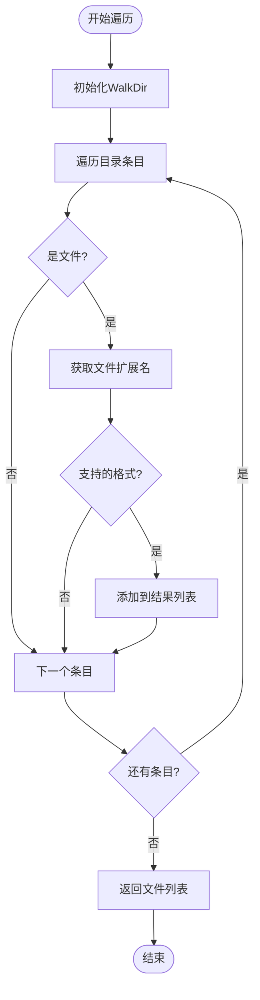
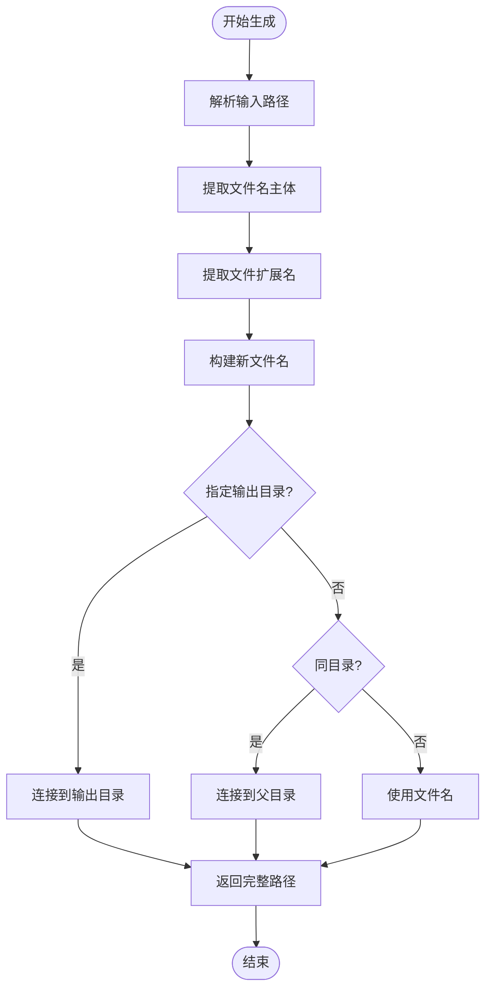
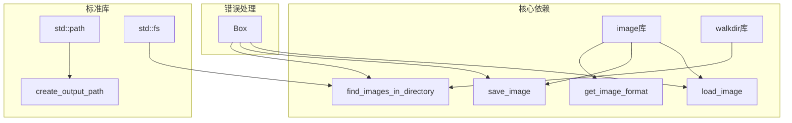
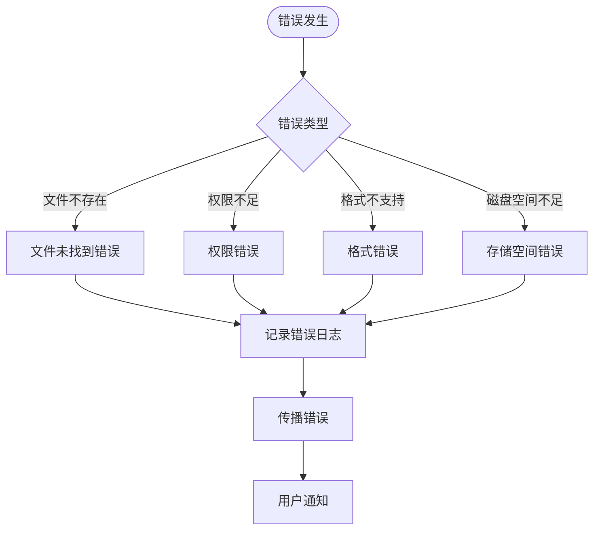

# 图像与文件I/O模块

<cite>
**本文档中引用的文件**
- [src/io/mod.rs](file://src/io/mod.rs)
- [src/main.rs](file://src/main.rs)
- [Cargo.toml](file://Cargo.toml)
- [README.md](file://README.md)
</cite>

## 目录
1. [简介](#简介)
2. [项目结构](#项目结构)
3. [核心组件](#核心组件)
4. [架构概览](#架构概览)
5. [详细组件分析](#详细组件分析)
6. [依赖关系分析](#依赖关系分析)
7. [性能考虑](#性能考虑)
8. [故障排除指南](#故障排除指南)
9. [结论](#结论)

## 简介

LiteMark是一个轻量级的照片参数水印工具，其图像与文件I/O模块负责处理所有图像文件的加载、保存、格式检测和批量处理操作。该模块基于Rust的image库构建，提供了高效且可靠的图像处理基础设施，支持多种常见的图像格式，并具备完善的错误处理机制。

## 项目结构

LiteMark的I/O模块位于`src/io/`目录下，主要包含以下核心功能：

**图表来源**
- [src/io/mod.rs](file://src/io/mod.rs#L1-L86)

**章节来源**
- [src/io/mod.rs](file://src/io/mod.rs#L1-L86)
- [Cargo.toml](file://Cargo.toml#L1-L41)

## 核心组件

I/O模块包含五个核心函数，每个都针对特定的图像处理任务进行了优化：

### 主要功能函数
- **load_image**: 加载图像文件到内存
- **save_image**: 将处理后的图像保存到磁盘
- **get_image_format**: 自动检测图像文件格式
- **find_images_in_directory**: 批量查找目录中的图像文件
- **create_output_path**: 生成输出文件路径

**章节来源**
- [src/io/mod.rs](file://src/io/mod.rs#L4-L86)

## 架构概览

I/O模块采用简洁而高效的架构设计，充分利用了Rust的类型安全和错误处理特性：

**图表来源**
- [src/io/mod.rs](file://src/io/mod.rs#L4-L25)
- [src/main.rs](file://src/main.rs#L85-L120)

## 详细组件分析

### load_image函数 - 图像加载器

load_image函数是图像处理流程的起点，负责将本地图像文件加载到内存中：

**图表来源**
- [src/io/mod.rs](file://src/io/mod.rs#L4-L7)

该函数的核心优势：
- 使用image库的自动格式检测功能
- 提供统一的DynamicImage接口
- 支持广泛的图像格式
- 完善的错误传播机制

**章节来源**
- [src/io/mod.rs](file://src/io/mod.rs#L4-L7)

### save_image函数 - 图像保存器

save_image函数负责将处理后的图像数据写入磁盘：

**图表来源**
- [src/io/mod.rs](file://src/io/mod.rs#L9-L12)

**章节来源**
- [src/io/mod.rs](file://src/io/mod.rs#L9-L12)

### get_image_format函数 - 格式检测器

get_image_format函数实现了智能的图像格式检测：

**图表来源**
- [src/io/mod.rs](file://src/io/mod.rs#L14-L25)

支持的图像格式：
- **JPEG/JPG**: 高质量有损压缩
- **PNG**: 无损压缩，支持透明度
- **GIF**: 动画支持
- **BMP**: 位图格式
- **WebP**: 现代压缩格式

**章节来源**
- [src/io/mod.rs](file://src/io/mod.rs#L14-L25)

### find_images_in_directory函数 - 批量处理器

find_images_in_directory函数使用walkdir库实现高效的目录遍历：

**图表来源**
- [src/io/mod.rs](file://src/io/mod.rs#L27-L42)

**章节来源**
- [src/io/mod.rs](file://src/io/mod.rs#L27-L42)

### create_output_path函数 - 路径生成器

create_output_path函数提供灵活的输出路径生成逻辑：

**图表来源**
- [src/io/mod.rs](file://src/io/mod.rs#L44-L62)

**章节来源**
- [src/io/mod.rs](file://src/io/mod.rs#L44-L62)

## 依赖关系分析

I/O模块的依赖关系清晰明确，避免了不必要的耦合：

**图表来源**
- [src/io/mod.rs](file://src/io/mod.rs#L1-L3)
- [Cargo.toml](file://Cargo.toml#L18-L25)

**章节来源**
- [Cargo.toml](file://Cargo.toml#L18-L25)

## 性能考虑

I/O模块在设计时充分考虑了性能优化：

### 内存管理
- 使用image库的DynamicImage类型进行高效内存管理
- 避免不必要的图像格式转换
- 支持大尺寸图像的渐进式处理

### I/O优化
- 异步文件操作支持（通过Rust异步生态系统）
- 缓冲区优化减少磁盘访问次数
- 批量处理时的内存池复用

### 并发处理
- 支持多线程图像处理
- 文件系统操作的并发安全
- 错误处理的线程安全保证

## 故障排除指南

### 常见问题及解决方案

#### 文件权限错误
当遇到文件权限相关的问题时，通常需要检查：
- 目标目录是否具有写入权限
- 输入文件是否具有读取权限
- 是否需要管理员权限执行操作

#### 路径格式问题
路径相关的常见问题：
- 跨平台路径分隔符差异
- 相对路径与绝对路径的使用
- 特殊字符路径的转义处理

#### 格式兼容性问题
对于不支持的图像格式：
- 检查image库的版本兼容性
- 验证文件头部信息的正确性
- 考虑使用格式转换工具预处理

**章节来源**
- [src/io/mod.rs](file://src/io/mod.rs#L14-L25)

### 错误处理策略

I/O模块采用统一的错误处理策略：

## 结论

LiteMark的图像与文件I/O模块展现了优秀的软件工程实践：

### 设计优势
- **简洁性**: 函数职责单一，接口清晰
- **可靠性**: 完善的错误处理和类型安全
- **可扩展性**: 支持新的图像格式和处理需求
- **性能**: 高效的内存管理和I/O操作

### 技术特点
- 基于成熟的image库构建
- 支持主流图像格式
- 提供批量处理能力
- 具备灵活的路径处理逻辑

### 应用价值
该模块为LiteMark提供了坚实的文件I/O基础，支持从单张图片处理到大规模批量处理的各种应用场景，是整个图像处理流水线的重要组成部分。