# 技术架构与设计

<cite>
**本文档引用的文件**
- [src/main.rs](file://src/main.rs)
- [src/lib.rs](file://src/lib.rs)
- [src/exif_reader/mod.rs](file://src/exif_reader/mod.rs)
- [src/io/mod.rs](file://src/io/mod.rs)
- [src/layout/mod.rs](file://src/layout/mod.rs)
- [src/renderer/mod.rs](file://src/renderer/mod.rs)
- [Cargo.toml](file://Cargo.toml)
- [README.md](file://README.md)
- [docs/ARCHITECTURE.md](file://docs/ARCHITECTURE.md)
</cite>

## 目录
1. [项目概述](#项目概述)
2. [整体架构](#整体架构)
3. [分层架构设计](#分层架构设计)
4. [核心模块详解](#核心模块详解)
5. [数据流分析](#数据流分析)
6. [模块间依赖关系](#模块间依赖关系)
7. [技术栈与工具链](#技术栈与工具链)
8. [设计原则](#设计原则)
9. [性能考量](#性能考量)
10. [扩展性设计](#扩展性设计)

## 项目概述

LiteMark是一个轻量级的照片参数水印工具，专为摄影爱好者和社交媒体用户设计。该项目采用Rust语言开发，实现了从命令行界面到底层图像处理的完整解决方案，具有模块化设计、高内聚低耦合的特点。

### 核心特性
- **EXIF数据提取**：从图片中提取ISO、光圈、快门速度、焦距等摄影参数
- **模板系统**：基于JSON的灵活布局配置，支持变量替换
- **专业字体渲染**：使用rusttype库实现高质量字体渲染，支持多语言
- **Logo支持**：自动加载和缩放Logo图片
- **批量处理**：支持目录级别的批量图片处理
- **隐私保护**：所有处理过程本地完成，不上传云端

## 整体架构

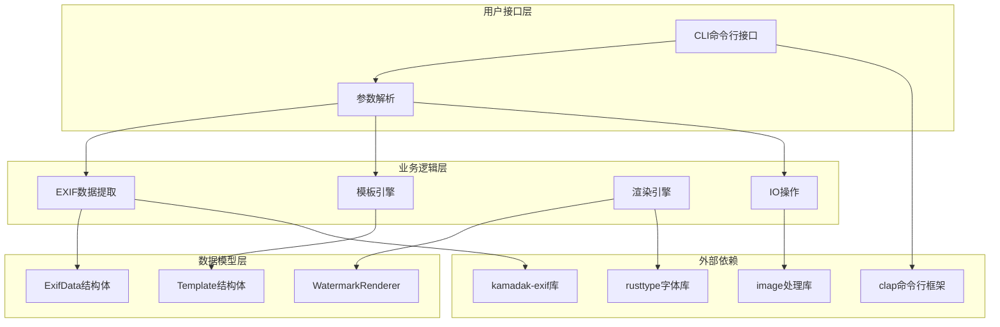

**图表来源**
- [src/main.rs](file://src/main.rs#L1-L320)
- [src/lib.rs](file://src/lib.rs#L1-L9)
- [src/exif_reader/mod.rs](file://src/exif_reader/mod.rs#L1-L120)
- [src/layout/mod.rs](file://src/layout/mod.rs#L1-L206)
- [src/renderer/mod.rs](file://src/renderer/mod.rs#L1-L631)
- [src/io/mod.rs](file://src/io/mod.rs#L1-L86)

## 分层架构设计

### 1. CLI层（命令行接口层）

CLI层位于架构的最顶层，负责用户交互和命令分发。

#### 主要职责
- **参数解析**：使用clap框架解析用户输入参数
- **命令分发**：根据用户命令类型分发到相应处理函数
- **错误处理**：统一的错误处理和用户友好的错误信息

#### 核心组件
- **Cli结构体**：定义命令行接口的整体结构
- **Commands枚举**：定义支持的子命令类型
- **处理函数**：单张图片处理和批量处理函数

#### 命令类型
- `Add`：为单张图片添加水印
- `Batch`：批量处理目录中的图片
- `Templates`：列出可用模板
- `ShowTemplate`：显示模板详情

**章节来源**
- [src/main.rs](file://src/main.rs#L1-L320)

### 2. 业务逻辑层

业务逻辑层包含核心的处理模块，负责具体的业务功能实现。

#### EXIF数据提取模块
负责从图片中提取摄影相关的元数据信息。

##### 数据结构
```rust
pub struct ExifData {
    pub iso: Option<u32>,
    pub aperture: Option<f64>,
    pub shutter_speed: Option<String>,
    pub focal_length: Option<f64>,
    pub camera_model: Option<String>,
    pub lens_model: Option<String>,
    pub date_time: Option<String>,
    pub author: Option<String>,
}
```

##### 功能特性
- **数据提取**：从图片中提取各种EXIF信息
- **数据转换**：将原始EXIF数据转换为标准化格式
- **变量映射**：生成可用于模板替换的键值对

**章节来源**
- [src/exif_reader/mod.rs](file://src/exif_reader/mod.rs#L1-L120)

#### 模板引擎模块
负责解析JSON模板文件并执行变量替换。

##### 核心结构
- **Template结构体**：定义模板的基本属性
- **Anchor枚举**：定义模板的定位方式
- **TemplateItem结构体**：定义模板中的元素类型

##### 变量替换机制
模板系统支持丰富的变量替换功能：
- `{Author}`：摄影师姓名
- `{ISO}`：ISO感光度
- `{Aperture}`：光圈值
- `{Shutter}`：快门速度
- `{Focal}`：焦距
- `{Camera}`：相机型号
- `{Lens}`：镜头型号
- `{DateTime}`：拍摄时间

**章节来源**
- [src/layout/mod.rs](file://src/layout/mod.rs#L1-L206)

#### 渲染引擎模块
负责图像的最终渲染和合成。

##### 核心功能
- **相框生成**：创建带有参数的底部相框
- **字体渲染**：使用rusttype进行高质量字体渲染
- **Logo渲染**：加载和缩放Logo图片
- **图像合成**：将所有元素合并到最终图像中

##### 字体渲染原理
使用rusttype库实现专业级字体渲染：
- **字体加载**：支持TTF字体文件
- **文本布局**：精确的字形定位和基线对齐
- **抗锯齿处理**：通过alpha值实现平滑边缘
- **多语言支持**：支持中文、英文等多种语言

**章节来源**
- [src/renderer/mod.rs](file://src/renderer/mod.rs#L1-L631)

### 3. 数据模型层

数据模型层定义了系统中使用的数据结构和类型。

#### 核心数据结构
- **ExifData**：EXIF数据的标准表示
- **Template**：模板的完整定义
- **WatermarkRenderer**：水印渲染器实例

#### 接口设计
- **统一接口**：各模块通过标准接口进行通信
- **类型安全**：使用Rust的类型系统保证数据一致性
- **错误处理**：统一的错误处理机制

**章节来源**
- [src/lib.rs](file://src/lib.rs#L1-L9)

## 核心模块详解

### EXIF数据提取模块

#### 实现特点
- **模块化设计**：独立的exif_reader模块
- **数据标准化**：将不同格式的EXIF数据统一为标准结构
- **扩展性**：预留接口支持未来集成真实的EXIF解析库

#### 数据转换流程
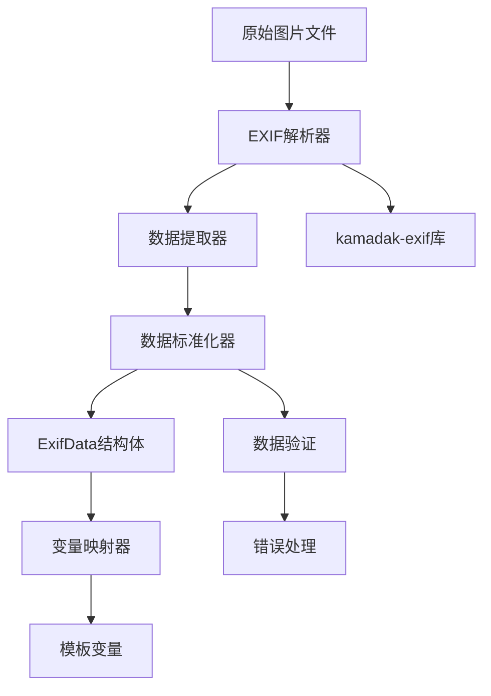

**图表来源**
- [src/exif_reader/mod.rs](file://src/exif_reader/mod.rs#L60-L120)

**章节来源**
- [src/exif_reader/mod.rs](file://src/exif_reader/mod.rs#L1-L120)

### 模板引擎模块

#### 模板系统架构
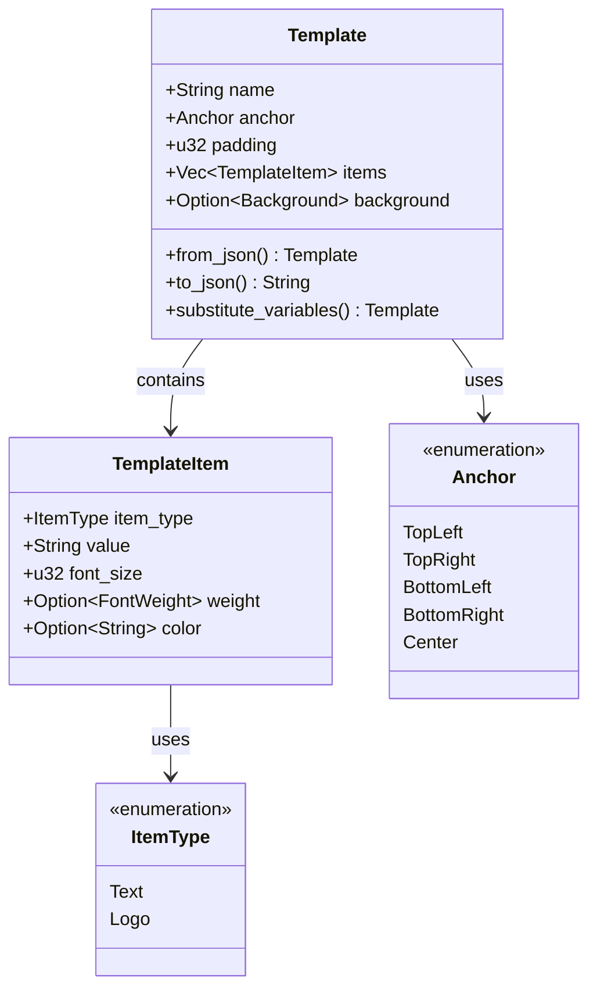

**图表来源**
- [src/layout/mod.rs](file://src/layout/mod.rs#L1-L206)

#### 变量替换机制
模板系统实现了强大的变量替换功能：

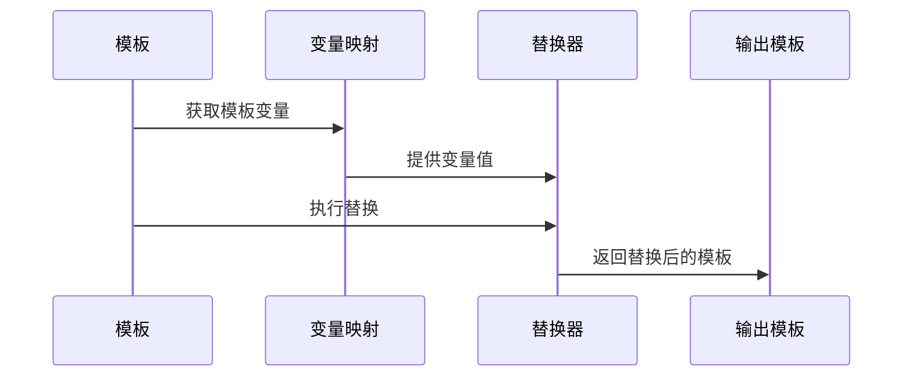

**图表来源**
- [src/layout/mod.rs](file://src/layout/mod.rs#L80-L100)

**章节来源**
- [src/layout/mod.rs](file://src/layout/mod.rs#L1-L206)

### 渲染引擎模块

#### 渲染流水线
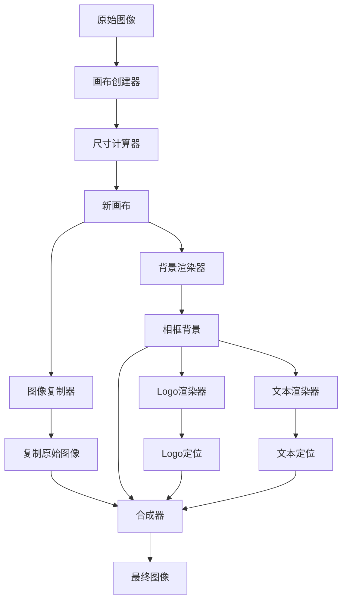

**图表来源**
- [src/renderer/mod.rs](file://src/renderer/mod.rs#L80-L150)

#### 字体渲染实现
渲染引擎使用rusttype库实现高质量字体渲染：

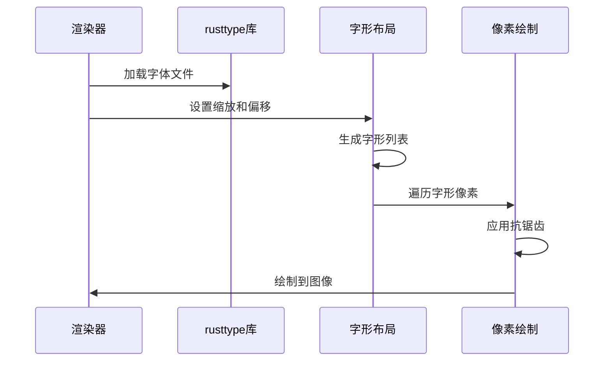

**图表来源**
- [src/renderer/mod.rs](file://src/renderer/mod.rs#L400-L500)

**章节来源**
- [src/renderer/mod.rs](file://src/renderer/mod.rs#L1-L631)

### IO操作模块

#### 文件处理功能
IO模块提供了完整的文件操作功能：

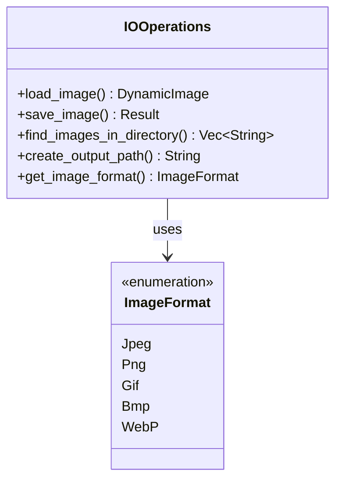

**图表来源**
- [src/io/mod.rs](file://src/io/mod.rs#L1-L86)

**章节来源**
- [src/io/mod.rs](file://src/io/mod.rs#L1-L86)

## 数据流分析

### 完整处理流程

从用户输入到输出图像的完整数据流如下：

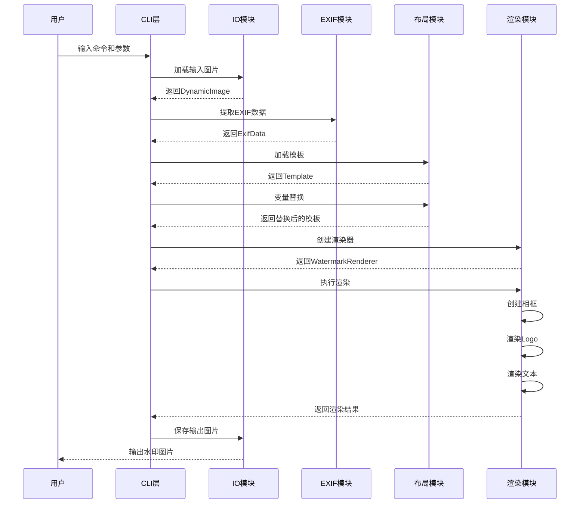

**图表来源**
- [src/main.rs](file://src/main.rs#L60-L120)
- [src/main.rs](file://src/main.rs#L150-L200)

### 关键数据转换

#### EXIF数据转换流程
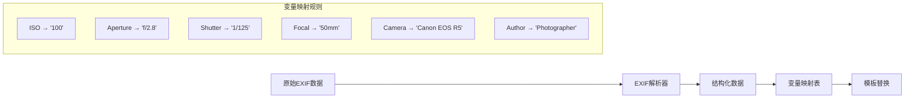

**图表来源**
- [src/exif_reader/mod.rs](file://src/exif_reader/mod.rs#L40-L80)

#### 模板处理流程
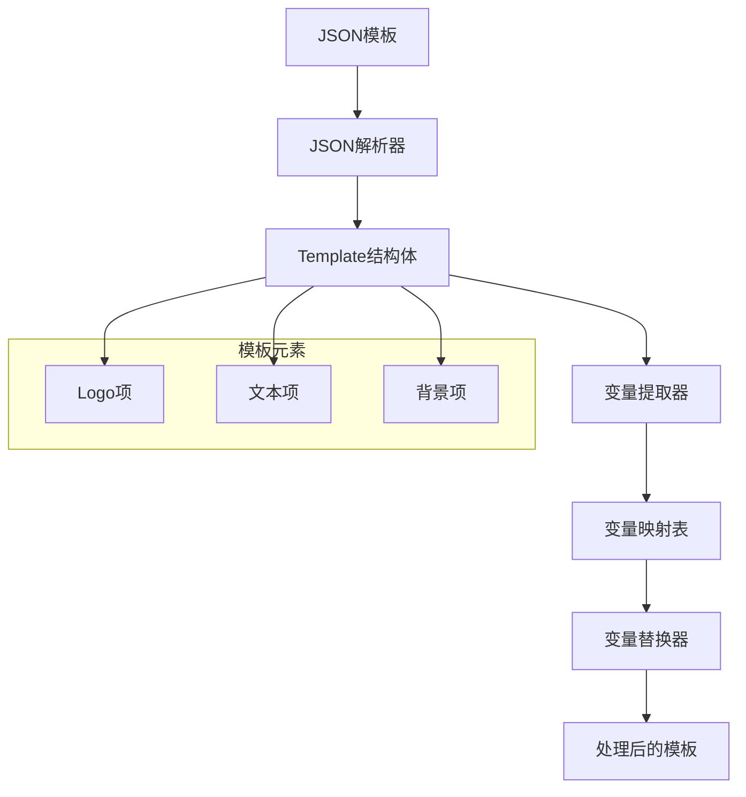

**图表来源**
- [src/layout/mod.rs](file://src/layout/mod.rs#L80-L120)

**章节来源**
- [src/main.rs](file://src/main.rs#L60-L200)

## 模块间依赖关系

### 依赖关系图

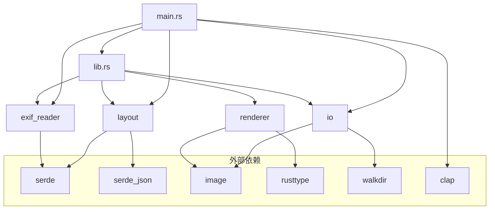

**图表来源**
- [src/lib.rs](file://src/lib.rs#L1-L9)
- [Cargo.toml](file://Cargo.toml#L1-L41)

### 接口设计原则

#### 高内聚设计
每个模块都专注于单一职责：
- **EXIF模块**：专门处理EXIF数据提取和转换
- **Layout模块**：专门处理模板解析和变量替换
- **Renderer模块**：专门处理图像渲染和合成
- **IO模块**：专门处理文件操作

#### 低耦合设计
模块间通过清晰的接口进行通信：
- **统一的数据结构**：ExifData、Template、WatermarkRenderer
- **标准的错误处理**：Box<dyn std::error::Error>
- **明确的依赖关系**：通过Cargo.toml管理依赖

**章节来源**
- [src/lib.rs](file://src/lib.rs#L1-L9)
- [Cargo.toml](file://Cargo.toml#L1-L41)

## 技术栈与工具链

### 核心技术栈

| 组件 | 版本 | 用途 |
|------|------|------|
| Rust | 2021 edition | 主要编程语言 |
| clap | 4.4 | 命令行参数解析 |
| image | 0.24 | 图像处理和格式支持 |
| rusttype | 0.9 | 高质量字体渲染 |
| serde | 1.0 | 数据序列化和反序列化 |
| serde_json | 1.0 | JSON处理 |
| kamadak-exif | 0.5 | EXIF数据解析（计划集成） |
| walkdir | 2.4 | 目录遍历 |

### 开发工具链

#### 构建系统
- **Cargo**：包管理和构建系统
- **Cargo.toml**：项目配置和依赖管理
- **GitHub Actions**：持续集成和部署

#### 测试框架
- **内置测试**：Rust的单元测试框架
- **集成测试**：端到端功能测试
- **性能测试**：基准测试和性能分析

#### 包管理
- **GitHub Releases**：二进制分发
- **Homebrew Tap**：macOS包管理
- **Scoop/Chocolatey**：Windows包管理

**章节来源**
- [Cargo.toml](file://Cargo.toml#L1-L41)

## 设计原则

### 1. 单一职责原则
每个模块都有明确的职责边界：
- **CLI层**：负责用户交互和命令分发
- **业务逻辑层**：负责核心业务处理
- **数据模型层**：负责数据结构定义

### 2. 开闭原则
系统对扩展开放，对修改封闭：
- **模板系统**：支持自定义模板，无需修改核心代码
- **字体系统**：支持自定义字体，无需修改渲染逻辑
- **格式支持**：支持新的图片格式，只需扩展IO模块

### 3. 依赖倒置原则
高层模块不依赖低层模块的具体实现：
- **抽象接口**：通过trait定义通用接口
- **依赖注入**：通过构造函数注入具体实现
- **配置驱动**：通过配置文件控制行为

### 4. 接口隔离原则
客户端不应依赖它不需要的接口：
- **模块化设计**：每个模块提供独立的功能接口
- **功能分离**：将相关功能组织在同一模块中
- **清晰边界**：模块间通过明确定义的接口通信

## 性能考量

### 渲染性能优化

#### 字体渲染优化
- **字形缓存**：避免重复布局相同的文本
- **抗锯齿阈值**：过滤过淡像素，提高渲染效率
- **内存管理**：及时释放不需要的图像数据

#### 图像处理优化
- **就地处理**：尽可能在原图像上进行修改
- **内存复用**：重用图像缓冲区
- **批处理**：支持批量处理提高吞吐量

### 内存使用优化

#### 数据结构优化
- **Option类型**：使用Option避免不必要的内存分配
- **字符串优化**：使用String而不是&str减少生命周期管理
- **集合优化**：合理使用Vec容量预分配

#### 生命周期管理
- **RAII原则**：利用Rust的所有权系统自动管理资源
- **借用检查**：通过借用避免不必要的数据拷贝
- **智能指针**：在需要时使用Arc/Mutex进行共享

### 并发处理

#### 批量处理并发
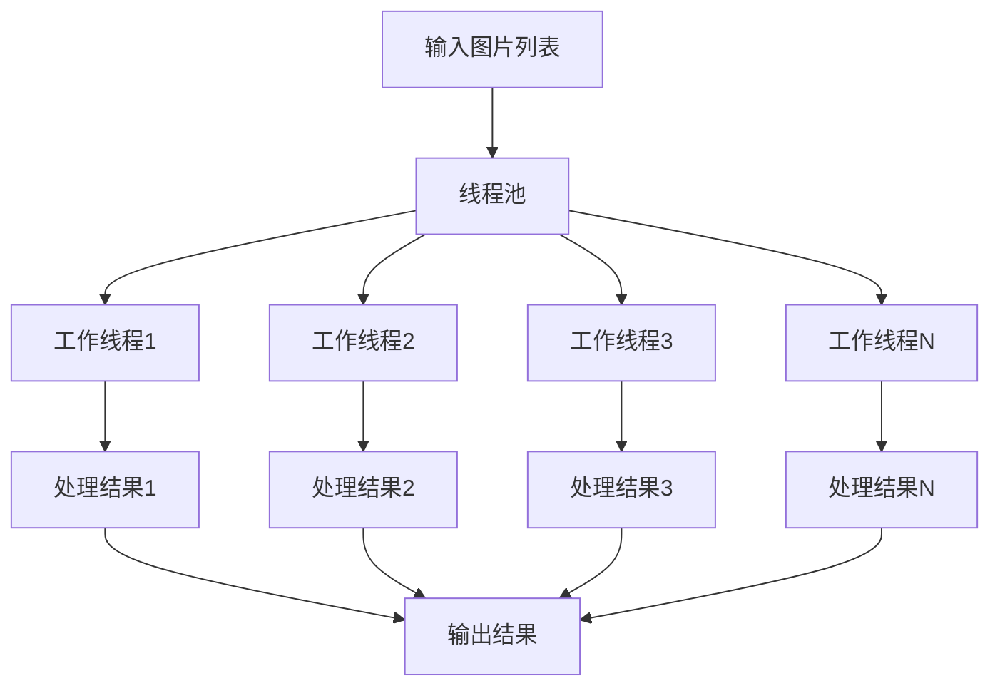

**图表来源**
- [src/main.rs](file://src/main.rs#L180-L220)

## 扩展性设计

### 模板系统扩展

#### 新模板类型
- **新增锚点**：支持更多的定位方式
- **新增元素类型**：支持更多类型的模板元素
- **新增样式**：支持更多的视觉效果

#### 变量系统扩展
- **自定义变量**：支持用户定义的变量
- **条件渲染**：支持基于条件的元素渲染
- **循环渲染**：支持数组类型的变量循环渲染

### 渲染引擎扩展

#### 新渲染器
- **GPU加速**：支持GPU加速的渲染
- **矢量渲染**：支持矢量图形渲染
- **滤镜效果**：支持图像滤镜效果

#### 多媒体支持
- **视频处理**：支持视频帧水印
- **动画支持**：支持动画序列的水印
- **音频元数据**：支持音频文件的元数据提取

### 平台扩展

#### 移动平台
- **iOS集成**：通过C ABI集成到Swift应用
- **Android支持**：通过JNI或NDK支持Android平台
- **跨平台GUI**：支持Electron或Flutter的GUI应用

#### Web平台
- **WASM支持**：通过WebAssembly在浏览器中运行
- **Web API**：提供RESTful API服务
- **云原生**：支持容器化部署

**章节来源**
- [docs/ARCHITECTURE.md](file://docs/ARCHITECTURE.md#L300-L357)

## 总结

LiteMark项目展现了优秀的软件架构设计，通过模块化的设计实现了高内聚低耦合的系统结构。项目的核心优势包括：

### 架构优势
- **清晰的分层设计**：CLI层、业务逻辑层、数据模型层职责分明
- **模块化架构**：各模块独立性强，易于维护和扩展
- **类型安全**：充分利用Rust的类型系统保证程序正确性

### 技术特色
- **高性能渲染**：使用rusttype实现高质量字体渲染
- **隐私保护**：所有处理过程本地完成
- **跨平台支持**：通过Rust实现跨平台兼容性

### 扩展潜力
- **模板系统**：灵活的JSON模板系统支持自定义
- **平台扩展**：良好的架构设计支持多平台扩展
- **功能增强**：模块化设计便于添加新功能

这个架构为摄影爱好者和开发者提供了一个强大而灵活的水印工具解决方案，同时为未来的功能扩展和平台移植奠定了坚实的基础。