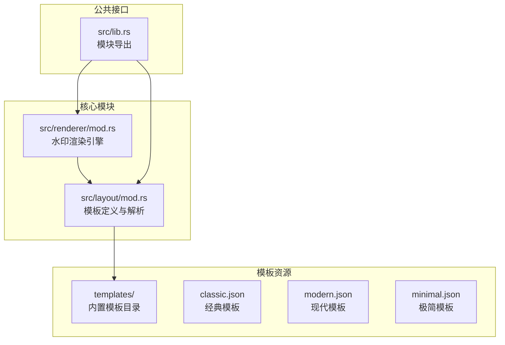
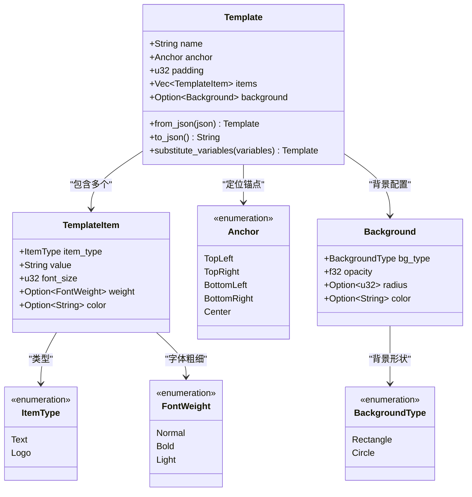
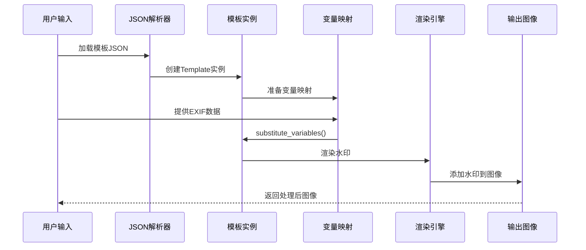
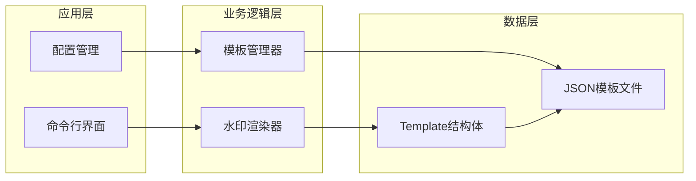
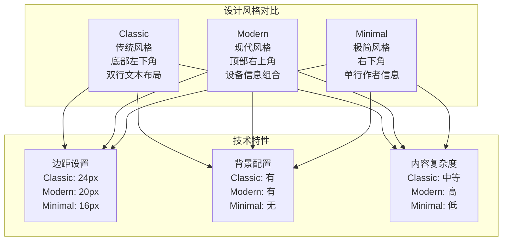
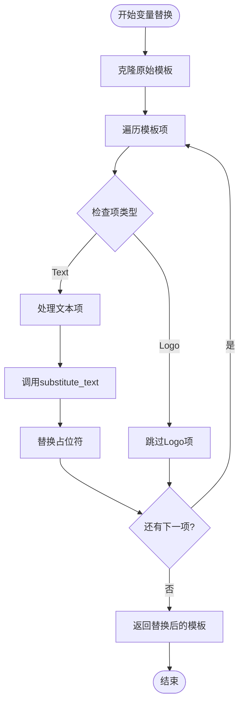
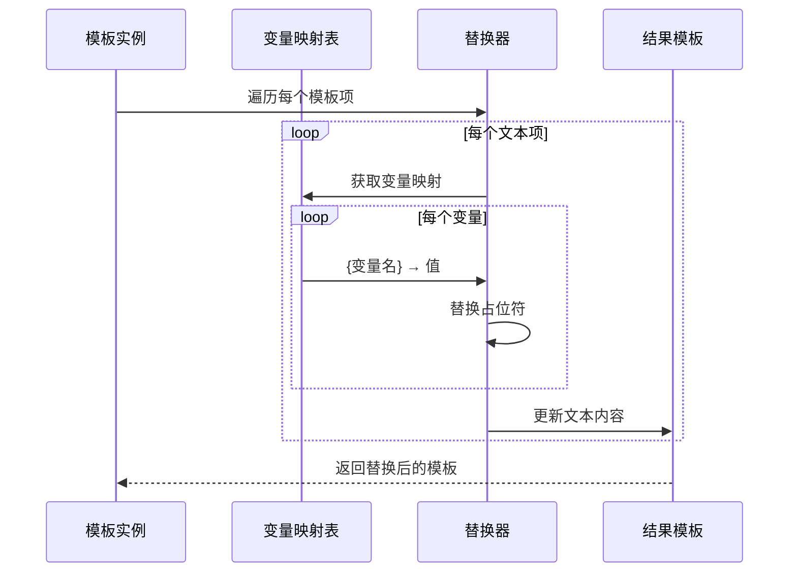
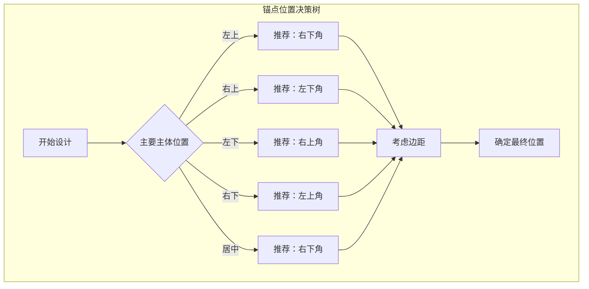
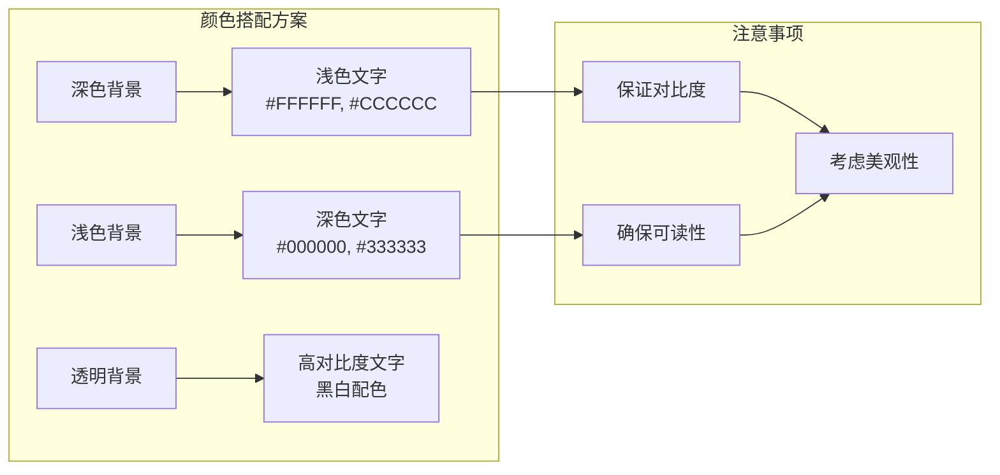

# 模板布局解析模块

<cite>
**本文档中引用的文件**
- [src/layout/mod.rs](file://src/layout/mod.rs)
- [templates/classic.json](file://templates/classic.json)
- [templates/modern.json](file://templates/modern.json)
- [templates/minimal.json](file://templates/minimal.json)
- [src/renderer/mod.rs](file://src/renderer/mod.rs)
- [src/lib.rs](file://src/lib.rs)
- [examples/basic_usage.md](file://examples/basic_usage.md)
</cite>

## 目录
1. [简介](#简介)
2. [项目结构](#项目结构)
3. [核心数据结构](#核心数据结构)
4. [JSON序列化设计](#json序列化设计)
5. [模板系统架构](#模板系统架构)
6. [内置模板分析](#内置模板分析)
7. [变量替换机制](#变量替换机制)
8. [自定义模板指南](#自定义模板指南)
9. [故障排除](#故障排除)
10. [总结](#总结)

## 简介

LiteMark模板布局解析模块是一个基于JSON配置的水印模板系统，提供了灵活且可定制的水印布局解决方案。该模块通过结构化的数据模型定义水印的位置、样式和内容，支持动态变量替换，能够根据EXIF数据自动生成个性化的水印效果。

## 项目结构

模板系统的核心文件组织如下：



**图表来源**
- [src/layout/mod.rs](file://src/layout/mod.rs#L1-L206)
- [src/renderer/mod.rs](file://src/renderer/mod.rs#L1-L50)
- [templates/classic.json](file://templates/classic.json#L1-L27)

**章节来源**
- [src/layout/mod.rs](file://src/layout/mod.rs#L1-L206)
- [src/renderer/mod.rs](file://src/renderer/mod.rs#L1-L631)

## 核心数据结构

### Template 结构体

Template是模板系统的核心数据结构，定义了完整的水印布局配置：



**图表来源**
- [src/layout/mod.rs](file://src/layout/mod.rs#L4-L206)

### 关键字段说明

| 字段 | 类型 | 描述 | 默认值 |
|------|------|------|--------|
| name | String | 模板唯一标识符 | 必需 |
| anchor | Anchor | 锚点位置（决定模板在图像中的放置位置） | 必需 |
| padding | u32 | 边距大小（像素） | 可选，默认0 |
| items | Vec<TemplateItem> | 模板项列表（文本或Logo） | 必需 |
| background | Option<Background> | 背景配置（可选） | None |

**章节来源**
- [src/layout/mod.rs](file://src/layout/mod.rs#L4-L206)

## JSON序列化设计

### 序列化特性

模板系统采用Serde库实现JSON序列化，具有以下特点：

1. **语义化命名**：使用`#[serde(rename = "...")]`注解确保JSON字段名符合约定
2. **可选字段处理**：使用`Option<T>`包装可选配置
3. **枚举序列化**：自动将枚举值转换为字符串表示
4. **嵌套结构**：支持复杂的嵌套对象结构

### 序列化示例

以下是经典模板的JSON序列化结构：

```json
{
    "name": "ClassicParam",
    "anchor": "bottom-left",
    "padding": 24,
    "items": [
        {
            "type": "text",
            "value": "{Author}",
            "font_size": 20,
            "weight": "bold",
            "color": "#FFFFFF"
        },
        {
            "type": "text",
            "value": "{Aperture} | ISO {ISO} | {Shutter}",
            "font_size": 14,
            "weight": "normal",
            "color": "#FFFFFF"
        }
    ],
    "background": {
        "type": "rect",
        "opacity": 0.3,
        "radius": 6,
        "color": "#000000"
    }
}
```

### 枚举序列化映射

| Rust枚举 | JSON字符串 | 描述 |
|-----------|------------|------|
| Anchor::TopLeft | "top-left" | 左上角锚点 |
| Anchor::TopRight | "top-right" | 右上角锚点 |
| Anchor::BottomLeft | "bottom-left" | 左下角锚点 |
| Anchor::BottomRight | "bottom-right" | 右下角锚点 |
| Anchor::Center | "center" | 居中锚点 |
| ItemType::Text | "text" | 文本类型 |
| ItemType::Logo | "logo" | Logo类型 |
| FontWeight::Normal | "normal" | 正常字重 |
| FontWeight::Bold | "bold" | 粗体字重 |
| FontWeight::Light | "light" | 细体字重 |
| BackgroundType::Rectangle | "rect" | 矩形背景 |
| BackgroundType::Circle | "circle" | 圆形背景 |

**章节来源**
- [src/layout/mod.rs](file://src/layout/mod.rs#L4-L206)

## 模板系统架构

### 渲染流程



**图表来源**
- [src/layout/mod.rs](file://src/layout/mod.rs#L60-L85)
- [src/renderer/mod.rs](file://src/renderer/mod.rs#L50-L100)

### 模块间关系



**图表来源**
- [src/lib.rs](file://src/lib.rs#L1-L9)
- [src/renderer/mod.rs](file://src/renderer/mod.rs#L1-L50)

**章节来源**
- [src/layout/mod.rs](file://src/layout/mod.rs#L60-L85)
- [src/renderer/mod.rs](file://src/renderer/mod.rs#L50-L100)

## 内置模板分析

### ClassicParam（经典模板）

经典模板体现了传统的水印设计理念：

| 特性 | 配置 | 设计意图 |
|------|------|----------|
| 锚点位置 | BottomLeft | 保持图像主体不受影响 |
| 内容层次 | 两行文本 | 分别显示作者和拍摄参数 |
| 字体大小 | 20px + 14px | 主次分明，突出作者信息 |
| 背景样式 | 半透明白色矩形 | 不遮挡图像内容 |
| 适用场景 | 传统摄影、个人作品 |

### Modern（现代模板）

现代模板展现了简洁时尚的设计风格：

| 特性 | 配置 | 设计意图 |
|------|------|----------|
| 锚点位置 | TopRight | 现代感强，不干扰主要画面 |
| 内容组合 | 相机+镜头+参数 | 全面展示拍摄设备信息 |
| 字体颜色 | 白色主色调 | 与深色背景形成对比 |
| 背景效果 | 半透明黑色圆角矩形 | 现代简约风格 |
| 适用场景 | 专业摄影、商业用途 |

### Minimal（极简模板）

极简模板追求最少化的设计原则：

| 特性 | 配置 | 设计意图 |
|------|------|----------|
| 锚点位置 | BottomRight | 最小化视觉干扰 |
| 内容单一 | 仅作者信息 | 避免信息过载 |
| 字体简洁 | 标准字体大小 | 保持清晰可读 |
| 无背景 | 完全透明 | 让图像本身成为焦点 |
| 适用场景 | 现代艺术、极简风格 |

### 模板对比分析



**图表来源**
- [templates/classic.json](file://templates/classic.json#L1-L27)
- [templates/modern.json](file://templates/modern.json#L1-L29)
- [templates/minimal.json](file://templates/minimal.json#L1-L17)

**章节来源**
- [templates/classic.json](file://templates/classic.json#L1-L27)
- [templates/modern.json](file://templates/modern.json#L1-L29)
- [templates/minimal.json](file://templates/minimal.json#L1-L17)

## 变量替换机制

### substitute_variables 方法详解

`substitute_variables`方法是模板系统的核心功能，负责将JSON模板中的占位符替换为实际的EXIF数据：



**图表来源**
- [src/layout/mod.rs](file://src/layout/mod.rs#L60-L85)

### 支持的变量占位符

| 变量名 | EXIF字段 | 描述 | 示例值 |
|--------|----------|------|--------|
| {Author} | Exif.Image.Artist | 摄影师姓名 | "John Doe" |
| {ISO} | Exif.Photo.ISOSpeedRatings | ISO感光度 | "100" |
| {Aperture} | Exif.Photo.FNumber | 光圈值 | "f/2.8" |
| {Shutter} | Exif.Photo.ExposureTime | 快门速度 | "1/125" |
| {Focal} | Exif.Photo.FocalLength | 焦距 | "50mm" |
| {Camera} | Exif.Image.Model | 相机型号 | "Canon EOS R5" |
| {Lens} | Exif.Photo.LensModel | 镜头型号 | "RF 24-70mm f/2.8" |
| {DateTime} | Exif.Image.DateTime | 拍摄时间 | "2024:01:15 14:30:25" |

### 变量替换算法

变量替换采用简单的字符串替换策略：



**图表来源**
- [src/layout/mod.rs](file://src/layout/mod.rs#L87-L95)

**章节来源**
- [src/layout/mod.rs](file://src/layout/mod.rs#L60-L95)

## 自定义模板指南

### JSON模板结构规范

创建自定义模板时，请遵循以下结构规范：

#### 基础模板结构

```json
{
    "name": "自定义模板名称",
    "anchor": "bottom-right",
    "padding": 20,
    "items": [],
    "background": null
}
```

#### TemplateItem 配置选项

| 字段 | 类型 | 必需 | 描述 | 示例值 |
|------|------|------|------|--------|
| type | string | 是 | 项类型：text 或 logo | "text" |
| value | string | 是 | 显示内容，支持变量占位符 | "{Author} - {Camera}" |
| font_size | integer | 是 | 字体大小（像素） | 16 |
| weight | string | 否 | 字体粗细：normal/bold/light | "bold" |
| color | string | 否 | 颜色值（十六进制） | "#FFFFFF" |

#### Background 配置选项

| 字段 | 类型 | 必需 | 描述 | 示例值 |
|------|------|------|------|--------|
| type | string | 是 | 背景类型：rect 或 circle | "rect" |
| opacity | float | 是 | 透明度（0.0-1.0） | 0.5 |
| radius | integer | 否 | 圆角半径（仅矩形） | 8 |
| color | string | 是 | 背景颜色 | "#000000" |

### 模板设计最佳实践

#### 1. 锚点选择指南



#### 2. 内容层次规划

| 层级 | 推荐内容 | 字体大小 | 用途 |
|------|----------|----------|------|
| 一级标题 | 作者名/品牌名 | 24-32px | 核心识别信息 |
| 二级标题 | 设备信息 | 18-24px | 技术规格 |
| 三级信息 | 时间/地点 | 14-18px | 补充信息 |
| 分隔符 | | 12px | 格式化分隔 |

#### 3. 颜色搭配原则



### 常见语法错误及修复

#### 1. JSON语法错误

**错误示例：**
```json
{
    "name": "Test",
    "anchor": "bottom-left"
    "items": []  // 缺少逗号
}
```

**修复方法：**
- 确保每个键值对之间有正确的逗号分隔
- 检查大括号和方括号的匹配
- 验证字符串引号的正确使用

#### 2. 枚举值错误

**错误示例：**
```json
{
    "anchor": "bottomleft",  // 错误：缺少连字符
    "weight": "bold",        // 正确
    "bg_type": "rectangle"   // 错误：应为"type"
}
```

**修复方法：**
- 使用正确的枚举字符串值
- 参考序列化映射表验证

#### 3. 变量占位符错误

**错误示例：**
```json
{
    "value": "Author: {author}"  // 错误：大小写不匹配
}
```

**修复方法：**
- 使用大写的变量名格式
- 确保变量名与支持的占位符一致

### 模板测试与验证

#### 测试步骤

1. **语法验证**：使用JSON验证工具检查语法正确性
2. **功能测试**：使用真实EXIF数据测试变量替换
3. **视觉测试**：检查渲染效果是否符合预期
4. **兼容性测试**：验证在不同图像尺寸下的表现

#### 验证脚本示例

```rust
// 测试模板加载和变量替换
let template_json = r#"{"name":"Test","anchor":"center","items":[{"type":"text","value":"{Author}","font_size":16}]}"#;
let template = Template::from_json(template_json).unwrap();
let mut vars = HashMap::new();
vars.insert("Author".to_string(), "Test Author".to_string());
let result = template.substitute_variables(&vars);
assert_eq!(result.items[0].value, "Test Author");
```

**章节来源**
- [src/layout/mod.rs](file://src/layout/mod.rs#L60-L95)
- [examples/basic_usage.md](file://examples/basic_usage.md#L50-L100)

## 故障排除

### 常见问题及解决方案

#### 1. 模板加载失败

**症状**：程序无法加载自定义模板文件

**可能原因**：
- JSON语法错误
- 文件路径不存在
- 权限不足

**解决方法**：
```rust
// 添加错误处理和日志记录
match Template::from_json(&template_content) {
    Ok(template) => {
        // 成功加载
    }
    Err(e) => {
        eprintln!("模板加载失败: {}", e);
        eprintln!("请检查JSON语法和文件完整性");
    }
}
```

#### 2. 变量替换不生效

**症状**：模板中的占位符未被替换为实际值

**排查步骤**：
1. 验证变量映射表是否正确传递
2. 检查变量名的大小写一致性
3. 确认EXIF数据中包含所需字段

**调试代码**：
```rust
// 添加调试输出
println!("原始模板: {:?}", template);
println!("变量映射: {:?}", variables);
let substituted = template.substitute_variables(variables);
println!("替换后模板: {:?}", substituted);
```

#### 3. 渲染效果异常

**症状**：水印显示位置不正确或样式异常

**解决方案**：
- 检查锚点配置是否合理
- 验证字体文件是否正确加载
- 确认图像尺寸与模板配置匹配

### 性能优化建议

#### 1. 模板缓存

```rust
// 实现模板缓存机制
use std::collections::HashMap;
use std::sync::Mutex;

struct TemplateCache {
    cache: Mutex<HashMap<String, Template>>,
}

impl TemplateCache {
    fn get_or_load(&self, name: &str) -> Result<Template, Error> {
        let mut cache = self.cache.lock()?;
        if let Some(template) = cache.get(name) {
            return Ok(template.clone());
        }
        
        // 从文件加载并缓存
        let template = self.load_template_from_file(name)?;
        cache.insert(name.to_string(), template.clone());
        Ok(template)
    }
}
```

#### 2. 异步加载

对于大型模板集合，可以采用异步加载策略：
- 预加载常用模板
- 使用后台线程加载不常用的模板
- 实现模板优先级队列

**章节来源**
- [src/layout/mod.rs](file://src/layout/mod.rs#L60-L95)
- [src/renderer/mod.rs](file://src/renderer/mod.rs#L50-L100)

## 总结

LiteMark模板布局解析模块提供了一个功能强大且灵活的水印解决方案。通过精心设计的数据结构、完善的JSON序列化机制和智能的变量替换算法，该系统能够满足从简单到复杂的各种水印需求。

### 核心优势

1. **结构化配置**：基于JSON的声明式配置方式，易于理解和维护
2. **灵活扩展**：支持自定义模板和变量替换，适应不同应用场景
3. **性能优化**：采用高效的渲染算法和合理的内存管理
4. **跨平台兼容**：基于Rust语言开发，支持多平台部署

### 发展方向

1. **模板编辑器**：开发图形化模板编辑界面
2. **动态样式**：支持基于图像内容的自适应样式
3. **国际化支持**：扩展多语言文本渲染能力
4. **高级效果**：集成阴影、描边等视觉效果

该模板系统为数字版权保护和摄影作品标记提供了坚实的技术基础，其设计理念和实现方式值得在类似项目中借鉴和应用。