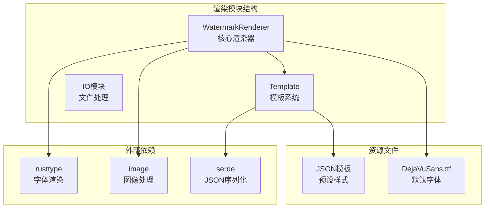
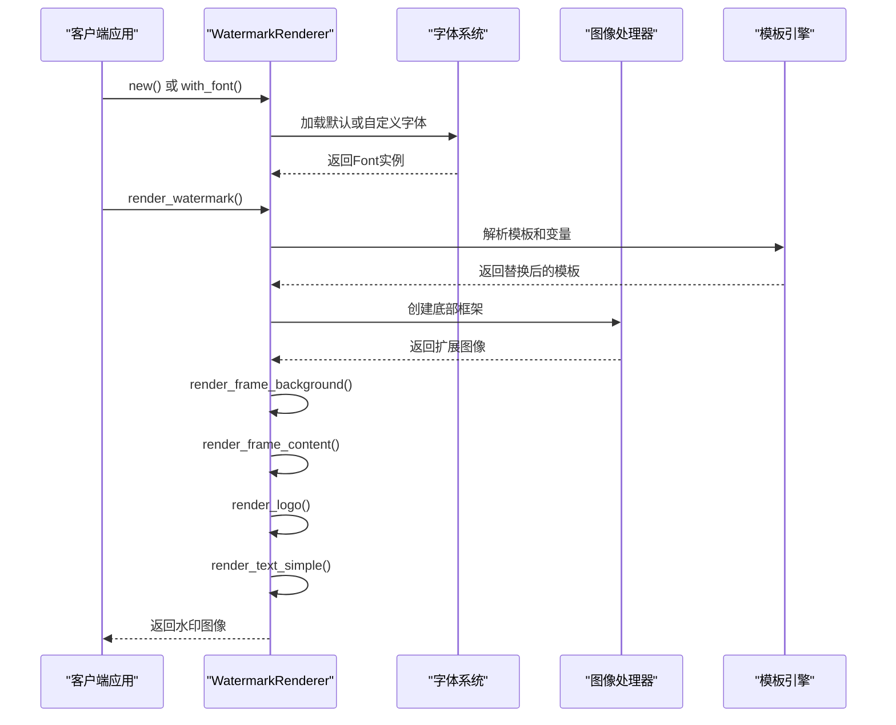
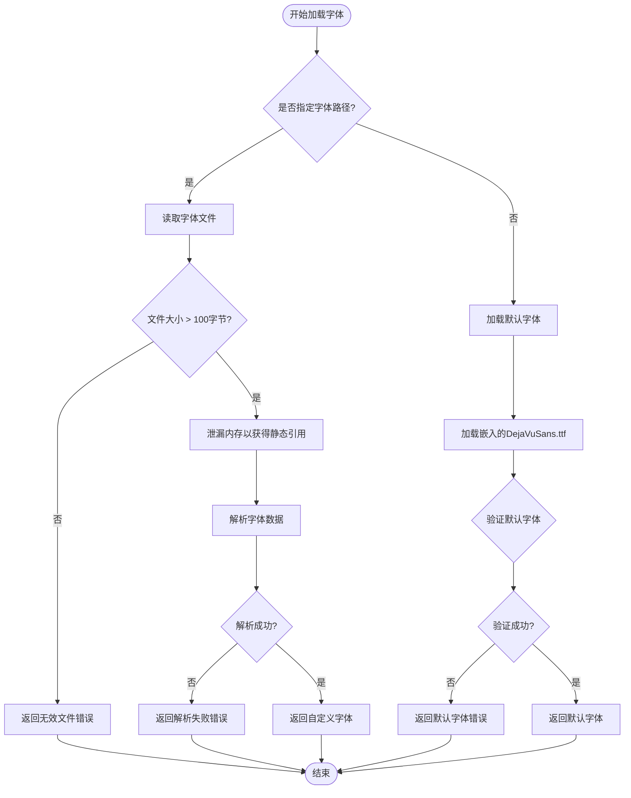
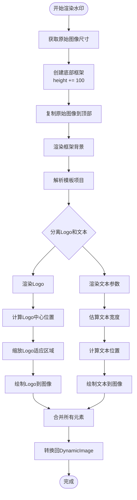
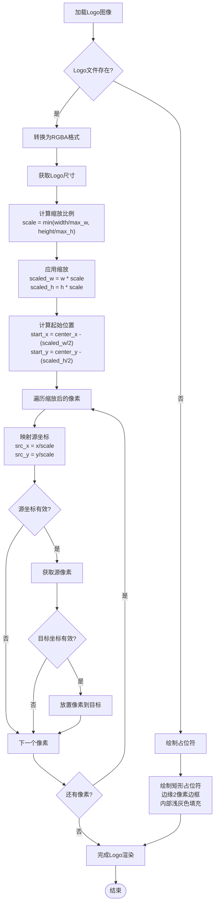
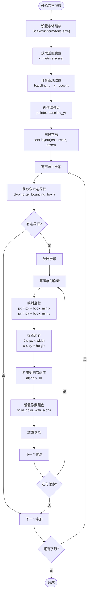
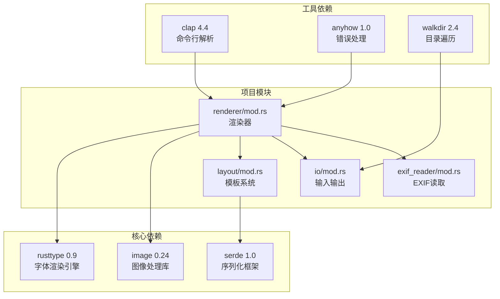

# 水印渲染引擎模块

<cite>
**本文档中引用的文件**
- [src/renderer/mod.rs](file://src/renderer/mod.rs)
- [src/lib.rs](file://src/lib.rs)
- [src/layout/mod.rs](file://src/layout/mod.rs)
- [src/main.rs](file://src/main.rs)
- [Cargo.toml](file://Cargo.toml)
- [templates/classic.json](file://templates/classic.json)
- [templates/modern.json](file://templates/modern.json)
- [templates/minimal.json](file://templates/minimal.json)
- [assets/fonts/DejaVuSans.ttf](file://assets/fonts/DejaVuSans.ttf)
</cite>

## 目录
1. [简介](#简介)
2. [项目结构概览](#项目结构概览)
3. [核心组件分析](#核心组件分析)
4. [架构概览](#架构概览)
5. [详细组件分析](#详细组件分析)
6. [依赖关系分析](#依赖关系分析)
7. [性能考量与优化](#性能考量与优化)
8. [故障排除指南](#故障排除指南)
9. [结论](#结论)

## 简介

WatermarkRenderer是lite-mark-core项目中的核心渲染引擎，负责为照片添加高质量的水印效果。该模块采用现代化的字体渲染技术，通过rusttype库实现精确的文本布局和像素级绘制，支持自定义字体和多种水印模板格式。

该渲染器的主要特点包括：
- 基于rusttype的高质量字体渲染
- 支持自定义字体文件和默认嵌入字体
- 智能的Logo缩放与居中算法
- 可配置的水印模板系统
- 高效的图像处理与内存管理

## 项目结构概览

**图表来源**
- [src/renderer/mod.rs](file://src/renderer/mod.rs#L1-L10)
- [src/layout/mod.rs](file://src/layout/mod.rs#L1-L15)
- [Cargo.toml](file://Cargo.toml#L15-L25)

**章节来源**
- [src/lib.rs](file://src/lib.rs#L1-L9)
- [src/renderer/mod.rs](file://src/renderer/mod.rs#L1-L20)

## 核心组件分析

WatermarkRenderer模块包含以下核心组件：

### WatermarkRenderer结构体
这是主要的渲染器结构体，封装了字体管理和渲染逻辑。它维护一个静态生命周期的字体实例，确保在整个应用程序生命周期内安全使用。

### 字体管理系统
- **默认字体加载**：自动加载编译时嵌入的DejaVuSans.ttf字体
- **自定义字体支持**：支持从文件系统加载用户指定的字体文件
- **字体验证机制**：确保字体数据的有效性和完整性

### 渲染管道
- **底部框架创建**：扩展原始图像高度以容纳水印内容
- **背景渲染**：绘制水印区域的背景层
- **Logo渲染**：智能缩放和居中显示品牌标识
- **文本渲染**：基于rusttype的高质量文本布局

**章节来源**
- [src/renderer/mod.rs](file://src/renderer/mod.rs#L5-L100)

## 架构概览

**图表来源**
- [src/renderer/mod.rs](file://src/renderer/mod.rs#L10-L50)
- [src/renderer/mod.rs](file://src/renderer/mod.rs#L52-L120)

## 详细组件分析

### 字体加载机制

#### with_font方法实现
`with_font`方法提供了灵活的字体加载策略：

**图表来源**
- [src/renderer/mod.rs](file://src/renderer/mod.rs#L15-L50)

#### 默认字体加载流程
默认字体采用编译时嵌入的方式，通过`include_bytes!`宏将DejaVuSans.ttf字体文件直接包含到二进制文件中。这种方法确保了字体的可靠性和跨平台兼容性。

**章节来源**
- [src/renderer/mod.rs](file://src/renderer/mod.rs#L15-L80)

### render_watermark核心渲染流程

#### 底部框架创建
渲染器首先创建一个扩展的图像画布，在原始图像下方添加100像素的高度用于水印内容展示：

**图表来源**
- [src/renderer/mod.rs](file://src/renderer/mod.rs#L52-L120)

#### 背景渲染机制
框架背景采用白色（RGBA: 255, 255, 255, 255）作为默认颜色，确保水印内容具有良好的对比度和可读性。

**章节来源**
- [src/renderer/mod.rs](file://src/renderer/mod.rs#L122-L140)

### Logo渲染与缩放算法

#### Logo缩放与居中实现
Logo渲染采用了智能的缩放算法，确保标志在指定区域内完美居中：

**图表来源**
- [src/renderer/mod.rs](file://src/renderer/mod.rs#L220-L280)

#### Logo降级处理
当Logo文件不存在时，系统会自动绘制一个简单的矩形占位符，包含2像素的灰色边框和浅灰色内部区域，确保界面的一致性。

**章节来源**
- [src/renderer/mod.rs](file://src/renderer/mod.rs#L220-L320)

### render_text_simple字形渲染机制

#### rusttype集成与字形布局
基于rusttype的文本渲染实现了精确的字形布局和像素级绘制：

**图表来源**
- [src/renderer/mod.rs](file://src/renderer/mod.rs#L340-L400)

#### 文本居中算法
文本居中采用了基于字体度量的估算方法：
- **字符计数**：统计文本长度
- **字体大小**：考虑当前字体尺寸
- **字符宽度估算**：使用0.6的比例因子估算平均字符宽度
- **位置计算**：`text_x = center_x - (estimated_width / 2)`

**章节来源**
- [src/renderer/mod.rs](file://src/renderer/mod.rs#L340-L420)

### 模板系统集成

#### Template结构体设计
模板系统提供了灵活的水印配置机制：

| 字段 | 类型 | 描述 | 默认值 |
|------|------|------|--------|
| name | String | 模板名称 | 必需 |
| anchor | Anchor | 锚点位置 | 必需 |
| padding | u32 | 内边距 | 0 |
| items | Vec<TemplateItem> | 水印项目列表 | 必需 |
| background | Option<Background> | 背景配置 | None |

#### 内置模板
系统提供了三种预设模板：

| 模板名称 | 锚点位置 | 主要特征 | 适用场景 |
|----------|----------|----------|----------|
| ClassicParam | bottom-left | 底部左下角，包含作者名和基本参数 | 传统摄影风格 |
| Modern | top-right | 顶部右上角，简洁现代风格 | 现代摄影作品 |
| Minimal | bottom-right | 底部右下角，极简签名 | 简洁专业风格 |

**章节来源**
- [src/layout/mod.rs](file://src/layout/mod.rs#L3-L50)
- [src/layout/mod.rs](file://src/layout/mod.rs#L100-L180)

## 依赖关系分析

**图表来源**
- [Cargo.toml](file://Cargo.toml#L15-L35)

**章节来源**
- [Cargo.toml](file://Cargo.toml#L1-L41)

## 性能考量与优化

### 图像处理性能优化

#### 内存使用优化
- **零拷贝操作**：尽可能使用引用而非复制数据
- **静态生命周期**：字体数据采用静态生命周期避免重复加载
- **像素级访问**：直接操作像素数组而非高级抽象

#### 缩放算法优化
- **双线性插值**：在Logo缩放时采用高效的缩放算法
- **边界检查**：提前验证坐标有效性减少无效操作
- **阈值过滤**：使用透明度阈值避免绘制微弱像素

### 渲染性能优化建议

#### 批处理优化
对于批量处理场景，建议：
- 预先加载所有字体文件
- 复用WatermarkRenderer实例
- 并行处理独立的图像文件

#### 内存管理
- 监控大图像的内存使用
- 考虑分块处理超大图像
- 实现适当的垃圾回收策略

#### 字体缓存策略
- 在多图像处理中重用字体实例
- 实现LRU缓存管理常用字体
- 预加载频繁使用的字体变体

## 故障排除指南

### 常见问题与解决方案

#### 字体加载失败
**症状**：`Failed to read font file` 或 `Failed to parse font data`
**原因**：字体文件损坏或格式不支持
**解决方案**：
- 验证字体文件完整性
- 使用标准TTF字体格式
- 检查文件权限和路径正确性

#### Logo渲染异常
**症状**：Logo显示不正确或出现占位符
**原因**：Logo文件不存在或格式不支持
**解决方案**：
- 确保Logo文件路径正确
- 验证图片格式支持（PNG、JPEG等）
- 检查文件编码和特殊字符

#### 文本渲染模糊
**症状**：水印文字显示模糊不清
**原因**：字体尺寸设置不当或缩放问题
**解决方案**：
- 调整字体大小参数
- 检查DPI设置和显示分辨率
- 使用更高分辨率的字体文件

**章节来源**
- [src/renderer/mod.rs](file://src/renderer/mod.rs#L15-L80)
- [src/renderer/mod.rs](file://src/renderer/mod.rs#L220-L320)

## 结论

WatermarkRenderer模块展现了现代Rust图像处理的最佳实践，通过精心设计的架构实现了高质量的水印渲染功能。其核心优势包括：

### 技术亮点
- **高质量字体渲染**：基于rusttype的专业级文本布局
- **灵活的字体系统**：支持自定义字体和默认嵌入字体
- **智能的图像处理**：精确的缩放算法和像素级控制
- **模块化设计**：清晰的职责分离和可扩展的模板系统

### 性能特性
- **高效内存使用**：静态生命周期字体和零拷贝操作
- **优化的渲染管道**：分阶段处理和早期边界检查
- **可配置的渲染质量**：支持不同精度级别的渲染选项

### 扩展性考虑
该模块为未来的功能扩展奠定了坚实基础，支持：
- 更复杂的水印布局算法
- 多种字体格式的支持
- GPU加速的渲染选项
- 动态模板生成机制

通过深入理解这些核心机制，开发者可以更好地利用和扩展这个强大的水印渲染引擎，为照片处理应用提供专业级的水印功能。