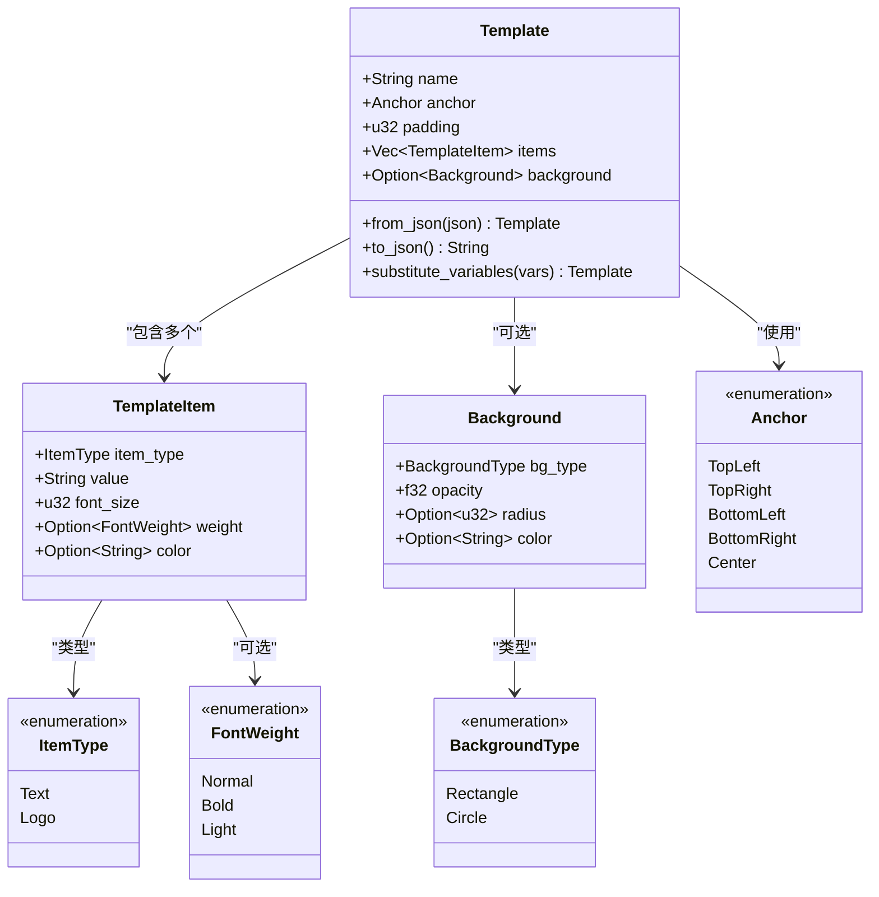
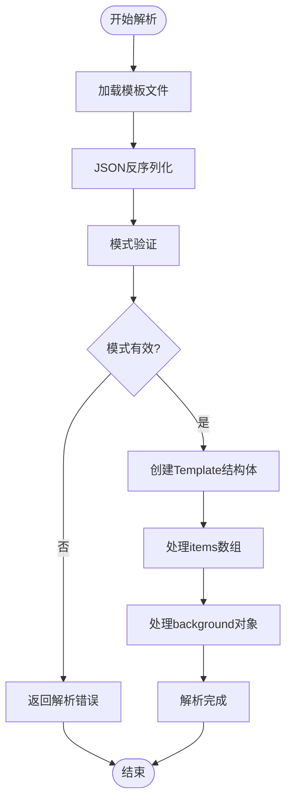
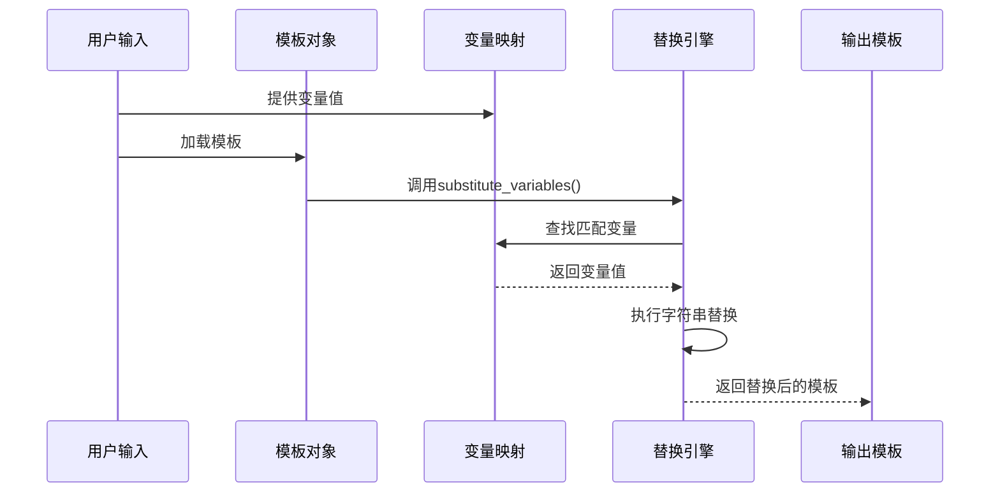
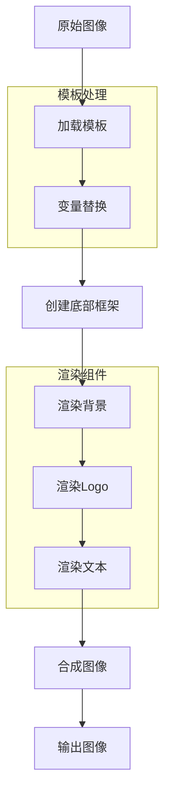

# JSON模板结构说明

<cite>
**本文档引用的文件**
- [src/layout/mod.rs](file://src/layout/mod.rs)
- [templates/classic.json](file://templates/classic.json)
- [templates/modern.json](file://templates/modern.json)
- [templates/minimal.json](file://templates/minimal.json)
- [src/main.rs](file://src/main.rs)
- [src/renderer/mod.rs](file://src/renderer/mod.rs)
- [Cargo.toml](file://Cargo.toml)
- [README.md](file://README.md)
</cite>

## 目录
1. [简介](#简介)
2. [核心数据结构](#核心数据结构)
3. [模板结构详解](#模板结构详解)
4. [内置模板示例](#内置模板示例)
5. [JSON Schema定义](#json-schema定义)
6. [模板解析机制](#模板解析机制)
7. [变量替换系统](#变量替换系统)
8. [渲染流程](#渲染流程)
9. [最佳实践](#最佳实践)
10. [故障排除](#故障排除)

## 简介

LiteMark Core采用基于JSON的模板系统，通过serde库实现可序列化的模板结构。该系统允许用户自定义照片水印框架的布局、样式和内容，支持多种预置模板和自定义配置。

## 核心数据结构

### 主要结构体关系



**图表来源**
- [src/layout/mod.rs](file://src/layout/mod.rs#L4-L105)

**节来源**
- [src/layout/mod.rs](file://src/layout/mod.rs#L1-L206)

## 模板结构详解

### 顶级字段说明

#### name（模板名称）
- **类型**: `String`
- **作用**: 唯一标识模板的名称，用于模板选择和识别
- **示例**: `"ClassicParam"`, `"Modern"`, `"Minimal"`
- **要求**: 必须唯一且符合标识符命名规范

#### anchor（定位锚点）
- **类型**: `Anchor` 枚举
- **作用**: 定义模板在图像中的定位位置
- **可选值**:
  - `"top-left"` - 左上角
  - `"top-right"` - 右上角  
  - `"bottom-left"` - 左下角
  - `"bottom-right"` - 右下角
  - `"center"` - 居中

#### padding（内边距像素值）
- **类型**: `u32` (无符号32位整数)
- **作用**: 模板边缘与图像边界之间的间距
- **范围**: 0-1000像素
- **默认值**: 0（无边距）

#### items（元素数组）
- **类型**: `Vec<TemplateItem>`
- **作用**: 包含模板中所有显示元素的数组
- **元素类型**: `TemplateItem` 对象
- **数量**: 最少1个，最多不限

#### background（背景配置）
- **类型**: `Option<Background>`
- **作用**: 配置模板背景样式
- **可选性**: 可为null，表示无背景
- **结构**: 包含类型、透明度、圆角半径和颜色

**节来源**
- [src/layout/mod.rs](file://src/layout/mod.rs#L4-L15)

### TemplateItem 元素详解

#### type（元素类型）
- **类型**: `ItemType` 枚举
- **作用**: 指定元素的显示类型
- **可选值**:
  - `"text"` - 文本元素
  - `"logo"` - 图标元素

#### value（内容值）
- **类型**: `String`
- **作用**: 元素的实际内容
- **特殊功能**: 支持变量替换语法 `{VariableName}`
- **示例**: 
  - 文本: `"Author: {Author}"`
  - Logo: `"path/to/logo.png"`

#### font_size（字体大小）
- **类型**: `u32`
- **作用**: 设置文本元素的字体尺寸
- **单位**: 像素
- **推荐范围**: 10-48像素

#### weight（字体粗细）
- **类型**: `Option<FontWeight>`
- **作用**: 控制文本的字体粗细
- **可选值**:
  - `null` - 使用默认粗细
  - `"normal"` - 标准粗细
  - `"bold"` - 粗体
  - `"light"` - 细体

#### color（字体颜色）
- **类型**: `Option<String>`
- **作用**: 设置文本或图标颜色
- **格式**: 十六进制颜色码（如 `"#FFFFFF"`）
- **可选性**: 可为null，使用默认颜色

**节来源**
- [src/layout/mod.rs](file://src/layout/mod.rs#L20-L35)

### Background 背景配置详解

#### type（背景类型）
- **类型**: `BackgroundType` 枚举
- **作用**: 定义背景的几何形状
- **可选值**:
  - `"rect"` - 矩形背景
  - `"circle"` - 圆形背景

#### opacity（透明度）
- **类型**: `f32` (32位浮点数)
- **作用**: 控制背景的透明程度
- **范围**: 0.0（完全透明）到 1.0（完全不透明）
- **精度**: 支持小数点后两位

#### radius（圆角半径）
- **类型**: `Option<u32>`
- **作用**: 设置矩形背景的圆角半径
- **可选性**: 仅对矩形背景有效
- **单位**: 像素
- **可选性**: 可为null，表示直角

#### color（背景颜色）
- **类型**: `Option<String>`
- **作用**: 设置背景的颜色
- **格式**: 十六进制颜色码
- **可选性**: 可为null，使用默认颜色

**节来源**
- [src/layout/mod.rs](file://src/layout/mod.rs#L40-L55)

## 内置模板示例

### ClassicParam 模板

基于经典风格设计，适用于传统摄影风格：

```json
{
  "name": "ClassicParam",
  "anchor": "bottom-left",
  "padding": 24,
  "items": [
    {
      "type": "text",
      "value": "{Author}",
      "font_size": 20,
      "weight": "bold",
      "color": "#FFFFFF"
    },
    {
      "type": "text",
      "value": "{Aperture} | ISO {ISO} | {Shutter}",
      "font_size": 14,
      "weight": "normal",
      "color": "#FFFFFF"
    }
  ],
  "background": {
    "type": "rect",
    "opacity": 0.3,
    "radius": 6,
    "color": "#000000"
  }
}
```

**视觉特征**:
- 底部左对齐布局
- 白色文字配黑色半透明背景
- 稍微圆角的矩形设计
- 大标题字体突出作者信息

### Modern 模板

现代简约风格，适合当代摄影作品：

```json
{
  "name": "Modern",
  "anchor": "top-right",
  "padding": 20,
  "items": [
    {
      "type": "text",
      "value": "{Camera} • {Lens}",
      "font_size": 16,
      "weight": "bold",
      "color": "#FFFFFF"
    },
    {
      "type": "text",
      "value": "{Focal} • {Aperture} • {Shutter} • ISO {ISO}",
      "font_size": 12,
      "weight": "normal",
      "color": "#CCCCCC"
    }
  ],
  "background": {
    "type": "rect",
    "opacity": 0.2,
    "radius": 8,
    "color": "#000000"
  }
}
```

**视觉特征**:
- 右上角定位
- 渐变灰色文字层次
- 更大的圆角半径
- 更高的透明度

### Minimal 模板

极简风格，专注于作者署名：

```json
{
  "name": "Minimal",
  "anchor": "bottom-right",
  "padding": 16,
  "items": [
    {
      "type": "text",
      "value": "{Author}",
      "font_size": 14,
      "weight": "normal",
      "color": "#FFFFFF"
    }
  ],
  "background": null
}
```

**视觉特征**:
- 纯粹的文本元素
- 无背景遮罩
- 简洁的右下角布局

**节来源**
- [templates/classic.json](file://templates/classic.json#L1-L27)
- [templates/modern.json](file://templates/modern.json#L1-L29)
- [templates/minimal.json](file://templates/minimal.json#L1-L17)

## JSON Schema定义

以下是完整的JSON Schema描述，用于验证模板文件的有效性：

```json
{
  "$schema": "http://json-schema.org/draft-07/schema#",
  "title": "LiteMark Template Schema",
  "type": "object",
  "required": ["name", "anchor", "padding", "items"],
  "properties": {
    "name": {
      "type": "string",
      "description": "模板唯一标识名称",
      "pattern": "^[a-zA-Z0-9_-]+$"
    },
    "anchor": {
      "type": "string",
      "enum": ["top-left", "top-right", "bottom-left", "bottom-right", "center"],
      "description": "模板定位锚点"
    },
    "padding": {
      "type": "integer",
      "minimum": 0,
      "maximum": 1000,
      "description": "模板内边距（像素）"
    },
    "items": {
      "type": "array",
      "minItems": 1,
      "items": {
        "type": "object",
        "required": ["type", "value"],
        "properties": {
          "type": {
            "type": "string",
            "enum": ["text", "logo"],
            "description": "元素类型"
          },
          "value": {
            "type": "string",
            "description": "元素内容值，支持变量替换"
          },
          "font_size": {
            "type": "integer",
            "minimum": 8,
            "maximum": 64,
            "description": "字体大小（像素）"
          },
          "weight": {
            "type": "string",
            "enum": ["normal", "bold", "light"],
            "description": "字体粗细"
          },
          "color": {
            "type": "string",
            "pattern": "^#([A-Fa-f0-9]{6}|[A-Fa-f0-9]{3})$",
            "description": "十六进制颜色码"
          }
        },
        "additionalProperties": false
      }
    },
    "background": {
      "oneOf": [
        {
          "type": "null",
          "description": "无背景"
        },
        {
          "type": "object",
          "required": ["type", "opacity"],
          "properties": {
            "type": {
              "type": "string",
              "enum": ["rect", "circle"],
              "description": "背景形状"
            },
            "opacity": {
              "type": "number",
              "minimum": 0.0,
              "maximum": 1.0,
              "description": "背景透明度"
            },
            "radius": {
              "type": "integer",
              "minimum": 0,
              "maximum": 100,
              "description": "圆角半径（像素）"
            },
            "color": {
              "type": "string",
              "pattern": "^#([A-Fa-f0-9]{6}|[A-Fa-f0-9]{3})$",
              "description": "背景颜色"
            }
          },
          "additionalProperties": false
        }
      ]
    }
  },
  "additionalProperties": false
}
```

## 模板解析机制

### 解析流程



**图表来源**
- [src/layout/mod.rs](file://src/layout/mod.rs#L72-L78)

### serde 序列化特性

模板结构体使用serde库实现自动序列化和反序列化：

- **Serialize特性**: 支持将结构体转换为JSON字符串
- **Deserialize特性**: 支持从JSON字符串解析为结构体
- **重命名特性**: 使用`#[serde(rename = "...")]`处理JSON键名映射
- **可选字段**: 使用`Option<T>`处理可选字段

**节来源**
- [src/layout/mod.rs](file://src/layout/mod.rs#L72-L78)

## 变量替换系统

### 替换机制



**图表来源**
- [src/layout/mod.rs](file://src/layout/mod.rs#L80-L95)

### 变量语法

模板支持大括号包围的变量语法：
- `{Author}` - 摄影师姓名
- `{ISO}` - 感光度
- `{Aperture}` - 光圈值
- `{Shutter}` - 快门速度
- `{Focal}` - 焦距
- `{Camera}` - 相机型号
- `{Lens}` - 镜头型号
- `{DateTime}` - 拍摄时间

### 替换算法

变量替换使用简单的字符串替换算法：
1. 遍历模板中的所有items
2. 对每个item的value字段进行变量替换
3. 将`{VariableName}`替换为对应的值
4. 保持其他文本不变

**节来源**
- [src/layout/mod.rs](file://src/layout/mod.rs#L97-L108)

## 渲染流程

### 渲染架构



**图表来源**
- [src/renderer/mod.rs](file://src/renderer/mod.rs#L65-L85)

### 渲染步骤详解

1. **模板加载与变量替换**
   - 从文件或内置模板加载
   - 执行变量替换操作
   - 创建替换后的模板副本

2. **框架创建**
   - 计算底部框架高度
   - 创建新的画布
   - 复制原始图像到顶部区域

3. **背景渲染**
   - 绘制背景矩形
   - 应用透明度效果
   - 处理圆角半径

4. **内容渲染**
   - 分离Logo和文本元素
   - 渲染Logo图标（居中）
   - 渲染文本参数（下方）

**节来源**
- [src/renderer/mod.rs](file://src/renderer/mod.rs#L65-L259)

## 最佳实践

### 模板设计原则

1. **清晰度优先**
   - 字体大小适中，确保可读性
   - 颜色对比度足够
   - 合理的内边距设置

2. **一致性设计**
   - 相同类型的模板使用相似的样式
   - 保持视觉层次感
   - 统一的变量命名约定

3. **性能优化**
   - 避免过大的字体尺寸
   - 合理使用背景透明度
   - 优化图片资源大小

### 常见配置模式

#### 经典参数模板
```json
{
  "padding": 24,
  "font_size": 20,
  "weight": "bold",
  "color": "#FFFFFF"
}
```

#### 现代简洁模板
```json
{
  "padding": 20,
  "font_size": 16,
  "weight": "normal",
  "color": "#CCCCCC"
}
```

#### 极简风格模板
```json
{
  "padding": 16,
  "font_size": 14,
  "weight": "normal",
  "color": "#FFFFFF"
}
```

## 故障排除

### 常见问题及解决方案

#### 1. 模板加载失败
**症状**: 提示"Template not found"
**原因**: 文件路径错误或JSON格式无效
**解决**: 
- 检查文件路径是否正确
- 验证JSON语法完整性
- 确认文件编码为UTF-8

#### 2. 变量替换不生效
**症状**: 模板中仍显示`{VariableName}`而非实际值
**原因**: 变量名拼写错误或未提供对应值
**解决**:
- 检查变量名拼写
- 确保提供所有必需变量
- 验证变量值格式

#### 3. 渲染效果异常
**症状**: 文字重叠、位置偏移、颜色错误
**原因**: 模板配置参数不当
**解决**:
- 调整padding值
- 修改字体大小
- 检查颜色值格式

#### 4. 性能问题
**症状**: 渲染速度慢、内存占用高
**原因**: 模板配置过于复杂
**解决**:
- 减少不必要的元素
- 优化背景设置
- 使用适当的图片分辨率

### 调试技巧

1. **启用详细日志**
   - 在开发环境中启用调试输出
   - 检查模板解析过程

2. **分步测试**
   - 从简单模板开始
   - 逐步添加复杂元素
   - 验证每一步的效果

3. **验证工具**
   - 使用JSON验证器检查语法
   - 测试不同变量组合
   - 比较预期与实际效果

**节来源**
- [src/main.rs](file://src/main.rs#L280-L295)

## 结论

LiteMark Core的JSON模板系统提供了强大而灵活的框架定制能力。通过理解核心数据结构、掌握配置选项和遵循最佳实践，开发者可以创建出满足各种需求的个性化水印模板。系统的serde序列化机制确保了配置文件的易读性和可维护性，而完善的变量替换系统则提供了动态内容生成的能力。

模板系统的模块化设计使得扩展新功能变得相对简单，同时保持了向后兼容性。无论是简单的作者署名还是复杂的多元素布局，都可以通过合理的配置实现预期的视觉效果。