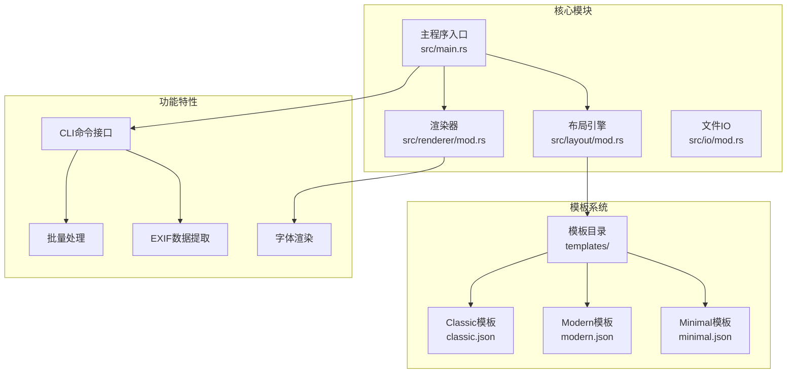
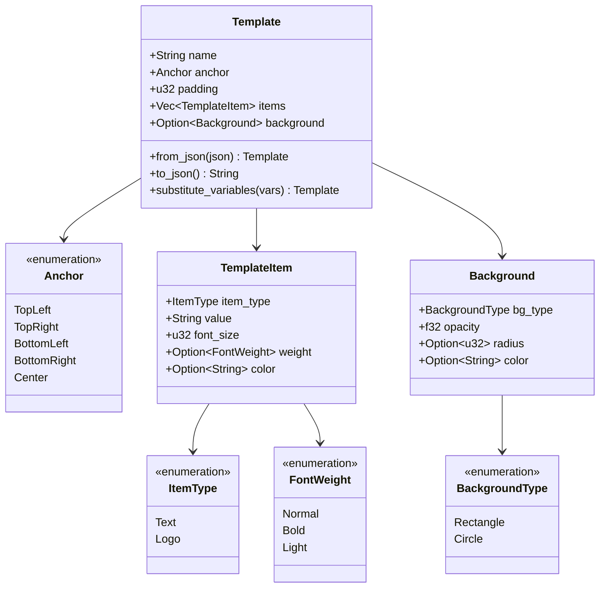
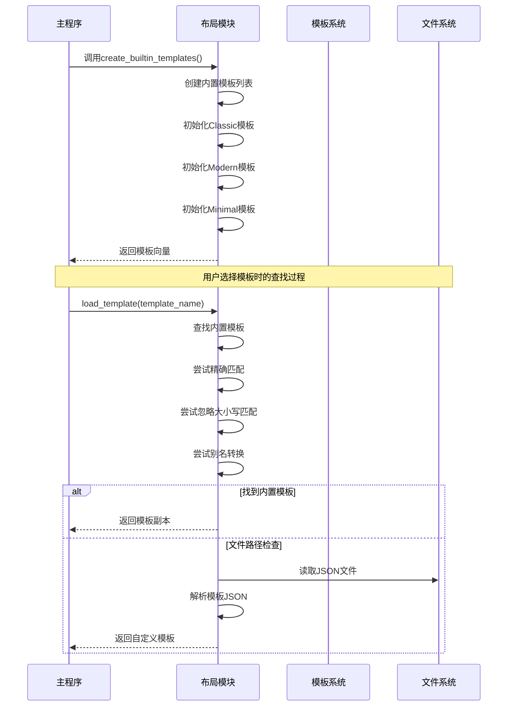
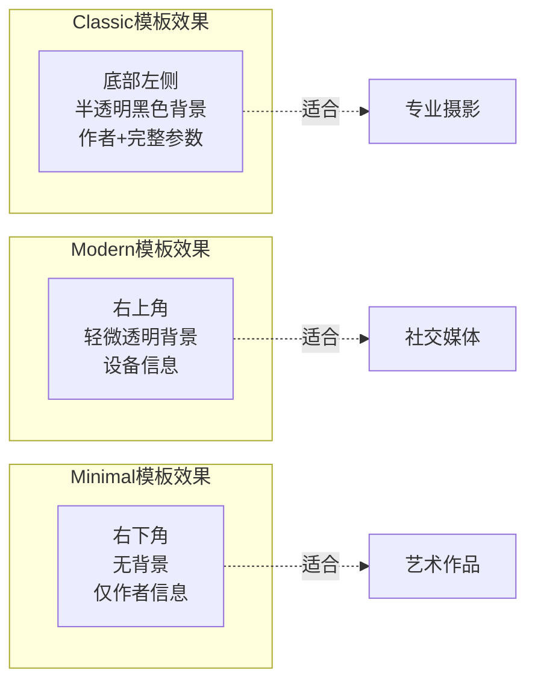

# 内置模板介绍

<cite>
**本文档中引用的文件**
- [templates/classic.json](file://templates/classic.json)
- [templates/modern.json](file://templates/modern.json)
- [templates/minimal.json](file://templates/minimal.json)
- [src/layout/mod.rs](file://src/layout/mod.rs)
- [src/main.rs](file://src/main.rs)
- [src/renderer/mod.rs](file://src/renderer/mod.rs)
- [README.md](file://README.md)
</cite>

## 目录
1. [简介](#简介)
2. [项目结构概览](#项目结构概览)
3. [内置模板系统架构](#内置模板系统架构)
4. [Classic模板详解](#classic模板详解)
5. [Modern模板详解](#modern模板详解)
6. [Minimal模板详解](#minimal模板详解)
7. [模板加载机制](#模板加载机制)
8. [CLI命令交互](#cli命令交互)
9. [模板渲染效果对比](#模板渲染效果对比)
10. [使用指南](#使用指南)
11. [总结](#总结)

## 简介

LiteMark是一个专为摄影爱好者设计的轻量级照片参数水印工具，提供了三种精心设计的内置JSON模板：Classic（经典）、Modern（现代）和Minimal（极简）。这些模板通过灵活的JSON配置系统，为用户提供多样化的水印布局选择，满足不同场景和审美需求。

每种模板都体现了独特的设计理念：
- **Classic模板**：采用底部左侧布局，搭配半透明黑色背景，营造专业而稳重的视觉效果
- **Modern模板**：顶部右侧布局，轻量信息密度，展现简洁现代的美学风格  
- **Minimal模板**：极简主义设计，在强调作者署名的同时保持画面纯净

## 项目结构概览

LiteMark的核心架构围绕模板系统构建，主要组件包括：



**图表来源**
- [src/main.rs](file://src/main.rs#L1-L320)
- [src/layout/mod.rs](file://src/layout/mod.rs#L1-L206)
- [src/renderer/mod.rs](file://src/renderer/mod.rs#L1-L631)

**章节来源**
- [src/main.rs](file://src/main.rs#L1-L50)
- [README.md](file://README.md#L80-L120)

## 内置模板系统架构

LiteMark的模板系统基于JSON配置文件，通过类型安全的Rust结构体实现模板定义和渲染。核心数据结构包括：



**图表来源**
- [src/layout/mod.rs](file://src/layout/mod.rs#L3-L100)

**章节来源**
- [src/layout/mod.rs](file://src/layout/mod.rs#L1-L206)

## Classic模板详解

Classic模板是LiteMark的旗舰模板，采用经典的底部左侧布局设计，搭配半透明黑色背景，展现出专业而稳重的视觉效果。

### 设计理念

Classic模板的核心设计理念体现在以下几个方面：

1. **底部左侧布局**：将水印元素放置在图片底部左侧，符合传统摄影水印的视觉习惯
2. **半透明黑色背景**：通过30%透明度的黑色矩形背景，确保文字清晰可读同时不干扰主体画面
3. **层次化信息展示**：通过字体大小和粗细区分不同信息层级

### JSON配置解析

Classic模板的完整配置如下：

| 字段 | 值 | 说明 |
|------|-----|------|
| name | "ClassicParam" | 模板名称标识符 |
| anchor | "bottom-left" | 锚点位置：底部左侧 |
| padding | 24 | 内边距：24像素 |
| background.type | "rect" | 背景类型：矩形 |
| background.opacity | 0.3 | 背景透明度：30% |
| background.radius | 6 | 背景圆角半径：6像素 |
| background.color | "#000000" | 背景颜色：黑色 |

### 文本项配置

Classic模板包含两个文本项，分别展示不同级别的信息：

| 序号 | 类型 | 值 | 字体大小 | 字体粗细 | 颜色 |
|------|------|-----|----------|----------|------|
| 1 | 作者信息 | "{Author}" | 20 | bold | "#FFFFFF" |
| 2 | 参数信息 | "{Aperture} \| ISO {ISO} \| {Shutter}" | 14 | normal | "#FFFFFF" |

### 视觉效果预期

Classic模板渲染后的预期效果：
- **整体布局**：水印位于图片底部左侧，与主体画面形成自然分隔
- **背景效果**：半透明黑色矩形背景提供良好的文字可读性
- **文字层次**：作者姓名使用大号加粗字体，参数信息使用较小常规字体
- **色彩对比**：白色文字在黑色背景上形成鲜明对比

**章节来源**
- [templates/classic.json](file://templates/classic.json#L1-L27)
- [src/layout/mod.rs](file://src/layout/mod.rs#L80-L110)

## Modern模板详解

Modern模板代表LiteMark的现代设计理念，采用顶部右侧布局，轻量信息密度，展现简洁现代的美学风格。

### 设计理念

Modern模板的设计哲学强调简约与功能性：

1. **顶部右侧布局**：将水印移至图片右上角，创造更现代的视觉体验
2. **轻量信息密度**：精选关键参数信息，避免视觉拥挤
3. **柔和色彩搭配**：使用浅灰色文字和低透明度背景

### JSON配置解析

Modern模板的配置特点：

| 字段 | 值 | 说明 |
|------|-----|------|
| name | "Modern" | 模板名称 |
| anchor | "top-right" | 锚点位置：顶部右侧 |
| padding | 20 | 内边距：20像素 |
| background.type | "rect" | 背景类型：矩形 |
| background.opacity | 0.2 | 背景透明度：20% |
| background.radius | 8 | 背景圆角半径：8像素 |
| background.color | "#000000" | 背景颜色：黑色 |

### 文本项配置

Modern模板采用两层信息结构：

| 层级 | 类型 | 值 | 字体大小 | 字体粗细 | 颜色 |
|------|------|-----|----------|----------|------|
| 主要信息 | 设备信息 | "{Camera} • {Lens}" | 16 | bold | "#FFFFFF" |
| 辅助信息 | 参数信息 | "{Focal} • {Aperture} • {Shutter} • ISO {ISO}" | 12 | normal | "#CCCCCC" |

### 视觉效果预期

Modern模板的渲染特征：
- **位置优势**：右上角布局不干扰主体画面重要区域
- **信息精简**：只展示最关键的设备和拍摄参数
- **色彩层次**：白色主信息配浅灰色辅助信息，形成自然层次
- **背景效果**：轻微透明背景保持低调而不失存在感

**章节来源**
- [templates/modern.json](file://templates/modern.json#L1-L29)
- [src/layout/mod.rs](file://src/layout/mod.rs#L112-L140)

## Minimal模板详解

Minimal模板体现了极简主义设计哲学，在强调作者署名的同时保持画面的纯净和简洁。

### 设计理念

Minimal模板的核心价值主张：

1. **极简主义风格**：去除所有非必要元素，只保留最核心的作者信息
2. **视觉纯净**：无背景设计，让画面保持原始美感
3. **低调存在**：最小化对主体画面的影响

### JSON配置解析

Minimal模板的极简配置：

| 字段 | 值 | 说明 |
|------|-----|------|
| name | "Minimal" | 模板名称 |
| anchor | "bottom-right" | 锚点位置：底部右侧 |
| padding | 16 | 内边距：16像素 |
| background | null | 无背景设计 |

### 文本项配置

Minimal模板只包含一个文本项：

| 类型 | 值 | 字体大小 | 字体粗细 | 颜色 |
|------|-----|----------|----------|------|
| 作者信息 | "{Author}" | 14 | normal | "#FFFFFF" |

### 视觉效果预期

Minimal模板的特点：
- **位置策略**：底部右侧布局，避免干扰主体画面
- **设计纯粹**：无背景设计，保持画面完整性
- **信息专注**：仅展示作者信息，其他参数自动省略
- **色彩统一**：白色文字在任何背景下都能良好显示

**章节来源**
- [templates/minimal.json](file://templates/minimal.json#L1-L17)
- [src/layout/mod.rs](file://src/layout/mod.rs#L142-L155)

## 模板加载机制

LiteMark通过`create_builtin_templates()`函数在程序启动时加载所有内置模板，实现了高效的模板管理机制。

### 加载流程



**图表来源**
- [src/layout/mod.rs](file://src/layout/mod.rs#L100-L155)
- [src/main.rs](file://src/main.rs#L250-L300)

### 别名支持机制

LiteMark提供了智能的模板别名支持，允许用户使用简化的名称访问内置模板：

| 输入名称 | 映射到的正式名称 | 支持情况 |
|----------|------------------|----------|
| "classic" | "ClassicParam" | 完全支持 |
| "modern" | "Modern" | 完全支持 |
| "minimal" | "Minimal" | 完全支持 |
| "Classic" | "ClassicParam" | 大小写兼容 |
| "MODERN" | "Modern" | 大小写兼容 |

**章节来源**
- [src/layout/mod.rs](file://src/layout/mod.rs#L100-L155)
- [src/main.rs](file://src/main.rs#L250-L300)

## CLI命令交互

LiteMark提供了丰富的CLI命令接口，支持模板的查看、选择和应用。

### 核心命令

| 命令类别 | 命令格式 | 功能描述 | 示例 |
|----------|----------|----------|------|
| 添加水印 | `litemark add` | 为单张图片添加水印 | `litemark add -i input.jpg -t classic -o output.jpg` |
| 批量处理 | `litemark batch` | 批量处理目录中的图片 | `litemark batch -i /photos/ -t modern -o /output/` |
| 列出模板 | `litemark templates` | 显示可用模板列表 | `litemark templates` |
| 查看模板 | `litemark show-template` | 显示模板详细信息 | `litemark show-template classic` |

### 模板选择机制

```mermaid
flowchart TD
Start([开始处理命令]) --> ParseArgs["解析命令行参数"]
ParseArgs --> CheckTemplate{"检查模板参数"}
CheckTemplate --> |内置模板| LoadBuiltIn["加载内置模板"]
CheckTemplate --> |文件路径| LoadFile["加载外部模板文件"]
CheckTemplate --> |默认值| UseDefault["使用默认模板"]
LoadBuiltIn --> ValidateName{"验证模板名称"}
ValidateName --> |匹配成功| ReturnTemplate["返回模板实例"]
ValidateName --> |匹配失败| CheckAlias["检查别名映射"]
CheckAlias --> |找到别名| ReturnTemplate
CheckAlias --> |未找到| ErrorNotFound["报告模板未找到"]
LoadFile --> ParseJSON["解析JSON配置"]
ParseJSON --> ValidateConfig["验证配置有效性"]
ValidateConfig --> |有效| ReturnTemplate
ValidateConfig --> |无效| ErrorInvalid["报告配置错误"]
UseDefault --> LoadBuiltIn
ReturnTemplate --> ProcessImage["处理图片"]
ErrorNotFound --> End([结束])
ErrorInvalid --> End
ProcessImage --> End
```



**图表来源**
- [src/main.rs](file://src/main.rs#L250-L300)

### 实际使用示例

以下是各种CLI命令的实际使用场景：

```bash
# 使用Classic模板添加水印
litemark add -i photo.jpg -t classic -o watermarked.jpg --author "John Doe"

# 使用Modern模板批量处理
litemark batch -i /raw_photos/ -t modern -o /processed/ --author "Jane Smith"

# 查看所有可用模板
litemark templates

# 查看Classic模板详情
litemark show-template classic
```

**章节来源**
- [src/main.rs](file://src/main.rs#L15-L80)
- [src/main.rs](file://src/main.rs#L280-L320)

## 模板渲染效果对比

为了帮助用户直观理解各模板的视觉差异，以下是对三种模板的详细对比分析：

### 视觉风格对比表

| 特性 | Classic | Modern | Minimal |
|------|---------|--------|---------|
| **锚点位置** | 底部左侧 | 顶部右侧 | 底部右侧 |
| **背景设计** | 半透明黑色矩形 | 轻微透明黑色矩形 | 无背景 |
| **信息密度** | 中等（作者+参数） | 低（设备信息） | 极低（仅作者） |
| **字体层次** | 两级（大标题+小正文） | 两级（粗体+细体） | 单级 |
| **适用场景** | 专业摄影、作品集 | 现代风格、社交媒体 | 纯净画质、艺术作品 |
| **视觉影响** | 中等（底部遮挡） | 轻微（角落装饰） | 最小（低调存在） |

### 渲染效果预览



### 适用场景建议

| 场景类型 | 推荐模板 | 理由 |
|----------|----------|------|
| **专业摄影作品** | Classic | 传统专业外观，完整参数信息 |
| **个人作品集** | Classic | 强调作者身份，专业可信 |
| **社交媒体分享** | Modern | 现代简洁风格，信息精炼 |
| **艺术创作** | Minimal | 最小化干扰，突出画面本身 |
| **商业宣传** | Classic | 专业形象，权威可信 |
| **日常记录** | Minimal | 轻量级，快速处理 |

## 使用指南

### 快速开始

1. **安装LiteMark**：从GitHub releases下载预编译二进制文件或从源码编译
2. **查看可用模板**：运行`litemark templates`查看所有内置模板
3. **测试模板效果**：使用`litemark show-template <template_name>`查看模板配置
4. **应用模板**：使用`litemark add`命令为图片添加水印

### 高级配置技巧

#### 自定义作者信息
```bash
# 设置自定义作者名覆盖EXIF数据
litemark add -i photo.jpg -t classic -o output.jpg --author "Professional Photographer"

# 批量处理时设置统一作者名
litemark batch -i /photos/ -t modern -o /output/ --author "Studio Name"
```

#### 模板别名使用
```bash
# 使用简化的模板名称
litemark add -i photo.jpg -t classic -o output.jpg  # 等同于 -t ClassicParam
litemark add -i photo.jpg -t modern -o output.jpg   # 等同于 -t Modern
litemark add -i photo.jpg -t minimal -o output.jpg  # 等同于 -t Minimal
```

#### 字体自定义
```bash
# 使用自定义字体文件
litemark add -i photo.jpg -t classic -o output.jpg --font /path/to/custom-font.ttf

# 设置环境变量使用默认字体
export LITEMARK_FONT=/path/to/font.ttf
litemark add -i photo.jpg -t classic -o output.jpg  # 自动使用环境变量指定的字体
```

### 故障排除

| 问题 | 可能原因 | 解决方案 |
|------|----------|----------|
| 模板未找到 | 拼写错误或使用了不存在的模板名 | 使用`litemark templates`查看可用模板 |
| 渲染效果异常 | 字体文件损坏或缺失 | 检查字体文件路径，尝试使用默认字体 |
| 权限错误 | 文件读写权限不足 | 确保有读取输入文件和写入输出文件的权限 |
| EXIF数据缺失 | 图片中没有EXIF信息 | 提供`--author`参数手动指定作者信息 |

**章节来源**
- [src/main.rs](file://src/main.rs#L15-L80)
- [README.md](file://README.md#L30-L80)

## 总结

LiteMark的三种内置模板——Classic、Modern和Minimal，各自体现了不同的设计理念和应用场景：

### 设计特色总结

- **Classic模板**：专业稳重的底部左侧布局，半透明黑色背景，适合需要完整参数信息的专业摄影场景
- **Modern模板**：简洁现代的顶部右侧布局，轻量信息密度，适合追求现代感的社交媒体和日常分享
- **Minimal模板**：极简主义设计，无背景设计，适合强调画面纯净的艺术创作和商业用途

### 技术优势

1. **JSON配置系统**：灵活的JSON配置支持，易于扩展和定制
2. **类型安全**：基于Rust的强类型系统，确保配置正确性和运行时稳定性
3. **本地处理**：完全本地化处理，保护用户隐私
4. **跨平台支持**：支持Windows、macOS和Linux平台

### 发展方向

LiteMark的模板系统为未来的功能扩展奠定了坚实基础，包括：
- 更多模板选项的开发
- 用户自定义模板的支持
- 模板市场和共享机制
- 更丰富的样式和布局选项

通过这三种精心设计的内置模板，LiteMark为摄影爱好者和专业摄影师提供了强大而灵活的水印解决方案，既满足了专业需求，又保持了易用性和美观性。