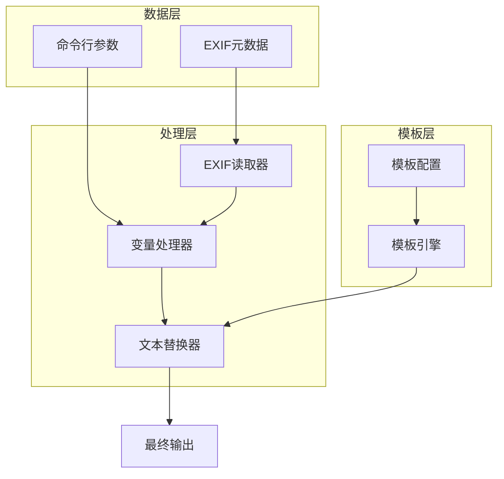
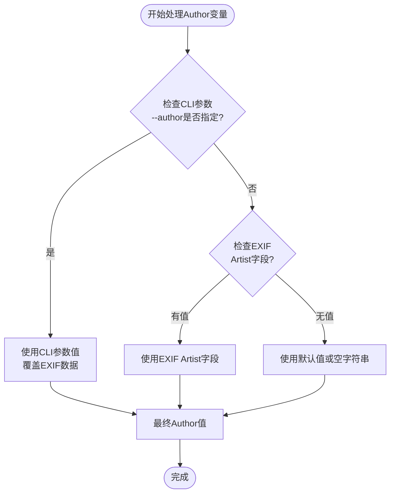
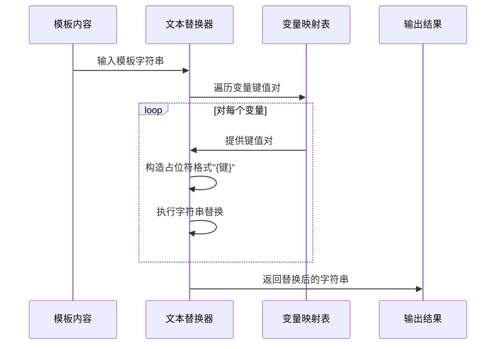

# 支持的变量列表

<cite>
**本文档中引用的文件**
- [src/exif_reader/mod.rs](file://src/exif_reader/mod.rs)
- [src/layout/mod.rs](file://src/layout/mod.rs)
- [src/main.rs](file://src/main.rs)
- [src/io/mod.rs](file://src/io/mod.rs)
- [templates/classic.json](file://templates/classic.json)
- [templates/modern.json](file://templates/modern.json)
- [templates/minimal.json](file://templates/minimal.json)
</cite>

## 目录
1. [简介](#简介)
2. [变量系统架构](#变量系统架构)
3. [核心变量详解](#核心变量详解)
4. [变量替换机制](#变量替换机制)
5. [模板中的变量使用](#模板中的变量使用)
6. [格式化规则与最佳实践](#格式化规则与最佳实践)
7. [常见问题与解决方案](#常见问题与解决方案)
8. [总结](#总结)

## 简介

LiteMark是一个轻量级的照片参数水印工具，其模板系统基于灵活的变量替换机制。该系统支持多种预定义的变量占位符，这些变量从图像的EXIF元数据中提取，并通过模板引擎进行动态替换。本文档详细列出了所有支持的变量及其数据来源、格式化规则和使用方法。

## 变量系统架构

变量系统采用分层架构设计，主要包含以下组件：



**图表来源**
- [src/exif_reader/mod.rs](file://src/exif_reader/mod.rs#L1-L120)
- [src/layout/mod.rs](file://src/layout/mod.rs#L1-L206)
- [src/main.rs](file://src/main.rs#L1-L320)

**章节来源**
- [src/exif_reader/mod.rs](file://src/exif_reader/mod.rs#L1-L120)
- [src/layout/mod.rs](file://src/layout/mod.rs#L1-L206)

## 核心变量详解

### 基础摄影参数变量

#### {ISO}
- **数据来源**: EXIF元数据中的ISO感光度值
- **数据类型**: u32 (无符号整数)
- **格式化**: 直接转换为字符串，不添加单位
- **示例值**: `"400"`
- **用途**: 显示相机的ISO设置

#### {Aperture}
- **数据来源**: EXIF元数据中的光圈值
- **数据类型**: f64 (浮点数)
- **格式化**: 自动添加"f/"前缀，保留一位小数
- **示例值**: `"f/2.8"`
- **用途**: 显示相机的光圈设置

#### {Shutter}
- **数据来源**: EXIF元数据中的快门速度
- **数据类型**: String (字符串)
- **格式化**: 保持原始格式，通常为分数形式
- **示例值**: `"1/250"`
- **用途**: 显示相机的快门速度设置

#### {Focal}
- **数据来源**: EXIF元数据中的焦距值
- **数据类型**: f64 (浮点数)
- **格式化**: 添加"mm"单位，不保留小数位
- **示例值**: `"50mm"`
- **用途**: 显示镜头的焦距

### 设备信息变量

#### {Camera}
- **数据来源**: EXIF元数据中的相机型号
- **数据类型**: String (字符串)
- **格式化**: 保持原始格式
- **示例值**: `"Canon EOS R5"`
- **用途**: 显示拍摄使用的相机设备

#### {Lens}
- **数据来源**: EXIF元数据中的镜头型号
- **数据类型**: String (字符串)
- **格式化**: 保持原始格式
- **示例值**: `"Canon RF 24-70mm f/2.8L IS USM"`
- **用途**: 显示使用的镜头型号

### 时间信息变量

#### {DateTime}
- **数据来源**: EXIF元数据中的拍摄时间
- **数据类型**: String (字符串)
- **格式化**: 保持原始格式（YYYY:MM:DD HH:MM:SS）
- **示例值**: `"2024:01:15 14:30:25"`
- **用途**: 显示照片的拍摄时间

### 特殊变量 - {Author}

{Author}变量具有特殊的优先级处理机制：



**图表来源**
- [src/main.rs](file://src/main.rs#L29-L30)
- [src/main.rs](file://src/main.rs#L140-L145)

- **数据来源**: 
  - 优先级1: 命令行参数 `--author`
  - 优先级2: EXIF元数据中的Artist字段
  - 优先级3: 默认值（空字符串）
- **数据类型**: String (字符串)
- **格式化**: 保持原始格式
- **示例值**: `"John Doe"` 或 `"Photographer"`
- **用途**: 显示摄影师姓名或作者信息

**章节来源**
- [src/exif_reader/mod.rs](file://src/exif_reader/mod.rs#L41-L69)
- [src/main.rs](file://src/main.rs#L140-L145)

## 变量替换机制

### 核心实现原理

变量替换机制的核心实现在 `substitute_text` 函数中，该函数遍历HashMap并替换指定格式的占位符：



**图表来源**
- [src/layout/mod.rs](file://src/layout/mod.rs#L90-L98)

### 替换算法细节

替换过程遵循以下步骤：

1. **占位符构造**: 将变量名用大括号包围形成 `{变量名}`
2. **大小写敏感匹配**: 精确匹配变量名，区分大小写
3. **全局替换**: 在整个字符串中查找并替换所有出现的占位符
4. **空值处理**: 如果变量值不存在，则替换为空字符串

### 实现代码路径

变量替换的具体实现位于 [`src/layout/mod.rs`](file://src/layout/mod.rs#L90-L98)，该函数接受两个参数：
- `text`: 要处理的模板字符串
- `variables`: 包含变量名到值映射的HashMap

**章节来源**
- [src/layout/mod.rs](file://src/layout/mod.rs#L90-L98)

## 模板中的变量使用

### 内置模板示例

系统提供了三个内置模板，展示了不同场景下的变量使用方式：

#### ClassicParam 模板
- **位置**: 底部左侧
- **变量组合**: `{Author}` 和 `{Aperture} | ISO {ISO} | {Shutter}`
- **适用场景**: 经典风格水印，突出摄影师信息和基本参数

#### Modern 模板  
- **位置**: 顶部右侧
- **变量组合**: `{Camera} • {Lens}` 和 `{Focal} • {Aperture} • {Shutter} • ISO {ISO}`
- **适用场景**: 现代简约风格，展示设备信息和完整参数

#### Minimal 模板
- **位置**: 底部右侧
- **变量组合**: `{Author}`
- **适用场景**: 极简风格，仅显示摄影师签名

### 模板配置结构

每个模板都包含以下关键元素：

| 元素 | 类型 | 描述 |
|------|------|------|
| name | String | 模板名称 |
| anchor | Anchor | 锚点位置（四个角落或中心） |
| padding | u32 | 边距大小 |
| items | Vec<TemplateItem> | 水印项目列表 |
| background | Option<Background> | 背景配置（可选） |

**章节来源**
- [src/layout/mod.rs](file://src/layout/mod.rs#L100-L170)
- [templates/classic.json](file://templates/classic.json#L1-L27)
- [templates/modern.json](file://templates/modern.json#L1-L29)
- [templates/minimal.json](file://templates/minimal.json#L1-L17)

## 格式化规则与最佳实践

### 大小写敏感性

变量名称严格区分大小写，必须使用正确的大小写格式：

- ✅ 正确：`{ISO}`, `{Aperture}`, `{Author}`
- ❌ 错误：`{iso}`, `{aperture}`, `{author}`

### 常见格式化问题

#### 快门速度格式化
- **问题**: 数值型快门速度（如0.004）需要转换为分数形式
- **解决方案**: 系统自动保持原始EXIF格式，通常为分数形式（如"1/250"）

#### 光圈值格式化
- **问题**: 光圈值需要添加"f/"前缀
- **解决方案**: 系统自动应用格式化规则：`f/{数值:.1}`

#### 焦距单位处理
- **问题**: 焦距需要添加"mm"单位
- **解决方案**: 系统自动添加单位：`{数值:.0}mm`

### 推荐的模板组合

#### 专业摄影师模板
```json
{
  "value": "{Camera} • {Lens} • {Focal} • {Aperture} • {Shutter} • ISO {ISO}"
}
```

#### 简洁风格模板
```json
{
  "value": "{Author} • {ISO} • {Aperture} • {Shutter}"
}
```

#### 设备导向模板
```json
{
  "value": "{Camera} • {Lens} • {DateTime}"
}
```

## 常见问题与解决方案

### 变量值为空的情况

当某些EXIF字段缺失时，对应的变量将被替换为空字符串。例如：

- 如果EXIF中没有光圈信息，`{Aperture}` 将被替换为空
- 如果没有作者信息，`{Author}` 将显示为空

### 性能优化建议

1. **避免过度复杂的模板**: 简单的变量组合比复杂的嵌套表达式更高效
2. **合理使用背景**: 过多的背景效果会增加渲染时间
3. **批量处理优化**: 使用 `batch` 命令处理大量图片时，系统会缓存字体和模板

### 兼容性注意事项

- **变量名称**: 请始终使用本文档中列出的确切变量名称
- **格式要求**: 占位符必须使用标准的大括号格式 `{变量名}`
- **编码支持**: 支持Unicode字符，但需确保字体文件包含相应字符集

## 总结

LiteMark的变量系统提供了强大而灵活的水印定制功能。通过理解各个变量的数据来源、格式化规则和替换机制，用户可以创建符合自己需求的个性化水印模板。

### 关键要点回顾

1. **变量来源**: 主要来自EXIF元数据，部分变量可通过CLI参数覆盖
2. **大小写敏感**: 变量名称严格区分大小写
3. **格式化规则**: 系统自动应用适当的格式化规则
4. **替换机制**: 高效的字符串替换算法确保性能
5. **模板灵活性**: 内置模板和自定义模板满足不同需求

### 最佳实践建议

- 在自定义模板时参考内置模板的变量组合
- 使用一致的变量命名规范
- 测试不同图片的变量填充效果
- 考虑目标受众的阅读习惯和审美偏好

通过掌握这些变量和它们的使用方法，用户可以充分发挥LiteMark的强大功能，创建专业且个性化的照片水印。