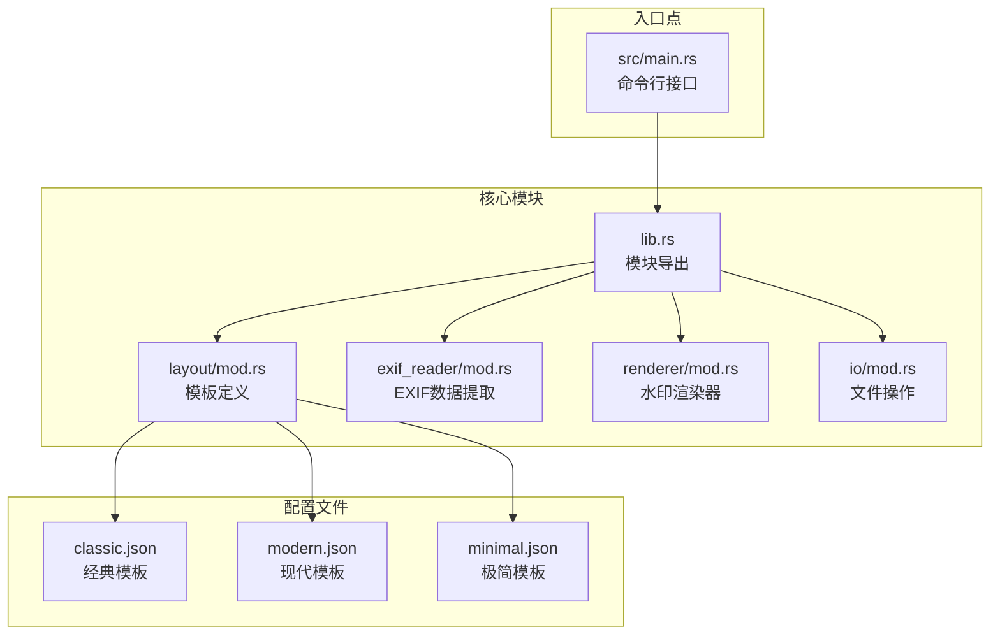
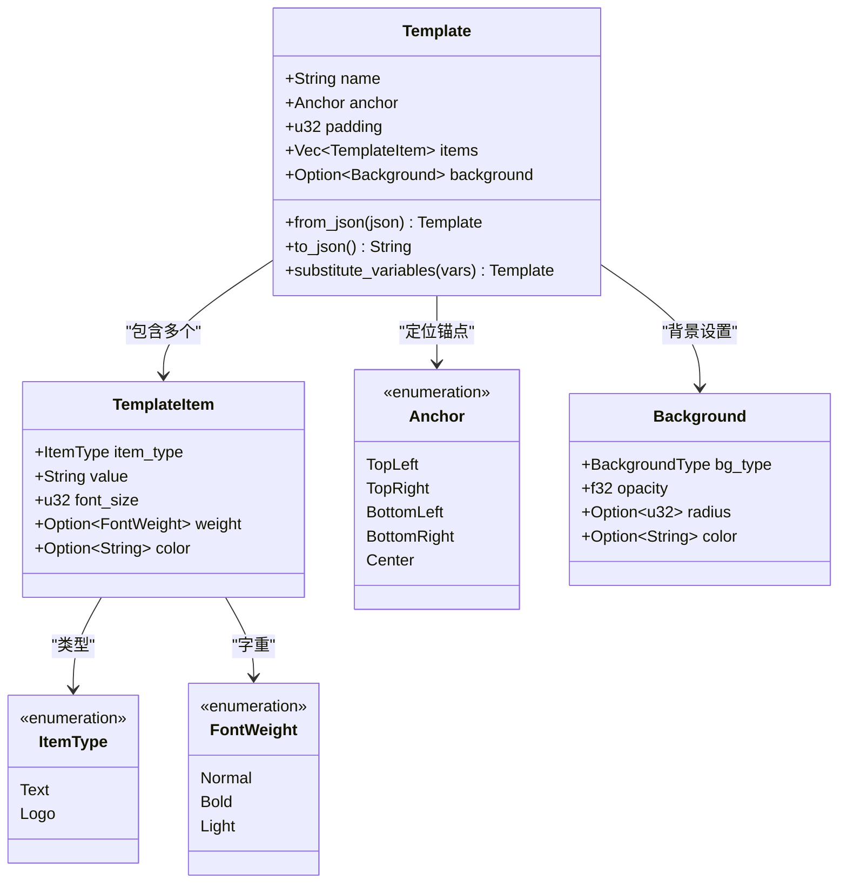
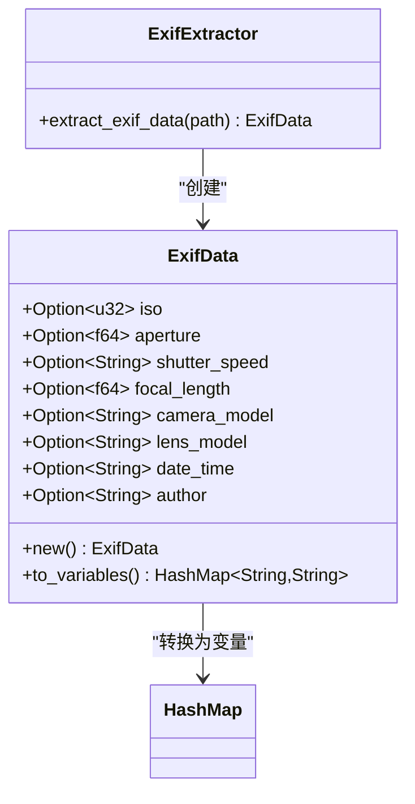
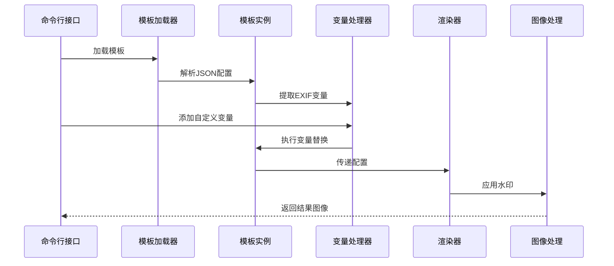
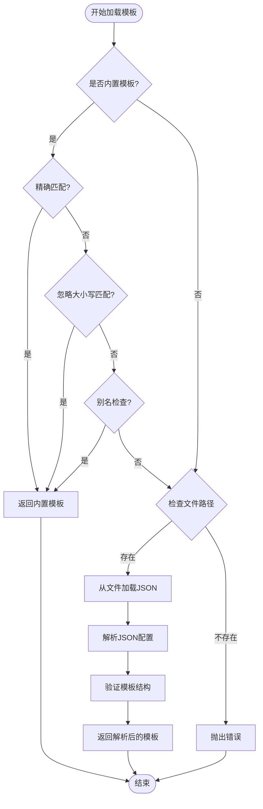
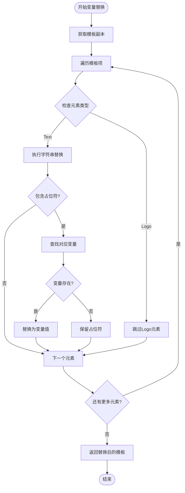
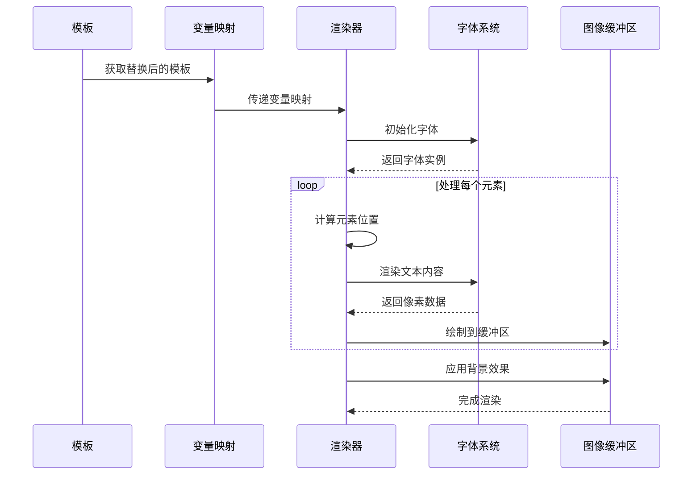
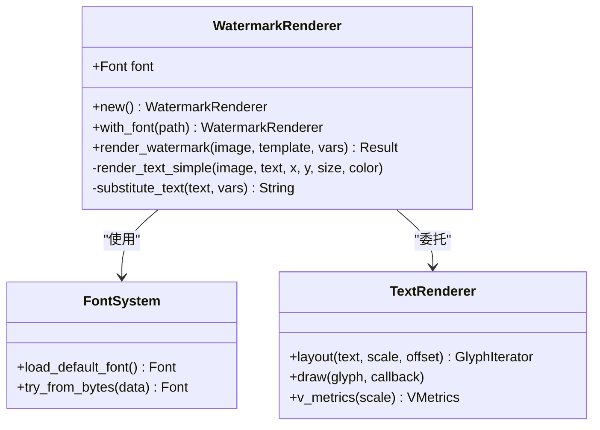
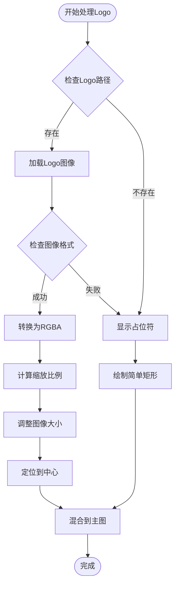
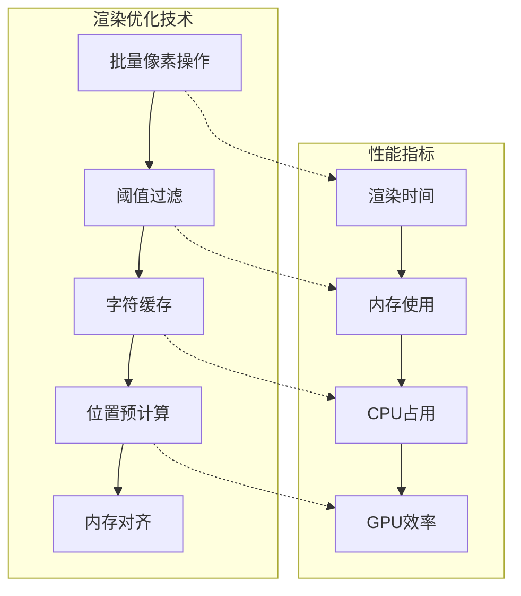

# 模板系统深度技术文档

<cite>
**本文档中引用的文件**
- [src/lib.rs](file://src/lib.rs)
- [src/layout/mod.rs](file://src/layout/mod.rs)
- [src/exif_reader/mod.rs](file://src/exif_reader/mod.rs)
- [src/renderer/mod.rs](file://src/renderer/mod.rs)
- [src/main.rs](file://src/main.rs)
- [src/io/mod.rs](file://src/io/mod.rs)
- [templates/classic.json](file://templates/classic.json)
- [templates/modern.json](file://templates/modern.json)
- [templates/minimal.json](file://templates/minimal.json)
- [Cargo.toml](file://Cargo.toml)
</cite>

## 目录
1. [简介](#简介)
2. [项目结构概览](#项目结构概览)
3. [核心组件分析](#核心组件分析)
4. [模板系统架构](#模板系统架构)
5. [JSON模板结构详解](#json模板结构详解)
6. [变量替换机制](#变量替换机制)
7. [内置模板分析](#内置模板分析)
8. [自定义模板开发指南](#自定义模板开发指南)
9. [渲染引擎实现](#渲染引擎实现)
10. [性能优化考虑](#性能优化考虑)
11. [故障排除指南](#故障排除指南)
12. [总结](#总结)

## 简介

lite-mark-core是一个轻量级的照片参数水印工具，其核心是一个高度可扩展的模板系统。该系统通过JSON配置文件定义水印布局，支持动态变量替换，并提供了灵活的渲染引擎来生成最终的水印效果。

模板系统作为整个框架的核心可扩展机制，允许用户通过简单的JSON配置来自定义水印的外观和内容，同时为开发者提供了强大的编程接口来扩展功能。

## 项目结构概览



**图表来源**
- [src/lib.rs](file://src/lib.rs#L1-L9)
- [src/layout/mod.rs](file://src/layout/mod.rs#L1-L206)
- [src/main.rs](file://src/main.rs#L1-L320)

**章节来源**
- [src/lib.rs](file://src/lib.rs#L1-L9)
- [src/layout/mod.rs](file://src/layout/mod.rs#L1-L206)

## 核心组件分析

### Template结构体

Template是模板系统的核心数据结构，定义了水印的所有属性：



**图表来源**
- [src/layout/mod.rs](file://src/layout/mod.rs#L3-L40)

### EXIF数据处理

ExifData结构体封装了从照片中提取的所有元数据：



**图表来源**
- [src/exif_reader/mod.rs](file://src/exif_reader/mod.rs#L4-L18)

**章节来源**
- [src/layout/mod.rs](file://src/layout/mod.rs#L3-L40)
- [src/exif_reader/mod.rs](file://src/exif_reader/mod.rs#L4-L18)

## 模板系统架构

### 整体架构设计



**图表来源**
- [src/main.rs](file://src/main.rs#L100-L150)
- [src/layout/mod.rs](file://src/layout/mod.rs#L42-L60)

### 模板加载流程



**图表来源**
- [src/main.rs](file://src/main.rs#L250-L290)

**章节来源**
- [src/main.rs](file://src/main.rs#L250-L290)
- [src/layout/mod.rs](file://src/layout/mod.rs#L42-L60)

## JSON模板结构详解

### 基本结构组成

每个JSON模板文件都遵循以下基本结构：

| 字段 | 类型 | 必需 | 描述 |
|------|------|------|------|
| name | String | 是 | 模板名称，用于识别和选择 |
| anchor | String | 是 | 锚点位置：top-left, top-right, bottom-left, bottom-right, center |
| padding | u32 | 是 | 内边距像素值 |
| items | Array | 是 | 水印元素列表 |
| background | Object | 否 | 背景配置对象 |

### TemplateItem元素配置

| 字段 | 类型 | 必需 | 描述 |
|------|------|------|------|
| type | String | 是 | 元素类型：text 或 logo |
| value | String | 是 | 显示内容，支持变量占位符 |
| font_size | u32 | 是 | 字体大小（像素） |
| weight | String | 否 | 字体粗细：normal, bold, light |
| color | String | 否 | 颜色值（十六进制格式） |

### Background背景配置

| 字段 | 类型 | 必需 | 描述 |
|------|------|------|------|
| type | String | 是 | 背景形状：rect 或 circle |
| opacity | f32 | 是 | 不透明度（0.0-1.0） |
| radius | u32 | 否 | 圆角半径（仅矩形有效） |
| color | String | 否 | 背景颜色（十六进制格式） |

**章节来源**
- [src/layout/mod.rs](file://src/layout/mod.rs#L3-L40)
- [templates/classic.json](file://templates/classic.json#L1-L27)
- [templates/modern.json](file://templates/modern.json#L1-L29)
- [templates/minimal.json](file://templates/minimal.json#L1-L17)

## 变量替换机制

### 支持的变量类型

模板系统支持以下预定义变量，这些变量来源于EXIF数据或CLI参数：

| 变量名 | 数据来源 | 格式示例 | 描述 |
|--------|----------|----------|------|
| {Author} | EXIF/CLI | "John Doe" | 作者姓名 |
| {ISO} | EXIF | "100" | 感光度值 |
| {Aperture} | EXIF | "f/2.8" | 光圈值 |
| {Shutter} | EXIF | "1/125" | 快门速度 |
| {Focal} | EXIF | "50mm" | 焦距 |
| {Camera} | EXIF | "Canon EOS R5" | 相机型号 |
| {Lens} | EXIF | "EF 24-70mm f/2.8L II USM" | 镜头型号 |
| {DateTime} | EXIF | "2024:01:15 14:30:25" | 拍摄时间 |

### 变量替换算法



**图表来源**
- [src/layout/mod.rs](file://src/layout/mod.rs#L62-L75)

### 实现细节

变量替换通过`substitute_variables`方法实现，该方法接受一个HashMap作为输入，其中键是变量名，值是对应的替换文本。系统会遍历模板中的每个元素，对文本类型的元素执行字符串替换操作。

**章节来源**
- [src/layout/mod.rs](file://src/layout/mod.rs#L62-L75)
- [src/exif_reader/mod.rs](file://src/exif_reader/mod.rs#L35-L55)

## 内置模板分析

### Classic经典模板

Classic模板采用传统的底部左对齐布局，适合需要突出显示基本信息的场景：

```mermaid
graph LR
subgraph "Classic模板布局"
A[Logo] --> B[作者姓名<br/>{Author}]
B --> C[参数信息<br/>{Aperture} | ISO {ISO} | {Shutter}]
end
subgraph "视觉特征"
D[白色文字]
E[黑色背景]
F[30%不透明度]
end
```

**图表来源**
- [templates/classic.json](file://templates/classic.json#L1-L27)

### Modern现代模板

Modern模板采用简洁的右上角布局，具有半透明背景：

```mermaid
graph LR
subgraph "Modern模板布局"
A[相机镜头信息<br/>{Camera} • {Lens}]
B[详细参数<br/>{Focal} • {Aperture} • {Shutter} • ISO {ISO}]
end
subgraph "视觉特征"
C[白色粗体标题]
D[灰色正文]
E[黑色半透明白底]
end
```

**图表来源**
- [templates/modern.json](file://templates/modern.json#L1-L29)

### Minimal极简模板

Minimal模板提供最简洁的签名方案：

```mermaid
graph LR
subgraph "Minimal模板布局"
A[作者姓名<br/>{Author}]
end
subgraph "视觉特征"
B[白色文字]
C[无背景]
end
```

**图表来源**
- [templates/minimal.json](file://templates/minimal.json#L1-L17)

**章节来源**
- [templates/classic.json](file://templates/classic.json#L1-L27)
- [templates/modern.json](file://templates/modern.json#L1-L29)
- [templates/minimal.json](file://templates/minimal.json#L1-L17)
- [src/layout/mod.rs](file://src/layout/mod.rs#L80-L140)

## 自定义模板开发指南

### 创建自定义模板的步骤

#### 第一步：确定布局需求

在开始编写JSON之前，需要明确以下要素：
- **锚点位置**：选择合适的定位点
- **元素数量**：决定显示多少个信息块
- **视觉层次**：规划主次信息的展示顺序
- **颜色方案**：确定整体色调

#### 第二步：JSON结构设计

基于需求设计模板的基本结构：

```json
{
    "name": "CustomTemplate",
    "anchor": "bottom-right",
    "padding": 20,
    "items": [],
    "background": null
}
```

#### 第三步：添加文本元素

根据需要添加不同类型的文本元素：

```json
{
    "type": "text",
    "value": "{Camera} • {Lens}",
    "font_size": 16,
    "weight": "bold",
    "color": "#FFFFFF"
}
```

#### 第四步：配置Logo元素

如果需要添加Logo：

```json
{
    "type": "logo",
    "value": "/path/to/logo.png",
    "font_size": 0,
    "weight": null,
    "color": null
}
```

#### 第五步：添加背景装饰

为增强视觉效果可以添加背景：

```json
"background": {
    "type": "rect",
    "opacity": 0.3,
    "radius": 8,
    "color": "#000000"
}
```

### 模板定制技巧

#### 字体样式调整

| 属性 | 可选值 | 效果 |
|------|--------|------|
| font_size | 数值（像素） | 控制文字大小 |
| weight | normal/bold/light | 设置字体粗细 |
| color | 十六进制颜色码 | 定义文字颜色 |

#### 布局优化策略

1. **间距控制**：合理设置padding值确保内容不拥挤
2. **层次分明**：使用不同的字体大小区分主次信息
3. **色彩对比**：确保文字与背景有足够的对比度
4. **响应式设计**：考虑不同尺寸图片的适配性

#### 高级定制选项

```json
{
    "name": "AdvancedTemplate",
    "anchor": "center",
    "padding": 10,
    "items": [
        {
            "type": "text",
            "value": "{Author} - {DateTime}",
            "font_size": 18,
            "weight": "bold",
            "color": "#FF6B6B"
        },
        {
            "type": "text",
            "value": "{Camera} | {Lens} | ISO {ISO}",
            "font_size": 14,
            "weight": "normal",
            "color": "#4ECDC4"
        }
    ],
    "background": {
        "type": "circle",
        "opacity": 0.8,
        "radius": 15,
        "color": "#2C3E50"
    }
}
```

### 测试和验证

#### 模板测试流程

1. **语法验证**：确保JSON格式正确
2. **变量测试**：验证所有占位符都能正确替换
3. **视觉测试**：检查在不同图片上的显示效果
4. **兼容性测试**：确保在各种设备上正常工作

#### 调试技巧

- 使用`litemark show-template`命令查看模板详情
- 通过CLI参数覆盖默认变量值进行测试
- 利用日志输出跟踪变量替换过程

**章节来源**
- [src/layout/mod.rs](file://src/layout/mod.rs#L80-L140)
- [src/main.rs](file://src/main.rs#L300-L320)

## 渲染引擎实现

### 渲染流水线



**图表来源**
- [src/renderer/mod.rs](file://src/renderer/mod.rs#L60-L120)

### 字体渲染系统

渲染引擎使用rusttype库进行高质量字体渲染：



**图表来源**
- [src/renderer/mod.rs](file://src/renderer/mod.rs#L10-L50)

### Logo处理机制



**图表来源**
- [src/renderer/mod.rs](file://src/renderer/mod.rs#L250-L320)

### 性能优化策略

#### 字体缓存机制

渲染器维护字体实例的生命周期，避免重复加载相同字体文件：

- 默认字体嵌入编译时资源
- 支持自定义字体文件动态加载
- 字体数据安全地泄露为静态引用

#### 文本渲染优化

- 使用rusttype的高效字符布局算法
- 实现字符级别的像素级精确控制
- 通过阈值过滤避免过度渲染微弱像素

**章节来源**
- [src/renderer/mod.rs](file://src/renderer/mod.rs#L10-L50)
- [src/renderer/mod.rs](file://src/renderer/mod.rs#L250-L320)
- [src/renderer/mod.rs](file://src/renderer/mod.rs#L400-L450)

## 性能优化考虑

### 内存管理策略

模板系统采用多种内存优化技术：

1. **零拷贝设计**：大量使用引用和借用避免不必要的数据复制
2. **静态字体缓存**：默认字体在编译时嵌入，运行时无需额外分配
3. **智能指针使用**：合理使用Box和Arc管理动态内存

### 渲染性能优化



### 批处理优化

对于批量处理场景，系统实现了以下优化：

- **并行处理**：支持多线程处理多个文件
- **进度跟踪**：实时显示处理进度和状态
- **错误恢复**：单个文件失败不影响整体流程

## 故障排除指南

### 常见问题及解决方案

#### 模板加载失败

**问题症状**：提示"Template not found"错误

**可能原因**：
1. 模板名称拼写错误
2. 自定义模板文件不存在
3. JSON格式语法错误

**解决步骤**：
1. 使用`litemark templates`列出可用模板
2. 检查模板文件路径和权限
3. 验证JSON语法有效性

#### 变量替换异常

**问题症状**：占位符未被替换或显示为原始文本

**可能原因**：
1. EXIF数据缺失相应字段
2. 变量名大小写不匹配
3. 自定义变量未正确传递

**解决步骤**：
1. 使用CLI `--author`参数手动指定作者
2. 检查EXIF数据完整性
3. 验证变量名格式（必须大括号包围）

#### 渲染质量问题

**问题症状**：文字模糊或颜色不正确

**可能原因**：
1. 字体文件损坏或缺失
2. 分辨率不匹配
3. 颜色空间差异

**解决步骤**：
1. 指定正确的字体文件路径
2. 调整字体大小适应图片分辨率
3. 检查颜色值格式是否正确

### 调试工具和技术

#### 日志分析

系统提供详细的调试信息：
- 模板加载过程记录
- 变量替换步骤追踪
- 渲染性能统计

#### 配置验证

```bash
# 查看模板详细信息
litemark show-template classic

# 列出所有可用模板
litemark templates

# 测试单个文件处理
litemark add --input test.jpg --output result.jpg --template custom
```

**章节来源**
- [src/main.rs](file://src/main.rs#L300-L320)
- [src/layout/mod.rs](file://src/layout/mod.rs#L180-L206)

## 总结

lite-mark-core的模板系统是一个设计精良、功能完备的水印解决方案。它通过以下特性实现了高度的可扩展性和易用性：

### 技术优势

1. **模块化架构**：清晰的职责分离使系统易于维护和扩展
2. **类型安全**：利用Rust的类型系统确保编译时安全性
3. **高性能渲染**：基于rusttype的高质量字体渲染
4. **灵活配置**：JSON配置支持复杂的布局和样式定制

### 设计理念

- **用户友好**：提供直观的命令行接口和丰富的内置模板
- **开发者友好**：清晰的API设计和完善的错误处理
- **可扩展性**：插件化的模板系统支持自定义开发
- **跨平台**：基于标准库的跨平台兼容性

### 应用价值

模板系统不仅满足了普通用户的个性化需求，更为开发者提供了强大的定制能力。通过合理的抽象和封装，系统在保持功能丰富的同时维持了良好的性能表现。

该模板系统代表了现代软件工程中配置驱动开发的最佳实践，为类似项目提供了优秀的参考范例。