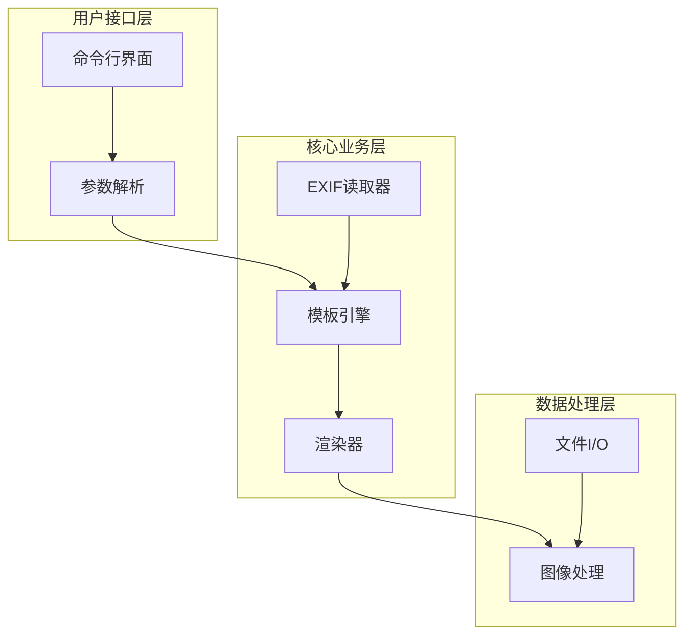
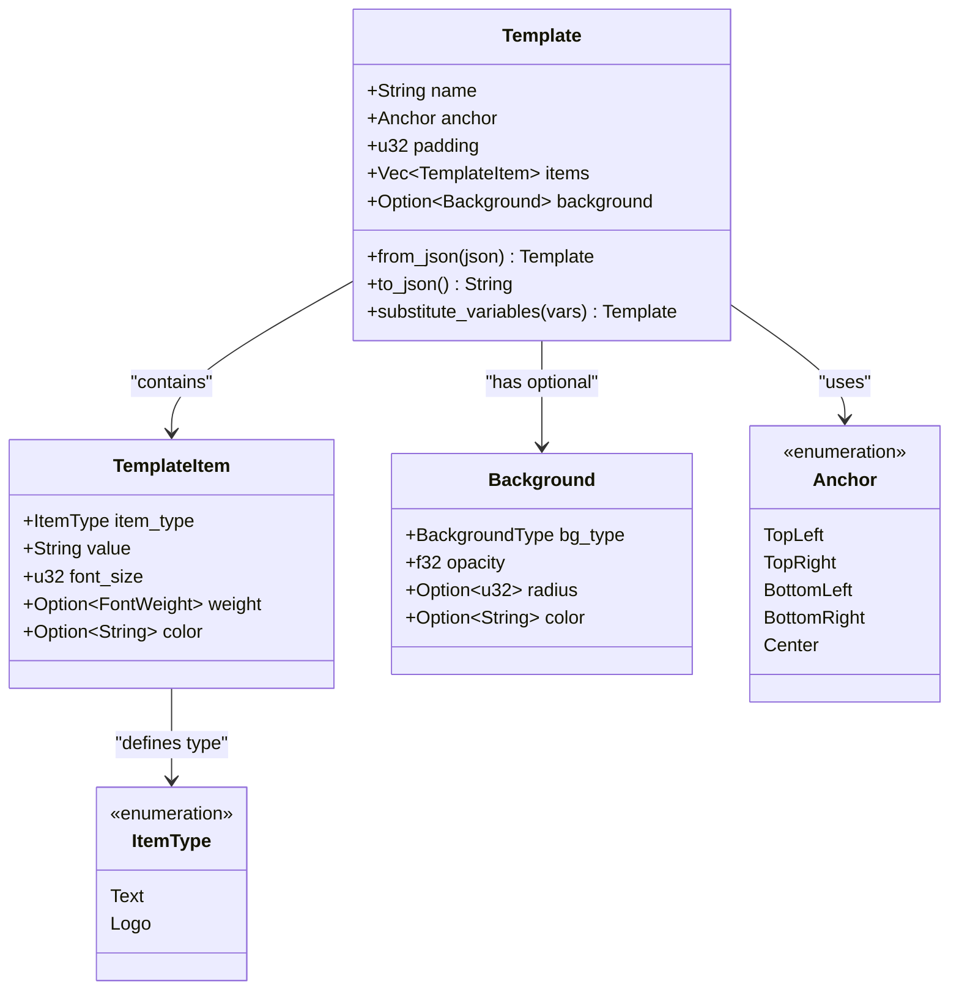
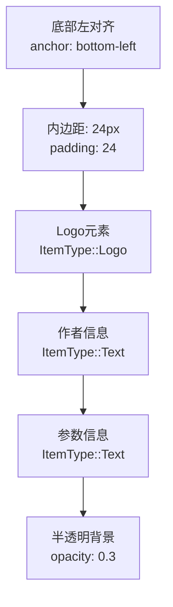
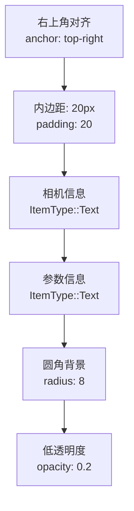
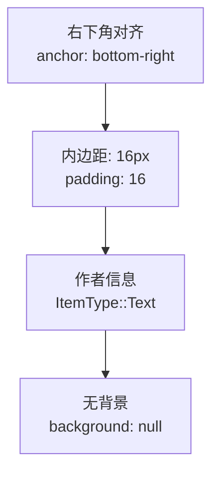
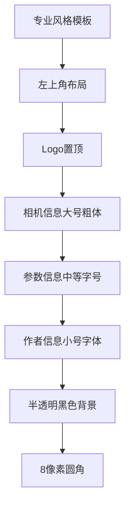

# 自定义模板创建指南

<cite>
**本文档中引用的文件**
- [templates/classic.json](file://templates/classic.json)
- [templates/modern.json](file://templates/modern.json)
- [templates/minimal.json](file://templates/minimal.json)
- [src/lib.rs](file://src/lib.rs)
- [src/layout/mod.rs](file://src/layout/mod.rs)
- [src/renderer/mod.rs](file://src/renderer/mod.rs)
- [src/main.rs](file://src/main.rs)
- [src/io/mod.rs](file://src/io/mod.rs)
- [README.md](file://README.md)
</cite>

## 目录
1. [简介](#简介)
2. [项目架构概览](#项目架构概览)
3. [模板系统核心概念](#模板系统核心概念)
4. [现有模板分析](#现有模板分析)
5. [JSON模板结构详解](#json模板结构详解)
6. [模板创建步骤](#模板创建步骤)
7. [完整示例：创建Professional模板](#完整示例创建professional模板)
8. [高级用法与最佳实践](#高级用法与最佳实践)
9. [调试与故障排除](#调试与故障排除)
10. [总结](#总结)

## 简介

LiteMark是一个轻量级的照片参数水印工具，采用JSON驱动的模板系统来实现灵活的布局定制。本指南将详细说明如何创建和使用自定义JSON模板文件，帮助用户根据需求设计个性化的水印布局。

## 项目架构概览

LiteMark采用模块化架构设计，核心功能分布在以下模块中：



**图表来源**
- [src/main.rs](file://src/main.rs#L1-L50)
- [src/lib.rs](file://src/lib.rs#L1-L9)

**章节来源**
- [src/lib.rs](file://src/lib.rs#L1-L9)
- [src/main.rs](file://src/main.rs#L1-L320)

## 模板系统核心概念

### 模板结构组成

每个JSON模板文件包含以下核心组件：



**图表来源**
- [src/layout/mod.rs](file://src/layout/mod.rs#L3-L50)

### 变量替换机制

模板支持动态变量替换，可用的占位符包括：
- `{Author}` - 摄影师姓名
- `{ISO}` - ISO感光度
- `{Aperture}` - 光圈值
- `{Shutter}` - 快门速度
- `{Focal}` - 焦距
- `{Camera}` - 相机型号
- `{Lens}` - 镜头型号
- `{DateTime}` - 拍摄时间

**章节来源**
- [src/layout/mod.rs](file://src/layout/mod.rs#L85-L105)

## 现有模板分析

### Classic模板（经典风格）

Classic模板是默认模板，采用底部左对齐布局：



**图表来源**
- [templates/classic.json](file://templates/classic.json#L1-L27)

### Modern模板（现代风格）

Modern模板采用右上角布局，具有圆角矩形背景：



**图表来源**
- [templates/modern.json](file://templates/modern.json#L1-L29)

### Minimal模板（极简风格）

Minimal模板是最简单的布局，仅显示作者信息：



**图表来源**
- [templates/minimal.json](file://templates/minimal.json#L1-L17)

**章节来源**
- [templates/classic.json](file://templates/classic.json#L1-L27)
- [templates/modern.json](file://templates/modern.json#L1-L29)
- [templates/minimal.json](file://templates/minimal.json#L1-L17)

## JSON模板结构详解

### 基础模板结构

```json
{
    "name": "模板名称",
    "anchor": "对齐方式",
    "padding": 内边距大小,
    "items": [
        {
            "type": "元素类型",
            "value": "内容或路径",
            "font_size": 字体大小,
            "weight": "字体粗细",
            "color": "颜色值"
        }
    ],
    "background": {
        "type": "背景类型",
        "opacity": 透明度,
        "radius": 圆角半径,
        "color": "背景颜色"
    }
}
```

### 锚点定位选项

| 锚点位置 | 描述 | 使用场景 |
|---------|------|----------|
| `top-left` | 左上角 | 标志性水印、品牌标识 |
| `top-right` | 右上角 | 现代风格、简洁布局 |
| `bottom-left` | 左下角 | 经典风格、传统布局 |
| `bottom-right` | 右下角 | 极简风格、低调标识 |
| `center` | 居中 | 特殊效果、艺术风格 |

### 元素类型配置

#### 文本元素（ItemType::Text）
```json
{
    "type": "text",
    "value": "{Camera} • {Lens} • {Aperture} • ISO {ISO}",
    "font_size": 16,
    "weight": "bold",
    "color": "#FFFFFF"
}
```

#### Logo元素（ItemType::Logo）
```json
{
    "type": "logo",
    "value": "path/to/logo.png",
    "font_size": 0,
    "weight": null,
    "color": null
}
```

### 背景配置选项

#### 矩形背景
```json
{
    "type": "rect",
    "opacity": 0.5,
    "radius": 10,
    "color": "#000000"
}
```

#### 圆形背景
```json
{
    "type": "circle",
    "opacity": 0.7,
    "radius": null,
    "color": "#FFFFFF"
}
```

**章节来源**
- [src/layout/mod.rs](file://src/layout/mod.rs#L3-L50)

## 模板创建步骤

### 步骤1：复制现有模板

从现有的内置模板开始是最简单的方法：

```bash
# 复制classic.json为自定义模板
cp templates/classic.json templates/professional.json
```

### 步骤2：修改锚点位置

将锚点从底部左对齐改为顶部左对齐：

```json
{
    "name": "Professional",
    "anchor": "top-left",
    "padding": 24,
    ...
}
```

### 步骤3：调整字体样式

修改字体大小和颜色：

```json
{
    "type": "text",
    "value": "{Author}",
    "font_size": 18,
    "weight": "bold",
    "color": "#FF0000"
}
```

### 步骤4：添加Logo元素

在模板中添加Logo元素：

```json
{
    "type": "logo",
    "value": "path/to/your-logo.png",
    "font_size": 0,
    "weight": null,
    "color": null
}
```

### 步骤5：创建现代风格背景

添加圆角矩形背景：

```json
{
    "background": {
        "type": "rect",
        "opacity": 0.3,
        "radius": 8,
        "color": "#000000"
    }
}
```

**章节来源**
- [templates/classic.json](file://templates/classic.json#L1-L27)

## 完整示例：创建Professional模板

以下是完整的Professional模板示例，包含相机型号、镜头、曝光参数和作者信息的多行排版：

```json
{
    "name": "Professional",
    "anchor": "top-left",
    "padding": 24,
    "items": [
        {
            "type": "logo",
            "value": "path/to/your-logo.png",
            "font_size": 0,
            "weight": null,
            "color": null
        },
        {
            "type": "text",
            "value": "{Camera} • {Lens}",
            "font_size": 18,
            "weight": "bold",
            "color": "#FFFFFF"
        },
        {
            "type": "text",
            "value": "{Focal}mm • {Aperture} • {Shutter} • ISO {ISO}",
            "font_size": 14,
            "weight": "normal",
            "color": "#CCCCCC"
        },
        {
            "type": "text",
            "value": "{Author}",
            "font_size": 16,
            "weight": "normal",
            "color": "#FFFFFF"
        }
    ],
    "background": {
        "type": "rect",
        "opacity": 0.3,
        "radius": 8,
        "color": "#000000"
    }
}
```

### 模板效果说明



**图表来源**
- [src/layout/mod.rs](file://src/layout/mod.rs#L107-L150)

### 使用自定义模板

创建模板后，可以通过命令行参数使用：

```bash
# 使用自定义JSON文件
litemark add -i input.jpg -t ./templates/professional.json -o output.jpg

# 或者使用相对路径
litemark add -i input.jpg -t ./templates/professional.json -o output.jpg --author "摄影师姓名"
```

**章节来源**
- [src/main.rs](file://src/main.rs#L100-L150)

## 高级用法与最佳实践

### 程序化模板创建

除了JSON文件方式，还可以通过编程方式创建模板：

```rust
use litemark::{Template, Anchor, TemplateItem, ItemType, FontWeight, Background, BackgroundType};

let professional_template = Template {
    name: "Professional".to_string(),
    anchor: Anchor::TopLeft,
    padding: 24,
    items: vec![
        TemplateItem {
            item_type: ItemType::Logo,
            value: "path/to/logo.png".to_string(),
            font_size: 0,
            weight: None,
            color: None,
        },
        TemplateItem {
            item_type: ItemType::Text,
            value: "{Camera} • {Lens}".to_string(),
            font_size: 18,
            weight: Some(FontWeight::Bold),
            color: Some("#FFFFFF".to_string()),
        },
        // ... 其他元素
    ],
    background: Some(Background {
        bg_type: BackgroundType::Rectangle,
        opacity: 0.3,
        radius: Some(8),
        color: Some("#000000".to_string()),
    }),
};
```

### 动态模板生成

利用模板的变量替换功能，可以创建动态模板：

```rust
// 创建基础模板
let base_template = Template::from_json(r#"{
    "name": "Dynamic",
    "anchor": "bottom-right",
    "padding": 16,
    "items": [
        {
            "type": "text",
            "value": "{Author} • {DateTime}",
            "font_size": 14,
            "weight": "normal",
            "color": "#FFFFFF"
        }
    ]
}"#)?;

// 动态修改模板
let mut dynamic_template = base_template.clone();
dynamic_template.name = "Customized".to_string();
dynamic_template.padding = 20;

// 替换变量
let variables = [("Author", "John Doe"), ("DateTime", "2024-01-15")];
let final_template = dynamic_template.substitute_variables(&variables);
```

### 性能优化建议

1. **合理设置内边距**：避免过大的padding影响整体布局
2. **选择合适的字体大小**：根据目标分辨率调整字体尺寸
3. **优化背景透明度**：平衡可见性和美观性
4. **Logo尺寸控制**：确保Logo在不同分辨率下清晰可辨

### 多语言支持

模板系统支持多种语言字符：

```json
{
    "value": "相机: {Camera} • 镜头: {Lens} • 作者: {Author}"
}
```

**章节来源**
- [src/layout/mod.rs](file://src/layout/mod.rs#L60-L85)

## 调试与故障排除

### 常见JSON语法错误

#### 错误1：缺少逗号
```json
// ❌ 错误格式
{
    "name": "Test",
    "anchor": "top-left"
    "padding": 10
}
```

#### 正确格式
```json
// ✅ 正确格式
{
    "name": "Test",
    "anchor": "top-left",
    "padding": 10
}
```

#### 错误2：引号不匹配
```json
// ❌ 错误格式
{
    "name": Test
}
```

#### 正确格式
```json
// ✅ 正确格式
{
    "name": "Test"
}
```

### 使用serde反序列化错误

当JSON解析失败时，serde会提供详细的错误信息：

```rust
match Template::from_json(json_content) {
    Ok(template) => println!("模板加载成功"),
    Err(error) => {
        eprintln!("JSON解析错误: {}", error);
        eprintln!("请检查JSON语法和字段类型");
    }
}
```

### 调试技巧

1. **使用在线JSON验证器**：确保JSON语法正确
2. **分步测试**：先测试基本结构，再添加复杂元素
3. **检查文件路径**：确保Logo路径正确且文件存在
4. **验证变量名**：确认使用的变量名在EXIF数据中存在

### 常见问题解决

#### 问题1：模板不显示
- 检查JSON语法是否正确
- 验证文件路径是否存在
- 确认锚点位置不会导致内容被裁剪

#### 问题2：Logo不显示
- 确认Logo文件格式支持（PNG、JPG等）
- 检查文件路径是否正确
- 验证文件权限是否可读

#### 问题3：字体显示异常
- 确认字体文件路径正确
- 检查字体文件是否损坏
- 验证字体格式是否受支持

**章节来源**
- [src/layout/mod.rs](file://src/layout/mod.rs#L60-L85)
- [src/main.rs](file://src/main.rs#L280-L320)

## 总结

LiteMark的模板系统提供了强大而灵活的定制能力，通过JSON配置即可实现复杂的水印布局设计。本指南涵盖了从基础模板修改到高级程序化创建的完整流程，帮助用户充分发挥模板系统的潜力。

### 关键要点回顾

1. **模板结构**：掌握JSON模板的基本结构和各个字段的作用
2. **锚点定位**：理解不同锚点对布局的影响
3. **元素类型**：熟悉文本和Logo元素的配置方法
4. **背景设置**：学会创建现代风格的圆角矩形背景
5. **变量替换**：利用动态变量实现个性化内容
6. **调试技巧**：掌握JSON语法检查和错误排查方法

### 最佳实践建议

- 从现有模板开始，逐步调整满足需求
- 保持JSON格式的一致性和可读性
- 测试不同分辨率下的显示效果
- 合理设置透明度和颜色对比度
- 定期备份自定义模板文件

通过遵循本指南的步骤和建议，用户可以创建出符合个人或品牌需求的专业级水印模板，提升照片作品的专业性和识别度。