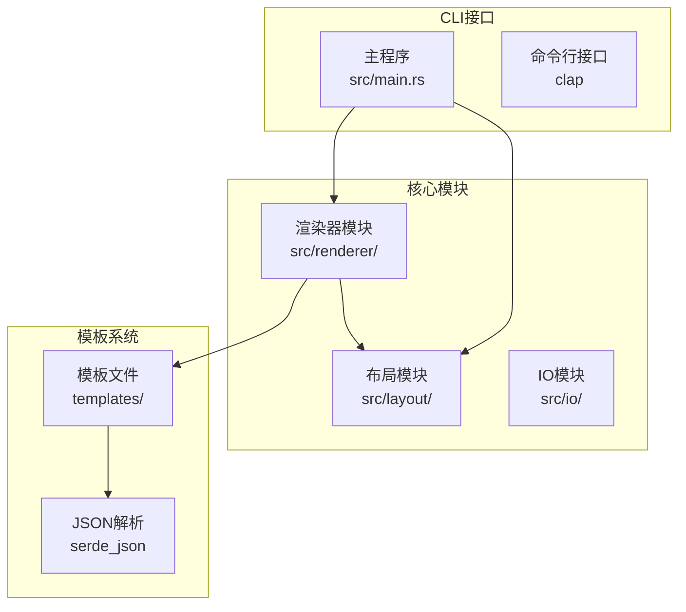
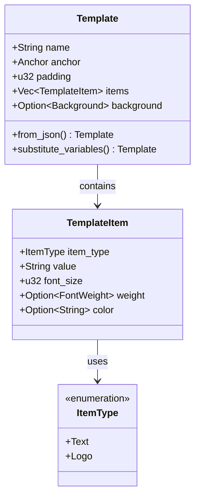
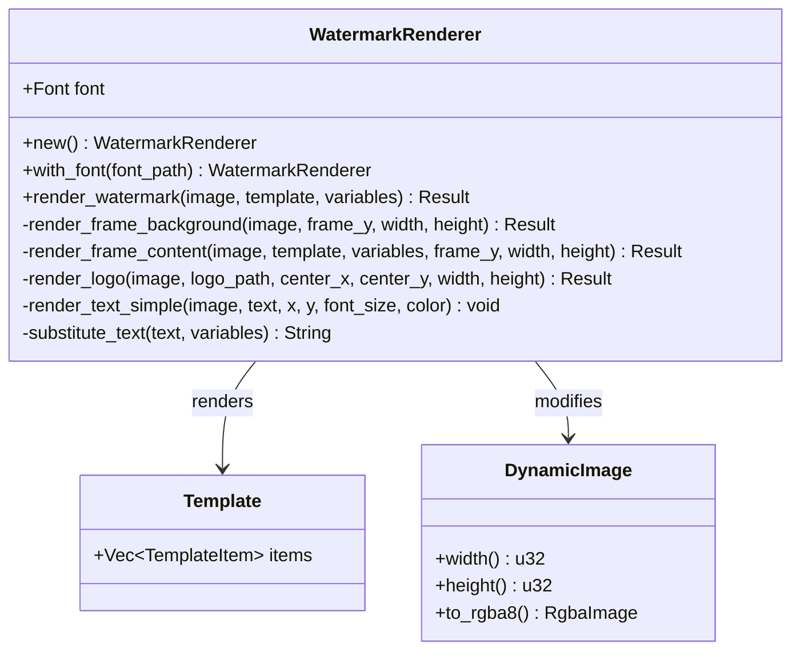
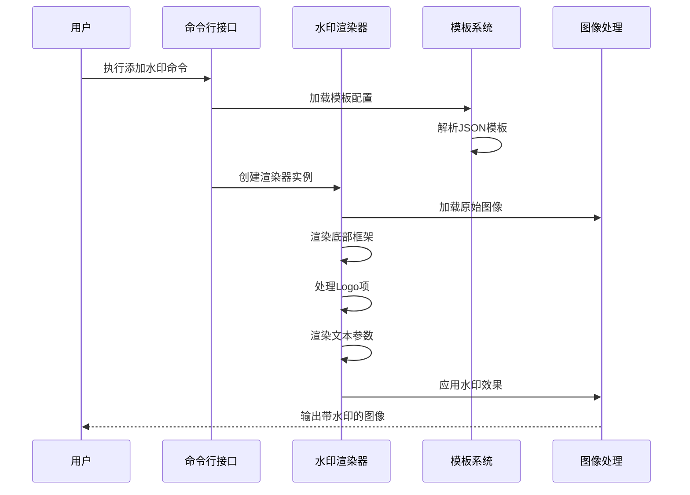
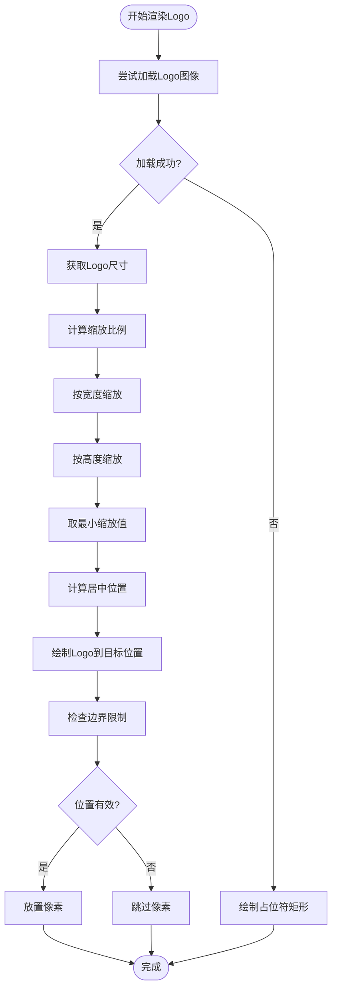
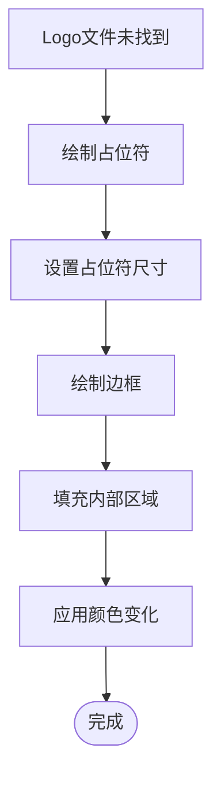
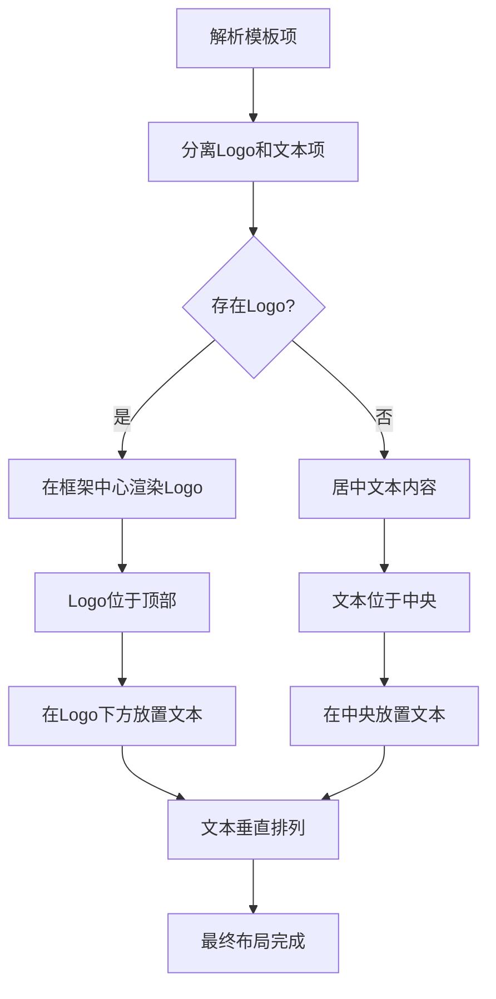
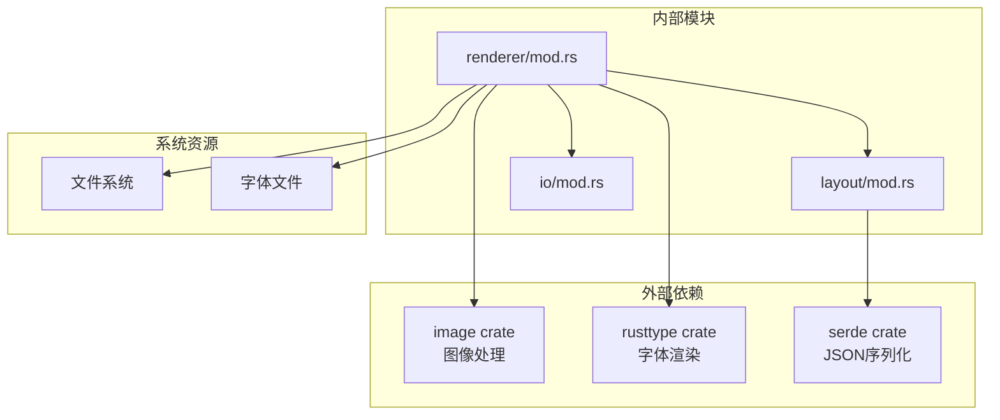

# Logo集成

<cite>
**本文档中引用的文件**
- [src/renderer/mod.rs](file://src/renderer/mod.rs)
- [src/layout/mod.rs](file://src/layout/mod.rs)
- [src/lib.rs](file://src/lib.rs)
- [src/main.rs](file://src/main.rs)
- [templates/classic.json](file://templates/classic.json)
- [templates/minimal.json](file://templates/minimal.json)
- [templates/modern.json](file://templates/modern.json)
- [README.md](file://README.md)
</cite>

## 目录
1. [简介](#简介)
2. [项目结构](#项目结构)
3. [核心组件](#核心组件)
4. [架构概览](#架构概览)
5. [详细组件分析](#详细组件分析)
6. [依赖关系分析](#依赖关系分析)
7. [性能考虑](#性能考虑)
8. [故障排除指南](#故障排除指南)
9. [结论](#结论)

## 简介

LiteMark是一个轻量级的照片参数水印工具，提供了强大的Logo集成功能。该功能允许用户在照片底部框架中添加自定义Logo图像，支持自动缩放、居中定位以及优雅的降级处理机制。Logo集成是框架模式的核心特性之一，为摄影作品增添了专业性和品牌识别度。

## 项目结构

LiteMark采用模块化架构设计，Logo集成功能分布在多个关键模块中：

**图表来源**
- [src/renderer/mod.rs](file://src/renderer/mod.rs#L1-L50)
- [src/layout/mod.rs](file://src/layout/mod.rs#L1-L30)
- [src/main.rs](file://src/main.rs#L1-L20)

**章节来源**
- [src/lib.rs](file://src/lib.rs#L1-L9)
- [README.md](file://README.md#L1-L50)

## 核心组件

### ItemType枚举定义

Logo集成的核心在于ItemType枚举的定义，它标识了模板中的不同元素类型：

**图表来源**
- [src/layout/mod.rs](file://src/layout/mod.rs#L36-L42)
- [src/layout/mod.rs](file://src/layout/mod.rs#L25-L35)

### WatermarkRenderer核心功能

WatermarkRenderer是Logo渲染功能的主要执行者，负责整个水印生成流程：

**图表来源**
- [src/renderer/mod.rs](file://src/renderer/mod.rs#L10-L50)
- [src/renderer/mod.rs](file://src/renderer/mod.rs#L150-L200)

**章节来源**
- [src/renderer/mod.rs](file://src/renderer/mod.rs#L1-L100)
- [src/layout/mod.rs](file://src/layout/mod.rs#L36-L42)

## 架构概览

Logo集成功能在整个系统中的位置和交互关系：

**图表来源**
- [src/main.rs](file://src/main.rs#L80-L120)
- [src/renderer/mod.rs](file://src/renderer/mod.rs#L60-L120)

## 详细组件分析

### render_logo方法实现

render_logo方法是Logo集成功能的核心实现，负责加载、缩放和渲染Logo图像：

**图表来源**
- [src/renderer/mod.rs](file://src/renderer/mod.rs#L280-L350)

#### Logo加载与缩放逻辑

Logo图像的加载和自动缩放是通过以下步骤实现的：

1. **图像加载验证**：使用image::open函数尝试加载指定路径的图像文件
2. **尺寸计算**：获取原始Logo尺寸并计算适合框架区域的缩放比例
3. **等比缩放**：保持宽高比不变，确保Logo不失真
4. **边界适配**：根据预设的宽度和高度限制进行最终缩放
5. **居中定位**：计算Logo在框架中的中心位置坐标

#### 占位符降级机制

当指定的Logo文件不存在时，系统会自动启用降级处理：

**图表来源**
- [src/renderer/mod.rs](file://src/renderer/mod.rs#L320-L350)

### 框架内容渲染流程

Logo与文本参数的垂直布局遵循特定的层次结构：

**图表来源**
- [src/renderer/mod.rs](file://src/renderer/mod.rs#L150-L220)

**章节来源**
- [src/renderer/mod.rs](file://src/renderer/mod.rs#L280-L380)

### 模板配置示例

#### 经典模板配置

经典模板展示了Logo与文本参数的标准布局：

| 配置项 | 值 | 说明 |
|--------|-----|------|
| 类型 | `logo` | 标识该项为Logo类型 |
| 路径 | `"path/to/logo.png"` | Logo图像文件路径 |
| 字体大小 | `0` | Logo项不使用字体 |
| 权重 | `None` | Logo项无字体权重 |
| 颜色 | `None` | Logo项无颜色属性 |

#### 现代模板配置

现代模板同样支持Logo集成，但具有不同的视觉风格：

| 配置项 | 值 | 说明 |
|--------|-----|------|
| 锚点 | `"top-right"` | 框架位于图片右上角 |
| 内边距 | `20` | 框架内边距20像素 |
| 背景 | `{"type": "rect", "opacity": 0.2}` | 半透明矩形背景 |
| 字体颜色 | `{"#FFFFFF"}` | 白色文字 |

**章节来源**
- [templates/classic.json](file://templates/classic.json#L1-L27)
- [templates/modern.json](file://templates/modern.json#L1-L29)

## 依赖关系分析

Logo集成功能涉及多个外部依赖和内部模块间的复杂关系：

**图表来源**
- [src/renderer/mod.rs](file://src/renderer/mod.rs#L1-L10)
- [Cargo.toml](file://Cargo.toml#L1-L20)

**章节来源**
- [src/renderer/mod.rs](file://src/renderer/mod.rs#L1-L20)
- [src/layout/mod.rs](file://src/layout/mod.rs#L1-L10)

## 性能考虑

### 图像处理优化

Logo渲染过程中的性能优化策略：

1. **内存管理**：使用RgbaImage直接操作像素数据，避免不必要的内存拷贝
2. **边界检查**：在像素放置前进行边界验证，减少无效操作
3. **缩放算法**：采用简单的最近邻插值，平衡质量和性能
4. **错误处理**：快速失败机制，避免无效文件的深度处理

### 缓存策略

系统实现了多层次的缓存机制：
- 字体数据在渲染器初始化时加载并缓存
- 模板配置解析结果被重复利用
- 图像文件访问路径进行本地缓存

## 故障排除指南

### 常见问题及解决方案

#### Logo文件加载失败

**症状**：Logo无法显示，控制台输出"Logo file not found"消息

**原因分析**：
- 指定的Logo文件路径不存在
- 文件权限不足
- 图像格式不支持

**解决方案**：
1. 验证文件路径的正确性
2. 检查文件读取权限
3. 使用支持的图像格式（PNG、JPEG等）
4. 在模板中设置相对路径或绝对路径

#### Logo显示异常

**症状**：Logo显示模糊或位置偏移

**原因分析**：
- Logo图像分辨率过低
- 缩放比例计算错误
- 坐标计算偏差

**解决方案**：
1. 使用高分辨率Logo图像
2. 调整模板中的尺寸参数
3. 检查框架高度设置

#### 性能问题

**症状**：Logo渲染速度缓慢

**原因分析**：
- Logo图像过大
- 系统资源不足
- 模板配置复杂

**解决方案**：
1. 压缩Logo图像文件
2. 减少同时处理的图像数量
3. 简化模板配置

**章节来源**
- [src/renderer/mod.rs](file://src/renderer/mod.rs#L320-L350)

## 结论

LiteMark的Logo集成功能提供了一个完整、高效的解决方案，用于在照片底部框架中添加品牌标识。该功能具有以下优势：

1. **灵活的配置**：通过JSON模板系统支持多种Logo配置方式
2. **智能缩放**：自动适应框架区域的Logo尺寸调整
3. **优雅降级**：文件缺失时的友好提示和替代方案
4. **高性能渲染**：优化的像素操作和边界检查机制
5. **跨平台兼容**：支持多种操作系统和图像格式

该功能不仅满足了专业摄影师的品牌展示需求，也为个人用户提供了一个简单易用的水印解决方案。随着系统的持续发展，Logo集成功能将继续优化，支持更多高级特性如动态Logo、渐变效果等。