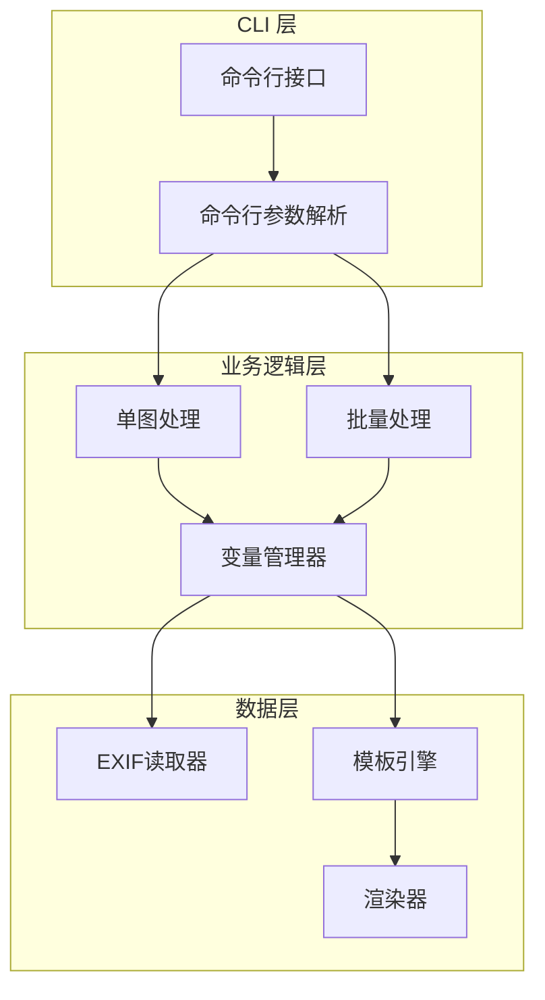
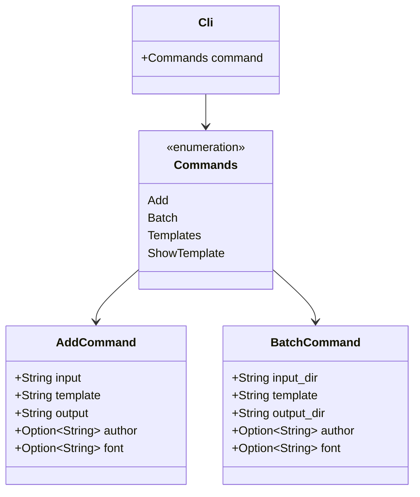
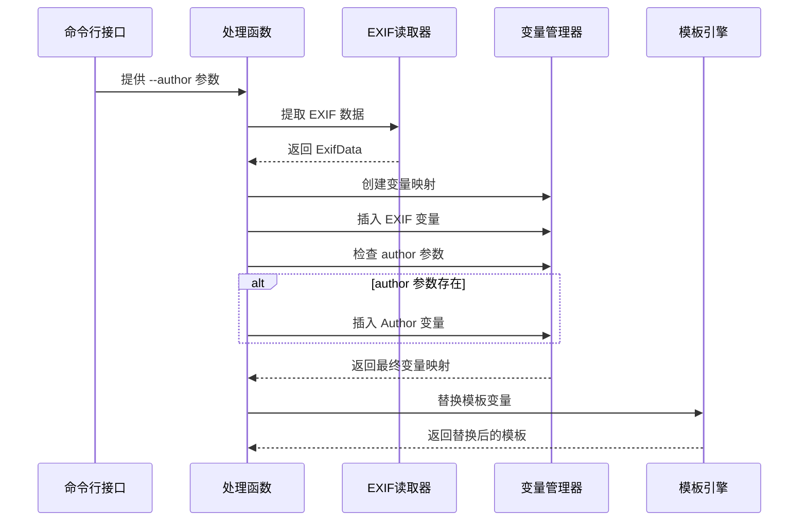
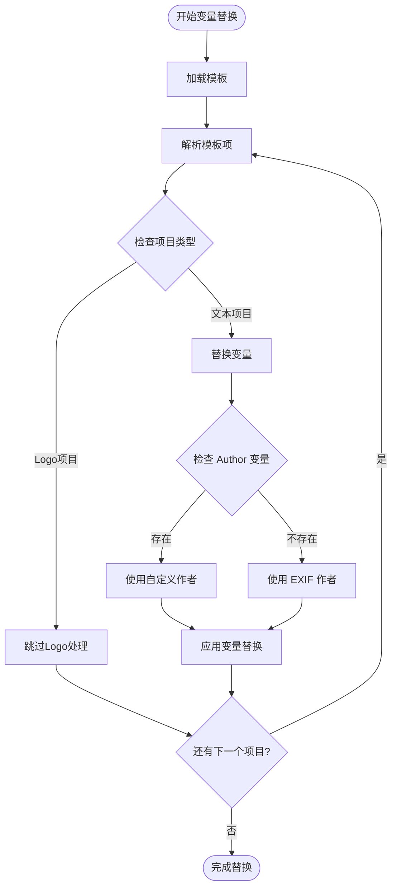
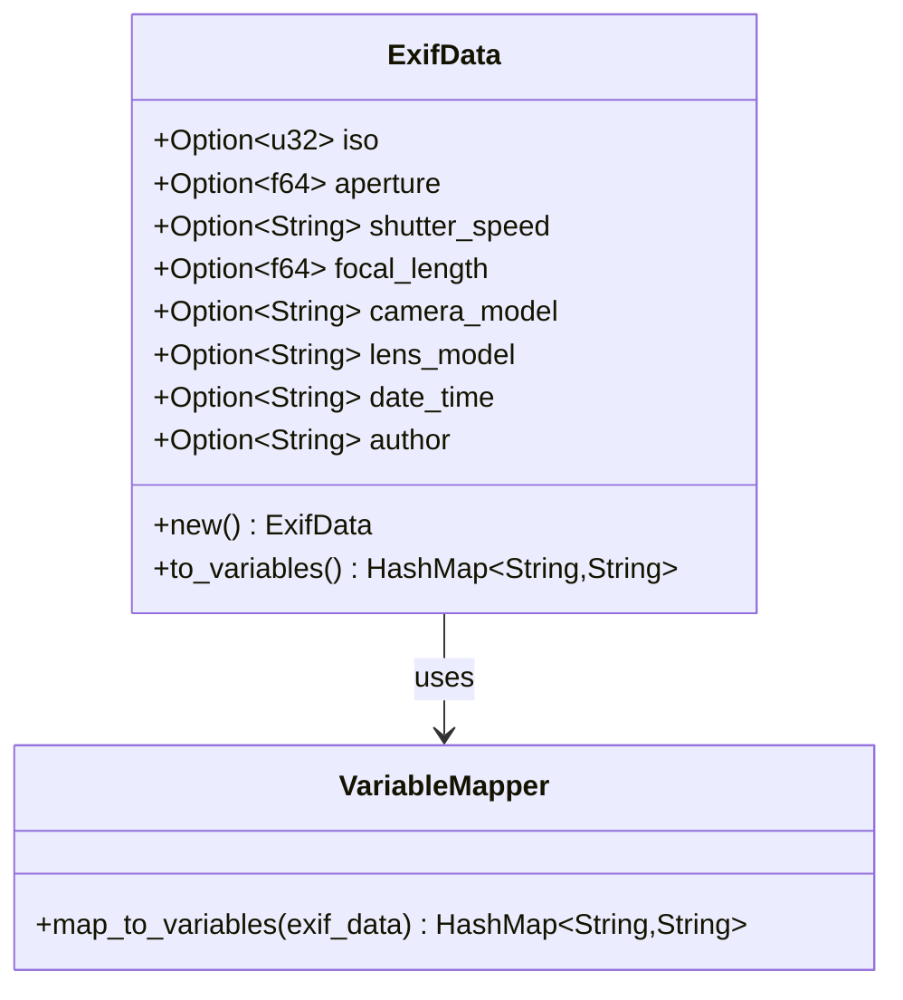
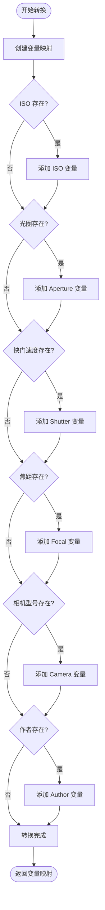
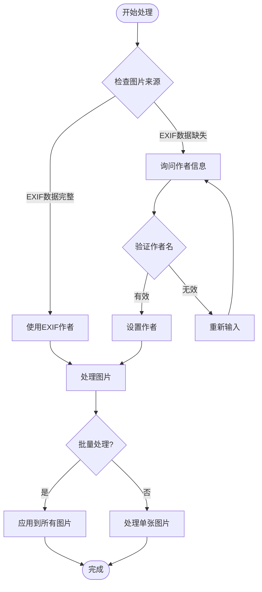

# 作者信息覆盖功能文档

<cite>
**本文档引用的文件**
- [src/main.rs](file://src/main.rs)
- [src/exif_reader/mod.rs](file://src/exif_reader/mod.rs)
- [src/layout/mod.rs](file://src/layout/mod.rs)
- [src/renderer/mod.rs](file://src/renderer/mod.rs)
- [src/io/mod.rs](file://src/io/mod.rs)
- [templates/classic.json](file://templates/classic.json)
- [templates/modern.json](file://templates/modern.json)
- [README.md](file://README.md)
- [examples/basic_usage.md](file://examples/basic_usage.md)
</cite>

## 目录
1. [简介](#简介)
2. [功能概述](#功能概述)
3. [架构设计](#架构设计)
4. [核心实现](#核心实现)
5. [使用方法](#使用方法)
6. [模板系统集成](#模板系统集成)
7. [EXIF数据处理](#exif数据处理)
8. [批量处理限制](#批量处理限制)
9. [故障排除](#故障排除)
10. [最佳实践](#最佳实践)

## 简介

LiteMark 的作者信息覆盖功能允许用户通过命令行参数 `--author` 来覆盖图片的默认作者信息。该功能在处理单张图片和批量处理场景中都能发挥作用，提供了灵活的作者信息管理机制。

## 功能概述

作者信息覆盖功能具有以下特性：

- **命令行参数支持**：通过 `--author` 参数直接指定作者名称
- **模板变量替换**：自动将作者信息插入到模板的 `{Author}` 变量中
- **优先级控制**：用户提供的作者信息优先于 EXIF 数据中的作者信息
- **跨平台兼容**：支持中文、英文等多种语言环境
- **批量处理限制**：在批量模式下为所有图片应用相同的作者信息

## 架构设计



**图表来源**
- [src/main.rs](file://src/main.rs#L1-L320)
- [src/exif_reader/mod.rs](file://src/exif_reader/mod.rs#L1-L120)
- [src/layout/mod.rs](file://src/layout/mod.rs#L1-L206)

## 核心实现

### 命令行参数定义

作者信息覆盖功能通过 `Cli` 结构体中的 `author` 字段实现：



**图表来源**
- [src/main.rs](file://src/main.rs#L10-L45)

### 变量哈希映射处理

在 `process_single_image` 和 `process_batch` 函数中，作者信息被插入到变量哈希映射中：



**图表来源**
- [src/main.rs](file://src/main.rs#L85-L120)
- [src/main.rs](file://src/main.rs#L122-L170)

**章节来源**
- [src/main.rs](file://src/main.rs#L85-L120)
- [src/main.rs](file://src/main.rs#L122-L170)

### 模板变量替换机制

模板系统通过 `substitute_variables` 方法实现变量替换：



**图表来源**
- [src/layout/mod.rs](file://src/layout/mod.rs#L85-L95)
- [src/layout/mod.rs](file://src/layout/mod.rs#L100-L115)

**章节来源**
- [src/layout/mod.rs](file://src/layout/mod.rs#L85-L95)
- [src/layout/mod.rs](file://src/layout/mod.rs#L100-L115)

## 使用方法

### 基本语法

```bash
litemark add -i <输入文件> -o <输出文件> [--author "<作者名>"]
litemark batch -i <输入目录> -o <输出目录> [--author "<作者名>"]
```

### 使用示例

#### 单张图片处理

```bash
# 使用默认作者（从EXIF获取）
litemark add -i photo.jpg -o marked.jpg

# 使用自定义作者名
litemark add -i photo.jpg -o marked.jpg --author "张三"

# 使用中文作者名
litemark add -i photo.jpg -o marked.jpg --author "李四"

# 使用包含特殊字符的作者名
litemark add -i photo.jpg -o marked.jpg --author "Photographer@Example"
```

#### 批量处理

```bash
# 批量处理并设置统一作者名
litemark batch -i photos/ -o output/ --author "专业摄影师"

# 批量处理（所有图片使用相同作者）
litemark batch -i images/ -o processed/ --author "摄影爱好者"
```

### 参数说明

| 参数 | 类型 | 必需 | 默认值 | 说明 |
|------|------|------|--------|------|
| `--author` | String | 否 | None | 自定义作者名称，覆盖EXIF中的作者信息 |

**章节来源**
- [examples/basic_usage.md](file://examples/basic_usage.md#L1-L50)
- [README.md](file://README.md#L30-L50)

## 模板系统集成

### 支持的模板变量

作者信息覆盖功能与模板系统的 `{Author}` 变量紧密集成：

```mermaid
graph LR
subgraph "模板配置"
Template[模板 JSON]
AuthorVar[{Author}]
end
subgraph "变量替换流程"
VarMap[变量映射]
EXIFData[EXIF数据]
CustomAuthor[自定义作者]
end
subgraph "输出结果"
FinalText[最终文本]
Watermark[水印内容]
end
Template --> AuthorVar
EXIFData --> VarMap
CustomAuthor --> VarMap
VarMap --> AuthorVar
AuthorVar --> FinalText
FinalText --> Watermark
```

**图表来源**
- [templates/classic.json](file://templates/classic.json#L5-L10)
- [src/layout/mod.rs](file://src/layout/mod.rs#L100-L115)

### 模板示例

#### 经典模板中的作者变量

```json
{
  "name": "ClassicParam",
  "items": [
    {
      "type": "text",
      "value": "{Author}",
      "font_size": 20,
      "weight": "bold",
      "color": "#FFFFFF"
    }
  ]
}
```

#### 现代模板中的作者变量

```json
{
  "name": "Modern",
  "items": [
    {
      "type": "text",
      "value": "{Camera} • {Lens}",
      "font_size": 16,
      "weight": "bold",
      "color": "#FFFFFF"
    }
  ]
}
```

**章节来源**
- [templates/classic.json](file://templates/classic.json#L1-L27)
- [templates/modern.json](file://templates/modern.json#L1-L29)

## EXIF数据处理

### EXIF数据结构

EXIF 数据通过 `ExifData` 结构体管理：



**图表来源**
- [src/exif_reader/mod.rs](file://src/exif_reader/mod.rs#L4-L25)

### 变量映射转换

`to_variables` 方法将 EXIF 数据转换为模板变量：



**图表来源**
- [src/exif_reader/mod.rs](file://src/exif_reader/mod.rs#L30-L60)

**章节来源**
- [src/exif_reader/mod.rs](file://src/exif_reader/mod.rs#L30-L60)

## 批量处理限制

### 当前限制

作者信息覆盖功能在批量处理中有以下限制：

1. **统一作者策略**：批量处理时只能为所有图片设置相同的作者信息
2. **无动态分配**：无法根据每张图片的 EXIF 数据动态选择作者
3. **全局影响**：一旦设置了 `--author` 参数，所有处理的图片都会使用该作者

### 解决方案建议

对于需要为不同图片指定不同作者的场景，可以考虑以下解决方案：

```bash
# 方案1：分批处理
litemark batch -i photos/ -o output1/ --author "作者A"
litemark batch -i photos/ -o output2/ --author "作者B"

# 方案2：先批量处理后重命名
litemark batch -i photos/ -o temp/
# 手动编辑输出文件的作者信息

# 方案3：编写脚本自动化处理
#!/bin/bash
for file in photos/*.jpg; do
    base=$(basename "$file" .jpg)
    litemark add -i "$file" -o "output/${base}_authorA.jpg" --author "作者A"
done
```

**章节来源**
- [src/main.rs](file://src/main.rs#L122-L170)

## 故障排除

### 常见问题

#### 1. 作者信息未显示

**症状**：水印中没有显示作者信息

**原因**：
- 模板中未包含 `{Author}` 变量
- EXIF 数据中缺少作者信息且未提供 `--author` 参数

**解决方法**：
```bash
# 检查模板是否包含 {Author} 变量
litemark show-template classic

# 使用 --author 参数强制指定作者
litemark add -i photo.jpg -o output.jpg --author "我的名字"
```

#### 2. 中文作者名显示异常

**症状**：中文作者名显示为乱码或方块

**原因**：字体不支持中文字符

**解决方法**：
```bash
# 使用支持中文的字体
litemark add -i photo.jpg -o output.jpg --author "张三" --font /path/to/chinese-font.ttf
```

#### 3. 批量处理作者信息不一致

**症状**：批量处理后某些图片的作者信息不正确

**原因**：EXIF 数据中的作者信息与预期不符

**解决方法**：
```bash
# 强制使用自定义作者信息
litemark batch -i photos/ -o output/ --author "统一作者名"
```

### 调试技巧

#### 启用详细输出

```bash
# 查看详细的处理过程
litemark add -i photo.jpg -o output.jpg --author "调试作者" --verbose
```

#### 检查变量映射

```bash
# 使用测试模式查看变量
litemark add -i photo.jpg -o output.jpg --author "测试作者" --dry-run
```

**章节来源**
- [src/main.rs](file://src/main.rs#L85-L120)

## 最佳实践

### 1. 命令行使用规范

```bash
# 推荐：始终使用引号包围包含空格的作者名
litemark add -i photo.jpg -o output.jpg --author "专业摄影师 张三"

# 不推荐：裸露的空格会导致解析错误
litemark add -i photo.jpg -o output.jpg --author Professional Photographer Zhang San
```

### 2. 批量处理策略

```bash
# 推荐：为不同项目使用不同的输出目录
litemark batch -i photos/ --author "项目A团队" -o output_project_a/
litemark batch -i photos/ --author "项目B团队" -o output_project_b/

# 推荐：使用描述性的输出文件名
litemark batch -i photos/ --author "摄影师" -o "output_$(date +%Y%m%d)/"
```

### 3. 模板定制建议

```json
{
  "name": "Professional",
  "items": [
    {
      "type": "text",
      "value": "{Author} © {DateTime|YYYY}",
      "font_size": 18,
      "weight": "bold",
      "color": "#FFFFFF"
    }
  ]
}
```

### 4. 工作流程优化



**图表来源**
- [src/main.rs](file://src/main.rs#L85-L120)

### 5. 性能优化建议

- **批量处理**：对于大量图片，优先使用批量处理功能
- **字体缓存**：避免重复加载相同的自定义字体文件
- **内存管理**：处理大尺寸图片时注意内存使用

**章节来源**
- [src/main.rs](file://src/main.rs#L122-L170)
- [src/io/mod.rs](file://src/io/mod.rs#L1-L86)