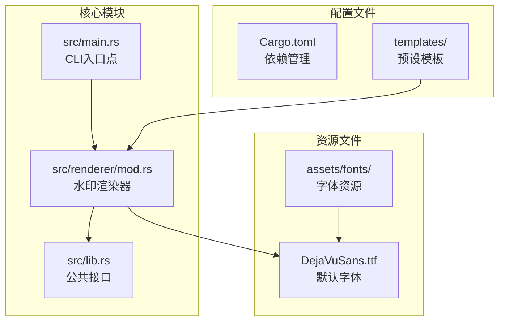
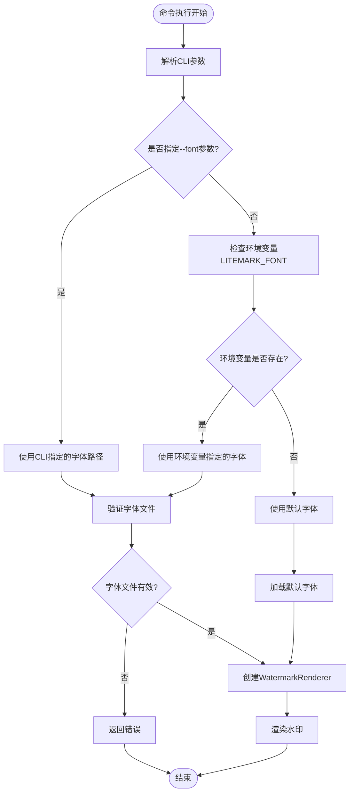
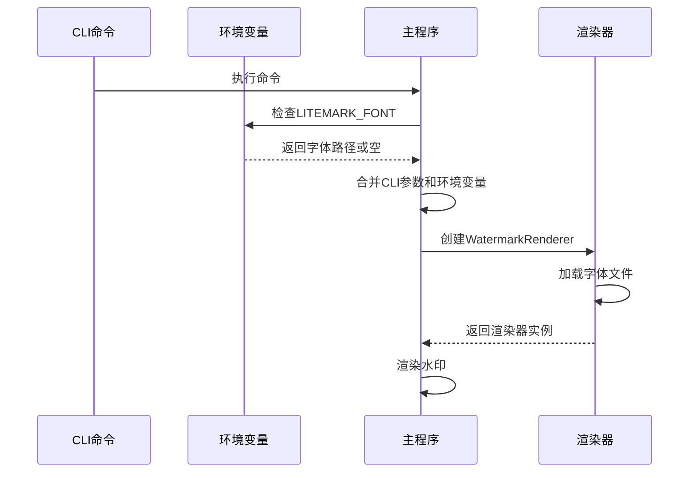
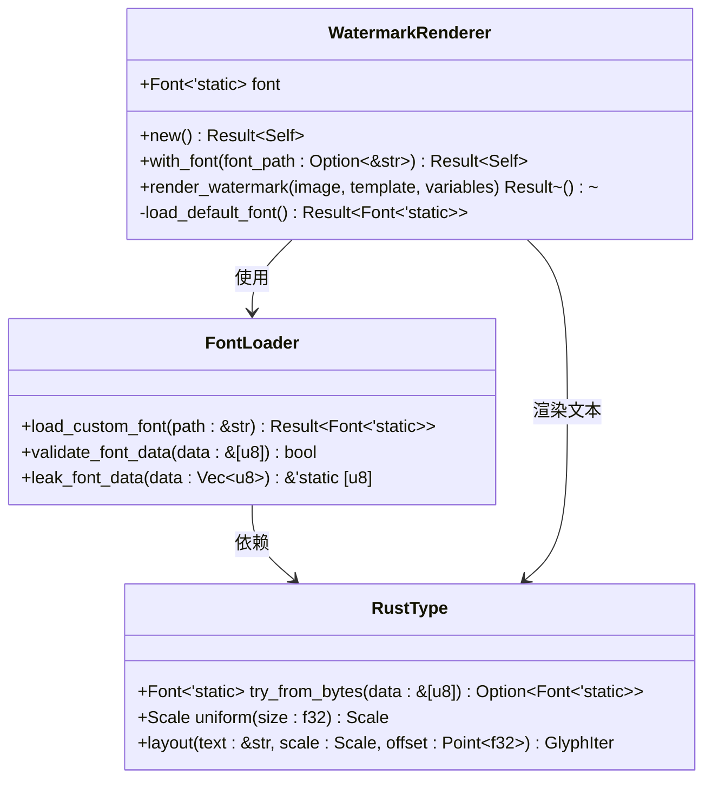
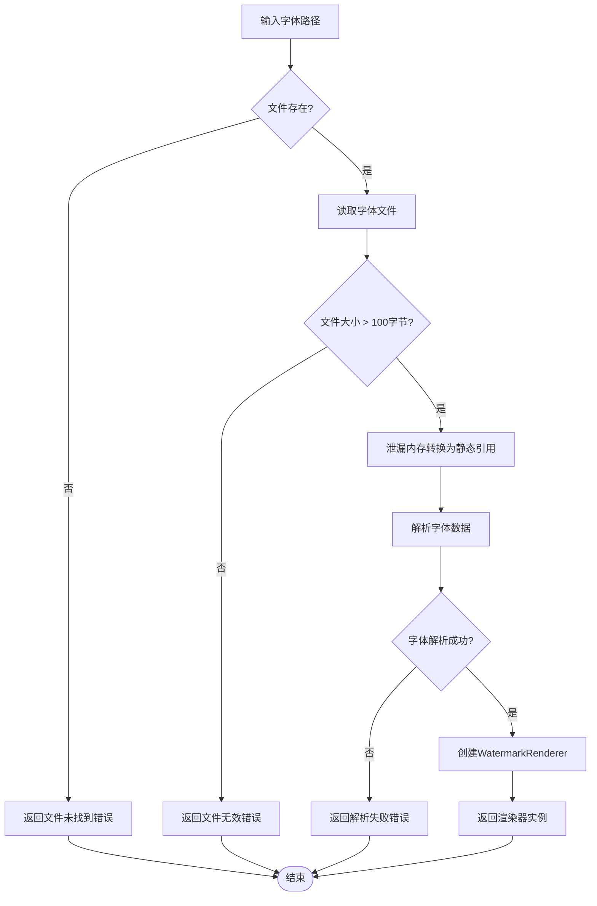
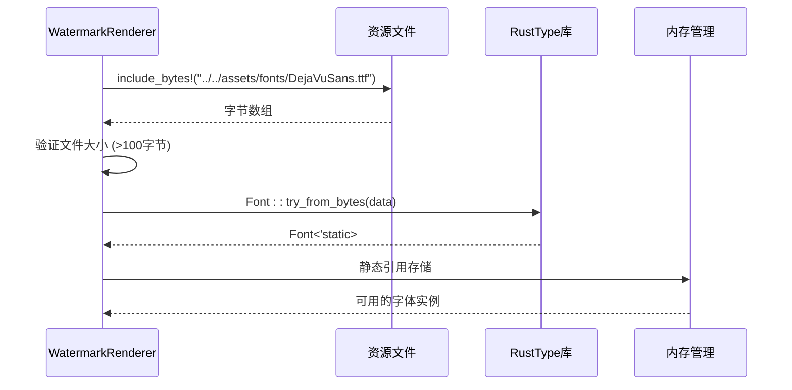
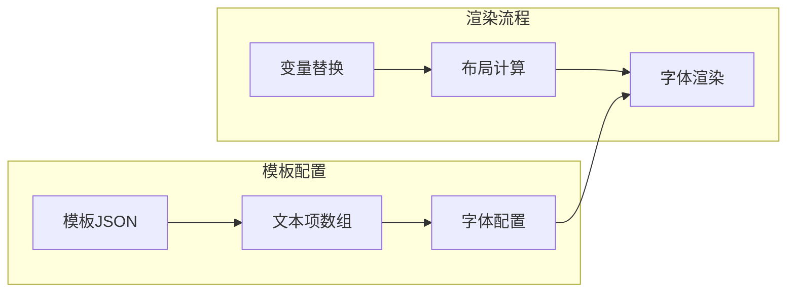
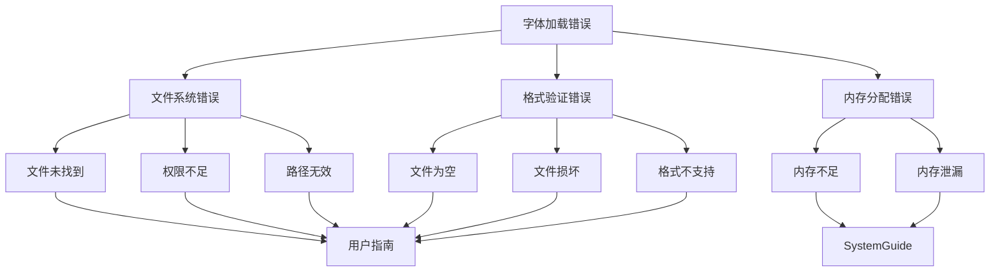

# 自定义字体功能详细文档

<cite>
**本文档中引用的文件**
- [src/main.rs](file://src/main.rs)
- [src/renderer/mod.rs](file://src/renderer/mod.rs)
- [src/lib.rs](file://src/lib.rs)
- [Cargo.toml](file://Cargo.toml)
- [templates/classic.json](file://templates/classic.json)
- [templates/modern.json](file://templates/modern.json)
- [templates/minimal.json](file://templates/minimal.json)
- [assets/fonts/DejaVuSans.ttf](file://assets/fonts/DejaVuSans.ttf)
</cite>

## 目录
1. [简介](#简介)
2. [项目结构概览](#项目结构概览)
3. [CLI参数配置](#cli参数配置)
4. [环境变量支持](#环境变量支持)
5. [核心实现原理](#核心实现原理)
6. [字体文件验证机制](#字体文件验证机制)
7. [默认字体加载](#默认字体加载)
8. [模板系统集成](#模板系统集成)
9. [使用示例](#使用示例)
10. [错误处理机制](#错误处理机制)
11. [最佳实践指南](#最佳实践指南)
12. [故障排除](#故障排除)

## 简介

LiteMark是一个轻量级的照片参数水印工具，支持通过CLI参数和环境变量指定自定义字体文件路径。该功能允许用户使用任意TTF字体文件来渲染水印文本，确保中英文字符的正确显示，同时保持与现有模板系统的无缝集成。

## 项目结构概览



**图表来源**
- [src/main.rs](file://src/main.rs#L1-L320)
- [src/renderer/mod.rs](file://src/renderer/mod.rs#L1-L631)
- [src/lib.rs](file://src/lib.rs#L1-L9)

**章节来源**
- [src/main.rs](file://src/main.rs#L1-L320)
- [src/renderer/mod.rs](file://src/renderer/mod.rs#L1-L631)
- [Cargo.toml](file://Cargo.toml#L1-L41)

## CLI参数配置

### 命令行参数定义

系统通过Clap框架提供了灵活的CLI参数配置，支持两种方式指定自定义字体：



**图表来源**
- [src/main.rs](file://src/main.rs#L146-L157)
- [src/main.rs](file://src/main.rs#L237-L243)

### 参数详解

| 参数名称 | 类型 | 默认值 | 描述 |
|---------|------|--------|------|
| `--font` | String | None | 指定自定义字体文件路径（优先级高于环境变量） |
| `--input` | String | 必需 | 输入图像文件路径 |
| `--output` | String | 必需 | 输出图像文件路径 |
| `--template` | String | "classic" | 模板名称或JSON文件路径 |
| `--author` | String | None | 覆盖EXIF数据中的作者信息 |

**章节来源**
- [src/main.rs](file://src/main.rs#L10-L32)

## 环境变量支持

### LITEMARK_FONT环境变量

系统支持通过环境变量`LITEMARK_FONT`设置全局默认字体路径，为批量处理场景提供便利：



**图表来源**
- [src/main.rs](file://src/main.rs#L147-L152)
- [src/main.rs](file://src/main.rs#L238-L239)

### 优先级规则

字体路径的加载遵循以下优先级顺序：
1. **CLI参数** (`--font`) - 最高优先级
2. **环境变量** (`LITEMARK_FONT`) - 中等优先级  
3. **默认字体** - 最低优先级

**章节来源**
- [src/main.rs](file://src/main.rs#L146-L157)
- [src/main.rs](file://src/main.rs#L237-L243)

## 核心实现原理

### WatermarkRenderer::with_font方法

`WatermarkRenderer::with_font`方法是自定义字体功能的核心实现，负责字体文件的读取、验证和静态引用的创建：



**图表来源**
- [src/renderer/mod.rs](file://src/renderer/mod.rs#L15-L45)
- [src/renderer/mod.rs](file://src/renderer/mod.rs#L47-L65)

### 字体数据处理流程



**图表来源**
- [src/renderer/mod.rs](file://src/renderer/mod.rs#L17-L45)

**章节来源**
- [src/renderer/mod.rs](file://src/renderer/mod.rs#L15-L45)

## 字体文件验证机制

### 多层验证体系

系统实现了严格的字体文件验证机制，确保字体数据的有效性和完整性：

| 验证阶段 | 检查内容 | 错误类型 | 处理方式 |
|---------|----------|----------|----------|
| 文件存在性检查 | 路径有效性 | `Failed to read font file` | 返回具体错误信息 |
| 文件大小验证 | 至少100字节 | `Font file appears to be invalid or empty` | 提示文件可能损坏 |
| 字体格式验证 | TTF格式解析 | `Failed to parse font data` | 显示解析失败原因 |
| 内存安全检查 | 静态生命周期 | 运行时错误 | 使用Box::leak安全转换 |

### 错误信息设计

系统提供了详细的错误信息，帮助用户快速定位问题：

- **文件读取错误**: 包含具体的文件路径和系统错误码
- **文件大小错误**: 提示文件可能为空或损坏
- **解析错误**: 显示字体数据的字节大小，便于调试

**章节来源**
- [src/renderer/mod.rs](file://src/renderer/mod.rs#L19-L35)

## 默认字体加载

### DejaVuSans.ttf嵌入机制

系统内置了DejaVu Sans字体作为默认选项，通过编译时嵌入确保跨平台兼容性：



**图表来源**
- [src/renderer/mod.rs](file://src/renderer/mod.rs#L47-L65)

### 默认字体特性

- **开源免费**: DejaVu字体家族完全开源
- **多语言支持**: 包含广泛的Unicode字符集
- **编译时嵌入**: 确保部署时无需额外字体文件
- **跨平台兼容**: 支持Windows、macOS、Linux等系统

**章节来源**
- [src/renderer/mod.rs](file://src/renderer/mod.rs#L47-L65)

## 模板系统集成

### 字体在模板中的应用

自定义字体与模板系统的深度集成，支持在不同位置渲染文本：



**图表来源**
- [templates/classic.json](file://templates/classic.json#L1-L27)
- [templates/modern.json](file://templates/modern.json#L1-L29)
- [templates/minimal.json](file://templates/minimal.json#L1-L17)

### 文本渲染集成

模板中的每个文本项都可以利用自定义字体进行渲染：

| 模板属性 | 字体影响 | 默认行为 |
|---------|----------|----------|
| `font_size` | 字体大小直接影响渲染效果 | 继承自模板配置 |
| `weight` | 字重设置影响字体外观 | 支持bold和normal |
| `color` | 颜色设置与字体无关 | 独立的颜色配置 |
| `value` | 文本内容由字体渲染 | 字体决定字符显示 |

**章节来源**
- [templates/classic.json](file://templates/classic.json#L1-L27)
- [templates/modern.json](file://templates/modern.json#L1-L29)
- [templates/minimal.json](file://templates/minimal.json#L1-L17)

## 使用示例

### 基础使用示例

#### 单文件处理
```bash
# 使用自定义字体添加水印
litemark add -i input.jpg -o output.jpg --font /path/to/custom.ttf

# 使用环境变量指定字体
export LITEMARK_FONT=/path/to/custom.ttf
litemark add -i input.jpg -o output.jpg

# 混合使用CLI参数和环境变量
export LITEMARK_FONT=/default/font.ttf
litemark add -i input.jpg -o output.jpg --font /specific/font.ttf  # CLI参数优先
```

#### 批量处理
```bash
# 批量处理目录中的所有图片
litemark batch -i input_dir/ -o output_dir/ --font /path/to/custom.ttf

# 使用环境变量进行批量处理
export LITEMARK_FONT=/path/to/custom.ttf
litemark batch -i input_dir/ -o output_dir/
```

### 高级使用场景

#### 不同字体风格的应用
```bash
# 使用衬线字体渲染专业感水印
litemark add -i photo.jpg -o branded.jpg --font /fonts/serif.ttf

# 使用无衬线字体渲染现代感水印  
litemark add -i photo.jpg -o modern.jpg --font /fonts/sans-serif.ttf

# 使用手写字体渲染个性化水印
litemark add -i photo.jpg -o handwritten.jpg --font /fonts/script.ttf
```

#### 多语言支持测试
```bash
# 测试中文字体支持
litemark add -i photo.jpg -o chinese.jpg --font /fonts/chinese.ttf \
  --author "张三" --template classic

# 测试日文字符支持
litemark add -i photo.jpg -o japanese.jpg --font /fonts/japanese.ttf \
  --author "山田太郎" --template modern
```

## 错误处理机制

### 错误分类与处理



### 常见错误及解决方案

| 错误类型 | 错误信息 | 可能原因 | 解决方案 |
|---------|----------|----------|----------|
| 文件读取失败 | `Failed to read font file: ...` | 文件不存在、权限不足、路径错误 | 检查文件路径、确认文件权限、验证路径语法 |
| 文件大小错误 | `Font file appears to be invalid or empty` | 文件损坏、空文件、截断文件 | 重新下载字体文件、检查文件完整性 |
| 解析失败 | `Failed to parse font data (size: N bytes)` | 字体格式不支持、数据损坏 | 使用有效的TTF字体文件、检查字体格式 |

### 错误恢复策略

系统采用优雅降级策略：
1. **字体加载失败**: 自动回退到默认字体
2. **部分字符缺失**: 使用默认字体渲染缺失字符
3. **内存不足**: 尝试减少字体缓存大小

**章节来源**
- [src/renderer/mod.rs](file://src/renderer/mod.rs#L19-L35)

## 最佳实践指南

### 字体选择建议

#### 推荐字体类型
- **专业摄影**: Times New Roman、Georgia、Palatino
- **现代设计**: Helvetica、Arial、Roboto
- **创意作品**: Brush Script、Pacifico、Lobster
- **多语言支持**: Noto Sans、Source Han Sans、Microsoft YaHei

#### 字体文件要求
- **格式**: 必须为标准TTF字体文件
- **编码**: 支持Unicode字符集（至少Basic Latin）
- **大小**: 建议不超过5MB，避免过大的字体文件
- **质量**: 高分辨率字体，确保清晰度

### 性能优化建议

#### 字体缓存策略
```bash
# 缓存常用字体，避免重复加载
export LITEMARK_FONT=/common/fonts/custom.ttf

# 批量处理时复用渲染器实例
litemark batch -i images/ -o processed/ --font $LITEMARK_FONT
```

#### 内存管理
- 避免同时加载多个大字体文件
- 使用相对路径减少内存占用
- 定期清理临时字体文件

### 兼容性考虑

#### 跨平台字体支持
- Windows: TrueType字体 (.ttf)
- macOS: TrueType字体 (.ttf)
- Linux: TrueType字体 (.ttf)
- 移动端: 需要适配平台特定字体格式

#### 字符集兼容性
- 确保字体包含所需的字符集
- 测试中英文混合文本渲染
- 验证特殊符号和表情字符显示

## 故障排除

### 常见问题诊断

#### 字体无法加载
```bash
# 检查字体文件是否存在
ls -la /path/to/custom.ttf

# 验证文件权限
chmod 644 /path/to/custom.ttf

# 测试文件可读性
file /path/to/custom.ttf
```

#### 渲染效果异常
```bash
# 使用默认字体测试
litemark add -i test.jpg -o test-default.jpg --font ""

# 检查字体文件完整性
head -c 100 /path/to/custom.ttf | hexdump -C

# 验证字体格式
fc-list | grep custom.ttf  # Linux系统
```

### 调试技巧

#### 详细日志输出
```bash
# 启用详细模式（如果支持）
export RUST_LOG=debug
litemark add -i input.jpg -o output.jpg --font /path/to/custom.ttf

# 检查环境变量设置
echo $LITEMARK_FONT
```

#### 字体测试脚本
```bash
#!/bin/bash
# 测试字体渲染效果
TEST_TEXT="Hello 世界 Test 字符集"
for FONT in /fonts/*.ttf; do
    echo "Testing $FONT:"
    litemark add -i test.jpg -o "${FONT##*/}.jpg" \
        --font "$FONT" --author "$TEST_TEXT"
done
```

### 性能监控

#### 内存使用监控
```bash
# 监控内存使用情况
/usr/bin/time -v litemark add -i large.jpg -o output.jpg \
    --font /large-font.ttf
```

#### 处理时间统计
```bash
# 测量处理时间
time litemark add -i photo.jpg -o result.jpg \
    --font /custom.ttf
```

通过以上详细的文档说明，用户可以充分理解和使用LiteMark的自定义字体功能，确保水印渲染的质量和一致性。该功能不仅提供了强大的字体定制能力，还通过完善的错误处理和性能优化确保了系统的稳定性和易用性。