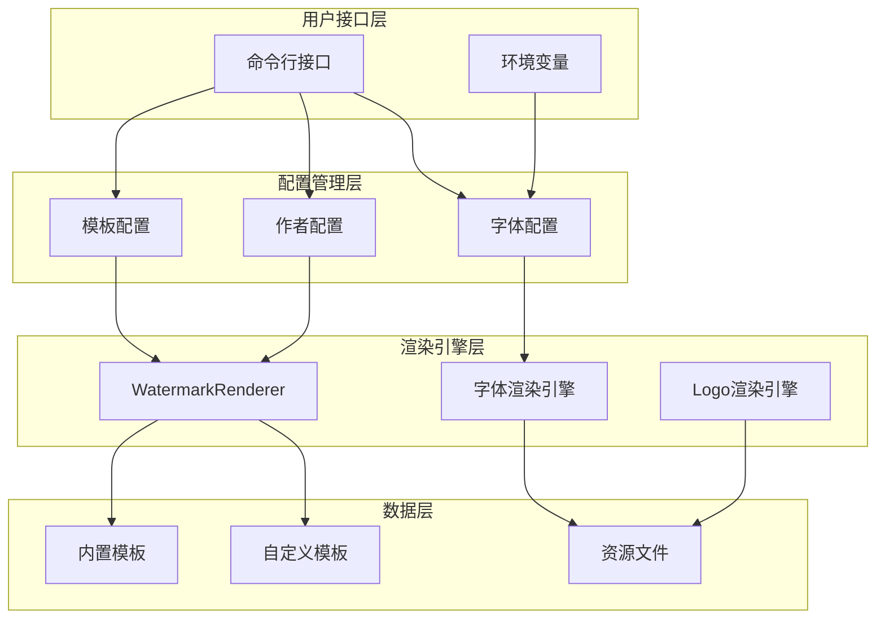
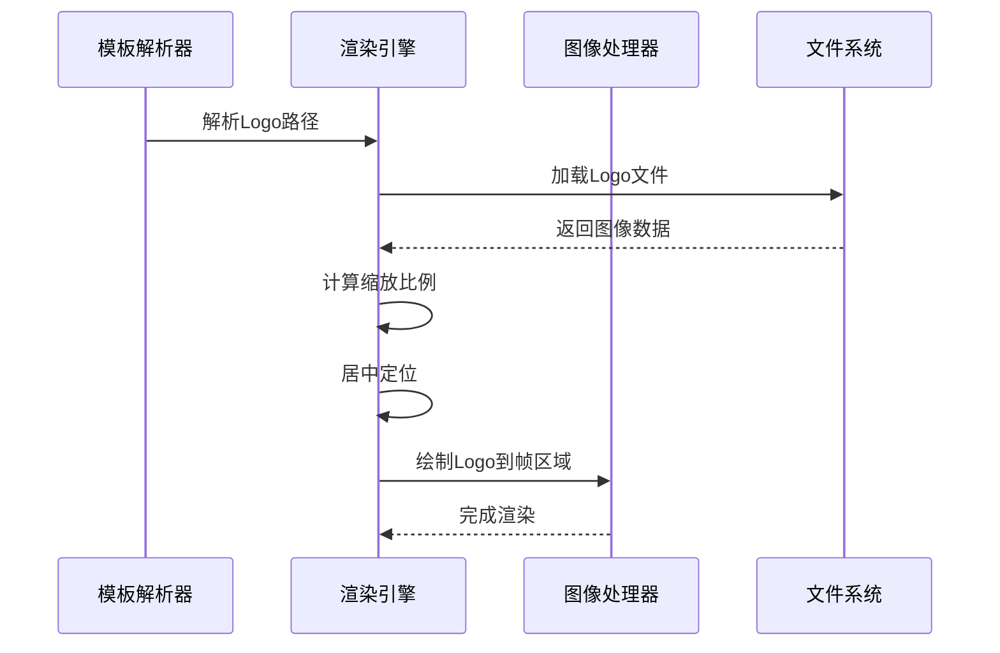
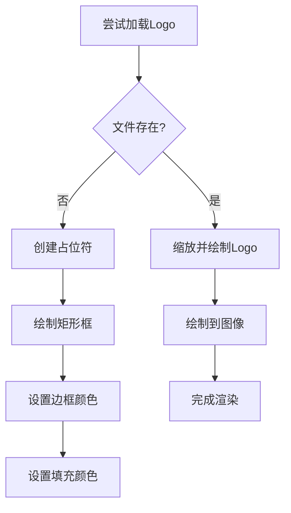
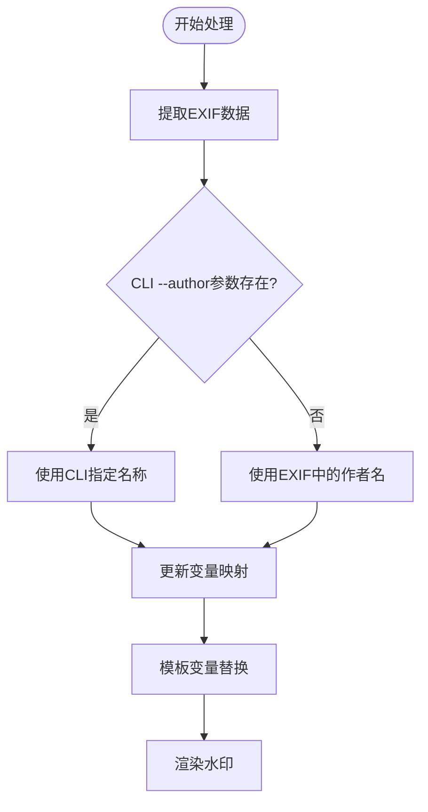
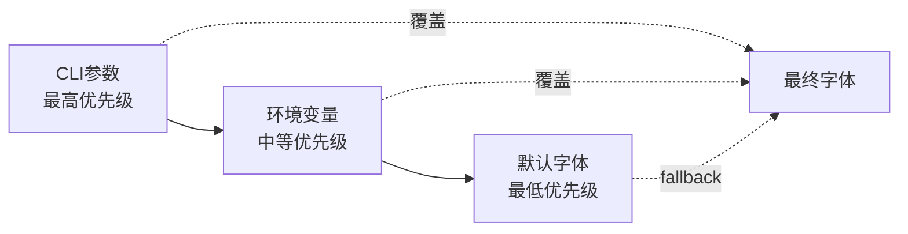

# 配置与自定义

<cite>
**本文档中引用的文件**
- [src/main.rs](file://src/main.rs)
- [src/renderer/mod.rs](file://src/renderer/mod.rs)
- [src/layout/mod.rs](file://src/layout/mod.rs)
- [src/exif_reader/mod.rs](file://src/exif_reader/mod.rs)
- [src/io/mod.rs](file://src/io/mod.rs)
- [templates/classic.json](file://templates/classic.json)
- [templates/modern.json](file://templates/modern.json)
- [templates/minimal.json](file://templates/minimal.json)
- [Cargo.toml](file://Cargo.toml)
- [README.md](file://README.md)
</cite>

## 目录
1. [简介](#简介)
2. [项目架构概览](#项目架构概览)
3. [字体配置系统](#字体配置系统)
4. [Logo配置与使用](#logo配置与使用)
5. [作者名称覆盖](#作者名称覆盖)
6. [模板系统配置](#模板系统配置)
7. [环境变量配置](#环境变量配置)
8. [配置示例与最佳实践](#配置示例与最佳实践)
9. [限制性与扩展建议](#限制性与扩展建议)
10. [故障排除指南](#故障排除指南)

## 简介

LiteMark 是一个轻量级的照片参数水印工具，提供了丰富的配置与自定义功能。本文档详细介绍了如何通过CLI参数、环境变量和模板系统来个性化你的水印效果，包括字体选择、Logo使用、作者名称覆盖等高级功能。

## 项目架构概览

LiteMark 的配置系统采用分层架构设计，主要包含以下组件：



**图表来源**
- [src/main.rs](file://src/main.rs#L1-L50)
- [src/renderer/mod.rs](file://src/renderer/mod.rs#L1-L50)
- [src/layout/mod.rs](file://src/layout/mod.rs#L1-L50)

**章节来源**
- [src/main.rs](file://src/main.rs#L1-L320)
- [src/renderer/mod.rs](file://src/renderer/mod.rs#L1-L631)

## 字体配置系统

### CLI参数配置

LiteMark 支持通过 `--font` 参数指定自定义字体文件，这为不同语言和美学风格提供了灵活的字体选择方案。

#### 基本用法

```bash
# 使用自定义字体添加水印
litemark add -i input.jpg -t classic -o output.jpg --font /path/to/custom-font.ttf

# 批量处理时指定字体
litemark batch -i /photos/ -t modern -o /output/ --font /usr/share/fonts/chinese.ttf
```

#### 字体加载优先级

系统采用多层级字体加载策略：


**图表来源**
- [src/main.rs](file://src/main.rs#L100-L120)
- [src/renderer/mod.rs](file://src/renderer/mod.rs#L15-L50)

### 默认字体与嵌入资源

系统内置了 DejaVu Sans 字体作为默认选择，该字体支持多种语言字符集：

- **字体格式**: TrueType (.ttf)
- **字符支持**: 英文、数字、基本符号
- **嵌入方式**: 编译时静态嵌入
- **加载位置**: `src/renderer/assets/fonts/DejaVuSans.ttf`

### 自定义字体验证

系统实现了严格的字体验证机制：

| 验证项目 | 检查内容 | 错误处理 |
|---------|---------|---------|
| 文件存在性 | 检查字体文件路径有效性 | 返回 "Failed to read font file" 错误 |
| 文件大小 | 验证文件大小至少100字节 | 返回 "Font file appears to be invalid or empty" |
| 格式解析 | 尝试解析字体数据 | 返回 "Failed to parse font data" 错误 |

**章节来源**
- [src/renderer/mod.rs](file://src/renderer/mod.rs#L15-L80)
- [src/main.rs](file://src/main.rs#L100-L130)

## Logo配置与使用

### Logo在模板中的配置

Logo功能通过模板系统实现，支持在底部框架区域的中心位置显示品牌标识或个人徽标。

#### 模板配置结构

```json
{
  "name": "CustomTemplate",
  "items": [
    {
      "type": "logo",
      "value": "path/to/logo.png"
    },
    {
      "type": "text",
      "value": "{Author}"
    }
  ]
}
```

#### Logo渲染流程



**图表来源**
- [src/renderer/mod.rs](file://src/renderer/mod.rs#L250-L320)
- [src/layout/mod.rs](file://src/layout/mod.rs#L60-L80)

### Logo自动缩放与居中处理

系统实现了智能的Logo缩放算法，确保在不同尺寸的图片上都能获得最佳视觉效果：

#### 缩放计算逻辑

| 计算要素 | 公式 | 说明 |
|---------|------|------|
| 缩放比例 | `min(width/2 / logo_width, height/2 / logo_height)` | 保证Logo不超过可用空间的50% |
| 目标宽度 | `logo_width * scale` | 缩放后的实际宽度 |
| 目标高度 | `logo_height * scale` | 缩放后的实际高度 |
| 起始坐标X | `center_x - (scaled_width/2)` | 水平居中起始点 |
| 起始坐标Y | `center_y - (scaled_height/2)` | 垂直居中起始点 |

#### 占位符处理

当Logo文件不存在时，系统会自动创建占位符：



**图表来源**
- [src/renderer/mod.rs](file://src/renderer/mod.rs#L250-L320)

**章节来源**
- [src/renderer/mod.rs](file://src/renderer/mod.rs#L250-L350)
- [templates/classic.json](file://templates/classic.json#L1-L27)

## 作者名称覆盖

### CLI参数覆盖机制

LiteMark 提供了强大的作者名称覆盖功能，允许用户通过 `--author` 参数完全替换EXIF数据中的作者信息。

#### 覆盖流程



**图表来源**
- [src/main.rs](file://src/main.rs#L140-L160)
- [src/exif_reader/mod.rs](file://src/exif_reader/mod.rs#L40-L70)

### 变量替换系统

系统实现了完整的模板变量替换机制，支持所有EXIF字段的动态替换：

| 变量名称 | 来源 | 格式化示例 |
|---------|------|-----------|
| `{Author}` | CLI参数/EXIF | "John Doe" |
| `{ISO}` | EXIF数据 | "100" |
| `{Aperture}` | EXIF数据 | "f/2.8" |
| `{Shutter}` | EXIF数据 | "1/125" |
| `{Focal}` | EXIF数据 | "50mm" |
| `{Camera}` | EXIF数据 | "Canon EOS R5" |
| `{Lens}` | EXIF数据 | "EF 24-70mm f/2.8L II USM" |
| `{DateTime}` | EXIF数据 | "2024:01:15 14:30:25" |

### 批量处理中的作者覆盖

在批量处理模式下，作者名称覆盖同样生效：

```bash
# 批量处理时统一设置作者名
litemark batch -i /photos/ -t classic -o /output/ --author "Professional Photographer"
```

**章节来源**
- [src/main.rs](file://src/main.rs#L140-L180)
- [src/exif_reader/mod.rs](file://src/exif_reader/mod.rs#L40-L80)

## 模板系统配置

### 内置模板类型

LiteMark 提供了三种预设模板，每种都有独特的布局和风格：

#### ClassicParam 模板
- **锚点**: 底部左下角
- **特点**: 包含Logo、作者名和拍摄参数
- **适用场景**: 传统摄影风格，强调参数信息

#### Modern 模板  
- **锚点**: 顶部右上角
- **特点**: 简洁现代风格，半透明背景
- **适用场景**: 现代摄影作品，追求简洁美感

#### Minimal 模板
- **锚点**: 底部右下角
- **特点**: 极简设计，仅显示作者名
- **适用场景**: 纯粹的艺术作品，避免干扰

### 模板配置详解

每个模板都遵循统一的JSON结构：

```json
{
  "name": "TemplateName",
  "anchor": "bottom-left",
  "padding": 24,
  "items": [
    {
      "type": "text",
      "value": "{Author}",
      "font_size": 20,
      "weight": "bold",
      "color": "#FFFFFF"
    }
  ],
  "background": {
    "type": "rect",
    "opacity": 0.3,
    "radius": 6,
    "color": "#000000"
  }
}
```

### 模板加载机制


**图表来源**
- [src/main.rs](file://src/main.rs#L200-L250)
- [src/layout/mod.rs](file://src/layout/mod.rs#L120-L180)

**章节来源**
- [src/layout/mod.rs](file://src/layout/mod.rs#L120-L206)
- [templates/classic.json](file://templates/classic.json#L1-L27)
- [templates/modern.json](file://templates/modern.json#L1-L29)
- [templates/minimal.json](file://templates/minimal.json#L1-L17)

## 环境变量配置

### LITEMARK_FONT 环境变量

LiteMark 支持通过环境变量 `LITEMARK_FONT` 设置全局字体路径，为自动化脚本和批量处理提供便利。

#### 使用方法

```bash
# Linux/macOS
export LITEMARK_FONT="/usr/share/fonts/chinese.ttf"
litemark add -i input.jpg -t classic -o output.jpg

# Windows
set LITEMARK_FONT=C:\Fonts\chinese.ttf
litemark add -i input.jpg -t classic -o output.jpg
```

#### 优先级规则

环境变量与CLI参数遵循明确的优先级顺序：

1. **CLI参数** (`--font`) - 最高优先级
2. **环境变量** (`LITEMARK_FONT`) - 中等优先级  
3. **默认字体** - 最低优先级



**图表来源**
- [src/main.rs](file://src/main.rs#L110-L120)

**章节来源**
- [src/main.rs](file://src/main.rs#L110-L130)

## 配置示例与最佳实践

### 多语言支持配置

#### 中文支持示例

```bash
# 使用中文字体
litemark add -i photo.jpg -t classic -o output.jpg \
  --font /usr/share/fonts/wqy-microhei/wqy-microhei.ttc \
  --author "摄影师姓名"

# 环境变量配置（推荐）
export LITEMARK_FONT="/usr/share/fonts/wqy-microhei/wqy-microhei.ttc"
litemark add -i photo.jpg -t classic -o output.jpg --author "张三"
```

#### 日文支持示例

```bash
# 使用日文字体
litemark add -i photo.jpg -t modern -o output.jpg \
  --font /usr/share/fonts/ipafont/ipag.ttf \
  --author "田中太郎"
```

### Logo配置最佳实践

#### 品牌Logo配置

```json
{
  "name": "BrandedPhoto",
  "items": [
    {
      "type": "logo",
      "value": "/path/to/company-logo.png"
    },
    {
      "type": "text",
      "value": "{Author} • {Camera} • {Lens}"
    }
  ]
}
```

#### 个人徽标配置

```bash
# 个人照片处理
litemark add -i my_photo.jpg -t classic -o branded.jpg \
  --font /usr/share/fonts/personal-style.ttf \
  --author "My Photography Studio"
```

### 批量处理配置

#### 工作流示例

```bash
#!/bin/bash
# 批量处理脚本示例

# 设置环境变量
export LITEMARK_FONT="/usr/share/fonts/professional-font.ttf"

# 处理照片目录
litemark batch \
  -i "/photos/raw/" \
  -o "/photos/watermarked/" \
  -t "modern" \
  --author "Professional Photographer"

# 后续处理
convert "/photos/watermarked/*.jpg" -quality 85 "/photos/final/"
```

### 性能优化配置

#### 字体缓存策略

```bash
# 预加载常用字体
echo "预加载字体缓存..." > /dev/null
litemark add -i test.jpg -t classic -o /tmp/test.jpg --font /path/to/font.ttf > /dev/null

# 批量处理时利用缓存
litemark batch -i /large-set/ -o /processed/ -t classic --author "Photographer"
```

## 限制性与扩展建议

### 当前配置限制

#### 字体格式限制
- **支持格式**: TrueType (.ttf) 和 OpenType (.otf)
- **不支持格式**: PostScript Type 1、SVG Fonts
- **字符集限制**: 取决于字体文件本身

#### Logo尺寸限制
- **最大尺寸**: 50%的可用空间
- **最小尺寸**: 30x30像素
- **格式要求**: PNG、JPEG、BMP、GIF、WebP

#### 模板定制限制
- **JSON语法**: 必须符合严格的数据结构
- **变量替换**: 仅支持预定义的变量集合
- **样式控制**: 基础的颜色、字体大小、权重设置

### 深度定制建议

#### 通过模板JSON深度定制

对于需要更复杂定制的用户，可以直接编辑模板JSON文件：

```json
{
  "name": "CustomTemplate",
  "anchor": "bottom-center",
  "padding": 30,
  "items": [
    {
      "type": "logo",
      "value": "path/to/logo.png",
      "font_size": 0,
      "weight": null,
      "color": null
    },
    {
      "type": "text", 
      "value": "{Author} | {Camera} | {DateTime}",
      "font_size": 18,
      "weight": "bold",
      "color": "#333333"
    }
  ],
  "background": {
    "type": "rect",
    "opacity": 0.8,
    "radius": 10,
    "color": "#FFFFFF"
  }
}
```

#### 自定义字体集成

```bash
# 创建字体符号链接
sudo ln -s /path/to/custom-font.ttf /usr/local/share/fonts/my-font.ttf

# 更新字体缓存
fc-cache -fv

# 验证字体可用性
fc-list | grep "Custom Font Name"
```

### 未来配置扩展方向

#### 输出质量设置
- **JPEG质量控制**: `--quality` 参数
- **PNG压缩级别**: `--compression` 参数
- **WebP转换**: `--format webp` 参数

#### 背景遮罩透明度
- **全局透明度**: `--background-opacity` 参数
- **渐变效果**: `--gradient` 参数
- **模糊背景**: `--blur-background` 参数

#### 高级排版选项
- **文本间距控制**: `--line-spacing` 参数
- **对齐方式**: `--align` 参数（left、center、right）
- **多列布局**: `--columns` 参数

## 故障排除指南

### 常见问题与解决方案

#### 字体加载失败

**问题症状**:
```
Failed to read font file: /path/to/font.ttf
```

**解决方案**:
1. 验证文件路径正确性
2. 检查文件权限 (`chmod 644 font.ttf`)
3. 确认字体文件完整性
4. 使用绝对路径而非相对路径

#### Logo显示异常

**问题症状**:
- Logo显示为占位符矩形
- Logo位置偏移
- Logo尺寸过大或过小

**解决方案**:
1. 验证Logo文件格式和尺寸
2. 检查文件路径是否正确
3. 确保文件可读权限
4. 调整模板中的Logo配置

#### 模板加载错误

**问题症状**:
```
Template 'custom' not found
```

**解决方案**:
1. 检查模板名称拼写
2. 验证JSON语法正确性
3. 确认文件存在且可读
4. 使用 `litemark show-template` 查看模板详情

#### EXIF数据提取失败

**问题症状**:
- 作者名显示为空
- 拍摄参数缺失
- EXIF警告信息

**解决方案**:
1. 确认图片包含EXIF数据
2. 使用支持EXIF的相机拍摄
3. 检查图片文件完整性
4. 考虑手动指定作者名

### 调试技巧

#### 启用详细输出

```bash
# 启用调试模式
RUST_LOG=debug litemark add -i input.jpg -t classic -o output.jpg

# 查看模板解析过程
litemark show-template classic
```

#### 验证配置

```bash
# 检查可用模板
litemark templates

# 测试字体加载
litemark add -i test.jpg -t classic -o /dev/null --font /path/to/font.ttf

# 验证Logo路径
litemark add -i test.jpg -t classic -o /dev/null --font /path/to/font.ttf
```

**章节来源**
- [src/main.rs](file://src/main.rs#L280-L320)
- [src/renderer/mod.rs](file://src/renderer/mod.rs#L15-L80)