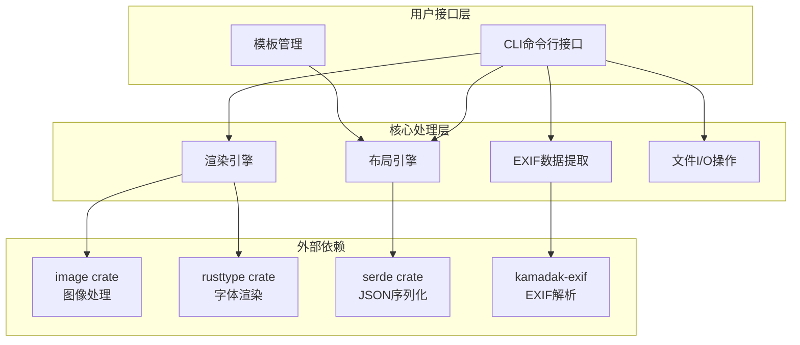
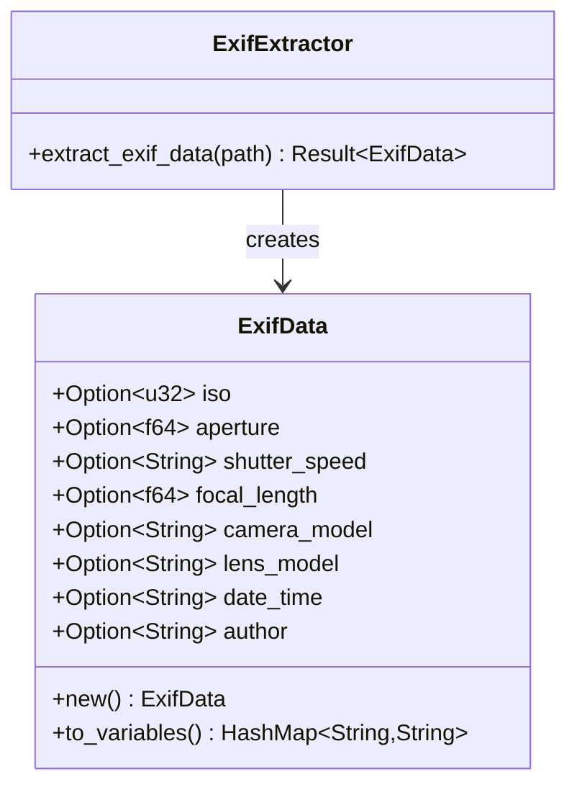
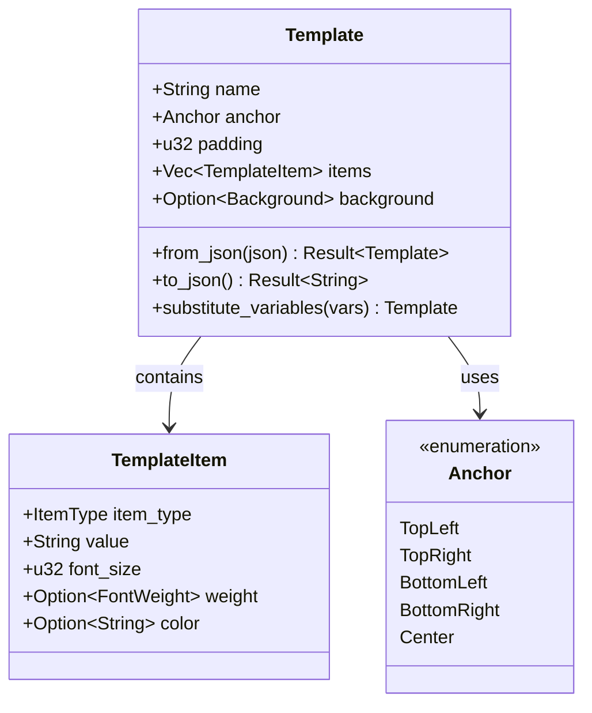
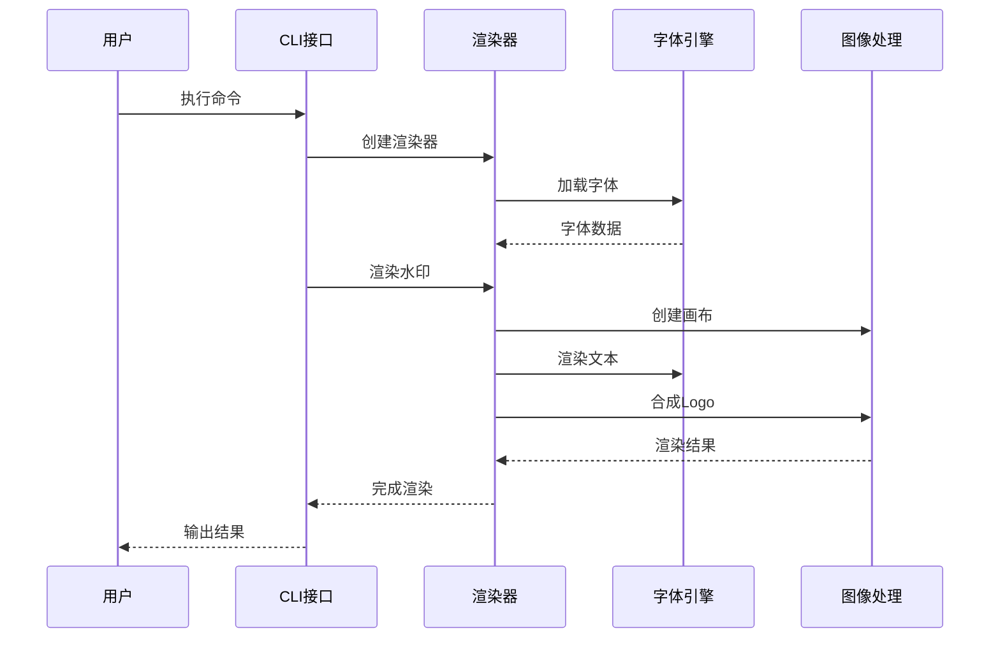
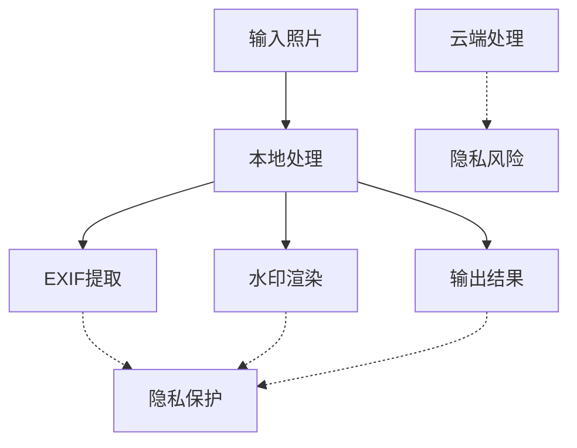
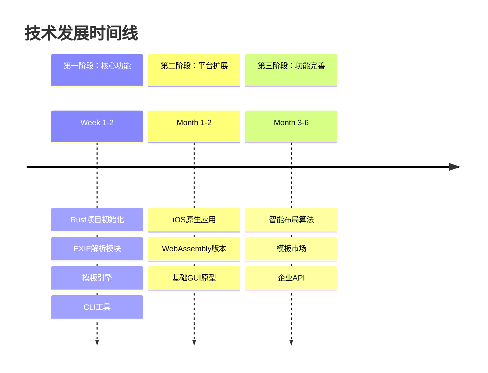
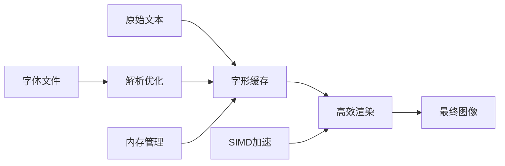

# LiteMark 核心项目概述

<cite>
**本文档引用的文件**
- [README.md](file://README.md)
- [plan.md](file://plan.md)
- [Cargo.toml](file://Cargo.toml)
- [src/lib.rs](file://src/lib.rs)
- [src/main.rs](file://src/main.rs)
- [src/exif_reader/mod.rs](file://src/exif_reader/mod.rs)
- [src/layout/mod.rs](file://src/layout/mod.rs)
- [src/renderer/mod.rs](file://src/renderer/mod.rs)
- [src/io/mod.rs](file://src/io/mod.rs)
- [templates/classic.json](file://templates/classic.json)
- [templates/modern.json](file://templates/modern.json)
- [templates/minimal.json](file://templates/minimal.json)
</cite>

## 目录
1. [项目简介](#项目简介)
2. [核心价值与设计理念](#核心价值与设计理念)
3. [主要功能特性](#主要功能特性)
4. [技术架构概览](#技术架构概览)
5. [模块化设计分析](#模块化设计分析)
6. [模板系统详解](#模板系统详解)
7. [隐私优先的设计原则](#隐私优先的设计原则)
8. [技术愿景与未来规划](#技术愿景与未来规划)
9. [性能考量与优化](#性能考量与优化)
10. [总结](#总结)

## 项目简介

LiteMark 是一个专为摄影爱好者设计的轻量级照片参数水印CLI工具。该项目采用Rust语言开发，专注于提供本地化的照片参数展示解决方案，支持基于EXIF数据的自动信息提取与美观的底部相框渲染。作为一个开源项目，LiteMark致力于为用户提供隐私优先、高性能的照片参数水印服务。

**章节来源**
- [README.md](file://README.md#L1-L163)
- [plan.md](file://plan.md#L1-L280)

## 核心价值与设计理念

### 隐私优先的核心理念

LiteMark 的首要设计原则是"隐私优先"。所有处理过程都在本地完成，不涉及任何云端传输。这一设计理念体现在：

- **完全本地处理**：从EXIF数据提取到最终水印生成，所有操作都在用户设备上完成
- **数据零外泄**：用户的照片和拍摄参数不会上传到任何服务器
- **透明处理流程**：用户可以清楚了解每个处理步骤，确保数据安全

### 轻量级与高性能的平衡

项目采用Rust语言开发，体现了以下设计哲学：

- **高性能执行**：利用Rust的内存安全性和并发优势，提供快速的图像处理能力
- **简洁性与可扩展性**：在保持核心功能简洁的同时，预留了充分的扩展空间
- **跨平台兼容**：支持Windows、macOS和Linux平台的原生运行

**章节来源**
- [plan.md](file://plan.md#L15-L25)
- [Cargo.toml](file://Cargo.toml#L1-L41)

## 主要功能特性

### EXIF数据提取与处理

LiteMark 能够自动提取照片的详细拍摄参数：

- **ISO感光度**：自动识别并显示相机的ISO设置
- **光圈值**：精确提取f-number数值（如f/2.8）
- **快门速度**：支持分数形式表示（如1/125秒）
- **焦距信息**：显示镜头的实际焦距（如50mm）
- **相机型号**：识别并显示使用的相机品牌和型号
- **镜头信息**：记录使用的具体镜头型号
- **拍摄时间**：提取照片的拍摄时间戳
- **作者信息**：支持自定义作者名称或从EXIF中提取

### JSON模板系统

项目提供了灵活的JSON模板系统，支持：

- **自定义布局**：通过JSON配置文件定义水印布局
- **变量替换**：支持动态变量替换（如{Author}、{ISO}等）
- **样式定制**：可配置字体大小、颜色、粗细等样式属性
- **背景效果**：支持半透明背景、圆角等视觉效果

### 批量处理能力

- **目录遍历**：支持整个目录的批量处理
- **并行处理**：利用Rust的并发特性提高处理效率
- **错误恢复**：单个文件处理失败不影响整体流程

### 专业字体渲染

- **多语言支持**：完美支持中英文字符的渲染
- **字体嵌入**：内置高质量字体，也可使用自定义字体
- **专业排版**：采用rusttype库实现专业的字体渲染效果

### Logo叠加功能

- **自动缩放**：智能调整Logo尺寸以适应不同分辨率
- **位置控制**：支持多种Logo放置位置
- **占位符机制**：当Logo文件缺失时自动显示占位符

**章节来源**
- [src/exif_reader/mod.rs](file://src/exif_reader/mod.rs#L1-L120)
- [src/layout/mod.rs](file://src/layout/mod.rs#L1-L206)
- [src/renderer/mod.rs](file://src/renderer/mod.rs#L1-L631)

## 技术架构概览

LiteMark 采用模块化的架构设计，将功能分解为独立的模块，每个模块都有明确的职责边界。

**图表来源**
- [src/lib.rs](file://src/lib.rs#L1-L9)
- [src/main.rs](file://src/main.rs#L1-L320)
- [Cargo.toml](file://Cargo.toml#L10-L30)

### 架构设计原则

1. **单一职责原则**：每个模块只负责一个特定的功能领域
2. **依赖注入**：通过构造函数注入依赖，提高测试性和灵活性
3. **错误处理统一**：采用Result类型进行统一的错误处理
4. **配置驱动**：通过JSON配置文件驱动模板行为

**章节来源**
- [src/lib.rs](file://src/lib.rs#L1-L9)
- [plan.md](file://plan.md#L100-L130)

## 模块化设计分析

### EXIF数据提取模块

该模块负责从照片中提取拍摄参数信息，虽然当前实现是占位符，但已经定义了完整的数据结构。

**图表来源**
- [src/exif_reader/mod.rs](file://src/exif_reader/mod.rs#L4-L25)

### 布局引擎模块

布局引擎负责解析JSON模板并执行变量替换，支持复杂的布局配置。

**图表来源**
- [src/layout/mod.rs](file://src/layout/mod.rs#L4-L80)

### 渲染引擎模块

渲染引擎是最复杂的模块，负责实际的图像合成和文本渲染。

**图表来源**
- [src/renderer/mod.rs](file://src/renderer/mod.rs#L10-L100)

### 文件I/O模块

负责处理文件的读取、写入和目录遍历功能。

**章节来源**
- [src/exif_reader/mod.rs](file://src/exif_reader/mod.rs#L1-L120)
- [src/layout/mod.rs](file://src/layout/mod.rs#L1-L206)
- [src/renderer/mod.rs](file://src/renderer/mod.rs#L1-L631)
- [src/io/mod.rs](file://src/io/mod.rs#L1-L86)

## 模板系统详解

LiteMark 的模板系统是其核心特色之一，提供了高度灵活的布局定制能力。

### 模板结构设计

每个模板都遵循统一的JSON结构：

| 字段 | 类型 | 描述 | 必需 |
|------|------|------|------|
| name | String | 模板名称 | 是 |
| anchor | Anchor | 锚点位置 | 是 |
| padding | u32 | 内边距 | 是 |
| items | Vec<TemplateItem> | 内容项列表 | 是 |
| background | Option<Background> | 背景配置 | 否 |

### 内置模板分析

#### ClassicParam模板
经典参数模板，位于底部左侧，提供传统的参数展示方式。

- **布局**：bottom-left锚点
- **内容**：作者名称（大号粗体）+ 拍摄参数（小号常规）
- **样式**：白色背景，黑色文字，30%透明度

#### Modern模板  
现代风格模板，位于右上角，适合追求简洁现代感的用户。

- **布局**：top-right锚点
- **内容**：相机信息 + 详细参数
- **样式**：半透明黑色背景，白色粗体标题，灰色参数

#### Minimal模板
极简风格模板，位于右下角，适合低调的用户。

- **布局**：bottom-right锚点
- **内容**：仅显示作者名称
- **样式**：无背景，白色文字

### 变量系统

模板支持丰富的变量替换：

| 变量名 | 描述 | 示例值 |
|--------|------|--------|
| {Author} | 作者名称 | "John Doe" |
| {ISO} | ISO感光度 | "100" |
| {Aperture} | 光圈值 | "f/2.8" |
| {Shutter} | 快门速度 | "1/125" |
| {Focal} | 焦距 | "50mm" |
| {Camera} | 相机型号 | "Canon EOS R5" |
| {Lens} | 镜头型号 | "EF 50mm f/1.2L" |
| {DateTime} | 拍摄时间 | "2024-01-01 12:00:00" |

**章节来源**
- [src/layout/mod.rs](file://src/layout/mod.rs#L100-L180)
- [templates/classic.json](file://templates/classic.json#L1-L27)
- [templates/modern.json](file://templates/modern.json#L1-L29)
- [templates/minimal.json](file://templates/minimal.json#L1-L17)

## 隐私优先的设计原则

LiteMark 的隐私保护体现在多个层面：

### 本地处理架构

**图表来源**
- [plan.md](file://plan.md#L250-L270)

### 数据处理流程

1. **输入验证**：检查文件格式和完整性
2. **本地解析**：在用户设备上解析EXIF数据
3. **模板渲染**：使用本地资源生成水印
4. **输出保存**：将结果保存到用户指定位置

### 安全措施

- **无网络请求**：整个处理过程中不发送任何网络请求
- **临时文件清理**：处理完成后不保留临时文件
- **权限最小化**：只请求必要的文件访问权限

**章节来源**
- [plan.md](file://plan.md#L250-L280)

## 技术愿景与未来规划

### 当前里程碑

LiteMark 已经实现了核心功能的MVP版本：

- ✅ CLI工具与框架模式
- ✅ 专业字体渲染（rusttype）
- ✅ Logo支持
- ✅ 多语言支持（中英文）
- ✅ 模板系统
- ✅ 批量处理

### 未来发展方向

#### iOS应用集成

计划开发原生iOS应用，采用Rust编译为staticlib + C ABI + Swift Bridging的架构：

- **性能优势**：最高性能，内存控制精确
- **用户体验**：原生界面，即时预览
- **功能扩展**：支持批量处理和自定义模板

#### WebAssembly版本

开发Web版本，实现无需安装的在线处理：

- **技术栈**：wasm-bindgen + wasm-pack
- **部署方案**：GitHub Pages + CDN
- **用户体验**：拖拽上传，本地处理

#### 跨平台GUI扩展

计划开发桌面GUI应用：

- **平台支持**：macOS、Windows、Linux
- **技术选择**：Electron或原生框架
- **功能增强**：智能布局、模板市场

### 技术路线图

**图表来源**
- [plan.md](file://plan.md#L250-L280)

### 商业化策略

项目采用"良心工具"的定位策略：

- **免费版本**：基础模板、单张导出、署名功能
- **一次性买断**：批量处理、导出无压缩、定制模板
- **模板商店**：后期推出付费模板包

**章节来源**
- [plan.md](file://plan.md#L200-L250)

## 性能考量与优化

### 高性能设计

LiteMark 采用多项性能优化策略：

#### 并行处理
- **批量处理**：支持多线程并行处理多个文件
- **内存管理**：利用Rust的RAII特性自动管理内存
- **SIMD加速**：使用支持SIMD的图像处理库

#### 内存优化
- **流式处理**：对大图采用分块处理策略
- **缓存机制**：字体字形缓存减少重复计算
- **资源复用**：模板对象的高效复用

#### 字体渲染优化

**图表来源**
- [src/renderer/mod.rs](file://src/renderer/mod.rs#L500-L600)

### 扩展性设计

项目架构预留了充分的扩展空间：

- **插件系统**：支持自定义渲染器
- **模板引擎**：可扩展的模板解析器
- **字体支持**：可配置的字体加载机制

**章节来源**
- [plan.md](file://plan.md#L220-L250)

## 总结

LiteMark 作为一个轻量级的照片参数水印工具，成功地在简洁性与功能性之间找到了平衡。项目的核心价值在于：

### 技术优势

1. **高性能执行**：基于Rust的内存安全性和并发优势
2. **隐私保护**：完全本地处理，保护用户数据安全
3. **跨平台兼容**：支持主流操作系统和硬件平台
4. **可扩展架构**：模块化设计便于功能扩展

### 用户价值

1. **简化工作流程**：一键添加专业参数水印
2. **个性化定制**：丰富的模板系统满足不同需求
3. **质量保证**：专业字体渲染和高质量输出
4. **成本效益**：一次性买断或免费使用的选择

### 发展前景

LiteMark 的技术愿景与市场需求完美契合，从CLI工具到iOS应用，再到Web版本的完整路线图，展现了项目团队的远见卓识。随着移动互联网的发展和用户对隐私保护意识的增强，LiteMark 有望成为摄影爱好者和内容创作者的首选工具。

项目的开源性质也为社区贡献和技术创新提供了良好的基础，相信在未来的迭代中，LiteMark 将继续为摄影社区带来更多价值。